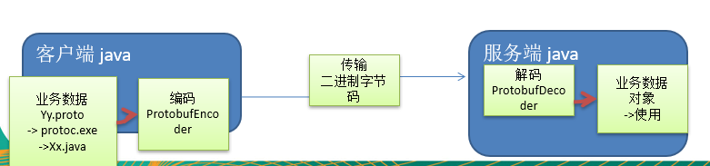
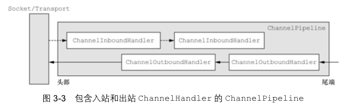
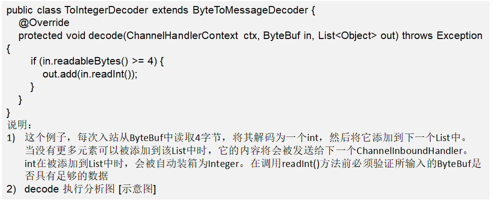
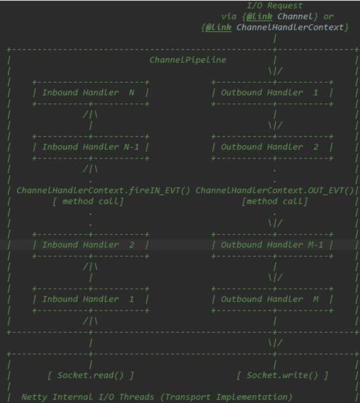
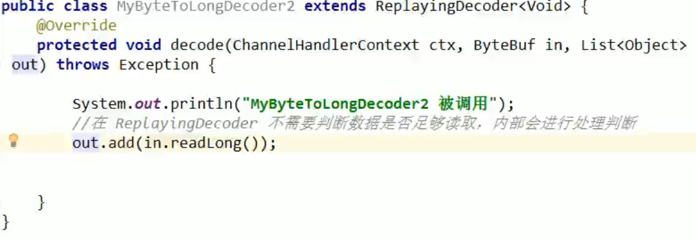

## 1. Netty 概述

Netty 是由JBOSS提供的一个Java开源框架。

Netty 是一个 **异步** 的、**基于事件驱动** 、底层通过包装 **NIO** 来实现的  **网络** 应用框架，


在分布式系统中，各个节点之间需要远程服务调用，高性能的RPC框架必不可少，Netty作为异步高性能的通信框架，往往作为基础通信组件被这些RPC框架使用，如阿里的分布式服务框架Dubbo的RPC框架使用的Dubbo协议进行节点间通信，Dubbo协议默认使用Netty作为基础通信组件，用于实现各进程节点之间的内部通信。

**原生NIO 存在的问题**

1. NIO 的类库和 API 繁杂，使用麻烦：需要熟练掌握 Selector、ServerSocketChannel、SocketChannel、ByteBuffer 等。
2. 需要具备其他的额外技能：要熟悉 Java 多线程编程，因为 NIO 编程涉及到 Reactor 模式，你必须对多线程和网络编程非常熟悉，才能编写出高质量的 NIO 程序。
3. 开发工作量和难度都非常大：例如客户端面临断连重连、网络闪断、半包读写、失败缓存、网络拥塞和异常流的处理等等。
4. JDK NIO 的 Bug：例如臭名昭著的 Epoll Bug，它会导致 Selector 空轮询，最终导致 CPU 100%。直到 JDK 1.7 版本该问题仍旧存在，没有被根本解决。

**Netty 的优点**

1. Netty 对 JDK 自带的 NIO 的 API 进行了封装，解决了上述问题。设计优雅：适用于各种传输类型的统一 API 阻塞和非阻塞 Socket；基于灵活且可扩展的事件模型，可以清晰地分离关注点；高度可定制的线程模型 - 单线程，一个或多个线程池。
2. 使用方便：详细记录的 Javadoc，用户指南和示例；没有其他依赖项，JDK 5（Netty 3.x）或 6（Netty 4.x）就足够了。
3. 高性能、吞吐量更高：延迟更低；减少资源消耗；最小化不必要的内存复制。
4. 安全：完整的 SSL/TLS 和 StartTLS 支持。
5. 社区活跃、不断更新：社区活跃，版本迭代周期短，发现的 Bug 可以被及时修复，同时，更多的新功能会被加入

**线程模型基本介绍**

1. 不同的线程模式，对程序的性能有很大影响，为了搞清Netty 线程模式，我们来系统的讲解下 各个线程模式， 最后看看Netty 线程模型有什么优越性。
2. 目前存在的线程模型有：
   - 传统阻塞I/O 模型
   - Reactor 模式
3. 根据 Reactor 的数量和处理资源池线程的数量不同，有 3 种典型的实现
   - 单 Reactor 单线程；
   - 单 Reactor 多线程；
   - 主从 Reactor 多线程 
4. Netty 线程模式（Netty 主要基于主从Reactor多线程模型做了一定的改进，其中主从 Reactor 多线程模型有多个 Reactor)

**传统阻塞I/O 模型**


黄色的框表示对象， 蓝色的框表示线程，白色的框表示方法(API)

模型特点

1. 采用阻塞IO模式获取输入的数据
2. 每个连接都需要独立的线程完成数据的输入，业务处理, 数据返回

问题分析

1. 当并发数很大，就会创建大量的线程，占用很大系统资源
2. 连接创建后，如果当前线程暂时没有数据可读，该线程会阻塞在read 操作，造成线程资源浪费

**Reactor 模式**


1. 基于 I/O 复用模型：多个连接共用一个阻塞对象，应用程序只需要在一个阻塞对象等待，无需阻塞等待所有连接。当某个连接有新的数据可以处理时，操作系统通知应用程序，线程从阻塞状态返回，开始进行业务处理
    Reactor 对应的叫法:  反应器模式 / 分发者模式(Dispatcher) / 通知者模式(notifier)
2. 基于线程池复用线程资源：不必再为每个连接创建线程，将连接完成后的业务处理任务分配给线程进行处理，一个线程可以处理多个连接的业务。
3. Reactor 模式使用IO复用监听事件, 收到事件后，分发给某个线程(进程), 这点就是网络服务器高并发处理关键。


**Reactor模式 中核心组成：**

1. Reactor：Reactor 在一个单独的线程中运行，负责监听和分发事件，分发给适当的处理程序来对 IO 事件做出反应。 它就像公司的电话接线员，它接听来自客户的电话并将线路转移到适当的联系人；

2. Handlers：处理程序执行 I/O 事件要完成的实际事件，类似于客户想要与之交谈的公司中的实际人员。Reactor 通过调度适当的处理程序来响应 I/O 事件，处理程序执行非阻塞操作。


### Reactor模式

#### **单Reactor 单线程**


**方案说明：**

1. Select 是前面 I/O 复用模型介绍的标准网络编程 API，可以实现应用程序通过一个阻塞对象监听多路连接请求
2. Reactor 对象通过 Select 监控客户端请求事件，收到事件后通过 Dispatch 进行分发
3. 如果是建立连接请求事件，则由 Acceptor 通过 Accept 处理连接请求，然后创建一个 Handler 对象处理连接完成后的后续业务处理
4. 如果不是建立连接事件，则 Reactor 会分发调用连接对应的 Handler 来响应
5. Handler 会完成 Read→业务处理→Send 的完整业务流程

结合实例：服务器端用一个线程通过多路复用搞定所有的 IO 操作（包括连接，读、写等），编码简单，清晰明了，但是如果客户端连接数量较多，将无法支撑，前面的 NIO 案例就属于这种模型。

**方案优缺点分析：**

- 优点：模型简单，没有多线程、进程通信、竞争的问题，全部都在一个线程中完成

- 缺点：性能问题，只有一个线程，无法完全发挥多核 CPU 的性能。Handler 在处理某个连接上的业务时，整个进程无法处理其他连接事件，很容易导致性能瓶颈

- 缺点：可靠性问题，线程意外终止，或者进入死循环，会导致整个系统通信模块不可用，不能接收和处理外部消息，造成节点故障

- 使用场景：客户端的数量有限，业务处理非常快速，比如 Redis在业务处理的时间复杂度 O(1) 的情况

  

#### **单Reactor 多线程**


**方案说明：**

1. Reactor 对象通过select 监控客户端请求 事件, 收到事件后，通过dispatch进行分发
2. 如果建立连接请求, 则右Acceptor 通过 accept 处理连接请求, 然后创建一个Handler对象处理完成连接后的各种事件
3. 如果不是连接请求，则由reactor分发调用连接对应的handler 来处理
4. handler 只负责响应事件，不做具体的业务处理, 通过read 读取数据后，会分发给后面的worker线程池的某个线程处理业务
5. worker 线程池会分配独立线程完成真正的业务，并将结果返回给handler
6. handler收到响应后，通过send 将结果返回给client

**方案优缺点分析：**

- 优点：可以充分的利用多核cpu 的处理能力
- 缺点：多线程数据共享和访问比较复杂， reactor 处理所有的事件的监听和响应，在单线程运行， 在高并发场景容易出现性能瓶颈。


#### **主从Reactor 多线程**


**方案说明：**

1. Reactor主线程 MainReactor 对象通过select 监听连接事件, 收到事件后，通过Acceptor 处理连接事件
2. 当 Acceptor 处理连接事件后，MainReactor 将连接分配给SubReactor 
3. subreactor 将连接加入到连接队列进行监听,并创建handler进行各种事件处理
4. 当有新事件发生时， subreactor 就会调用对应的handler处理
5. handler 通过read 读取数据，分发给后面的worker 线程处理
6. worker 线程池分配独立的worker 线程进行业务处理，并返回结果
7. handler 收到响应的结果后，再通过send 将结果返回给client
8. Reactor 主线程可以对应多个Reactor 子线程, 即MainRecator 可以关联多个SubReactor

**方案优缺点说明：**

- **优点：**父线程与子线程的数据交互简单职责明确，父线程只需要接收新连接，子线程完成后续的业务处理。
- **优点：**父线程与子线程的数据交互简单，Reactor 主线程只需要把新连接传给子线程，子线程无需返回数据。
- **缺点：**编程复杂度较高

**结合实例：**这种模型在许多项目中广泛使用，包括 Nginx 主从 Reactor 多进程模型，Memcached 主从多线程，Netty 主从多线程模型的支持


#### **Reactor模式小结：**

- 单Reactor单线程，前台接待员和服务员是同一个人，全程为顾客服务
- 单Reactor多线程，一个前台接待员，多个服务生，接待员只负责接待
- 主从Reactor多线程，一个门迎，多个接待员，多个服务生

**Reatcor模式具有如下优点：**

1. 响应快，不必为单个同步时间所阻塞，虽然 Reactor 本身依然是同步的

2. 可以最大程度的避免复杂的多线程及同步问题，并且避免了多线程/进程的切换开销

3. 扩展性好，可以方便的通过增加 Reactor 实例个数来充分利用 CPU 资源

4. 复用性好，Reactor 模型本身与具体事件处理逻辑无关，具有很高的复用性

   

### Netty模型

#### 简单版


**方案说明：**

1. BossGroup 线程维护Selector , 只关注Accecpt
2. 当接收到Accept事件，获取到对应的SocketChannel, 封装成 NIOScoketChannel并注册到Worker 线程(事件循环), 并进行维护
3. 当Worker线程监听到selector 中通道发生自己感兴趣的事件后，就进行处理(就由handler)， 注意handler 已经加入到通道


#### 进阶版


主要基于**主从** **Reactors** **多线程模型**（如图）做了一定的改进，其中主从 Reactor 多线程模型有多个 Reactor

#### 详尽版


**方案说明：**

1. Netty抽象出两组线程池 **BossGroup** 专门负责接收客户端的连接，**WorkGroup** 专门负责网络的读写。
2. **BossGroup** 和 **WorkGroup** 类型都是 **NioEventLoopGroup**。
3. NioEventLoopGroup 相当于一个事件循环组，这个组中含有多个事件循环，每个事件循环是NioEventLoop（也就是上图中的NioEventGroup）
4. NioEventLoop 表示一个不断循环的执行处理任务的线程，每个NioEventLoop都有一个selector，用于监听绑定在其上的socket的网络通讯。
5. NioEventLoopGroup 可以有多个线程，即可以含有多个NioEventLoop（对应的就是图中的NioEventGroup）
6. 每个Boss NioEventLoop 执行的步骤有3步
   - 轮询 accept 事件
   - 处理 accept 事件，与client 建立连接，生成NioSocketChannel，并将其注册到某个worker NioEventLopp 上的 selector
   - 处理任务队列的任务，即 runAllTasks
7. 每个 Worker NioEventLoop 循环执行的步骤
   - 轮询read，write 事件
   - 处理IO事件，即read、write事件，在对应NioSocketChannel处理
   - 处理任务队列的任务，即 runAllTasks
8. 每个Worker NioEventLoop 处理业务时，会使用 Pipeline（管道），pipeline 与 channel 是相互引用的关系，即通过pipeline 可以获取到对应通道，也可以通过channel获取到pipeline ，同时 管道中维护里很多的处理器。

### Netty入门实例 - TCP服务

1. 实例要求：使用IDEA 创建Netty项目
2. Netty 服务器在 6668 端口监听，客户端能发送消息给服务器 "hello, 服务器~"
3. 服务器可以回复消息给客户端 "hello, 客户端~"
4. 目的：对Netty 线程模型 有一个初步认识, 便于理解Netty 模型理论

代码链接：

```


```


**任务队列中的** **Task** **有** **3** **种典型使用场景**

1. 用户程序自定义的普通任务，存放在TaskQueue
2. 用户自定义定时任务 ，存放在ScheduleTaskQueue
3. 非当前 Reactor 线程调用 Channel 的各种方法

例如在**推送系统**的业务线程里面，根据**用户的标识**，找到对应的 **Channel** **引用**，然后调用 Write 类方法向该用户推送消息，就会进入到这种场景。最终的 Write 会提交到任务队列中后被**异步消费**


**方案再说明**：

1. Netty 抽象出两组**线程池**，BossGroup 专门负责接收客户端连接，WorkerGroup 专门负责网络读写操作。
2. NioEventLoop 表示一个不断循环执行处理任务的线程，每个 NioEventLoop 都有一个 selector，用于监听绑定在其上的 socket 网络通道。
3. NioEventLoop 内部采用串行化设计，从消息的读取->解码->处理->编码->发送，始终由 IO 线程 NioEventLoop 负责
4. NioEventLoopGroup 下包含多个 NioEventLoop
5. 每个 NioEventLoop 中包含有一个 Selector，一个 taskQueue
6. 每个 NioEventLoop 的 Selector 上可以注册监听多个 NioChannel
7. 每个 NioChannel 只会绑定在唯一的 NioEventLoop 上
8. 每个 NioChannel 都绑定有一个自己的 ChannelPipeline


### **异步模型**

**基本介绍**

1. 异步的概念和同步相对。当一个异步过程调用发出后，调用者不能立刻得到结果。实际处理这个调用的组件在完成后，通过状态、通知和回调来通知调用者。
2. Netty 中的 I/O 操作是异步的，包括 Bind、Write、Connect 等操作会简单的返回一个 ChannelFuture。
3. 调用者并不能立刻获得结果，而是通过 Future-Listener 机制，用户可以方便的主动获取或者通过通知机制获得 IO 操作结果
4. Netty 的异步模型是建立在 future 和 callback 的之上的。callback 就是回调。重点说 Future，它的核心思想是：假设一个方法 fun，计算过程可能非常耗时，等待 fun返回显然不合适。那么可以在调用 fun 的时候，立马返回一个 Future，后续可以通过 Future去监控方法 fun 的处理过程(即 ： Future-Listener 机制)

### **Future说明**

1. 表示异步的执行结果, 可以通过它提供的方法来检测执行是否完成，比如检索计算等等.
2. ChannelFuture 是一个接口 ： **public interface** ChannelFuture **extends** Future<Void>
   我们可以添加监听器，当监听的事件发生时，就会通知到监听器. 案例说明

### **Future-Listener 机制**

- 当 Future 对象刚刚创建时，处于非完成状态，调用者可以通过返回的 ChannelFuture 来获取操作执行的状态，注册监听函数来执行完成后的操作。
- 常见有如下操作：
  - 通过 isDone 方法来判断当前操作是否完成；
  - 通过 isSuccess 方法来判断已完成的当前操作是否成功；
  - 通过 getCause 方法来获取已完成的当前操作失败的原因；
  - 通过 isCancelled 方法来判断已完成的当前操作是否被取消；
  - 通过 addListener 方法来注册监听器，当操作已完成(isDone 方法返回完成)，将会通知指定的监听器；如果 Future 对象已完成，则通知指定的监听器

### Netty入门实例 - HTTP服务

1. 实例要求：使用IDEA 创建Netty项目
2. Netty 服务器在 6668 端口监听，浏览器发出请求 "http://localhost:6668/ "
3. 服务器可以回复消息给客户端 "Hello! 我是服务器 5 " , 并对特定请求资源进行过滤。
4. 目的：Netty 可以做Http服务开发，并且理解Handler实例和客户端及其请求的关系。

代码链接：

```java


```


### **Bootstrap 和 ServerBootstrap**

- Bootstrap 意思是引导，一个 Netty 应用通常由一个 Bootstrap 开始，主要作用是配置整个 Netty 程序，串联各个组件，Netty 中 Bootstrap 类是客户端程序的启动引导类，ServerBootstrap 是服务端启动引导类
- 常见的方法有：
  - public ServerBootstrap group(EventLoopGroup parentGroup, EventLoopGroup childGroup)，该方法用于服务器端，用来设置两个 EventLoop
  - public B group(EventLoopGroup group) ，该方法用于客户端，用来设置一个 EventLoop
  - public B channel(Class<? extends C> channelClass)，该方法用来设置一个服务器端的通道实现
  - public <T> B option(ChannelOption<T> option, T value)，用来给 ServerChannel 添加配置
  - public <T> ServerBootstrap childOption(ChannelOption<T> childOption, T value)，用来给接收到的通道添加配置
  - public ServerBootstrap childHandler(ChannelHandler childHandler)，该方法用来设置业务处理类（自定义的 handler）
  - public ChannelFuture bind(int inetPort) ，该方法用于服务器端，用来设置占用的端口号
  - public ChannelFuture connect(String inetHost, int inetPort) ，该方法用于客户端，用来连接服务

### **Future 和 ChannelFuture**

-  Netty 中所有的 IO 操作都是异步的，不能立刻得知消息是否被正确处理。但是可以过一会等它执行完成或者直接注册一个监听，具体的实现就是通过 Future 和 ChannelFutures，他们可以注册一个监听，当操作执行成功或失败时监听会自动触发注册的监听事件

- 常见的方法：

  - channel()，返回当前正在进行 IO 操作的通道

  - ChannelFuture sync()，等待异步操作执行完毕

    

### **Channel**

1. Netty 网络通信的组件，能够用于执行网络 I/O 操作。
2. 通过Channel 可获得当前网络连接的通道的状态
3. 通过Channel 可获得 网络连接的配置参数 （例如接收缓冲区大小）
4. Channel 提供异步的网络 I/O 操作(如建立连接，读写，绑定端口)，异步调用意味着任何 I/O 调用都将立即返回，并且不保证在调用结束时所请求的 I/O 操作已完成
5. 调用立即返回一个 ChannelFuture 实例，通过注册监听器到 ChannelFuture 上，可以 I/O 操作成功、失败或取消时回调通知调用方
6. 支持关联 I/O 操作与对应的处理程序
7. 不同协议、不同的阻塞类型的连接都有不同的 Channel 类型与之对应，常用的 Channel 类型:
   - NioSocketChannel，异步的客户端 TCP Socket 连接。
   - NioServerSocketChannel，异步的服务器端 TCP Socket 连接。
   - NioDatagramChannel，异步的 UDP 连接。
   - NioSctpChannel，异步的客户端 Sctp 连接。
   - NioSctpServerChannel，异步的 Sctp 服务器端连接，这些通道涵盖了 UDP 和 TCP 网络 IO 以及文件 IO。

### **Selector**

- Netty 基于 Selector 对象实现 I/O 多路复用，通过 Selector 一个线程可以监听多个连接的 Channel 事件。
- 当向一个 Selector 中注册 Channel 后，Selector 内部的机制就可以自动不断地查询(Select) 这些注册的 Channel 是否有已就绪的 I/O 事件（例如可读，可写，网络连接完成等），这样程序就可以很简单地使用一个线程高效地管理多个 Channel

### **ChannelHandler  及其实现类**

1. ChannelHandler 是一个接口，处理 I/O 事件或拦截 I/O 操作，并将其转发到其ChannelPipeline(业务处理链)中的下一个处理程序。

2. ChannelHandler 本身并没有提供很多方法，因为这个接口有许多的方法需要实现，方便使用期间，可以继承它的子类

3. ChannelHandler 及其实现类一览图

   

   - ChannelInboundHandler 用于处理入站 I/O 事件。

   - ChannelOutboundHandler 用于处理出站 I/O 操作。

     //适配器

   - ChannelInboundHandlerAdapter 用于处理入站 I/O 事件。

   - ChannelOutboundHandlerAdapter 用于处理出站 I/O 操作。

   - ChannelDuplexHandler 用于处理入站和出站事件。

4. 我们经常需要自定义一个 Handler 类去继承 ChannelInboundHandlerAdapter，然后通过重写相应方法实现业务逻辑，我们接下来看看一般都需要重写哪些方法

   ```java
   public class ChannelInboundHandlerAdapter extends ChannelHandlerAdapter implements ChannelInboundHandler {
       public ChannelInboundHandlerAdapter() {}
   
       public void channelRegistered(ChannelHandlerContext ctx) throws Exception {
           ctx.fireChannelRegistered();}
   
       public void channelUnregistered(ChannelHandlerContext ctx) throws Exception {ctx.fireChannelUnregistered();}
   
       //通道就绪事件
       public void channelActive(ChannelHandlerContext ctx) throws Exception {
           ctx.fireChannelActive();}
   
       public void channelInactive(ChannelHandlerContext ctx) throws Exception {
           ctx.fireChannelInactive();}
   
       //通道读取数据事件
       public void channelRead(ChannelHandlerContext ctx, Object msg) throws Exception {
           ctx.fireChannelRead(msg);}
   
       //数据读取完毕事件
       public void channelReadComplete(ChannelHandlerContext ctx) throws Exception {
           ctx.fireChannelReadComplete();}
   
       public void userEventTriggered(ChannelHandlerContext ctx, Object evt) throws Exception {
           ctx.fireUserEventTriggered(evt);}
   
       public void channelWritabilityChanged(ChannelHandlerContext ctx) throws Exception {
           ctx.fireChannelWritabilityChanged();}
   
       //通道发生异常事件
       public void exceptionCaught(ChannelHandlerContext ctx, Throwable cause) throws Exception {
           ctx.fireExceptionCaught(cause);}
   }
   ```

   

### **Pipeline** **和** **ChannelPipeline**

1. ChannelPipeline 是一个 Handler 的集合，它负责处理和拦截 inbound 或者 outbound 的事件和操作，相当于一个贯穿 Netty 的链。(**也可以这样理解：****ChannelPipeline** **是 保****存** **ChannelHandler** **的** **List****，用于处理或拦截** **Channel** **的入站事件和出站操****作)

2. ChannelPipeline 实现了一种高级形式的拦截过滤器模式，使用户可以完全控制事件的处理方式，以及 Channel 中各个的 ChannelHandler 如何相互交互

3. 在 Netty 中每个 Channel 都有且仅有一个 ChannelPipeline 与之对应，它们的组成关系如下

   

   - 一个 Channel 包含了一个 ChannelPipeline，而 ChannelPipeline 中又维护了一个由 ChannelHandlerContext 组成的双向链表，并且每个 ChannelHandlerContext 中又关联着一个 ChannelHandler
   - 入站事件和出站事件在一个双向链表中，入站事件会从链表 head 往后传递到最后一个入站的 handler，出站事件会从链表 tail 往前传递到最前一个出站的 handler，两种类型的 handler 互不干扰

4. 常用方法：

   - ChannelPipeline addFirst(ChannelHandler... handlers)，把一个业务处理类（handler）添加到链中的第一个位置
   - ChannelPipeline addLast(ChannelHandler... handlers)，把一个业务处理类（handler）添加到链中的最后一个位置

### ChannelHandlerContext

1. 保存 Channel 相关的所有上下文信息，同时关联一个 ChannelHandler 对象
2. 即ChannelHandlerContext 中 包 含 一 个 具 体 的 事 件 处 理 器 ChannelHandler ， 同 时ChannelHandlerContext 中也绑定了对应的 pipeline 和 Channel 的信息，方便对 ChannelHandler进行调用.
3. 常用方法：
   - ChannelFuture close()，关闭通道
   - ChannelOutboundInvoker flush()，刷新
   - ChannelFuture writeAndFlush(Object msg) ， 将 数 据 写 到 ChannelPipeline 中 当 前
   - ChannelHandler 的下一个 ChannelHandler 开始处理（出站）

### ChannelOption

1. Netty 在创建 Channel 实例后,一般都需要设置 ChannelOption 参数。

2. ChannelOption 参数如下:

   - **ChannelOption.SO_BACKLOG**

     TCP/IP 协议 listen 函数中的 backlog 参数，用来初始化服务器可连接队列大小。服务端处理客户端连接请求是顺序处理的，所以同一时间只能处理一个客户端连接。多个客户端来的时候，服务端将不能处理的客户端连接请求放在队列中等待处理，backlog 参数指定了队列的大小。

   - **ChannelOption.SO_KEEPALIVE**

     一直保持连接活动状态

### EventLoopGroup 和其实现类 NioEventLoopGroup

1. EventLoopGroup 是一组 EventLoop 的抽象，Netty 为了更好的利用多核 CPU 资源，一般会有多个 EventLoop 同时工作，每个 EventLoop 维护着一个 Selector 实例。

2. EventLoopGroup 提供 next 接口，可以从组里面按照一定规则获取其中一个 EventLoop来处理任务。在 Netty 服务器端编程中，我们一般都需要提供两个 EventLoopGroup，例如：BossEventLoopGroup 和 WorkerEventLoopGroup。

3. 通常一个服务端口即一个 ServerSocketChannel对应一个Selector 和一个EventLoop线程。BossEventLoop 负责接收客户端的连接并将 SocketChannel 交给 WorkerEventLoopGroup 来进行 IO 处理，如下图所示：

   

   - BossEventLoopGroup 通常是一个单线程的 EventLoop，EventLoop 维护着一个注册了ServerSocketChannel 的 Selector 实例BossEventLoop 不断轮询 Selector 将连接事件分离出来
   - 通常是 OP_ACCEPT 事件，然后将接收到的 SocketChannel 交给 WorkerEventLoopGroup
   - WorkerEventLoopGroup 会由 next 选择其中一个 EventLoop来将这个 SocketChannel 注册到其维护的 Selector 并对其后续的 IO 事件进行处理

### **Unpooled类**

1. Netty 提供一个专门用来操作缓冲区(即Netty的数据容器)的工具类

2. 常用方法如下所示：

   //通过给定的数据和字符编码返回一个 ByteBuf 对象（**类似于** **NIO** **中的** **ByteBuffer** **但有区别**）

   public static ByteBuf copiedBuffer(CharSequence string, Charset charset)

3. 举例说明 Unpooled 获取 Netty的数据容器ByteBuf 的基本使用 

.jpg)


### Netty 应用实例 - 群聊系统

1. 编写一个 Netty 群聊系统，实现服务器端和客户端之间的数据简单通讯（非阻塞）
2. 实现多人群聊
3. 服务器端：可以监测用户上线，离线，并实现消息转发功能
4. 客户端：通过channel 可以无阻塞发送消息给其它所有用户，同时可以接受其它用户发送的消息(有服务器转发得到)

```java

```


### Netty 应用实例 -心跳检测机制

1. )编写一个 Netty心跳检测机制案例, 当服务器超过3秒没有读时，就提示读空闲
2. 当服务器超过5秒没有写操作时，就提示写空闲
3. 实现当服务器超过7秒没有读或者写操作时，就提示读写空闲

```

```


### Netty 应用实例 -通过WebSocket 编程实现服务器和客户端长连接

1. Http协议是无状态的, 浏览器和服务器间的请求响应一次，下一次会重新创建连接.
2. 要求：实现基于webSocket的长连接的全双工的交互
3. 改变Http协议多次请求的约束，实现长连接了， 服务器可以发送消息给浏览器
4. 客户端浏览器和服务器端会相互感知，比如服务器关闭了，浏览器会感知，同样浏览器关闭了，服务器会感知

### 编码和解码的基本介绍

1. 编写网络应用程序时，因为数据在网络中传输的都是二进制字节码数据，在发送数据时就需要编码，接收数据时就需要解码 
2. codec(编解码器) 的组成部分有两个：decoder(解码器)和 encoder(编码器)。encoder 负责把业务数据转换成字节码数据，decoder 负责把字节码数据转换成业务数据

**Netty 本身的编码解码的机制和问题分析**

1. Netty 自身提供了一些 codec(编解码器)
2. Netty 提供的编码器
   - StringEncoder，对字符串数据进行编码
   - ObjectEncoder，对 Java 对象进行编码
3. Netty 提供的解码器
   - StringDecoder, 对字符串数据进行解码
   - ObjectDecoder，对 Java 对象进行解码
4. Netty 本身自带的 ObjectDecoder 和 ObjectEncoder 可以用来实现 POJO 对象或各种业务对象的编码和解码，底层使用的仍是 Java 序列化技术 , 而Java 序列化技术本身效率就不高，存在如下问题
   - 无法跨语言
   - 序列化后的体积太大，是二进制编码的 5 倍多
   - 序列化性能太低
5. 引出 新的解决方案 Google 的 **Protobuf**

### Protobuf

1. Protobuf 是 Google 发布的开源项目，全称 Google Protocol Buffers，是一种轻便高效的结构化数据存储格式，可以用于结构化数据串行化，或者说序列化。它很适合做数据存储或 RPC（远程过程调用 remote procedure call）数据交换格式。 目前很多公司 tcp+protobuf 代替 http+json 。
2. 参考文档 : https://developers.google.com/protocol-buffers/docs/proto  语言指南。
3. Protobuf 是以 message 的方式来管理数据的。
4. 支持跨平台、**跨语言**，即[客户端和服务器端可以是不同的语言编写的] （**支持目前绝大多数语言**，例如 C++、C#、Java、python 等）
5. 高性能，高可靠性
6. 使用 protobuf 编译器能自动生成代码，Protobuf 是将类的定义使用.proto 文件进行描述。说明，在idea 中编写 .proto 文件时，会自动提示是否**下载** **.****ptotot** **编写插件**. 可以让**语法高亮**。
7. 然后通过 protoc.exe 编译器根据.proto 自动生成.java 文件
8. protobuf 使用示意图



### **Protobuf快速入门实例**1

1. 客户端可以发送一个Student PoJo 对象到服务器 (通过 Protobuf 编码) 
2. 服务端能接收Student PoJo 对象，并显示信息(通过 Protobuf 解码)

### Protobuf快速入门实例2

1. 客户端可以随机发送Student PoJo/ Worker PoJo 对象到服务器 (通过 Protobuf 编码) 
2. 服务端能接收Student PoJo/ Worker PoJo 对象(需要判断是哪种类型)，并显示信息(通过 Protobuf 解码)


## Netty核心组件

1. netty的组件设计：Netty的主要组件有Channel、EventLoop、ChannelFuture、ChannelHandler、ChannelPipe等
2. ChannelHandler充当了处理入站和出站数据的应用程序逻辑的容器。例如，实现ChannelInboundHandler接口（或ChannelInboundHandlerAdapter），你就可以接收入站事件和数据，这些数据会被业务逻辑处理。当要给客户端发送响应时，也可以从ChannelInboundHandler冲刷数据。业务逻辑通常写在一个或者多个ChannelInboundHandler中。ChannelOutboundHandler原理一样，只不过它是用来处理出站数据的
3. ChannelPipeline提供了ChannelHandler链的容器。以客户端应用程序为例，**如果事件的运动方向是从客户端到服务端的，那么我们称这些事件为出站的**，即客户端发送给服务端的数据会通过pipeline中的一系列ChannelOutboundHandler，并被这些Handler处理，反之则称为入站的



### 编码解码器

1. 当Netty发送或者接受一个消息的时候，就将会发生一次数据转换。入站消息会被解码：从字节转换为另一种格式（比如java对象）；如果是出站消息，它会被编码成字节。

2. Netty提供一系列实用的编解码器，他们都实现了ChannelInboundHadnler或者ChannelOutboundHandler接口。在这些类中，channelRead方法已经被重写了。以入站为例，对于每个从入站Channel读取的消息，这个方法会被调用。随后，它将调用由解码器所提供的decode()方法进行解码，并将已经解码的字节转发给ChannelPipeline中的下一个ChannelInboundHandler。

3. 出站与入站对比表

   |       入站        |       出站        |
   | :---------------: | :---------------: |
   |       解码        |       编码        |
   | Socket =》Channel | Channel =》Socket |
   |  InBoundHandler   |  OutBoundHandler  |

   

**解码器-ByteToMessageDecoder**

- 关系继承图

   

- 由于不可能知道远程节点是否会一次性发送一个完整的信息，tcp有可能出现粘包拆包的问题，这个类会对入站数据进行缓冲，直到它准备好被处理.

- 一个关于ByteToMessageDecoder实例分析

   

   上图中有个需要注意的地方是 **decod（）使用的是 If  而不是while** ，每次调用该handler后只会取4个字节进行解码，解码后再传给后面的handler做处理，所以这个handler在一次请求过来时，会被调用很多次。

**Netty的handler链的调用机制**

1. 使用自定义的编码器和解码器来说明Netty的handler 调用机制
    客户端发送 long类型的数据 -> 服务器
    服务端发送 long类型的数据 -> 客户端
2. 结论
   - 不论解码器handler 还是 编码器handler 即接收的消息类型必须与待处理的消息类型一致，否则该handler不会被执行
   - 在解码器 进行数据解码时，需要判断 缓存区(ByteBuf)的数据是否足够 ，否则接收到的结果会期望结果可能不一致



**解码器-ReplayingDecoder**

1. public abstract class ReplayingDecoder<S> extends ByteToMessageDecoder

2. ReplayingDecoder扩展了ByteToMessageDecoder类，使用这个类，我们不必调用readableBytes()方法。参数S指定了用户状态管理的类型，其中Void代表不需要状态管理

3. 应用实例：使用ReplayingDecoder 编写解码器，对前面的案例进行简化 [案例演示]

   

4. ReplayingDecoder使用方便，但它也有一些局限性：

   - 并不是所有的 ByteBuf 操作都被支持，如果调用了一个不被支持的方法，将会抛出一个 UnsupportedOperationException。
   - ReplayingDecoder 在某些情况下可能稍慢于 ByteToMessageDecoder，例如网络缓慢并且消息格式复杂时，消息会被拆成了多个碎片，速度变慢

**其它解码器**

1. LineBasedFrameDecoder：这个类在Netty内部也有使用，它使用行尾控制字符（\n或者\r\n）作为分隔符来解析数据。
2. DelimiterBasedFrameDecoder：使用自定义的特殊字符作为消息的分隔符。
3. HttpObjectDecoder：一个HTTP数据的解码器
4. LengthFieldBasedFrameDecoder：通过指定长度来标识整包消息，这样就可以自动的处理黏包和半包消息。

### Log4j整合到Netty

1. 添加maven依赖

```
	    <dependency>
            <groupId>log4j</groupId>
            <artifactId>log4j</artifactId>
            <version>1.2.17</version>
        </dependency>
        <dependency>
            <groupId>org.slf4j</groupId>
            <artifactId>slf4j-api</artifactId>
            <version>1.7.25</version>
        </dependency>
        <dependency>
            <groupId>org.slf4j</groupId>
            <artifactId>slf4j-log4j12</artifactId>
            <version>1.7.25</version>
            <scope>test</scope>
        </dependency>
        <dependency>
            <groupId>org.slf4j</groupId>
            <artifactId>slf4j-simple</artifactId>
            <version>1.7.25</version>
            <scope>test</scope>
        </dependency>

```

2.配置log4j.properties


### TCP 粘包拆包原理