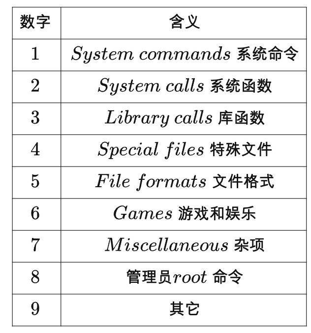

### shell

### 编辑命令

- Ctrl + a ：移到命令行首
- Ctrl + e ：移到命令行尾
- Ctrl + f ：按字符前移（右向）
- Ctrl + b ：按字符后移（左向）
- Alt + f ：按单词前移（右向）
- Alt + b ：按单词后移（左向）
- Ctrl + xx：在命令行首和光标之间移动
- Ctrl + u ：从光标处删除至命令行首
- Ctrl + k ：从光标处删除至命令行尾
- Ctrl + w ：从光标处删除至字首
- Alt + d ：从光标处删除至字尾
- Ctrl + d ：删除光标处的字符
- Ctrl + h ：删除光标前的字符
- Ctrl + y ：粘贴至光标后
- Alt + c ：从光标处更改为首字母大写的单词
- Alt + u ：从光标处更改为全部大写的单词
- Alt + l ：从光标处更改为全部小写的单词
- Ctrl + t ：交换光标处和之前的字符
- Alt + t ：交换光标处和之前的单词
- Alt + Backspace：与 Ctrl + w ~~相同~~类似，分隔符有些差别 [感谢 rezilla 指正]

### 重新执行命令

- Ctrl + r：逆向搜索命令历史
- Ctrl + g：从历史搜索模式退出
- Ctrl + p：历史中的上一条命令
- Ctrl + n：历史中的下一条命令
- Alt + .：使用上一条命令的最后一个参数

### 控制命令

- Ctrl + l：清屏
- Ctrl + o：执行当前命令，并选择上一条命令
- Ctrl + s：阻止屏幕输出
- Ctrl + q：允许屏幕输出
- Ctrl + c：终止命令
- Ctrl + z：挂起命令

### Bang (!) 命令

- !!：执行上一条命令
- !blah：执行最近的以 blah 开头的命令，如 !ls
- !blah:p：仅打印输出，而不执行
- !$：上一条命令的最后一个参数，与 Alt + . 相同
- !$:p：打印输出 !$ 的内容
- !*：上一条命令的所有参数
- !*:p：打印输出 !* 的内容
- ^blah：删除上一条命令中的 blah
- ^blah^foo：将上一条命令中的 blah 替换为 foo
- ^blah^foo^：将上一条命令中所有的 blah 都替换为 foo


### man

`man` 命令是一个非常有用的命令，当你不会使用某个`Linux` 命令时，可以使用`man` 来查看其帮助文档。`man` 命令查到的手册来源于目录`/usr/share/man/`，可以看到该目录下有9 个这样的目录：

```shell
ls /usr/share/man/

man1
man2
man3
man4
man5
man6
man7
man8
man9
```

`man` 手册分9 种，用数字`[1-9]` 来区分，分别代表的含义如下（可以用`man man` 命令来查看）：



可以通过设置不同的数字来查看不同的手册，如下：

```text
man 1 系统命令名
man 2 系统函数名
man 3 库函数名
```

如果没有带这个数字，则会从`1` 查到`9`，直到查到第一个为止。

**.man**文件是一个Unix风格（只有LF换行符）的纯文本文件，包含一个命令或其他项目的描述。它的格式是使用传统的 "troff "文本格式化工具。在GNU/Linux机器上，全系统的manpages通常位于"/usr/share/man "目录下，按语言分类并打包成gzip（.gz）档案。**.man**后缀本身通常只用于第三方的manpage文件。任何**.man**文件都可以用文本编辑器轻松打开。

### groff

groff（GUN roff） 是 roff 排版系统现在最常用的实现，其它实现有troff、nroff、ditroff等等。尽管历史悠久，roff当前还在广泛使用中。UNIX系统的man手册页、很多软件书籍和标准是用roff来写的。

[Groff概览](https://www.chungkwong.cc/groff.html)

[使用 groff 编写 man 手册页](https://linux.cn/article-9122-1.html)

[Unix, Linux 和MacOS](https://juejin.cn/post/6844903841901576199)


### cat

显示最后一屏内容	

cat 文件名	 cat 是由第一行到最后一行连续显示在屏幕上，而 tac 则是由最后一行到第一行反向在屏幕上显示出来


### tail

查看文件的后几行	

tail -n  -10 文件名	Ctrl + C 强制退出


### more

`more` 命令用于查看Linux 文件的内容，用`more filename` 打开一个文件后，可以控制`向上`或`向下`翻滚页面。

回车 往下滚一行

空格 往下滚一页

Ctrlµ  + B 往上滚一页


### mkdir 

mkdir -p /a/b 可以创建多级文件夹


### telnet

在linux和centos下，我们就直接可以用telnet命令来测试端口是否畅通。具体用法：telnet 指定的IP或者 域名 端口号.

```bash
比如：telnet 192.168.1.102 3306

内网 telnet 127.0.0.1 8090
```

在Mac os 下

```bash
nc -vz -w 2 192.168.1.104 3306
```


### vim


### Others

[常用Linux命令](https://zhuanlan.zhihu.com/p/132549442)

目录操作:
	cd		切换目录
	clear		清楚屏幕
	pwd		显示当前目录所在位置
	ls(list)	显示当前目录下的所有目录 -a(r代表all)(显示隐藏目录)/-l
			(显示目录详细信息，ls -l 可以缩写为ll)
	mkdir(make dir)	创建目录
	find		搜索目录 find /root -name '*test*'
	mv(move)	移动改名 mv 旧名称 新名称 mv 目标名 目标新位置
	cp(copy)	复制目标 cp -r(r代表递归)(复制目录) 目标名 要复制到的位置
	rm(remove)	删除目标 rm -r(删除目录) -f(r代表force强制)(跳过询问直接删除)
文件操作:
	touch		创建文件 touch 文件名
	echo 2 >myid	将2输出到myid中，也可以简单创建文件
	
	head	与tail相反 	查看文件的前几行  head -n 10  test.log   查询日志文件中的头10行日志;
	vim		修改文件内容		vim	 文件名
			vim有3种模式，开始是命令 按i进入编辑模式 按Esc返回命令底行模式 保存退出:wq
			保存退出：Shift+zz wq	不保存退出：q!	强制退出：  !	正常退出：  q	Shift+G 快速到文件末尾
	chmod		修改文件权限 chmod u+x 文件名	在当前用户下可以执行   当前用户/当前用户所在组/其他用户
压缩和解压：
	tar		压缩文件	tar -zc(压缩)vf 打包压缩后的文件名 要打包压缩的文件
			解压文件	tar -z(格式为gz)x(解压缩)v(显示过程)f(文件名) xxx.tar.gz -C /usr------C代表指定解压的位置
其他命令：
	grep		grep to(要查的信息) sudo.conf(要查的文件) --color(颜色高亮显示)
	ps		查询进程	ps -ef     
	|		管道符	前面的输出作为后面的输入	例： ps -ef | grep tomcat
	kill		结束进程	kill -9(强制关闭) 进程的pid
	ifconfig	查看当前系统的网卡信息：ifconfig	用户后边的第一列数字是 PID
	ping		查看与某台机器的连接情况：ping
	netstat		查看当前系统的端口使用：netstat -an(windows中是 netstat -aov) 本机地址最后一位是端口号
	chmod		修改权限方法  chmod u=rwx,g=rw,o=r aaa.txt	chmod 764 aaa.txt
	rpm -qa | grep mysql	查询
	rpm -e --nodeps 名称	卸载
	rpm -ivh 软件名		安装

.sh的启动、关闭和查看状态	./zkServer.sh  start/stop/status
关闭防火墙		service iptables stop
开机不启动防火墙	chkconfig iptables off
查看控制台		tail -f tomcat-sina/logs/catalina.out	查看tomcat启动情况	
查看带nginx进程 	ps aux|grep nginx/(pid)	
杀死带nginx进程 	ps aux|grep nginx/(pid)  | xargs kill	
根据进程pid查端口	netstat -nap | grep pid
根据端口port查进程	netstat -nap | grep port
退出telnet		telnet 192.168.60.82 9736  ctrl+] 输入命令  quit
查看启动的控制台	./apache-activemq-5.15.6/bin/activemq console  
查找文件		whereis my.cnf
yum install gcc/ruby	联网下载资源

根据名称查询进程 ps -ef|grep svn
根据端口查进程	netstat -lntup|grep 3690
根据端口查进程	lsof -i :3690
展示目录树 tree /application/svndata/


tail -f error.log	查看文件末尾，可以看到实时输出的内容。