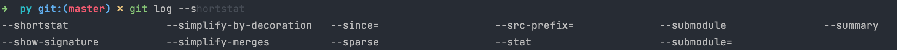

# Shell

## zsh

mac 默认shell 从bash 转为了 zsh，zsh 兼容了 bash，所以可以很容易切换。

bash 配置文件位置  ~/.bash_profile	zsh 配置文件位置 ~/.zshrc

可以在终端的 coustom shell 里设置 /bin/bash 或者 /bin/zsh

不过使用了bash 会有警告提示，以下命令可以关闭警告

```shell
# 打开非默认shell不警告
export BASH_SILENCE_DEPRECATION_WARNING=1
```

## oh-my-zsh

管理zsh的工具，提供更多的主题配色，以及插件支持。

**配置插件**：

- git git命令自动补全插件

  

  

- z插件 文件目录快速跳转	 https://github.com/rupa/z

  

- zsh-autosuggestions  历史命令自动提示

  如图输入命令时，会给出建议的命令（灰色部分）按键盘 → 补全

  

- zsh-syntax-highlighting 语法高亮

  

- bat  `cat` 某个文件，可以在终端直接输出文件内容，`bat` 相比 `cat` 增加了行号和颜色高亮 

## item2 

适用于macOS的终端模拟器，支持操作系統功能，例如窗口透明度、全屏模式、分割窗口、展示系统资源、设置文本编辑模式等等功能

item2也可以设置主题和颜色，但是只能在item2中生效，像oh-my-zsh中的主题和颜色 可以在别IDE中的终端模拟器中也生效，比如 IDEA、Pycharm等。

## brew

默认情况下 inter_86的 brew 无法在 M1_arm 上下载新的软件，当然也可以设置使用 Rosetta 打开 兼容老的指令集。

老的brew目录是在 /usr/local下，新的brew 会在/opt/homebrew/下


