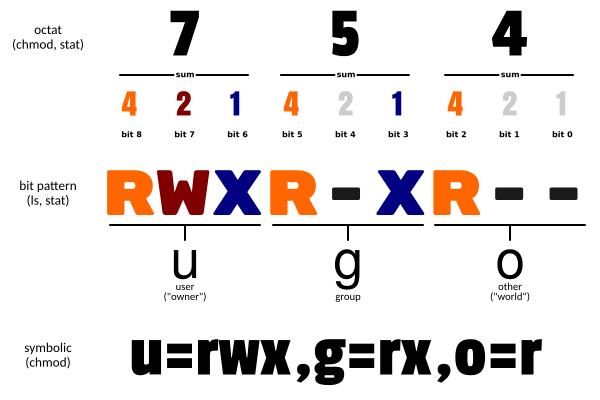
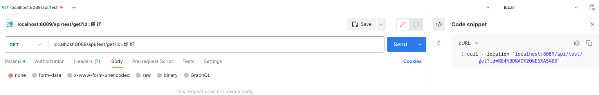
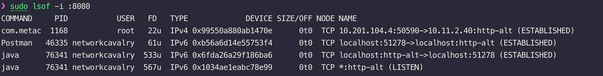
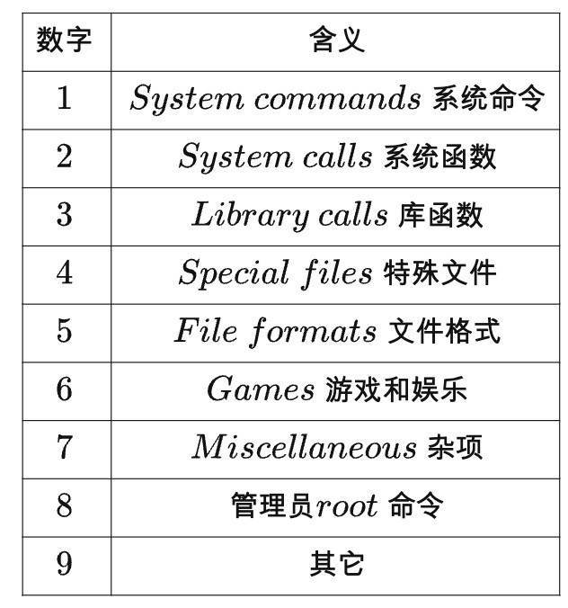
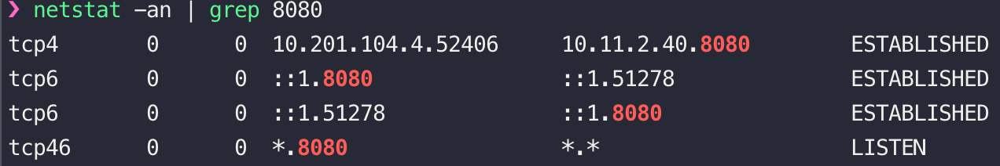
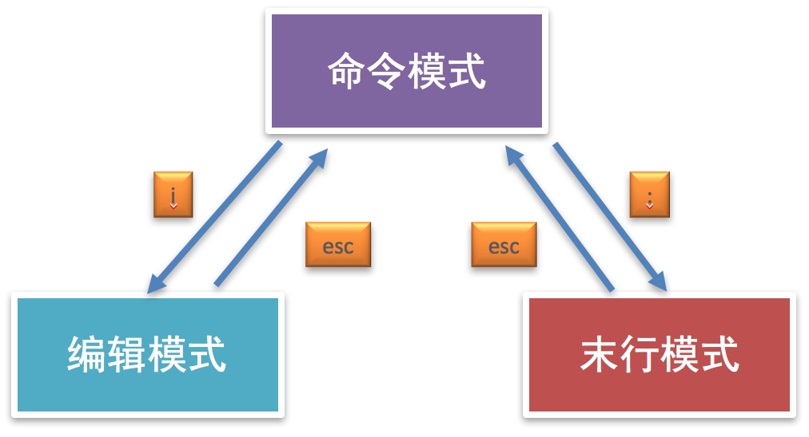

## abcdefghijklmnopqrstuvwxyz

## 常用命令

https://fr3nky.uk/2024/02/02/linux/

# A

## apt

**apt / apt-get** Advanced Package Tool，包管理工具，用于Debian、Ubuntu 。类似的还有：

**yum**  Yellowdog Updater Modified，用于Red Hat、CentOS

**dnf** Dandified YUM，用于替代 yum

**brew**  Homebrew，用于macOS


## automake

https://www.laruence.com/2009/11/18/1154.html


# B

## brew

Homebrew  是 macOS中最好用的包管理器，可以用来安装mac软件。


### brew search

```sh
brew search lsof 
```

### brew install

```sh
brew install lsof 
```

**直接下载brew包含的多版本**

```sh
brew search jdk@
==> Formulae
openjdk@11       openjdk@17 ✔     openjdk@21 ✔     openjdk@23 ✔     openjdk@8     

==> Casks
graalvm-jdk@17                    microsoft-openjdk@11              microsoft-openjdk@21              oracle-jdk@21
graalvm-jdk@21                    microsoft-openjdk@17              oracle-jdk@17
```

```sh
brew install openjdk@11
```

**使用rb链接下载历史版本的应用**

1. ```sh
   #查看下载来源 From: https://github.com/Homebrew/homebrew-core/blob/HEAD/Formula/l/lsof.rb
   brew info lsof 
   ```

2. 到对应github中查看历史版本的rb文件

   ```sh
   # 例如https://raw.githubusercontent.com/Homebrew/homebrewore/b0e4376fc8e13dd9ef25ee64c47e9d864402e9cb/Formula/lsof.rb
   ```

3. 下载rb文件

   ```sh
   curl -O https://raw.githubusercontent.com/Homebrew/homebrewore/b0e4376fc8e13dd9ef25ee64c47e9d864402e9cb/Formula/lsof.rb
   ```

4. 在下载目录指定版本安装

   ```sh
   brew install lsof.rb
   ```

   

### brew uninstall

```sh
brew uninstall lsof 
```


### brew services

通过 brew来管理后台已安装的后台服务，可以设置开机启动。

```sh
brew services list #查看services列表
```

可以查看本地下载好的服务。

| Name     | Status   | User       | Plist                                   |
| -------- | -------- | ---------- | --------------------------------------- |
| 服务名称 | 服务状态 | 开启的用户 | 后缀名为 `.plist` 的 XML 文件存储的位置 |

```sh
brew services list #查看services列表
brew services run mysql # 启动mysql 服务
brew services start mysql # 启动 mysql 服务，并注册开机自启
brew services stop mysql # 停止 mysql 服务，并取消开机自启
brew services restart mysql # 重启 mysql 服务，并注册开机自启
brew services cleanup # 清除已卸载应用的无用配置
```


# C

## cat

显示最后一屏内容	

cat 文件名	 cat 是由第一行到最后一行连续显示在屏幕上，而 tac 则是由最后一行到第一行反向在屏幕上显示出来


## chmod

https://www.runoob.com/linux/linux-comm-chmod.html

Linux chmod（英文全拼：change mode）命令是控制用户对文件的权限的命令

Linux/Unix 的文件调用权限分为三级 : 文件所有者（Owner）、用户组（Group）、其它用户（Other Users）。


只有文件所有者和超级用户可以修改文件或目录的权限。可以使用绝对模式（八进制数字模式），符号模式指定文件的权限。



| 数字 | 含义           | 字符 |
| ---- | -------------- | ---- |
| 7    | 读 + 写 + 执行 | rwx  |
| 6    | 读 + 写        | rw-  |
| 5    | 读 + 执行      | r-x  |
| 4    | 只读           | r--  |
| 3    | 写 + 执行      | -wx  |
| 2    | 只写           | -w-  |
| 1    | 只执行         | --x  |
| 0    | 无             | ---  |

总结：

- 利用 **chmod** 命令可以控制文件的操作权限。
- 字母法格式: chmod 不同角色设置的权限 文件
- 数字法格式: chmod 不同角色的权限值 文件名

## cp 文件复制

当然，这里提供一些 `cp` 命令的示例，展示如何在不同场景下使用它：

**示例 1: 复制单个文件**

假设我们有一个名为 `example.txt` 的文件，我们想复制它到当前目录下的 `backup.txt`：
```sh
cp example.txt backup.txt
```
执行后，当前目录下将有两个文件：`example.txt` 和 `backup.txt`，它们的内容相同。

**示例 2: 复制多个文件到同一目录**

我们有多个文本文件，想要将它们全部复制到 `documents` 目录中：
```sh
cp *.txt documents/
```
这个命令会将当前目录下所有 `.txt` 文件复制到 `documents` 目录中。

**示例 3: 递归复制目录**

我们有一个名为 `old_project` 的目录，想要复制整个目录到名为 `new_project` 的新目录：
```sh
cp -r old_project new_project
```
执行后，`new_project` 目录将包含 `old_project` 目录的所有内容。

**示例 4: 保留文件属性复制**

我们想要复制 `image.png` 并保留其原有的修改时间和权限：
```sh
cp -p image.png /path/to/destination/image.png
```
这将复制 `image.png` 并保留其原有的属性。

**示例 5: 强制覆盖文件**

我们想要复制 `report.docx` 到 `/home/user/documents` 目录，并且不管目标目录中是否已存在同名文件，都直接覆盖：
```sh
cp -f report.docx /home/user/documents/
```

**示例 6: 显示复制进度**

我们想要复制一个较大的视频文件，并看到复制过程中的详细信息：
```sh
cp -v video.mp4 /path/to/destination/video.mp4
```
这将显示复制过程中的详细信息，包括文件名和复制状态。

**示例 7: 复制并删除原文件**

我们想要将 `script.sh` 移动到 `/usr/local/bin` 目录，实际上是复制然后删除原文件：
```sh
cp --remove-destination script.sh /usr/local/bin/script.sh
```
这将把 `script.sh` 复制到 `/usr/local/bin` 目录，并删除原文件。

这些示例展示了 `cp` 命令在不同情况下的使用方式，帮助您更有效地管理文件和目录。


## curl 访问Web服务器

client URL工具

https://www.ruanyifeng.com/blog/2019/09/curl-reference.html

发送GET请求，访问URI

```sh
curl https://www.baidu.com
```

### -A

`-A ` 参数指定客户端的代理标头信息，即`User-Agent`。本质是一个HTTP 请求头部字段，用于告诉服务器客户端的调用信息，如**浏览器类型**、**浏览器版本**、**操作系统**、**设备信息**、**引擎和版本** 等，如果使用curl 调用的话，默认用户代理字符串是`curl/curl命令的版本号`。

> ```bash
> $ curl -A 'Mozilla/5.0 (Windows NT 10.0; Win64; x64) AppleWebKit/537.36 (KHTML, like Gecko) Chrome/76.0.3809.100 Safari/537.36' https://google.com
> ```

上面命令将`User-Agent`改成 Chrome 浏览器。

> ```bash
> $ curl -A '' https://google.com
> ```

上面命令会移除`User-Agent`标头。

也可以通过`-H`参数直接指定标头，更改`User-Agent`。

> ```bash
> $ curl -H 'User-Agent: php/1.0' https://google.com
> ```

### **-b**

`-b`参数用来向服务器发送 Cookie。

> ```bash
> $ curl -b 'foo=bar' https://google.com
> ```

上面命令会生成一个标头`Cookie: foo=bar`，向服务器发送一个名为`foo`、值为`bar`的 Cookie。

> ```bash
> $ curl -b 'foo1=bar;foo2=bar2' https://google.com
> ```

上面命令发送两个 Cookie。

> ```bash
> $ curl -b cookies.txt https://www.google.com
> ```

上面命令读取本地文件`cookies.txt`，里面是服务器设置的 Cookie（参见`-c`参数），将其发送到服务器。

### **-c**

`-c`参数将服务器设置的 Cookie 写入一个文件。

> ```bash
> $ curl -c cookies.txt https://www.google.com
> ```

上面命令将服务器的 HTTP 回应所设置 Cookie 写入文本文件`cookies.txt`。

### **-d**

`-d`参数用于发送 POST 请求的数据体。

> ```bash
> $ curl -d'login=emma＆password=123'-X POST https://google.com/login
> # 或者
> $ curl -d 'login=emma' -d 'password=123' -X POST  https://google.com/login
> ```

使用`-d`参数以后，HTTP 请求会自动加上标头`Content-Type : application/x-www-form-urlencoded`。并且会自动将请求转为 POST 方法，因此可以省略`-X POST`。

`-d`参数可以读取本地文本文件的数据，向服务器发送。

> ```bash
> $ curl -d '@data.txt' https://google.com/login
> ```

上面命令读取`data.txt`文件的内容，作为数据体向服务器发送。

`--data-urlencode`参数等同于`-d`，发送 POST 请求的数据体，区别在于会自动将发送的数据进行 URL 编码。

也可以结果-G来发送编码后的GET请求体。

> ```bash
> curl --data-urlencode 'comment=hello world' https://google.com/login
> ```

上面代码中，发送的数据`hello world`之间有一个空格，需要进行 URL 编码。

### **-e**

`-e`参数用来设置 HTTP 的标头`Referer`，表示请求的来源。

> ```bash
> curl -e 'https://google.com?q=example' https://www.example.com
> ```

上面命令将`Referer`标头设为`https://google.com?q=example`。

`-H`参数可以通过直接添加标头`Referer`，达到同样效果。

> ```bash
> curl -H 'Referer: https://google.com?q=example' https://www.example.com
> ```

### **-F**

`-F`参数用来向服务器上传二进制文件。

> ```bash
>  curl -F 'file=@photo.png' https://google.com/profile
> ```

上面命令会给 HTTP 请求加上标头`Content-Type: multipart/form-data`，然后将文件`photo.png`作为`file`字段上传。

`-F`参数可以指定 MIME 类型。

> ```bash
>  curl -F 'file=@photo.png;type=image/png' https://google.com/profile
> ```

上面命令指定 MIME 类型为`image/png`，否则 curl 会把 MIME 类型设为`application/octet-stream`。

`-F`参数也可以指定文件名。

> ```bash
>  curl -F 'file=@photo.png;filename=me.png' https://google.com/profile
> ```

上面命令中，原始文件名为`photo.png`，但是服务器接收到的文件名为`me.png`。

### **-G**

`-G`参数用来构造 URL 的查询字符串。

> ```bash
>  curl -G -d 'q=kitties' -d 'count=20' https://google.com/search
> ```

上面命令会发出一个 GET 请求，实际请求的 URL 为`https://google.com/search?q=kitties&count=20`。如果省略`-G`，会发出一个 POST 请求。

如果数据需要 URL 编码，可以结合`--data--urlencode`参数。

> ```bash
> curl -G --data-urlencode 'comment=hello world' https://www.example.com
> ```

示例：



 url中的中文“你 好”进行了url编码后变成了 %E4%BD%A0 %20 %E5%A5%BD

```sh
curl 'localhost:8089/api/test/get?id=%E4%BD%A0%20%E5%A5%BD'
```

在我们输入的时候，我们希望进行url编码，就是使用`--data-urlencode` ，但是使用后默认发送POST请求，需要我们加-G 命令指定为GET请求。

```sh
curl -G --data-urlencode 'id=你好' 'localhost:8089/api/test/get'
```


### **-H**

`-H`参数添加 HTTP 请求的标头。

> ```bash
>  curl -H 'Accept-Language: en-US' https://google.com
> ```

上面命令添加 HTTP 标头`Accept-Language: en-US`。

> ```bash
>  curl -H 'Accept-Language: en-US' -H 'Secret-Message: xyzzy' https://google.com
> ```

上面命令添加两个 HTTP 标头。

> ```bash
>  curl -d '{"login": "emma", "pass": "123"}' -H 'Content-Type: application/json' https://google.com/login
> ```

上面命令添加 HTTP 请求的标头是`Content-Type: application/json`，然后用`-d`参数发送 JSON 数据。

### **-i**

`-i`参数打印出服务器回应的 HTTP 标头。

> ```bash
>  curl -i https://www.baidu.com
> ```

上面命令收到服务器回应后，先输出服务器回应的标头，然后空一行，再输出网页的源码。

**-I**

`-I`参数向服务器发出 HEAD 请求，然会将服务器返回的 HTTP 标头打印出来。

> ```bash
>  curl -I https://www.baidu.com
> ```

上面命令输出服务器对 HEAD 请求的回应。

`--head`参数等同于`-I`。

> ```bash
>  curl --head https://www.baidu.com
> ```

### **-k**

`-k`参数指定跳过 SSL 检测。

> ```bash
>  curl -k https://www.baidu.com
> ```

上面命令不会检查服务器的 SSL 证书是否正确。

### **-L**

`-L`参数会让 HTTP 请求跟随服务器的重定向。curl 默认不跟随重定向。

> ```bash
>  curl -L -d 'tweet=hi' https://api.twitter.com/tweet
> ```

### **--limit-rate**

`--limit-rate`用来限制 HTTP 请求和回应的带宽，模拟慢网速的环境。

> ```bash
>  curl --limit-rate 200k https://google.com
> ```

上面命令将带宽限制在每秒 200K 字节

### **-o**

`-o` 小写o 参数将服务器的回应保存成文件，等同于`wget`命令。

```sh
curl -o baidu.html https://www.baidu.com
```

上面命令将`www.baidu.com`保存成`baidu.html`。

**-O**

`-O` 大写O 参数将服务器回应保存成文件，并将 URL 的最后部分当作文件名。

```sh
curl -O https://www.baidu.com/foo/bar.html
```

上面命令将服务器回应保存成文件，文件名为`bar.html`。

### **-v**

`-v`参数输出通信的整个过程，用于调试。

```sh
curl -v https://www.baidu.com
```

### **-X**

`-X`参数指定 HTTP 请求的方法。

```sh
curl -X POST https://www.baidu.com
```

上面命令对`https://www.baidu.com`发出 POST 请求。


# D

## diff 文件比较

```·
diff a.txt b.txt 

diff a.txt b.txt -y
```


# E

## echo  查看变量

```sh
echo $USER
覆盖写   echo  a	>		文件名
追加写   echo	a >>	文件名
```


## export  设置环境变量

export 设置环境变量 会当前会话中可用，并且可以被子进程继承。这意味着当你在终端会话中导出一个环境变量后，任何从该会话启动的程序都能访问到这个变量

```sh
#查看所有环境变量
export 
```


# F

## find 查找文件

查找命令，在指定目录下查找文件(包括目录)

```sh
find / -name my.cnf
find . -name '1.txt'
find . -name '*.txt'
```

| 选项  | 说明                         |
| :---- | :--------------------------- |
| -name | 根据文件名(包括目录名)字查找 |


find命令结合通配符的使用，是一种特殊语句，主要有星号(*)和问号(?)，用来模糊搜索文件

| 通配符 | 说明                  |
| :----- | :-------------------- |
| *      | 代表0个或多个任意字符 |
| ?      | 代表任意一个字符      |

通配符不仅能结合 **find** 命令使用，还可以结合其它命令使用, 比如: **ls、mv、cp** 等，这里需要注意只有 **find** 命令使用通配符需要加上引号。


find 也可以查询目录下的文件列表

```sh
find /xxx/ 
```


# G

## grep 文本搜索

```sh
grep 'python' a.txt 		#带引号
grep python a.txt				#不带引号
grep ^a a.txt						#正则匹配
cat a.txt | grep python #结合管道命令
```

| 命令选项 | 说明                       |
| :------- | :------------------------- |
| -i       | 忽略大小写                 |
| -n       | 显示匹配行号               |
| -v       | 显示不包含匹配文本的所有行 |

支持正则表达式。

| 正则表达式 | 说明                   |
| :--------- | :--------------------- |
| ^          | 以指定字符串开头       |
| $          | 以指定字符串结尾       |
| .          | 匹配一个非换行符的字符 |


## groff 文档编写工具

groff（GUN roff） 是 roff 排版系统现在最常用的实现，其它实现有troff、nroff、ditroff等等。尽管历史悠久，roff当前还在广泛使用中。UNIX系统的man手册页、很多软件书籍和标准是用roff来写的。

[Groff概览](https://www.chungkwong.cc/groff.html)

[使用 groff 编写 man 手册页](https://linux.cn/article-9122-1.html)

[Unix, Linux 和MacOS](https://juejin.cn/post/6844903841901576199)


# I

## iptables和firewalld

centos7以前的版本默认使用iptables服务进行管理防火墙规则。centos7以及其以上版本默认使用firewalld服务管理防火墙。所以在centos8中，就使用其默认的firewalld配置防火墙。

ubuntu系统默认防火墙是UFW（Uncomplicated Firewall），用户管理 iptables 防火墙规则

https://www.cnblogs.com/johnyong/p/13473133.html

[防火墙官方介绍](https://access.redhat.com/documentation/zh-cn/red_hat_enterprise_linux/7/html/security_guide/sec-using_firewalls#sec-Comparison_of_Firewalld_to_system-config-firewall_and_iptables)


## ifconfig

```sh
install net-tools 
```

查看和设置 网卡信息

https://wangchujiang.com/linux-command/c/ifconfig.html


# L


## ln 链接

链接命令是创建链接文件，链接文件分为:

- 软链接
- 硬链接

| 命令  | 说明       |
| :---- | :--------- |
| ln -s | 创建软链接 |
| ln    | 创建硬链接 |

**软链接**

类似于**Windows下的快捷方式**，当一个源文件的目录层级比较深，我们想要方便使用它可以给源文件创建一个软链接。

**注意点:**

- **如果软链接和源文件不在同一个目录，源文件要使用绝对路径，不能使用相对路径。**
- **删除源文件则软链接失效**
- **可以给目录创建软链接**


**硬链接**

**硬链接数就是文件数据被文件名使用的次数, 好比引用计数**。

硬链接的作用是可以给重要文件创建硬链接，能够防止文件数据被误删，删除源文件，软链接失效，但是硬链接依然可以使用。

**注意点:**

- **创建硬链接使用相对路径和绝对路径都可以**
- **删除源文件，硬链接还可以访问到数据。**
- **创建硬链接，硬链接数会加1，删除源文件或者硬链接，硬链接数会减1。**
- **创建软链接，硬链接数不会加1**
- **不能给目录创建硬链接**


## ls

## lsof 查看打开文件

Linux 查看端口占用情况可以使用 **lsof** 和 **netstat** 命令。

lsof(list open files)是一个列出当前系统打开文件的工具。

### 查看在端口号上的连接

```bash
lsof -i:端口号
```

示例：



|     列名     | 介绍                                                         |
| :----------: | :----------------------------------------------------------- |
| **COMMAND**  | 进程名称，表示使用该端口的程序名称。                         |
|   **PID**    | 进程ID，标识运行程序的唯一进程号。                           |
|   **USER**   | 运行该进程的用户名称。                                       |
|    **FD**    | 文件描述符，表示进程打开的文件或网络连接。对于网络连接，通常以数字加字母组合表示，如 `22u`，其中 `u` 表示该文件描述符是可读写的。 |
|   **TYPE**   | 文件类型，对于网络连接，通常是 `IPv4` 或 `IPv6`，表示使用的协议版本。 |
|  **DEVICE**  | 设备号，对于网络连接，是一个十六进制的设备标识符，用于内部标识网络连接。 |
| **SIZE/OFF** | 文件大小或偏移量，对于网络连接，通常显示为 `0t0`，表示没有数据传输或偏移量为0。 |
|   **NODE**   | 节点号，对于网络连接，通常显示为 `TCP` 或 `UDP`，表示协议类型。 |
|   **NAME**   | 连接的详细信息，包括本地地址和远程地址，以及连接状态（如 `ESTABLISHED` 或 `LISTEN`）。`http-alt` 是 8080 端口的别名 |

例如：`10.201.104.4:50590->10.11.2.40:http-alt (ESTABLISHED)`，表示本地地址 `10.201.104.4` 的端口 `50590` 与远程地址 `10.11.2.40` 的端口 `8080`之间建立了 TCP 连接，且连接状态为 `ESTABLISHED`（已建立）。

`*:http-alt (LISTEN)`，表示 Java 应用程序正在监听所有网络接口的 `8080` 端口，等待客户端连接。`*` 表示监听所有网络接口，`LISTEN` 表示该端口处于监听状态，等待建立连接。

**SOCKET网络连接状态**


查看正在监听的端口和进程

```
lsof -i -P | grep LISTEN 
```

查看指定进程的端口监听

```
lsof -nP -p 43176  | grep LISTEN
```

```sh
#查看帮助
lsof -h 
```


# M

## man

`man` 命令是一个非常有用的命令，当你不会使用某个`Linux` 命令时，可以使用`man` 来查看其帮助文档。`man` 命令查到的手册来源于目录`/usr/share/man/`，可以看到该目录下有9 个这样的目录：

```shell
ls /usr/share/man/

man1
man2
man3
man4
man5
man6
man7
man8
man9
```

`man` 手册分9 种，用数字`[1-9]` 来区分，分别代表的含义如下（可以用`man man` 命令来查看）：



可以通过设置不同的数字来查看不同的手册，如下：

```text
man 1 系统命令名
man 2 系统函数名
man 3 库函数名
```

如果没有带这个数字，则会从`1` 查到`9`，直到查到第一个为止。

**.man**文件是一个Unix风格（只有LF换行符）的纯文本文件，包含一个命令或其他项目的描述。它的格式是使用传统的 "troff "文本格式化工具。在GNU/Linux机器上，全系统的manpages通常位于"/usr/share/man "目录下，按语言分类并打包成gzip（.gz）档案。**.man**后缀本身通常只用于第三方的manpage文件。任何**.man**文件都可以用文本编辑器轻松打开。


## more

`more` 命令用于查看Linux 文件的内容，用`more filename` 打开一个文件后，可以控制`向上`或`向下`翻滚页面。

**操作键说明:**

| 操作键 | 说明           |
| :----- | :------------- |
| 空格   | 显示下一屏信息 |
| 回车   | 显示下一行信息 |
| b      | 显示上一屏信息 |
| f      | 显示下一屏信息 |
| q      | 退出           |


## mkdir 

mkdir -p /a/b 可以创建多级文件夹


# N

## netstat 网络端口查询工具

>  lsof 也可以查询端口号上的连接

```shell
netstat -an | grep 80
```

```
-a：显示所有网络连接和监听端口。
-n：以数字形式显示地址和端口号。而不是尝试解析它们为域名或服务名称。这样可以加快命令的执行速度，避免 DNS 解析的延迟
```



第二行：tcp6       0      0  ::1.8080               ::1.51278              ESTABLISHED

- **`tcp6`**：表示这是一个 IPv6 的 TCP 连接。
- **`0      0`**：表示发送和接收队列的大小，这里都是 0，表示没有数据积压。
- **`::1.8080`**：本地地址和端口，`::1` 是 IPv6 的本地回环地址（类似于 IPv4 的 `127.0.0.1`），端口是 8080。
- **`::1.51278`**：远程地址和端口，同样是本地回环地址，端口是 51278。
- **`ESTABLISHED`**：表示这个连接已经建立，正在通信。

第四行：tcp46      0      0  *.8080                 \*.\*                    LISTEN

- **`tcp46`**：表示这是一个同时支持 IPv4 和 IPv6 的 TCP 连接。
- **`0      0`**：表示发送队列和接收队列的大小，这里都是 0。
- **`*.8080`**：表示该端口正在监听所有网络接口的 8080 端口。
- **`*.*`**：表示该端口可以接受来自任何地址的连接。
- **`LISTEN`**：表示该端口处于监听状态，等待客户端的连接请求。


# O

## [orb](https://docs.orbstack.dev/)  macOS的容器管理工具

OrbStack 是一款专为 macOS 设计的快速、轻量级且易于操作的 Docker 容器与 Linux 机器管理工具。它提供了一种替代传统的 Docker Desktop 和 WSL（Windows Subsystem for Linux）的方式，通过一个易于使用的应用程序集成了强大的功能，致力于提升开发效率。

通过docker desktop 启动的docker 引擎 和 通过orb 启动启动的docker引擎是有区别的。orb 会在docker的基础上额外提供Linux机器管理的工具，这个linux虚拟机其实是orb中的一个自启动的k8s容器，可以通过 docker  ps命令查看。

```sh
orb #进入默认机器
orb -m [machine_name] #进入指定机器
orb -m [machine_name] -u root #用root身份进入指定机器
```


# P

## ps 查看进程状态

process status

**基本用法**

- `ps`：不带任何参数，显示当前终端的进程列表。
- `ps --help`：显示帮助信息。

**选项**

- `-a`：显示所有终端的进程，除了会话领导进程。
- `e`：显示所有进程。
- `f`：全格式显示，包括命令行参数。
- `u`：以用户为主的格式显示进程信息。
- `x`：显示没有控制终端的进程。
- `l`：长格式显示，包括更多详细信息。

**输出字段解释**

- `PID`：进程ID。
- `TTY`：终端类型，表示进程是在哪个终端上运行的。
- `TIME`：CPU时间，进程占用的CPU时间。
- `CMD`：命令名，执行的命令。

**组合选项**

- `ps aux`：显示所有进程的详细信息。
  - `a`：显示所有终端的进程。
  - `u`：以用户为主的格式显示进程信息。
  - `x`：显示没有控制终端的进程。
- `ps -ef`：以全格式显示所有进程。
  - `-e`：显示所有进程。
  - `f`：全格式显示。

**示例**

- `ps aux | grep nginx`：显示所有nginx进程的详细信息，并过滤出包含"nginx"的行。
- `ps -ef | grep root`：显示所有由root用户启动的进程。
- `ps -u username`：显示指定用户启动的所有进程。
- `ps -p PID`：显示指定PID的进程信息。
- `ps -ef | awk '{print $8, $9}'`：显示所有进程的命令名和命令行参数。


# Q


# R


# S

## scp

复制文件到服务器 

```bash
scp /Users/networkcavalry/Documents/IDEAProjects/article-center/target/article-center-1.0-SNAPSHOT.jar   root@47.97.244.231:/root
```

## setfile 

**修改文件创建和修改时间**

**更新创建日期**

```
setfile -d '12/5/2020 00:00:00'  filepath
```

**更新修改日期**

```
setfile -m '12/5/2020 00:00:00'  filepath
```


## sftp

https://zhuanlan.zhihu.com/p/51749905

1）连接远程服务器

```text
sftp remote_user@remote_host
```

2）使用端口进行连接

```text
sftp -P remote_port remote_user@remote_host
```

3）从远程服务器拉取文件

```text
get /path/remote_file
```

4）上传本地文件到服务器

```text
put local_file
```

5）查看远程服务器目录内容

```text
ls
```

6）查看本地目录内容

```text
lls
```

7）执行本地 Shell 命令

```text
![command]
```


## sudo 管理员权限

```sh
sudo -s			#切换管理员身份
sudo mv 		#某一条指令获取管理员权限
whoami 			#查看当前用户权限
exit				#退出登录用户
```


## systemctl

https://segmentfault.com/a/1190000023029058

systemctl命令是Systemd中最重要的一个命令，而Systemd是管理linux系统的程序。

systemctl 可以对服务进行启动，停止等操作，在Systemd中有Unit的概念，每个进程都是一个Unit，总共有十二种Unit类型：

- Service unit，系统服务
- Target unit，多个 Unit 构成的一个组
- Device Unit，硬件设备
- Mount Unit，文件系统的挂载点
- Automount Unit，自动挂载点
- Path Unit，文件或路径
- Scope Unit，不是由 Systemd 启动的外部进程
- Slice Unit，进程组
- Snapshot Unit，Systemd 快照，可以切回某个快照
- Socket Unit，进程间通信的 socket
- Swap Unit，swap 文件
- Timer Unit，定时器

**常用操作**

```sh
# 列出正在运行的Unit
systemctl list-units，可以直接使用systemctl

# 列出所有Unit，包括没有找到配置文件的或者启动失败的
systemctl list-units --all

# 列出所有没有运行的 Unit
systemctl list-units --all --state=inactive

# 列出所有加载失败的 Unit
systemctl list-units --failed

# 列出所有正在运行的、类型为service的Unit
systemctl list-units --type=service

# 显示某个 Unit 是否正在运行
systemctl is-active application.service

# 显示某个 Unit 是否处于启动失败状态
systemctl is-failed application.service

# 显示某个 Unit 服务是否建立了启动链接
systemctl is-enabled application.service

# 立即启动一个服务
sudo systemctl start apache.service

# 立即停止一个服务
sudo systemctl stop apache.service

# 重启一个服务
sudo systemctl restart apache.service

# 重新加载一个服务的配置文件
sudo systemctl reload apache.service

# 重载所有修改过的配置文件
sudo systemctl daemon-reload
```


# T

## tail

[tail命令详解](https://www.myfreax.com/linux-tail-command/)

查看文件的后几行	

tail -10 文件名	

持续输出某个文件的后续变化

tail -f  文件名

## tar 压缩和解压缩

Linux默认支持的压缩格式:

- .gz
- .bz2
- .zip

**说明:**

- .gz和.bz2的压缩包需要使用tar命令来压缩和解压缩
- .zip的压缩包需要使用zip命令来压缩，使用unzip命令来解压缩


```sh
tar -zcvf t.biz test
tar -xvf t.biz  test
tar -xvf t.biz  test -C aa
```

| 选项 | 说明                               |
| :--- | :--------------------------------- |
| -c   | 创建打包文件                       |
| -v   | 显示打包或者解包的详细信息         |
| -f   | 指定文件名称, 必须放到所有选项后面 |
| -z   | 压缩或解压缩(.gz)                  |
| -j   | 压缩或解压缩(.bz2)                 |
| -x   | 解包                               |
| -C   | 解压缩到指定目录（目录必须存在）   |


## telnet

在linux和centos下，我们就直接可以用telnet命令来测试端口是否畅通。具体用法：telnet 指定的IP或者 域名 端口号.

```bash
比如：telnet 192.168.1.102 3306

内网 telnet 127.0.0.1 8090
```

在Mac os 下

```bash
nc -vz -w 2 192.168.1.104 3306
```


## top  查看系统资源占用情况

macOS和Linux系统中都包含该命令，但展示数据有所区分，因此分成两部分。

### Linux

### macOS

top不是显示cpu占用情况工具，而是linux系统资源的占用情况。

CPU指标信息：

- %us：用户空间占用CPU百分比
- %sy：内核空间占用CPU百分比
- %ni：用户进程空间内改变过优先级的进程占用CPU百分比
- %wa：表示系统 **有未完成** 的 **磁盘I/O **时，CPU处于空闲状态的百分比。（不包括网络I/O）
- %id：表示系统 **没有未完成** 的 **磁盘I/O **时，CPU处于空闲状态的百分比。
- %hi：硬件CPU中断占用百分比
- %si：软中断占用百分比


# U

## uname 输出系统信息

```sh
uname -a
```

```
名称       uname - 输出系统信息

概述       uname [选项]...

描述       输出特定的系统信息。如果没有给定选项，则与 -s 相同。
       -a, --all
              按照如下所述的顺序输出全部信息，在信息未知的情况下会忽略 -p 和 -i 选项：
       -s, --kernel-name
              输出内核名称
       -n, --nodename
              输出网络节点主机名
       -r, --kernel-release
              输出内核发行版本
       -v, --kernel-version
              输出内核版本信息
       -m, --machine
              输出机器硬件名称
       -p, --processor
              输出处理器类型（不可移植）
       -i, --hardware-platform
              输出硬件平台信息（不可移植）
		   -o, --operating-system
              输出操作系统信息
```

`Linux localhost 5.8.0-55-generic #62~20.04.2-Ubuntu SMP Fri Apr 23 01:36:37 UTC 2021 x86_64 x86_64 x86_64 GNU/Linux`

- **Linux**：内核名称。 
- **localhost**：节点名称，网络上用来标识机器的名称。
- **5.8.0-55-generic**：内核释放号，操作系统的版本号
- **#62~20.04.2-Ubuntu**：内核版本和构建信息。显示内核的具体版本信息，包括编译日期和时间，以及编译者的信息。
- **SMP**：表示这是一个支持对称多处理（Symmetric Multi-Processing）的内核。
- **Fri Apr 23 01:36:37 UTC 2021**：内核编译日期和时间。
- **x86_64**：机器类型。 即硬件架构
- **x86_64**：处理器类型。
- **x86_64**：硬件平台（如果存在）。
- **GNU/Linux**：操作系统。

`Darwin localhost 24.1.0 Darwin Kernel Version 24.1.0: Thu Oct 10 21:02:45 PDT 2024; root:xnu-11215.41.3~2/RELEASE_ARM64_T8112 arm64`

- **Darwin**：内核名称。
- **localhost**：节点名称。
- **24.1.0**：内核释放号。
- **Darwin Kernel Version 24.1.0**：内核版本。
- **Thu Oct 10 21:02:45 PDT 2024**：内核编译日期和时间。
- **root:xnu-11215.41.3~2/RELEASE_ARM64_T8112**：构建根和配置信息。
- **arm64**：机器类型。
- **arm64**：处理器类型。
- **GNU/Linux**：操作系统。


# V

## vim



/ 搜索  n 是下一个， N 是上一个。

:set number 开启行号

:数字 快速跳转行号

CTRL + END 跳到最后

- **Ctrl + A**：将光标移到命令行或文本行的开头（A 表示 "Beginning"，即移动到行首）。
- **Ctrl + E**：将光标移到命令行或文本行的末尾（E 表示 "End"，即移动到行尾）。
- **Ctrl + F**：向前移动一个字符（F 表示 "Forward"，即向前移动）。
- **Ctrl + B**：向后移动一个字符（B 表示 "Backward"，即向后移动）。
- **Ctrl + L**：清屏并将当前行移到屏幕顶部（L 表示 "Clear"，即清除屏幕）。
- **Ctrl + U**：删除从光标位置到行首的所有字符（U 表示 "Delete"，即删除）。
- **Ctrl + K**：删除从光标位置到行尾的所有字符（K 表示 "Kill"，即清除）。
- **Ctrl + Y**：粘贴删除的文本到光标位置（Y 表示 "Yank"，即粘贴）。
- **Ctrl + D**：在空白行上按下表示退出终端（D 表示 "Delete"，即删除）；在非空行上按下表示删除光标后的字符。
- **Ctrl + C**：终止当前正在运行的命令（C 表示 "Cancel"，即取消）。
- **Ctrl + Z**：将当前进程挂起并放入后台（Z 表示 "Suspend"，即挂起）。
- **Tab**：自动补全命令或文件名。
- **Ctrl + R**：反向搜索命令历史记录，按下后可以开始输入关键字来查找之前执行过的命令。
- **Ctrl + H**：删除光标前的字符（H 表示 "Backspace"）。
- **Ctrl + W**：删除光标前的单词（W 表示 "Word"）。
- **Ctrl + N**：在命令历史记录中向后滚动（N 表示 "Next"，即下一个）。
- **Ctrl + P**：在命令历史记录中向前滚动（P 表示 "Previous"，即上一个）。
- **Ctrl + S**：暂停屏幕输出（S 表示 "Stop"），按下一次可恢复屏幕输出。
- **Ctrl +Q**：恢复被 Ctrl + S 暂停的屏幕输出（Q 表示 "Continue"）。
- **Ctrl +T**：交换光标前两个字符的位置（T 表示 "Transpose"，即交换）。
- **Ctrl +X, Ctrl +E**：打开当前命令行在编辑器中进行编辑，编辑完成后会执行编辑后的命令。

vi 常用命令

| 命令                                          | 说明               |
| :-------------------------------------------- | :----------------- |
| yy                                            | 复制光标所在行     |
| p                                             | 粘贴               |
| dd                                            | 删除/剪切当前行    |
| V                                             | 按行选中           |
| u                                             | 撤销               |
| ctr+r                                         | 反撤销             |
| >>                                            | 往右缩进           |
| <<                                            | 往左缩进           |
| :/搜索的内容                                  | 搜索指定内容       |
| :%s/要替换的内容/替换后的内容/g               | 全局替换           |
| :开始行数,结束行数s/要替换的内容/替换后的内容 | 局部替换           |
| .                                             | 重复上一次命令操作 |
| G                                             | 回到最后一行       |
| gg                                            | 回到第一行         |
| 数字+G                                        | 回到指定行         |
| shift+6                                       | 回到当前行的行首   |
| shift+4                                       | 回到当前行的行末   |
| ctr+f                                         | 下一屏             |
| ctr+b                                         | 上一屏             |


# W

## which 查找命令

查找并显示可执行文件的路径

```sh
which docker
```


# X

## xargs 标准输入转为命令行参数

通常搭配管道一起使用

```shell
echo "hello world" | echo 
# 不会有输出
```

```shell
$ echo "hello world" | xargs echo
# hello world
```

[xargs 教程](https://www.ruanyifeng.com/blog/2019/08/xargs-tutorial.html)


# Z

## z 快速路径切换

https://commandnotfound.cn/linux/1/589/z-%E5%91%BD%E4%BB%A4


## zip/unzip 压缩和解压缩


```sh
zip c test1 			#将test1文件夹压缩生成c.zip
unzip c.zip
unzip c.zip -d BB #解压缩到BB目录下，不存在则自动创建
```


| 命令  | 说明               |
| :---- | :----------------- |
| zip   | 压缩成.zip格式文件 |
| unzip | 解压缩.zip格式文件 |

**unzip命令选项:**

| 选项 | 说明                               |
| :--- | :--------------------------------- |
| -d   | 解压缩到指定目录（目录可以不存在） |

- 压缩文件尽量使用.gz格式，因为占用空间较少
- 使用zip命令压缩的文件占用空间比较多, 当时比较通用，操作更加简单。


# #

## >（重定向）

重定向也称为输出重定向，把在终端执行命令的结果保存到目标文件。

| 命令 | 说明                                                       |
| :--- | :--------------------------------------------------------- |
| >    | 如果文件存在会覆盖原有文件内容，相当于文件操作中的‘w’模式  |
| >>   | 如果文件存在会追加写入文件末尾，相当于文件操作中的‘a’ 模式 |


## |（管道）

管道(|)：一个命令的输出可以通过管道做为另一个命令的输入。

xargs 可以接收管道输出的参数，并且作为另外一个命令的参数，而非输入。

```sh
 ls | grep test | xargs find
```


