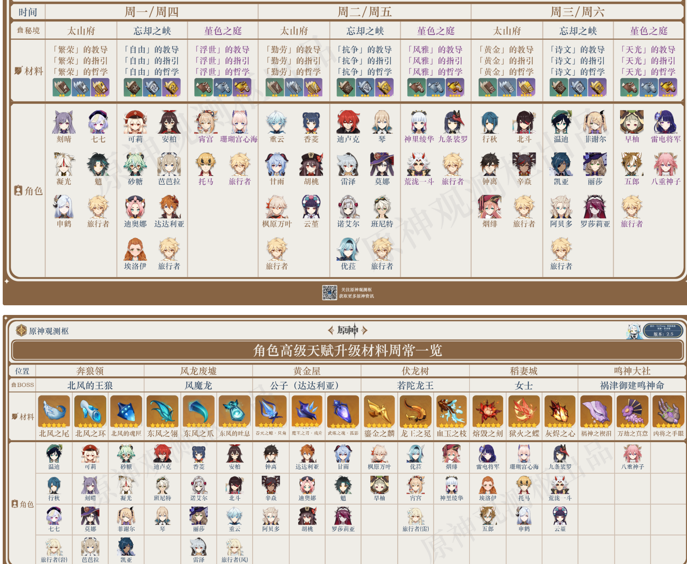

# 天赋升级

# 班尼特

主Q E随意 普攻不点 4宗室

武器：高基础攻击剑 暗巷闪光 > 试做斩岩

圣遗物：宗室套

主词条：生命/充能沙+生命杯+生命/治疗头

副词条：大生命 > 充能 > 小生命 > 其他

# 行秋

主Q副E	副C堆攻击和水伤   2命 6命

武器：强推祭礼剑 

圣遗物：**可带宗室套**   或者**2宗室2沉沦** 加20元素爆伤和15水伤 或者**绝缘套**

主词条：充能沙+水伤杯+攻击/双暴头

副词条：优先充能到200 双暴>充能>攻击

# 雷神

主Q副E 普攻也可以点 开大3A3重击

武器：薙草之稻光

圣遗物：绝缘套

主词条：充能沙+雷伤杯+双暴头 	有加攻击的阵容里带雷伤杯

副词条：双暴>充能>攻击  优先充能到300  暴击50 爆伤 150 

其他：

# 九条裟罗

主E副Q 	

武器：天空之翼 > 终末 > 飞雷 > 阿莫斯之弓

圣遗物：绝缘套 宗室套

主词条 充能/攻击沙+雷伤/攻击杯+双暴头

副词条：优先200以上充能 

其他:

- E的攻击力加成 只看 基础攻击力和E的等级 10级E可以加自身77%的基础攻击力 13级可加91%基础
- 九条可以先E然后直接Q，然后切人物吃雷的增伤。这样Q计算伤害时可以吃到E的攻击力
- Q对体型大的怪最多可以打到37次雷劈的伤害，且每次暴击独立计算。
- 6命的Q不止加攻击力，而且加雷属性伤害的60%爆伤

# 莫娜

武器：流浪乐章（核爆流） 永冻流（天空之卷）

圣遗物：宗室套 或者 2宗室+[2角斗士 /2乐团/2水套]

主词条：充能沙+水伤杯+双暴头

副词条：

其他：

- 天赋 充能的20%转换为水伤
- 大招会同时增加两种效果，泡影和星异。星异是增伤，最高达60%，并且会在泡影破裂后继续持久5秒。泡影可以通过冰冻结来保持不被戳破，这个也是永冻流的核心。
- 攻击戳破泡影会触发一个巨额水伤。
- 大招具体分为两段，开大瞬间会给怪上一个无伤害的水附着，戳破泡影的时候会造成巨额水伤，并增加一个水附着。
- 班尼特和莫娜核爆打法是，班尼特开大挂火，莫娜开大，挂的火被第一次水附着中和，此时莫娜不能立马切下场，需要等待两秒，因为元素附着有2秒CD，跳两下，然后切班尼特 要在1秒内戳破，1秒的原因是班尼特的大招在下场后只能保留1秒

# 北斗

武器：璃骨剑 > 恶王丸 > 桂木斩长正

圣遗物：绝缘 宗室

主词条

副词条：

# 八重神子

武器：

圣遗物：

主词条：

副词条：

其他：

# 刻晴

武器：

圣遗物：

主词条：

副词条：

其他：

# 七七

武器：西风剑 增加充能提高奶覆盖率

圣遗物：海染套 少女套

主词条：充能沙+攻击杯+暴击头

副词条：充能 > 暴击 > 攻击百分比 > 爆伤

其他：

- 奶单次奶量、回复覆盖率

# 元素反应

**超载：火+ 雷，**反应时发生爆炸，对敌人造成范围火元素伤害。超载反应造成的基础伤害仅与角色等级有关，且无法暴击。超载反应造成的爆炸无法为敌人附着火元素。

**超导：冰+ 雷**，反应时发生爆炸，对敌人造成范围冰元素伤害。超导反应造成的基础伤害仅与角色等级有关，且无法暴击。超导反应可以降低敌人一定的防御力。超导反应造成的爆炸无法为敌人附着冰元素。

**感电：水+ 雷，**反应时对敌人造成额外雷元素伤害，若周围存在被水元素附着的敌人，则会向周围传导雷元素伤害，传导伤害无法为敌人附着雷元素。

**蒸发：水+ 火，**按百分比提高本次攻击的伤害。根据攻击顺序的不同，伤害提升的百分比也不同。
火元素攻击水附着，提高50%（1.5倍伤害）水元素攻击火附着，提高100%（2倍伤害）

**融化：冰+ 火，**按百分比提高本次攻击的伤害。根据攻击顺序的不同，伤害提升的百分比也不同。     
冰元素攻击火附着，提高50%（1.5倍伤害）火元素攻击冰附着，提高100%（2倍伤害）

**冻结：水 +冰，**强控制，伤害不提升。

**碎冰：**被冻结的敌人受到**重攻击**时会产生碎冰反应，重攻击在前期体验中主要表现为双手剑攻击。碎冰反应表现为敌人解除冰冻并受到一定的**物理伤害**。