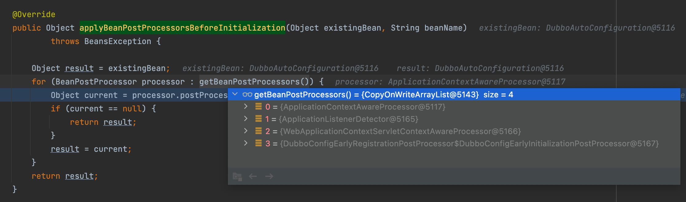

# SPI

## TelnetHandler

`org.apache.dubbo.remoting.telnet.TelnetHandler` 

实现该接口可以在终端下通过 telnel 访问服务器，查看RPC中已注册的接口及方法列表，查询入参出参的结构就是通过这个实现的。

还可以用来做一些在线运维的工作。

**示例**

```java
@Activate
@Help(parameter = "[-l] [service]", summary = "List services and methods.", detail = "List services and methods.")
public class ListTelnetHandler implements TelnetHandler {
  
  private ServiceRepository serviceRepository = ApplicationModel.getServiceRepository();

  @Override
  public String telnet(Channel channel, String message) {
    return "res"
  }
}
```

SPI配置：META-INF/dubbo/org.apache.dubbo.remoting.telnet.TelnetHandler

```properties
#配置形式：待处理命令=解析器
ls=com.lwj.ListTelnetHandler
```

```shell
telnet 127.0.0.1 20880 
dubbo> ls 
# output
res
```


# Dubbo启动流程入口

扫描到starter包下的 `org.apache.dubbo.spring.boot.autoconfigure.DubboAutoConfiguration`  创建bean对象

在实例化对象后，初始化对象阶段（initializeBean方法）会调用 BeanPostProcessor接口的处理方法

postProcessBeforeInitialization（初始化前处理方法） postProcessAfterInitialization（初始化后处理方法）

```java
protected Object initializeBean(final String beanName, final Object bean, @Nullable RootBeanDefinition mbd) {
		Object wrappedBean = bean;
		if (mbd == null || !mbd.isSynthetic()) {
      //初始化前处理方法
			wrappedBean = applyBeanPostProcessorsBeforeInitialization(wrappedBean, beanName);
		}

		try {
      //初始化方法
			invokeInitMethods(beanName, wrappedBean, mbd);
		}
		catch (Throwable ex) {
			throw new BeanCreationException(
					(mbd != null ? mbd.getResourceDescription() : null),
					beanName, "Invocation of init method failed", ex);
		}
		if (mbd == null || !mbd.isSynthetic()) {
      //初始化后处理方法
			wrappedBean = applyBeanPostProcessorsAfterInitialization(wrappedBean, beanName);
    }
```

**AbstractAutowireCapableBeanFactory#applyBeanPostProcessorsBeforeInitialization 初始化前处理方法**



当前注册的BeanPostProcessor实现有下面四个：

- `ApplicationContextAwareProcessor`，感知ApplicationContext处理器，对实现ApplicationContextAware接口的bean注入ApplicationContext
- `ApplicationListenerDetector`，ApplicationListener探测器，将实现ApplicationListener接口的单例bean加入容器，实现了MergedBeanDefinitionPostProcessor接口，会在填充属性前就将bean名称及是否单例记录下来。
- `WebApplicationContextServletContextAwareProcessor`，
- `DubboConfigEarlyInitializationPostProcessor`，

**DubboAutoConfiguration 实现了ApplicationContextAware。**

在设置ApplicationContext的时候，向容器中注册了两个监听器 `DubboLifecycleComponentApplicationListener`、 `DubboBootstrapApplicationListener`

```java
public class DubboAutoConfiguration implements ApplicationContextAware, BeanDefinitionRegistryPostProcessor {
  
    public void setApplicationContext(ApplicationContext applicationContext) throws BeansException {
        if (applicationContext instanceof ConfigurableApplicationContext) {
            ConfigurableApplicationContext context = (ConfigurableApplicationContext)applicationContext;
          	//dubbo生命周期组件监听器
            DubboLifecycleComponentApplicationListener dubboLifecycleComponentApplicationListener = new DubboLifecycleComponentApplicationListener(applicationContext);
            context.addApplicationListener(dubboLifecycleComponentApplicationListener);
          	//dubbo启动引导监听器
            DubboBootstrapApplicationListener dubboBootstrapApplicationListener = new DubboBootstrapApplicationListener(applicationContext);
            context.addApplicationListener(dubboBootstrapApplicationListener);
        }
    }
}
```

创建 `DubboBootstrapApplicationListener` 

```java
public class DubboBootstrapApplicationListener extends OnceApplicationContextEventListener implements Ordered {

    public static final String BEAN_NAME = "dubboBootstrapApplicationListener";

    private final DubboBootstrap dubboBootstrap;

    public DubboBootstrapApplicationListener(ApplicationContext applicationContext) {
        super(applicationContext);
        this.dubboBootstrap = DubboBootstrap.getInstance();
        DubboBootstrapStartStopListenerSpringAdapter.applicationContext = applicationContext;
    }
}
```


```java
//DubboBootstrap#getInstance
public class DubboBootstrap {
  
	  // executorRepository 是DubboBootstrap的属性，会在 new DubboBootstrap（）时触发创建
    private final ExecutorRepository executorRepository = getExtensionLoader(ExecutorRepository.class).getDefaultExtension();
  
    public static DubboBootstrap getInstance() {
        if (instance == null) {
            synchronized (DubboBootstrap.class) {
                if (instance == null) {
                    instance = new DubboBootstrap();
                }
            }
        }
        return instance;
    }

    private DubboBootstrap() {
        configManager = ApplicationModel.getConfigManager();
        environment = ApplicationModel.getEnvironment();

        DubboShutdownHook.getDubboShutdownHook().register();
        ShutdownHookCallbacks.INSTANCE.addCallback(DubboBootstrap.this::destroy);
    }
  
}
```

这里分析一下 `getExtensionLoader(ExecutorRepository.class).getDefaultExtension();`

获取 `ExecutorRepository`  的扩展加载器，然后获取默认扩展。但在获取扩展器之前需要 先获取到 `ExtensionFactory` 扩展加载器的默认扩展。最后返回的是 `ExtensionLoader.getExtensionLoader(ExtensionFactory.class).getAdaptiveExtension()`

```java
//org.apache.dubbo.common.extension.ExtensionLoader

//1.ExtensionLoader#getExtensionLoader
	public static <T> ExtensionLoader<T> getExtensionLoader(Class<T> type) { //type is ExecutorRepository.class
		    //org.apache.dubbo.common.threadpool.manager.ExecutorRepository
        ExtensionLoader<T> loader = (ExtensionLoader<T>) EXTENSION_LOADERS.get(type);
        if (loader == null) {
          	//第一次会走这里去 new ExtensionLoader<T>(type)
            EXTENSION_LOADERS.putIfAbsent(type, new ExtensionLoader<T>(type));
            loader = (ExtensionLoader<T>) EXTENSION_LOADERS.get(type);
        }
        return loader;
    }

//2.ExtensionLoader#ExtensionLoader 
    private ExtensionLoader(Class<?> type) { //ExecutorRepository.class
        this.type = type;
        objectFactory = (type == ExtensionFactory.class ? null : ExtensionLoader.getExtensionLoader(ExtensionFactory.class).getAdaptiveExtension());
    }


//3.ExtensionLoader#getExtensionLoader 再次走到这个方法 入参变成了 ExtensionFactory.class
	public static <T> ExtensionLoader<T> getExtensionLoader(Class<T> type) { 
		    //org.apache.dubbo.common.extension.ExtensionFactory
        ExtensionLoader<T> loader = (ExtensionLoader<T>) EXTENSION_LOADERS.get(type);
        if (loader == null) {
          	//ExtensionFactory也继续走这里
            EXTENSION_LOADERS.putIfAbsent(type, new ExtensionLoader<T>(type));
            loader = (ExtensionLoader<T>) EXTENSION_LOADERS.get(type);
        }
        return loader;
    }

//4.ExtensionLoader#ExtensionLoader
    private ExtensionLoader(Class<?> type) { //ExtensionFactory.class
        this.type = type;
      	//boolean条件判断为true返回null，返回了一个objectFactory为null的 ExtensionLoader
        objectFactory = (type == ExtensionFactory.class ? null : ExtensionLoader.getExtensionLoader(ExtensionFactory.class).getAdaptiveExtension());
    }


//5.接下来走步骤2中的getAdaptiveExtension方法 调用的对象是 ExtensionFactory类型的ExtensionLoader
//ExtensionLoader#getAdaptiveExtension 获取
    public T getAdaptiveExtension() {
        Object instance = cachedAdaptiveInstance.get();
        if (instance == null) {
            if (createAdaptiveInstanceError != null) {
                throw new IllegalStateException("Failed to create adaptive instance: " +
                        createAdaptiveInstanceError.toString(),
                        createAdaptiveInstanceError);
            }

            synchronized (cachedAdaptiveInstance) {
                instance = cachedAdaptiveInstance.get();
                if (instance == null) {
                    try {
                     		// 创建自适应的扩展
                        instance = createAdaptiveExtension();
                        cachedAdaptiveInstance.set(instance);
                    } catch (Throwable t) {
                        createAdaptiveInstanceError = t;
                        throw new IllegalStateException("Failed to create adaptive instance: " + t.toString(), t);
                    }
                }
            }
        }

        return (T) instance;
    }

    private T createAdaptiveExtension() {
        try {
						//getAdaptiveExtensionClass方法获结果是 AdaptiveExtensionFactory
            return injectExtension((T) getAdaptiveExtensionClass().newInstance());
        } catch (Exception e) {
            throw new IllegalStateException("Can't create adaptive extension " + type + ", cause: " + e.getMessage(), e);
        }
    }

   private Class<?> getAdaptiveExtensionClass() {
	     //加载扩展类
        getExtensionClasses();
        if (cachedAdaptiveClass != null) {
            return cachedAdaptiveClass;
        }
        return cachedAdaptiveClass = createAdaptiveExtensionClass();
    }

		//加载扩展类 step1
    private Map<String, Class<?>> getExtensionClasses() {
        Map<String, Class<?>> classes = cachedClasses.get();
        if (classes == null) {
            synchronized (cachedClasses) {
                classes = cachedClasses.get();
                if (classes == null) {
                    classes = loadExtensionClasses();
                    cachedClasses.set(classes);
                }
            }
        }
        return classes;
    }

		//加载扩展类 step2，同步加载当前ExtensionLoader类对应的扩展类文件
    private Map<String, Class<?>> loadExtensionClasses() {
        cacheDefaultExtensionName();

        Map<String, Class<?>> extensionClasses = new HashMap<>();
				
      //加载策略在类创建的时候已初始化
        for (LoadingStrategy strategy : strategies) {
          //ExtensionLoader#loadDirectory  type是当前扩展类加载器的类型
            loadDirectory(extensionClasses, strategy.directory(), type.getName(), strategy.preferExtensionClassLoader(),strategy.overridden(), strategy.excludedPackages());
            loadDirectory(extensionClasses, strategy.directory(), type.getName().replace("org.apache", "com.alibaba"),strategy.preferExtensionClassLoader(), strategy.overridden(), strategy.excludedPackages());
        }
        return extensionClasses;
    }


//加载扩展类 step3，加载结果保存到了extensionClasses这个map当中 
private void loadDirectory(Map<String, Class<?>> extensionClasses, String dir, String type,
                               boolean extensionLoaderClassLoaderFirst, boolean overridden, String... excludedPackages) {
		        String fileName = dir + type;
            ClassLoader classLoader = findClassLoader();
            ...
            urls = classLoader.getResources(fileName);
            ...
            loadResource(extensionClasses, classLoader, resourceURL, overridden, excludedPackages);
    }

//org.apache.dubbo.common.extension.ExtensionFactory 	spi
spring=org.apache.dubbo.config.spring.extension.SpringExtensionFactory
adaptive=org.apache.dubbo.common.extension.factory.AdaptiveExtensionFactory
spi=org.apache.dubbo.common.extension.factory.SpiExtensionFactory

```

### ExtensionLoader的加载策略

在创建 dubbo 的 ExtensionLoader时，在初始化属性 strategies 的时候会通过 JDK 的SPI加载 加载策略，这些策略定义了dubbo SPI 的扫描目录和策略等

```java
public class ExtensionLoader<T> {
  ...
	private static volatile LoadingStrategy[] strategies = loadLoadingStrategies();
  
    private static LoadingStrategy[] loadLoadingStrategies() {
        return stream(load(LoadingStrategy.class).spliterator(), false)
                .sorted()
                .toArray(LoadingStrategy[]::new);
    }
}

//java.util.ServiceLoader#load(java.lang.Class<S>)
 public static <S> ServiceLoader<S> load(Class<S> service) {
        ClassLoader cl = Thread.currentThread().getContextClassLoader();
        return ServiceLoader.load(service, cl);
    }

org/apache/dubbo/dubbo/2.7.18.1/dubbo-2.7.18.1.jar!/META-INF/services
文件名：/org.apache.dubbo.common.extension.LoadingStrategy
内容：	
org.apache.dubbo.common.extension.DubboInternalLoadingStrategy
org.apache.dubbo.common.extension.DubboLoadingStrategy
org.apache.dubbo.common.extension.ServicesLoadingStrategy	
  
这三个策略对应的目录如下，优先级也是从高到低  
META-INF/dubbo/internal/
META-INF/dubbo/
META-INF/services/
```


```java
//org.apache.dubbo.common.context.FrameworkExt SPI
config=org.apache.dubbo.config.context.ConfigManager
environment=org.apache.dubbo.common.config.Environment
repository=org.apache.dubbo.rpc.model.ServiceRepository
```

## SpringExtensionFactory

SpringExtensionFactory的作用在于dubbo的SPI机制中的依赖注入，当有扩展类需要注入其他bean的时候，可能会从SpringExtensionFactory这个类中通过applicationContext获取Bean对象。

## ServiceClassPostProcessor

处理 @DubboServie 标记类，包装成 ServiceBean 存入beanDefination 中。


## [dubbo SPI @Adaptive注解使用方法与原理解析 简单易懂](https://blog.csdn.net/qq_41960425/article/details/109348241?spm=1001.2101.3001.6650.3&utm_medium=distribute.pc_relevant.none-task-blog-2%7Edefault%7EBlogCommendFromBaidu%7ERate-3-109348241-blog-120812534.pc_relevant_default&depth_1-utm_source=distribute.pc_relevant.none-task-blog-2%7Edefault%7EBlogCommendFromBaidu%7ERate-3-109348241-blog-120812534.pc_relevant_default&utm_relevant_index=4)

## Holder 作用

其实Holder这个类属于JAX-WS 2.0规范中的一个类，其作用是为不可变的对象引用提供一个可变的包装。 这就涉及到Java的按值传递与引用传递之争了。 引用传递中在栈上copy一个引用的副本，其指向同一堆对象。2020年5月8日
