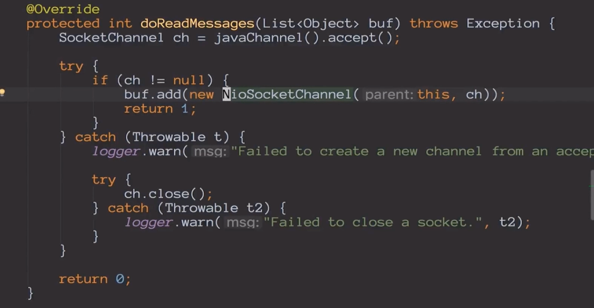
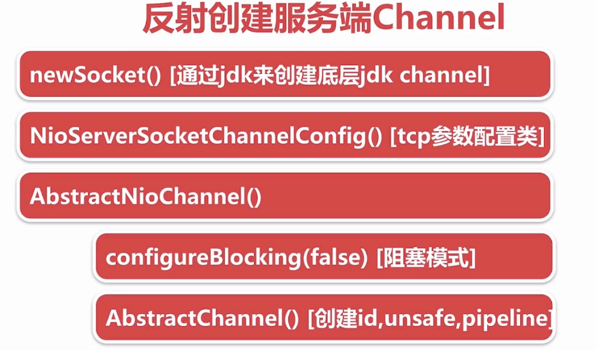
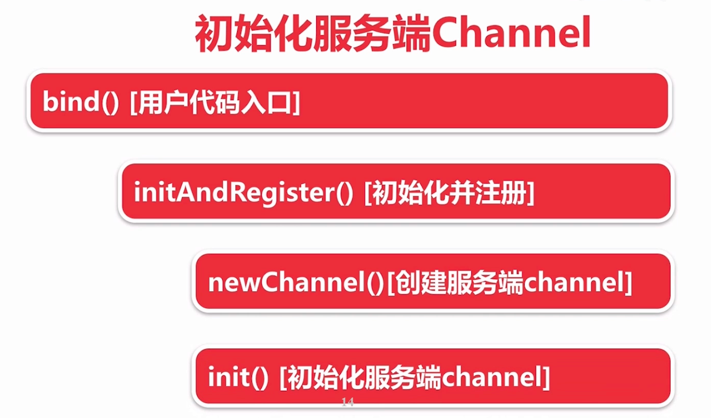
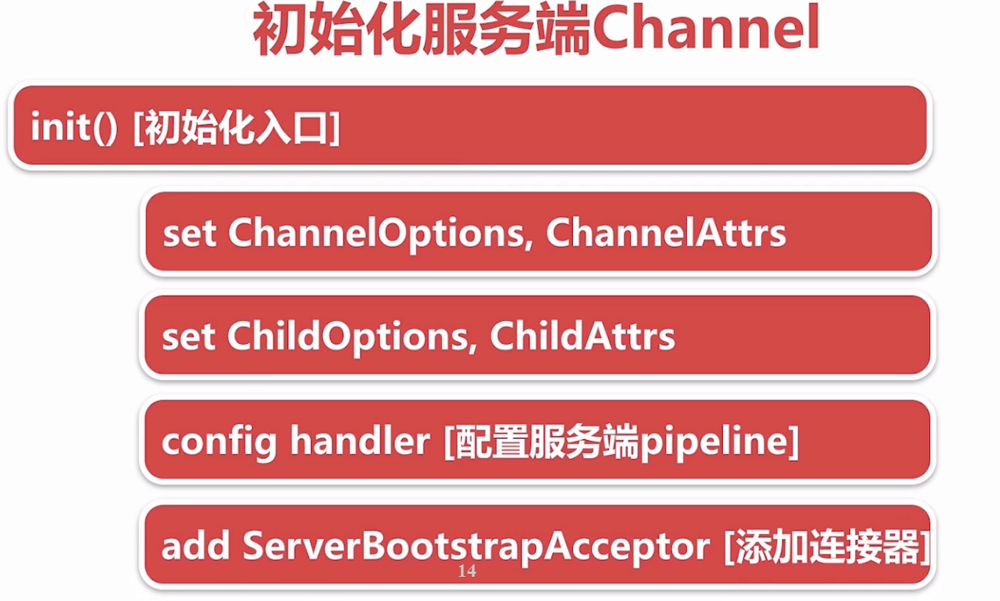
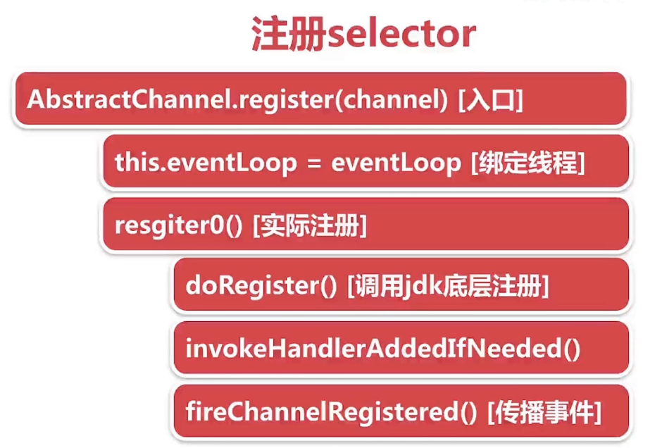
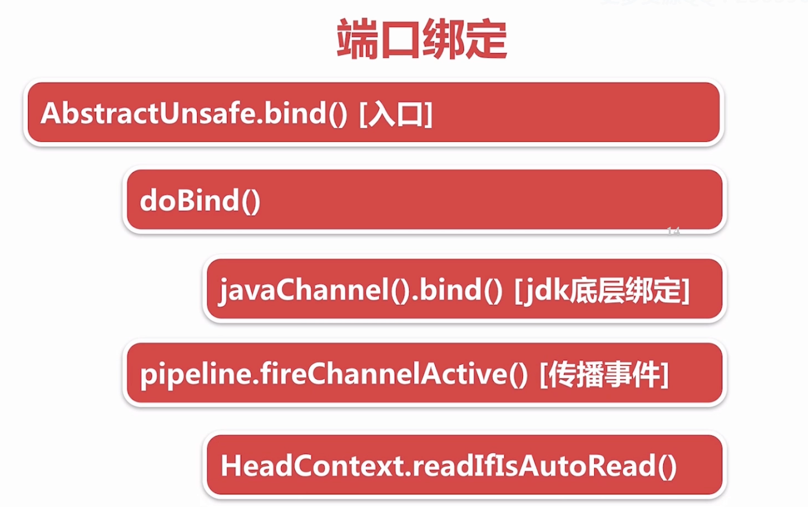
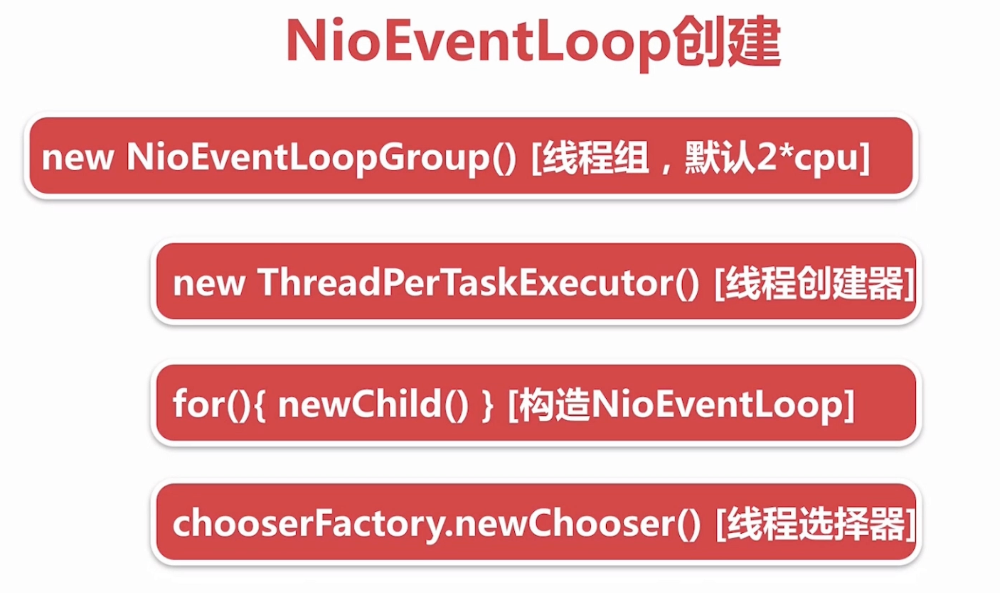
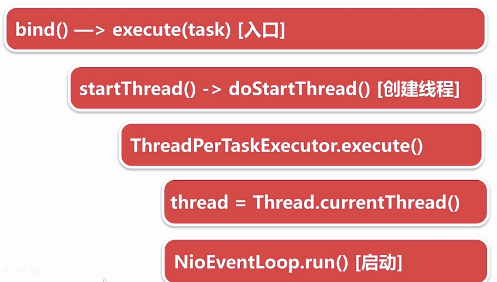

# NIO

## Server端代码

```java
public class NioSelectorServer {
    public static void main(String[] args) throws Exception {
        //  1. 打开一个服务端通道
        ServerSocketChannel ssc = ServerSocketChannel.open();
        //  2. 绑定对应的端口号
        ssc.bind(new InetSocketAddress(8888));
        //  3. 通道默认是阻塞的，需要设置为非阻塞
        ssc.configureBlocking(false);
        //  4. 创建选择器
        Selector selector = Selector.open();
        //  5. 将服务端通道注册到选择器上, 并指定注册监听的事件为OP_ACCEPT
        ssc.register(selector, SelectionKey.OP_ACCEPT);
        //  6. 检查选择器是否有事件
        while (true) {
            int select = selector.select(1000);
            if (select == 0) {
                System.out.println("暂时没有事件");
                continue;
            }
            //  7. 获取事件集合
            Iterator<SelectionKey> iterator = selector.selectedKeys().iterator();
            while (iterator.hasNext()) {
                SelectionKey selectionKey = iterator.next();
                //  8. 判断事件是否是客户端连接事件SelectionKey.isAcceptable()
                if (selectionKey.isAcceptable()) {
                    SocketChannel socketChannel = ssc.accept();
                    // 9. 得到客户端通道, 并将通道注册到选择器上, 并指定监听事件为OP_READ
                    socketChannel.configureBlocking(false);
                    socketChannel.register(selector, SelectionKey.OP_READ);
                    //  10. 判断是否是客户端读就绪事件SelectionKey.isReadable()
                }
                if (selectionKey.isReadable()) {
                    //  11. 得到客户端通道, 读取数据到缓冲区
                    SocketChannel channel = (SocketChannel) selectionKey.channel();
                    ByteBuffer byteBuffer = ByteBuffer.allocate(1024);
                    int read = channel.read(byteBuffer);
                    if (read > 0) {
                        System.out.println(new String(byteBuffer.array(), 0, read, StandardCharsets.UTF_8));
                    }
                    //  12. 给客户端回写数据
                    channel.write(ByteBuffer.wrap("server msg".getBytes(StandardCharsets.UTF_8)));
                    channel.close();
                }
                //  13. 从集合中删除对应的事件, 因为防止二次处理.
                iterator.remove();
            }
        }
    }
}
```

## Client端代码

```java
public class NioClient {
    public static void main(String[] args) throws Exception {
        SocketChannel sc = SocketChannel.open();
        System.out.println("客户端发起连接´");
        sc.connect(new InetSocketAddress("localhost", 8888));
        sc.write(ByteBuffer.wrap("你好".getBytes(StandardCharsets.UTF_8)));
        ByteBuffer byteBuffer = ByteBuffer.allocate(1024);
        int read = sc.read(byteBuffer);
        System.out.println(new String(byteBuffer.array(), 0, read, StandardCharsets.UTF_8));
    }
}
```


#  Netty组件对比

NioEventLoop 对应 Thread，用来 accept 连接，监听 连接和读写事件

Channel 则是对 Socket 的抽象，会把accept到的连接封装在Channel中，由Channel提供 绑定 读写和连接的操作 



Bytebuf 对应 之前的byte数组

Pipeline  对应 获取数据流后的处理逻辑流程，在创建 Channel 的时候同时会传入一个 对应的 Pipeline，所以后续每次数据读写都会经过这个Pipeline

ChannelHandler 对应 获取数据流后的处理逻辑 

# Netty服务端启动

```java
 ServerBootstrap b = new ServerBootstrap();
            b.group(bossGroup, workerGroup)
                    .channel(NioServerSocketChannel.class)
                    .childOption(ChannelOption.TCP_NODELAY, true)
                    .childAttr(AttributeKey.newInstance("childAttr"), "childAttrValue")
                    .handler(new ServerHandler())
                    .childHandler(new ChannelInitializer<SocketChannel>() {
                        @Override
                        public void initChannel(SocketChannel ch) {
                            ch.pipeline().addLast(new AuthHandler());
                            //..
                        }
                    });

            ChannelFuture f = b.bind(8888).sync();
```

## 创建服务端Channel



```java
final ChannelFuture initAndRegister() {
        Channel channel = null;
        try {
		        //创建服务端Channel
            channel = channelFactory.newChannel();
            init(channel);
        } catch (Throwable t) {
            if (channel != null) {
                // channel can be null if newChannel crashed (eg SocketException("too many open files"))
                channel.unsafe().closeForcibly();
            }
            // as the Channel is not registered yet we need to force the usage of the GlobalEventExecutor
            return new DefaultChannelPromise(channel, GlobalEventExecutor.INSTANCE).setFailure(t);
        }
					//...
```

```java
 public NioServerSocketChannel(ServerSocketChannel channel) {
        super(null, channel, SelectionKey.OP_ACCEPT);
        config = new NioServerSocketChannelConfig(this, javaChannel().socket());
    }
```

在设置bootstrap阶段，设置了channel类型为NioServerSocketChannl，这个会把这个class包装到strap中，后边用户反射创建服务端Channel。这个io.netty.channel.socket.nio.NioServerSocketChannl是netty对于Java nio的包装。底层还是用了`provider.openServerSocketChannel()`  调用nio底层创建ServerSocketChannel。

创建了底层ServerSocketChannel后，还需要进行配置通道是否是阻塞的（因为通道默认是阻塞的，需要设置为非阻塞）。这些会在 NioServerSocketChannl 的父类 AbstractNioChannel 中进行配置，最终会调用到 `AbstractChannel()` ，创建AbstractChannel时会创建 Channel 的 id、Unsafe 和 pipeline 这个三个属性，AbstractChannel 是抽象了服务端和客户端的Channel。

ChannelId 是通道的唯一标识，Unsafe 是netty内部用来操作tcp 读写的类，pipeline 则是对应业务逻辑。

将创建的 NioServerSocketChannl 对象 与 NioServerSocketChannelConfig 对象进行双向关联，这个配置类主要是进行tcp参数配置。

## 初始化服务端Channel





```java
@Override
    void init(Channel channel) throws Exception {
      	//ServerBootstrap构建时options的配置，使用较少
        final Map<ChannelOption<?>, Object> options = options0();
        synchronized (options) {
	          //设置到之前 ServerSocketChannel 关联的ServerSocketChannelConfig中
            channel.config().setOptions(options);
        }
      
      	//设置ServerSocketChannel 对应的 ChannlAttrs
        final Map<AttributeKey<?>, Object> attrs = attrs0();
        synchronized (attrs) {
            for (Entry<AttributeKey<?>, Object> e: attrs.entrySet()) {
                @SuppressWarnings("unchecked")
                AttributeKey<Object> key = (AttributeKey<Object>) e.getKey();
                channel.attr(key).set(e.getValue());
            }
        }

        ChannelPipeline p = channel.pipeline();

        final EventLoopGroup currentChildGroup = childGroup;
        final ChannelHandler currentChildHandler = childHandler;
        final Entry<ChannelOption<?>, Object>[] currentChildOptions;
        final Entry<AttributeKey<?>, Object>[] currentChildAttrs;
        synchronized (childOptions) {
            currentChildOptions = childOptions.entrySet().toArray(newOptionArray(childOptions.size()));
        }
        synchronized (childAttrs) {
            currentChildAttrs = childAttrs.entrySet().toArray(newAttrArray(childAttrs.size()));
        }

        p.addLast(new ChannelInitializer<Channel>() {
            @Override
            public void initChannel(Channel ch) throws Exception {
                final ChannelPipeline pipeline = ch.pipeline();
	              // 从ServerSocketChannelConfig中获取bootStrap阶段配置的ServerHandler
                ChannelHandler handler = config.handler();
                if (handler != null) {
                    pipeline.addLast(handler);
                }

        // We add this handler via the EventLoop as the user may have used a ChannelInitializer as handler.
	      // In this case the	 initChannel(...) method will only be called after this method returns. Because
        // of this we need to ensure we add our handler in a delayed fashion so all the users handler are
        // placed in front of the ServerBootstrapAcceptor.
              //这里向pipeline中添加一个连接接入器，新的连接都会使用传入的这些属性进行配置。
                ch.eventLoop().execute(new Runnable() {
                    @Override
                    public void run() {
                      pipeline.addLast(new ServerBootstrapAcceptor(
                          currentChildGroup, currentChildHandler, currentChildOptions, currentChildAttrs));
                    }
                });
            }
        });
    }
```


## 注册selector



```java
//io.netty.channel.nio.AbstractNioChannel#doRegister
protected void doRegister() throws Exception {
	//...
	selectionKey = javaChannel().register(eventLoop().selector, 0, this);
	//...
}
```

这里实际上还是调用了JavaNioChannel的 register 方法，但是不监听任何操作，参数 this 指的是 NioServerSocketChannel，以attachment（附件）形式绑定在了 java的 Channel 上，这里在注册的时候传入关注的事件是0，后边再绑定好端口后才会去做处理，增加关注连接事件。

```java
//io.netty.channel.AbstractChannel.AbstractUnsafe#register0
private void register0(ChannelPromise promise) {
	//..
	pipeline.invokeHandlerAddedIfNeeded();
  
	pipeline.fireChannelRegistered();
  
  if (isActive()) {
      if (firstRegistration) {
          pipeline.fireChannelActive();
      } else if (config().isAutoRead()) {
          // This channel was registered before and autoRead() is set. This means we need to begin read
          // again so that we process inbound data.
          //
          // See https://github.com/netty/netty/issues/4805
          beginRead();
      }
  }
}
```

上边两个pipeline的调用会触发两个钩子函数，具体对应的是 ServerHandler 中的，注意这里的 channelActive 还不会被触发。

```java
public class ChannelInboundHandlerAdapter extends ChannelHandlerAdapter implements ChannelInboundHandler {
    @Override
    public void handlerAdded(ChannelHandlerContext ctx) throws Exception {
        // NOOP
    }
  
    @Override
    public void channelRegistered(ChannelHandlerContext ctx) throws Exception {
        ctx.fireChannelRegistered();
    }
  
    @Override
    public void channelActive(ChannelHandlerContext ctx) throws Exception {
        ctx.fireChannelActive();
    }
}
```


## bind端口



bind 最后会走到 AbstractUnsafe  进行JDK的绑定，并且调用 fireChannelActive 发送 Channel激活事件。

```java
//io.netty.channel.AbstractChannel.AbstractUnsafe#bind
public final void bind(final SocketAddress localAddress, final ChannelPromise promise) {
           //...
            boolean wasActive = isActive();
            try {
              //底层JDK的端口绑定
                doBind(localAddress);
            } catch (Throwable t) {
                safeSetFailure(promise, t);
                closeIfClosed();
                return;
            }

            if (!wasActive && isActive()) {
                invokeLater(new Runnable() {
                    @Override
                    public void run() {
                        pipeline.fireChannelActive();
                    }
                });
            }

            safeSetSuccess(promise);
        }
```

做了两件事情：

- 底层JDK的端口绑定，对应 nio Server端的代码是 `serverSocketChannel.bind(new InetSocketAddress(8888));`

- 发送 channelActive 的事件，并且在readIfIsAutoRead 将 interestOps 关注的操作 增加 连接事件

  ```java
  //io.netty.channel.DefaultChannelPipeline.HeadContext#channelActive
  @Override
  public void channelActive(ChannelHandlerContext ctx) throws Exception {
    	//这里才会真正去触发 channelActive
      ctx.fireChannelActive();
  
      readIfIsAutoRead();
  }
  ```

  ```java
  //io.netty.channel.nio.AbstractNioChannel#doBeginRead
      @Override
      protected void doBeginRead() throws Exception {
          // Channel.read() or ChannelHandlerContext.read() was called
          final SelectionKey selectionKey = this.selectionKey;
          if (!selectionKey.isValid()) {
              return;
          }
  
          readPending = true;
  				//readInterestOp 是在创建服务端Channel时，传入的SelectionKey.OP_ACCEPT
          final int interestOps = selectionKey.interestOps();
          if ((interestOps & readInterestOp) == 0) {
              selectionKey.interestOps(interestOps | readInterestOp);
          }
      }
  ```

# NioEventLoop

## 面试题

默认情况下，Netty服务端起多少线程？何时启动？
Netty是如何解决jdk空轮训bug的？
Netty如何保证异步串行无锁化？

## NioEventLoop的创建



```java
//io.netty.util.concurrent.MultithreadEventExecutorGroup#MultithreadEventExecutorGroup
protected MultithreadEventExecutorGroup(int nThreads, Executor executor,
                                            EventExecutorChooserFactory chooserFactory, Object... args) {
				//...
        children = new EventExecutor[nThreads];

        for (int i = 0; i < nThreads; i ++) {
            boolean success = false;
            try {
                children[i] = newChild(executor, args);
                success = true;
            } 
	          //...
        }

        chooser = chooserFactory.newChooser(children);

        final FutureListener<Object> terminationListener = new FutureListener<Object>() {
            @Override
            public void operationComplete(Future<Object> future) throws Exception {
                if (terminatedChildren.incrementAndGet() == children.length) {
                    terminationFuture.setSuccess(null);
                }
            }
        };

        for (EventExecutor e: children) {
            e.terminationFuture().addListener(terminationListener);
        }

        Set<EventExecutor> childrenSet = new LinkedHashSet<EventExecutor>(children.length);
        Collections.addAll(childrenSet, children);
        readonlyChildren = Collections.unmodifiableSet(childrenSet);
    }
```

### ThreadPerTaskExecutor

- 每次执行任务都会创建一个线程实体，Netty底层使用的不是原生的 Thread 线程，而是经过包装的 FastThreadLocalThread，它内部定义了一个 InternalThreadLocalMap threadLocalMap 对象。
- NioEventLoop线程命名规则nioEventLoop-1-xx，1是线程池序号，xx是指线程序号。

### newchild

- 保存线程执行器ThreadPerTaskExecutor
- 创建一个MpscQueue
- 创建一个selector

### chooserFactory.newChoose

- 在创建了一个线程选择器时，会根据线程执行器的底层线程数量来做优化。比如是2的幂指数倍时，取模选线程的方式会调整，m % n 的会变成  m & n-1这种运算，这里的 n-1 优先于 & 运算符，没有直接用 % 是因为这个运算符性能会稍差一些。

  ```java
  		//io.netty.util.concurrent.DefaultEventExecutorChooserFactory#newChooser
  		@Override
      public EventExecutorChooser newChooser(EventExecutor[] executors) {
        // 判断是否2的幂指数倍
          if (isPowerOfTwo(executors.length)) {
              return new PowerOfTowEventExecutorChooser(executors);
          } else {
              return new GenericEventExecutorChooser(executors);
          }
      }
  ```

  

- 在注册Selector的时候会调用 next 方法来返回一个 NioEventLoop，这样是为了让新链接绑定在不同的 Loop上边，做了一个类似负载均衡的作用。

  ```java
  		//io.netty.util.concurrent.MultithreadEventExecutorGroup#next
      @Override
      public EventExecutor next() {
          return chooser.next();
      }
  ```

## NioEventLoop的启动



###  服务端启动绑定端口

### 新连接接入通过chooser绑定一个NioEventLoop

## NioEventLoop执行逻辑