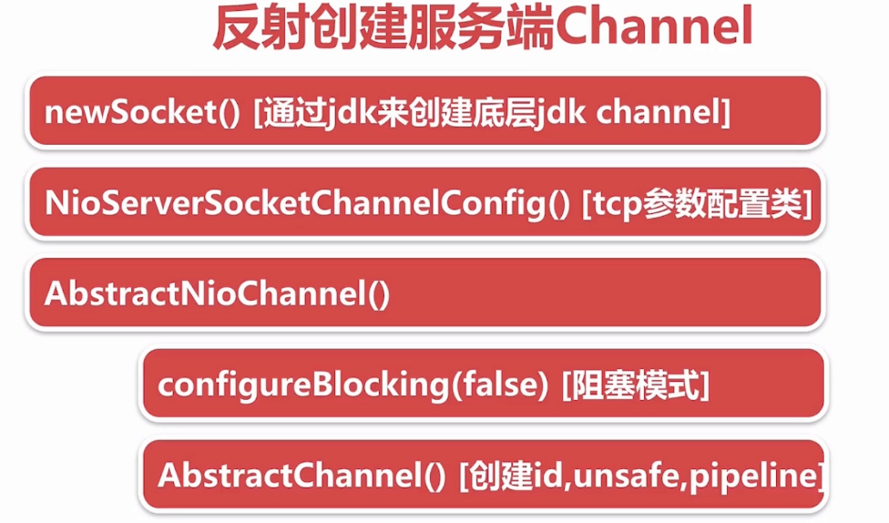

# NIO

## Server端代码

```java
public class NioSelectorServer {
    public static void main(String[] args) throws Exception {
        //  1. 打开一个服务端通道
        ServerSocketChannel ssc = ServerSocketChannel.open();
        //  2. 绑定对应的端口号
        ssc.bind(new InetSocketAddress(8888));
        //  3. 通道默认是阻塞的，需要设置为非阻塞
        ssc.configureBlocking(false);
        //  4. 创建选择器
        Selector selector = Selector.open();
        //  5. 将服务端通道注册到选择器上, 并指定注册监听的事件为OP_ACCEPT
        ssc.register(selector, SelectionKey.OP_ACCEPT);
        //  6. 检查选择器是否有事件
        while (true) {
            int select = selector.select(1000);
            if (select == 0) {
                System.out.println("暂时没有事件");
                continue;
            }
            //  7. 获取事件集合
            Iterator<SelectionKey> iterator = selector.selectedKeys().iterator();
            while (iterator.hasNext()) {
                SelectionKey selectionKey = iterator.next();
                //  8. 判断事件是否是客户端连接事件SelectionKey.isAcceptable()
                if (selectionKey.isAcceptable()) {
                    SocketChannel socketChannel = ssc.accept();
                    // 9. 得到客户端通道, 并将通道注册到选择器上, 并指定监听事件为OP_READ
                    socketChannel.configureBlocking(false);
                    socketChannel.register(selector, SelectionKey.OP_READ);
                    //  10. 判断是否是客户端读就绪事件SelectionKey.isReadable()
                }
                if (selectionKey.isReadable()) {
                    //  11. 得到客户端通道, 读取数据到缓冲区
                    SocketChannel channel = (SocketChannel) selectionKey.channel();
                    ByteBuffer byteBuffer = ByteBuffer.allocate(1024);
                    int read = channel.read(byteBuffer);
                    if (read > 0) {
                        System.out.println(new String(byteBuffer.array(), 0, read, StandardCharsets.UTF_8));
                    }
                    //  12. 给客户端回写数据
                    channel.write(ByteBuffer.wrap("server msg".getBytes(StandardCharsets.UTF_8)));
                    channel.close();
                }
                //  13. 从集合中删除对应的事件, 因为防止二次处理.
                iterator.remove();
            }
        }
    }
}
```

## Client端代码

```java
public class NioClient {
    public static void main(String[] args) throws Exception {
        SocketChannel sc = SocketChannel.open();
        System.out.println("客户端发起连接´");
        sc.connect(new InetSocketAddress("localhost", 8888));
        sc.write(ByteBuffer.wrap("你好".getBytes(StandardCharsets.UTF_8)));
        ByteBuffer byteBuffer = ByteBuffer.allocate(1024);
        int read = sc.read(byteBuffer);
        System.out.println(new String(byteBuffer.array(), 0, read, StandardCharsets.UTF_8));
    }
}
```


# NIO组件详解

## Selector

链接：https://www.jianshu.com/p/f26f1eaa7c8e

一个Channel在Selector注册其代表的是一个`SelectionKey`事件，`SelectionKey`的类型包括：

- `OP_READ`：可读事件；值为：`1<<0`  1
- `OP_WRITE`：可写事件；值为：`1<<2` 2
- `OP_CONNECT`：客户端连接服务端的事件(tcp连接)，一般为创建`SocketChannel`客户端channel；值为：`1<<3` 8
- `OP_ACCEPT`：服务端接收客户端连接的事件，一般为创建`ServerSocketChannel`服务端channel；值为：`1<<4` 16

一个Selector内部维护了三组keys：

1. `key set`:当前channel注册在Selector上所有的key；可调用`keys()`获取
2. `selected-key set`:当前channel就绪的事件；可调用`selectedKeys()`获取
3. `cancelled-key`:主动触发`SelectionKey#cancel()`方法会放在该集合，前提条件是该channel没有被取消注册；不可通过外部方法调用

Selector类中总共包含以下10个方法：

- `open()`:创建一个Selector对象
- `isOpen()`:是否是open状态，如果调用了`close()`方法则会返回`false`
- `provider()`:获取当前Selector的`Provider`
- `keys()`:如上文所述，获取当前channel注册在Selector上所有的key
- `selectedKeys()`:获取当前channel就绪的事件列表
- `selectNow()`:获取当前是否有事件就绪，该方法立即返回结果，不会阻塞；如果返回值>0，则代表存在一个或多个
- `select(long timeout)`:selectNow的阻塞超时方法，超时时间内，有事件就绪时才会返回；否则超过时间也会返回
- `select()`:selectNow的阻塞方法，直到有事件就绪时才会返回
- `wakeup()`:调用该方法会时，阻塞在`select()`处的线程会立马返回；(ps：下面一句划重点)即使当前不存在线程阻塞在`select()`处，那么下一个执行`select()`方法的线程也会立即返回结果，相当于执行了一次`selectNow()`方法
- `close()`: 用完`Selector`后调用其`close()`方法会关闭该Selector，且使注册到该`Selector`上的所有`SelectionKey`实例无效。channel本身并不会关闭。


#  Netty组件对比

NioEventLoop 对应 Thread，用来 accept 连接，监听 连接和读写事件

Channel 则是对 Socket 的抽象，会把accept到的连接封装在Channel中，由Channel提供 绑定 读写和连接的操作 


Bytebuf 对应 之前的byte数组

Pipeline  对应 获取数据流后的处理逻辑流程，在创建 Channel 的时候同时会传入一个 对应的 Pipeline，所以后续每次数据读写都会经过这个Pipeline

ChannelHandler 对应 获取数据流后的处理逻辑 

# 一、Netty服务端启动

## Netty Server端代码

```java
 ServerBootstrap b = new ServerBootstrap();
            b.group(bossGroup, workerGroup)
                    .channel(NioServerSocketChannel.class)
                    .childOption(ChannelOption.TCP_NODELAY, true)
                    .childAttr(AttributeKey.newInstance("childAttr"), "childAttrValue")
                    .handler(new ServerHandler())
                    .childHandler(new ChannelInitializer<SocketChannel>() {
                        @Override
                        public void initChannel(SocketChannel ch) {
                            ch.pipeline().addLast(new AuthHandler());
                            //..
                        }
                    });

            ChannelFuture f = b.bind(8888).sync();
```

## 创建服务端Channel



```java
final ChannelFuture initAndRegister() {
        Channel channel = null;
        try {
		        //创建服务端Channel
            channel = channelFactory.newChannel();
            init(channel);
        } catch (Throwable t) {
            if (channel != null) {
                // channel can be null if newChannel crashed (eg SocketException("too many open files"))
                channel.unsafe().closeForcibly();
            }
            // as the Channel is not registered yet we need to force the usage of the GlobalEventExecutor
            return new DefaultChannelPromise(channel, GlobalEventExecutor.INSTANCE).setFailure(t);
        }
					//...
```

```java
 public NioServerSocketChannel(ServerSocketChannel channel) {
        super(null, channel, SelectionKey.OP_ACCEPT);
        config = new NioServerSocketChannelConfig(this, javaChannel().socket());
    }
```

在设置bootstrap阶段，设置了channel类型为NioServerSocketChannl，这个会把这个class包装到strap中，后边用户反射创建服务端Channel。这个io.netty.channel.socket.nio.NioServerSocketChannl是netty对于Java nio的包装。底层还是用了`provider.openServerSocketChannel()`  调用nio底层创建ServerSocketChannel。

创建了底层ServerSocketChannel后，还需要进行配置通道是否是阻塞的（因为通道默认是阻塞的，需要设置为非阻塞）。这些会在 NioServerSocketChannl 的父类 AbstractNioChannel 中进行配置，最终会调用到 `AbstractChannel()` ，创建AbstractChannel时会创建 Channel 的 id、Unsafe 和 pipeline 这个三个属性，AbstractChannel 是抽象了服务端和客户端的Channel。

ChannelId 是通道的唯一标识，Unsafe 是netty内部用来操作tcp 读写的类，pipeline 则是对应业务逻辑。

将创建的 NioServerSocketChannl 对象 与 NioServerSocketChannelConfig 对象进行双向关联，这个配置类主要是进行tcp参数配置。

## 初始化服务端Channel


```java
@Override
    void init(Channel channel) throws Exception {
      	//ServerBootstrap构建时options的配置，使用较少
        final Map<ChannelOption<?>, Object> options = options0();
        synchronized (options) {
	          //设置到之前 ServerSocketChannel 关联的ServerSocketChannelConfig中
            channel.config().setOptions(options);
        }
      
      	//设置ServerSocketChannel 对应的 ChannlAttrs
        final Map<AttributeKey<?>, Object> attrs = attrs0();
        synchronized (attrs) {
            for (Entry<AttributeKey<?>, Object> e: attrs.entrySet()) {
                @SuppressWarnings("unchecked")
                AttributeKey<Object> key = (AttributeKey<Object>) e.getKey();
                channel.attr(key).set(e.getValue());
            }
        }

        ChannelPipeline p = channel.pipeline();

        final EventLoopGroup currentChildGroup = childGroup;
        final ChannelHandler currentChildHandler = childHandler;
        final Entry<ChannelOption<?>, Object>[] currentChildOptions;
        final Entry<AttributeKey<?>, Object>[] currentChildAttrs;
        synchronized (childOptions) {
            currentChildOptions = childOptions.entrySet().toArray(newOptionArray(childOptions.size()));
        }
        synchronized (childAttrs) {
            currentChildAttrs = childAttrs.entrySet().toArray(newAttrArray(childAttrs.size()));
        }

        p.addLast(new ChannelInitializer<Channel>() {
            @Override
            public void initChannel(Channel ch) throws Exception {
                final ChannelPipeline pipeline = ch.pipeline();
	              // 从ServerSocketChannelConfig中获取bootStrap阶段配置的ServerHandler
                ChannelHandler handler = config.handler();
                if (handler != null) {
                    pipeline.addLast(handler);
                }

        // We add this handler via the EventLoop as the user may have used a ChannelInitializer as handler.
	      // In this case the	 initChannel(...) method will only be called after this method returns. Because
        // of this we need to ensure we add our handler in a delayed fashion so all the users handler are
        // placed in front of the ServerBootstrapAcceptor.
              //这里向pipeline中添加一个连接接入器，新的连接都会使用传入的这些属性进行配置。
                ch.eventLoop().execute(new Runnable() {
                    @Override
                    public void run() {
                      pipeline.addLast(new ServerBootstrapAcceptor(
                          currentChildGroup, currentChildHandler, currentChildOptions, currentChildAttrs));
                    }
                });
            }
        });
    }
```


## 注册selector


```java
//io.netty.bootstrap.AbstractBootstrap#initAndRegister
final ChannelFuture initAndRegister() {
  ChannelFuture regFuture = config().group().register(channel);
}

//io.netty.channel.MultithreadEventLoopGroup#register
@Override
public ChannelFuture register(Channel channel) {
//这里的next()会通过NioEventLoopGroup的线程选择器，选择一个NioEventLoop线程，然后将当前 NioServerSocketChannel 注册上去
    return next().register(channel);
}

//io.netty.channel.SingleThreadEventLoop#register(io.netty.channel.Channel)
  @Override
  public ChannelFuture register(Channel channel) {
      return register(new DefaultChannelPromise(channel, this));
  }

//io.netty.channel.SingleThreadEventLoop#register(io.netty.channel.ChannelPromise)
@Override
public ChannelFuture register(final ChannelPromise promise) {
    ObjectUtil.checkNotNull(promise, "promise");
    promise.channel().unsafe().register(this, promise);
    return promise;
}

//io.netty.channel.AbstractChannel.AbstractUnsafe#register
@Override
public final void register(EventLoop eventLoop, final ChannelPromise promise) {
  //对 NioServerSocketChannel 设置 eventloop
	AbstractChannel.this.eventLoop = eventLoop;

	if (eventLoop.inEventLoop()) {
    //继续调用注册
	    register0(promise);
    } else {
}

//io.netty.channel.AbstractChannel.AbstractUnsafe#register0
private void register0(ChannelPromise promise) {
  //...
  doRegister();
  //...
}

//io.netty.channel.nio.AbstractNioChannel#doRegister
protected void doRegister() throws Exception {
	//...
	selectionKey = javaChannel().register(eventLoop().selector, 0, this);
	//...
}
```

这里实际上还是调用了JavaNioChannel的 register 方法，但是不监听任何操作，参数 this 指的是 NioServerSocketChannel，以attachment（附件）形式绑定在了 java的 Channel 上，这里在注册的时候传入关注的事件是0，后边再绑定好端口后才会去做处理，增加关注连接事件。

```java
//io.netty.channel.AbstractChannel.AbstractUnsafe#register0
private void register0(ChannelPromise promise) {
	//..
	pipeline.invokeHandlerAddedIfNeeded();
  
	pipeline.fireChannelRegistered();
  
  if (isActive()) {
      if (firstRegistration) {
          pipeline.fireChannelActive();
      } else if (config().isAutoRead()) {
          // This channel was registered before and autoRead() is set. This means we need to begin read
          // again so that we process inbound data.
          //
          // See https://github.com/netty/netty/issues/4805
          beginRead();
      }
  }
}
```

上边两个pipeline的调用会触发两个钩子函数，具体对应的是 ServerHandler 中的，注意这里的 channelActive 还不会被触发。

```java
public class ChannelInboundHandlerAdapter extends ChannelHandlerAdapter implements ChannelInboundHandler {
    @Override
    public void handlerAdded(ChannelHandlerContext ctx) throws Exception {
    }
  
    @Override
    public void channelRegistered(ChannelHandlerContext ctx) throws Exception {
        ctx.fireChannelRegistered();
    }
  
    @Override
    public void channelActive(ChannelHandlerContext ctx) throws Exception {
        ctx.fireChannelActive();
    }
}
```


## bind端口


bind 最后会走到 AbstractUnsafe  进行JDK的绑定，并且调用 fireChannelActive 发送 Channel激活事件。

```java
//io.netty.channel.AbstractChannel.AbstractUnsafe#bind
public final void bind(final SocketAddress localAddress, final ChannelPromise promise) {
           //...
            boolean wasActive = isActive();
            try {
              //底层JDK的端口绑定
                doBind(localAddress);
            } catch (Throwable t) {
                safeSetFailure(promise, t);
                closeIfClosed();
                return;
            }

            if (!wasActive && isActive()) {
                invokeLater(new Runnable() {
                    @Override
                    public void run() {
                        pipeline.fireChannelActive();
                    }
                });
            }

            safeSetSuccess(promise);
        }
```

做了两件事情：

- 底层JDK的端口绑定，对应 nio Server端的代码是 `serverSocketChannel.bind(new InetSocketAddress(8888));`

- 发送 channelActive 的事件，并且在readIfIsAutoRead 将 interestOps 关注的操作 增加 连接事件

  ```java
  //io.netty.channel.DefaultChannelPipeline.HeadContext#channelActive
  @Override
  public void channelActive(ChannelHandlerContext ctx) throws Exception {
    	//这里才会真正去触发 channelActive
      ctx.fireChannelActive();
  
      readIfIsAutoRead();
  }
  ```

  ```java
  //io.netty.channel.nio.AbstractNioChannel#doBeginRead
      @Override
      protected void doBeginRead() throws Exception {
          // Channel.read() or ChannelHandlerContext.read() was called
          final SelectionKey selectionKey = this.selectionKey;
          if (!selectionKey.isValid()) {
              return;
          }
  
          readPending = true;
  				//readInterestOp 是在创建服务端Channel时，传入的SelectionKey.OP_ACCEPT
          final int interestOps = selectionKey.interestOps();
          if ((interestOps & readInterestOp) == 0) {
              selectionKey.interestOps(interestOps | readInterestOp);
          }
      }
  ```

# 二、NioEventLoop

## NioEventLoop类继承图


## NioEventLoopGroup类继承图


## NioEventLoop的创建


```java
//io.netty.util.concurrent.MultithreadEventExecutorGroup#MultithreadEventExecutorGroup
protected MultithreadEventExecutorGroup(int nThreads, Executor executor,
                                            EventExecutorChooserFactory chooserFactory, Object... args) {
				//...
        children = new EventExecutor[nThreads];

        for (int i = 0; i < nThreads; i ++) {
            boolean success = false;
            try {
              	//NioEventLoop的parent是NioEventLoopGroup，这里构建Child，就是构造每个子NioeventLoop，方便在后边的
                children[i] = newChild(executor, args);
                success = true;
            } 
	          //...
        }

        chooser = chooserFactory.newChooser(children);

        final FutureListener<Object> terminationListener = new FutureListener<Object>() {
            @Override
            public void operationComplete(Future<Object> future) throws Exception {
                if (terminatedChildren.incrementAndGet() == children.length) {
                    terminationFuture.setSuccess(null);
                }
            }
        };

        for (EventExecutor e: children) {
            e.terminationFuture().addListener(terminationListener);
        }

        Set<EventExecutor> childrenSet = new LinkedHashSet<EventExecutor>(children.length);
        Collections.addAll(childrenSet, children);
        readonlyChildren = Collections.unmodifiableSet(childrenSet);
    }
```

### ThreadPerTaskExecutor 创建线程执行器

- NioEventLoop 的父类 SingleThreadEventExecutor 持有这个 ThreadPerTaskExecutor 线程创建执行器。

  ```java
  //io.netty.util.concurrent.SingleThreadEventExecutor#execute
  @Override
  public void execute(Runnable task) {
      if (task == null) {
          throw new NullPointerException("task");
      }
  
      boolean inEventLoop = inEventLoop();
  	  // 判断执行execute方法的线程是不是NioEventLoop线程本身
      if (inEventLoop) {
          addTask(task);
      } else {
        // 如果不是的话，最终会调用ThreadPerTaskExecutor的execute方法创建NioEventLoop线程
          startThread();
          addTask(task);
          if (isShutdown() && removeTask(task)) {
              reject();
          }
      }
  
      if (!addTaskWakesUp && wakesUpForTask(task)) {
          wakeup(inEventLoop);
      }
  }
  ```

   ThreadPerTaskExecutor 自身实现了 Executor 接口下 execute 方法，每次执行任务都会创建启动一个线程实体。

  ```
  
  ```

- ThreadPerTaskExecutor 内部持有一个 netty自定义的DefaultThreadFactory，它实现了 ThreadFactory 接口的newThread 方法，定义了创建线程的类型。Netty底层使用的不是原生的 Thread 线程，而是经过包装的 FastThreadLocalThread，它内部定义了一个 InternalThreadLocalMap threadLocalMap 对象。

- NioEventLoop线程命名规则nioEventLoop-1-xx，1是线程池序号，xx是指线程序号。

### newchild 构造NioEventLoop创建

- 保存线程执行器ThreadPerTaskExecutor

- 创建一个任务队列，底层采用了 JCTools 的 MpscQueue

  Netty没有用JDK提供的阻塞队列，而是使用了高性能无锁队列MpscQueue。

   JCTools提供了很多队列，大家需要针对不同的应用场景选择合适的队列，避免发生潜在的问题。 这里解释一下「MSPC」的含义，如下：

  - M：Multiple，多个的。
  - S：Single，单个的。
  - P：Producer，生产者。
  - C：Consumer，消费者。

  因此MpscQueue其实就是指：适用于多生产者，单消费者的高性能无锁队列！ 

  之前的文章有说过，NioEventLoop是个单线程的线程池，提交到EventLoop的任务会被线程串行化执行。因此EventLoop的任务队列的生产消费模型是：多生产者，单消费者。 
  链接：https://juejin.cn/post/6969738534328467493

- 创建一个selector

  在创建 Selector 的时候Netty对床层的 selectKey做了优化，用数组实现替代了之前的hashset

### chooserFactory.newChoose 创建线程选择器

- 在创建了一个线程选择器时，会根据线程执行器的底层线程数量来做优化。比如是2的幂指数倍时，取模选线程的方式会调整，m % n 的会变成  m & n-1这种运算，这里的 n-1 优先于 & 运算符，没有直接用 % 是因为这个运算符性能会稍差一些。

  ```java
  		//io.netty.util.concurrent.DefaultEventExecutorChooserFactory#newChooser
  		@Override
      public EventExecutorChooser newChooser(EventExecutor[] executors) {
        // 判断是否2的幂指数倍
          if (isPowerOfTwo(executors.length)) {
              return new PowerOfTowEventExecutorChooser(executors);
          } else {
              return new GenericEventExecutorChooser(executors);
          }
      }
  ```

- 在注册Selector的时候会调用 next 方法来返回一个 NioEventLoop，这样是为了让新链接绑定在不同的 Loop上边，做了一个类似负载均衡的作用。

  ```java
  		//io.netty.util.concurrent.MultithreadEventExecutorGroup#next
      @Override
      public EventExecutor next() {
          return chooser.next();
      }
  ```

## NioEventLoop的启动


###  服务端启动绑定端口

```java
//io.netty.bootstrap.AbstractBootstrap#doBind0
private static void doBind0(
            final ChannelFuture regFuture, final Channel channel,
            final SocketAddress localAddress, final ChannelPromise promise) {

    // This method is invoked before channelRegistered() is triggered.  Give user handlers a chance to set up
    // the pipeline in its channelRegistered() implementation.
        channel.eventLoop().execute(new Runnable() {
            @Override
            public void run() {
                if (regFuture.isSuccess()) {
                    channel.bind(localAddress, promise).addListener(ChannelFutureListener.CLOSE_ON_FAILURE);
                } else {
                    promise.setFailure(regFuture.cause());
                }
            }
        });
    }

//io.netty.util.concurrent.SingleThreadEventExecutor#execute
  @Override
  public void execute(Runnable task) {
      if (task == null) {
          throw new NullPointerException("task");
      }

    boolean inEventLoop = inEventLoop();
    if (inEventLoop) {
        addTask(task);
    } else {
        startThread();
        addTask(task);
        if (isShutdown() && removeTask(task)) {
            reject();
        }
    }

    if (!addTaskWakesUp && wakesUpForTask(task)) {
        wakeup(inEventLoop);
    }
}

//io.netty.util.concurrent.SingleThreadEventExecutor#doStartThread
private void doStartThread() {
        assert thread == null;
  			// 这里使用之前NioEventLoopGroup中的线程执行器
        executor.execute(new Runnable() {
            @Override
            public void run() {
                thread = Thread.currentThread();
                if (interrupted) {
                    thread.interrupt();
                }

                boolean success = false;
                updateLastExecutionTime();
                try {
	                  //NioEventLoop执行逻辑
                    SingleThreadEventExecutor.this.run();
                    success = true;
                } catch (Throwable t) {
                    logger.warn("Unexpected exception from an event executor: ", t);
                }
              //...
        });
    }
```

## NioEventLoop执行逻辑


```java
//io.netty.util.concurrent.SingleThreadEventExecutor#doStartThread
private void doStartThread() {
        assert thread == null;
        executor.execute(new Runnable() {
            @Override
            public void run() {
                thread = Thread.currentThread();
                if (interrupted) {
                    thread.interrupt();
                }

                boolean success = false;
                updateLastExecutionTime();
                try {
	                  //NioEventLoop执行逻辑
                    SingleThreadEventExecutor.this.run();
                    success = true;
                } catch (Throwable t) {
                    logger.warn("Unexpected exception from an event executor: ", t);
                }
              //...
        });
    }
```

```java
//io.netty.channel.nio.NioEventLoop#run
		@Override
    protected void run() {
        for (;;) {
            try {
                switch (selectStrategy.calculateStrategy(selectNowSupplier, hasTasks())) {
                    case SelectStrategy.CONTINUE:
                        continue;
                    case SelectStrategy.SELECT:
	                    //进行底层的select操作，类似于Server端代码中的 selector.select(1000)
                    	//在进行select前，会把线程的唤醒状态调整为false
                        select(wakenUp.getAndSet(false));
                        if (wakenUp.get()) {
                            selector.wakeup();
                        }
                    default:
                        // fallthrough
                }

                cancelledKeys = 0;
                needsToSelectAgain = false;
                final int ioRatio = this.ioRatio; //默认50
              //根据io比例进行区分处理
                if (ioRatio == 100) {
                    try {
                      //处理io的逻辑
                        processSelectedKeys();
                    } finally {
                        // Ensure we always run tasks.
                        //用来处理扔到taskQueue中的任务
                        runAllTasks();
                    }
                } else {
                    final long ioStartTime = System.nanoTime();
                    try {
                        processSelectedKeys();
                    } finally {
                        // Ensure we always run tasks.
                        final long ioTime = System.nanoTime() - ioStartTime;
                        runAllTasks(ioTime * (100 - ioRatio) / ioRatio);
                    }
                }
            } catch (Throwable t) {
                handleLoopException(t);
            }
            // Always handle shutdown even if the loop processing threw an exception.
            try {
                if (isShuttingDown()) {
                    closeAll();
                    if (confirmShutdown()) {
                        return;
                    }
                }
            } catch (Throwable t) {
                handleLoopException(t);
            }
        }
    }
```

### select方法检查是否有IO事件


```java
//io.netty.channel.nio.NioEventLoop#select
private void select(boolean oldWakenUp) throws IOException {
        Selector selector = this.selector;
        try {
            int selectCnt = 0;
            long currentTimeNanos = System.nanoTime();
          	//防止一直阻塞在select上，设置了截止时间
            long selectDeadLineNanos = currentTimeNanos + delayNanos(currentTimeNanos);
            for (;;) {
                long timeoutMillis = (selectDeadLineNanos - currentTimeNanos + 500000L) / 1000000L;
                if (timeoutMillis <= 0) {
                    if (selectCnt == 0) {
	                      //获取当前是否有事件就绪，该方法立即返回结果，不会阻塞；如果返回值>0，则代表存在一个或多个
                        selector.selectNow();
                        selectCnt = 1;
                    }
                    break;
                }

                // If a task was submitted when wakenUp value was true, the task didn't get a chance to call
                // Selector#wakeup. So we need to check task queue again before executing select operation.
                // If we don't, the task might be pended until select operation was timed out.
                // It might be pended until idle timeout if IdleStateHandler existed in pipeline.
                if (hasTasks() && wakenUp.compareAndSet(false, true)) {
                    selector.selectNow();
                    selectCnt = 1;
                    break;
                }

              	// 去select当前NioEventLoop上有没有新的读写事件
	              //selectNow的阻塞超时方法，超时时间内，有事件就绪时才会返回；否则超过时间也会返回
                int selectedKeys = selector.select(timeoutMillis);
                selectCnt ++;

                if (selectedKeys != 0 || oldWakenUp || wakenUp.get() || hasTasks() || hasScheduledTasks()) {
                    // - Selected something,
                    // - waken up by user, or
                    // - the task queue has a pending task.
                    // - a scheduled task is ready for processing
                    break;
                }
                if (Thread.interrupted()) {
                    // Thread was interrupted so reset selected keys and break so we not run into a busy loop.
                    // As this is most likely a bug in the handler of the user or it's client library we will
                    // also log it.
                    //
                    // See https://github.com/netty/netty/issues/2426
                    if (logger.isDebugEnabled()) {
                        logger.debug("Selector.select() returned prematurely because " +
                                "Thread.currentThread().interrupt() was called. Use " +
                                "NioEventLoop.shutdownGracefully() to shutdown the NioEventLoop.");
                    }
                    selectCnt = 1;
                    break;
                }

              	// 这里为了解决JDK空轮训的bug，如果发现select返回时间减去select开始时间，小于1000毫秒的超时时间，那么这样的selectCnt到达512次后，会认为是空轮询，会通过重建Selector的方式来解决。
                long time = System.nanoTime();
                if (time - TimeUnit.MILLISECONDS.toNanos(timeoutMillis) >= currentTimeNanos) {
                    // timeoutMillis elapsed without anything selected.
                    selectCnt = 1;
                  //SELECTOR_AUTO_REBUILD_THRESHOLD 默认为512次
                } else if (SELECTOR_AUTO_REBUILD_THRESHOLD > 0 &&
                        selectCnt >= SELECTOR_AUTO_REBUILD_THRESHOLD) {
                    // The selector returned prematurely many times in a row.
                    // Rebuild the selector to work around the problem.
                    logger.warn(
                      "Selector.select() returned prematurely {} times in a row; rebuilding Selector {}.",
                            selectCnt, selector);

                    rebuildSelector();
                    selector = this.selector;

                    // Select again to populate selectedKeys.
                    selector.selectNow();
                    selectCnt = 1;
                    break;
                }

                currentTimeNanos = time;
            }

            if (selectCnt > MIN_PREMATURE_SELECTOR_RETURNS) {
                if (logger.isDebugEnabled()) {
                    logger.debug("Selector.select() returned prematurely {} times in a row for Selector {}.",
                            selectCnt - 1, selector);
                }
            }
        } catch (CancelledKeyException e) {
            if (logger.isDebugEnabled()) {
                logger.debug(CancelledKeyException.class.getSimpleName() + " raised by a Selector {} - JDK bug?",
                        selector, e);
            }
            // Harmless exception - log anyway
        }
    }
```

### processSelecteKey 处理IO事件


对keySet的优化是在创建NioEventLoop时做的，底层使用反射用数组替换了原本 Selectord 中的 selectedKeys，将时间复杂度从O（n）变为O（1）

可以看到前后对比：

 


### RunAllTask


**task的分类和添加**

Netty 中的task 分为 普通任务队列 taskQueue 和定时任务队列。 ScheduledTask

这个定时任务队列是一个优先级队列，会根据超时时间进行排序，底层数据结构是一个最小堆，超时时间小的在最前面，超时时间大的在最后面。

添加普通任务

```java
//io.netty.util.concurrent.SingleThreadEventExecutor#addTask
protected void addTask(Runnable task) {
      if (task == null) {
          throw new NullPointerException("task");
      }
      if (!offerTask(task)) {
          reject(task);
      }
  }
```

添加定时任务

```java

//io.netty.util.concurrent.AbstractScheduledEventExecutor#schedule
@Override
public <V> ScheduledFuture<V> schedule(Callable<V> callable, long delay, TimeUnit unit) {
    ObjectUtil.checkNotNull(callable, "callable");
    ObjectUtil.checkNotNull(unit, "unit");
    if (delay < 0) {
        throw new IllegalArgumentException(
                String.format("delay: %d (expected: >= 0)", delay));
    }
    return schedule(new ScheduledFutureTask<V>(
            this, callable, ScheduledFutureTask.deadlineNanos(unit.toNanos(delay))));
}

  <V> ScheduledFuture<V> schedule(final ScheduledFutureTask<V> task) {
      if (inEventLoop()) {
          scheduledTaskQueue().add(task);
      } else {
        //
          execute(new Runnable() {
              @Override
              public void run() {
                  scheduledTaskQueue().add(task);
              }
          });
      }

      return task;
  }
```

**task的聚合**

**task的执行**

```java
//io.netty.util.concurrent.SingleThreadEventExecutor#runAllTasks
protected boolean runAllTasks(long timeoutNanos) {
			  //从定时任务队列拉取到普通任务队列中，进行任务的聚合
        fetchFromScheduledTaskQueue();
        Runnable task = pollTask();
        if (task == null) {
            afterRunningAllTasks();
            return false;
        }

        final long deadline = ScheduledFutureTask.nanoTime() + timeoutNanos;
        long runTasks = 0;
        long lastExecutionTime;
        for (;;) {
            safeExecute(task);

            runTasks ++;

            // Check timeout every 64 tasks because nanoTime() is relatively expensive.
            // XXX: Hard-coded value - will make it configurable if it is really a problem.
          	//每执行64次任务后进行一次超时检查，发现超时后中断所有任务的执行
          	//没有每次都做超时检查，是因为nanoTime()成本比较昂贵
            if ((runTasks & 0x3F) == 0) {
                lastExecutionTime = ScheduledFutureTask.nanoTime();
                if (lastExecutionTime >= deadline) {
                    break;
                }
            }

            task = pollTask();
            if (task == null) {
                lastExecutionTime = ScheduledFutureTask.nanoTime();
                break;
            }
        }

        afterRunningAllTasks();
        this.lastExecutionTime = lastExecutionTime;
        return true;
    }
```

```java
//io.netty.util.concurrent.SingleThreadEventExecutor#fetchFromScheduledTaskQueue
private boolean fetchFromScheduledTaskQueue() {
    long nanoTime = AbstractScheduledEventExecutor.nanoTime();
	  //从定时任务队列中拉取超时的定时任务
    Runnable scheduledTask  = pollScheduledTask(nanoTime);
    while (scheduledTask != null) {
      //添加到普通任务队列中
        if (!taskQueue.offer(scheduledTask)) {
            // No space left in the task queue add it back to the scheduledTaskQueue so we pick it up again.
	          //添加普通任务队失败，则重新放回定时任务队列中
            scheduledTaskQueue().add((ScheduledFutureTask<?>) scheduledTask);
            return false;
        }
       	//继续拉取超时定时任务
        scheduledTask  = pollScheduledTask(nanoTime);
    }
    return true;
}
```

## NioEventLoop面试题

### 默认情况下，Netty服务端起多少线程？何时启动？

在构造NioEventLoopGroup 不传线程个数时，默认会是CPU核数*2个线程

在向NioEventLoop 调用 execute方法添加任务时，会判断当前线程是否是NioEventLoop线程，如果不是的话，会通过 NioEventLoop 的父类 SingleThreadEventExecutor 来创建一个新的线程，该线程的引用保存在其父类的成员变量中。

```java
//io.netty.bootstrap.AbstractBootstrap#doBind0
private static void doBind0(
            final ChannelFuture regFuture, final Channel channel,
            final SocketAddress localAddress, final ChannelPromise promise) {

    // This method is invoked before channelRegistered() is triggered.  Give user handlers a chance to set up
    // the pipeline in its channelRegistered() implementation.
    //在bind的时候就会触发NioEventLoop线程的创建
    channel.eventLoop().execute(new Runnable() {
        @Override
        public void run() {
            if (regFuture.isSuccess()) {
                channel.bind(localAddress, promise).addListener(ChannelFutureListener.CLOSE_ON_FAILURE);
            } else {
                promise.setFailure(regFuture.cause());
            }
        }
    });
}
```


### Netty是如何解决jdk空轮训bug的？

会记录select阻塞时间过少的次数，如果次数达到默认的512次后，会重建selector，重建的时候会把原selector中的key一并转移过去。


### Netty如何保证异步串行无锁化？

通过inEventLoop方法来区分出外部线程对NioEventLoop的操作，将外部的操作变更操作都保存在 taskQueue 当中，taskQueue 底层是MpscChunkedArrayQueue，一个多生产者单消费者的高性能无锁队列，结构类似于每个Node是数组的单向链表。

# 三、Netty新连接接入


## 检测新连接（BossGroup的EventLoop线程


```java
//io.netty.channel.nio.AbstractNioMessageChannel.NioMessageUnsafe#read
@Override
  public void read() {
        assert eventLoop().inEventLoop();
        final ChannelConfig config = config();
        final ChannelPipeline pipeline = pipeline();
        final RecvByteBufAllocator.Handle allocHandle = unsafe().recvBufAllocHandle();
		    //重置读取的配置信息
        allocHandle.reset(config);

        boolean closed = false;
        Throwable exception = null;
        try {
            try {
                do {
                    int localRead = doReadMessages(readBuf);
                    if (localRead == 0) {
                        break;
                    }
                    if (localRead < 0) {
                        closed = true;
                        break;
                    }
										//统计读取到的连接数
                    allocHandle.incMessagesRead(localRead);
                  //控制是否继续读取，一次最多读16个
                } while (allocHandle.continueReading());
            } catch (Throwable t) {
                exception = t;
            }
			//	...
}
```

NioServerSocketChannel 和 NioSocketChannel 是netty封装

ServerSocketChannel 和 SocketChannel JDK底层nio的类

```java
//io.netty.channel.socket.nio.NioServerSocketChannel#doReadMessages
@Override
protected int doReadMessages(List<Object> buf) throws Exception {
  	//底层还是用ServerSocketChannel获取到新的jdk的nio客户端连接
    SocketChannel ch = javaChannel().accept();

    try {
        if (ch != null) {
          	//将JDK的客户端连接SocketChannel 封装成 netty 的NioSocketChannel
            buf.add(new NioSocketChannel(this, ch));
            return 1;
        }
    } catch (Throwable t) {
        logger.warn("Failed to create a new channel from an accepted socket.", t);

        try {
            ch.close();
        } catch (Throwable t2) {
            logger.warn("Failed to close a socket.", t2);
        }
    }

    return 0;
}
```


## 创建NioSeocketChannel


```
public NioSocketChannel(Channel parent, SocketChannel socket) {
				//创建Netty封装的NioSocketChannel
        super(parent, socket);
        //构建 NioSocketChannelConfig 
        config = new NioSocketChannelConfig(this, socket.socket());
    }
```

在创建 NioSocketChannel 的时候会创建 unsafe 和 pipline，其中 unsafe 负责数据的读写，pipline 负责数据的业务处理逻辑链

**SelectionKey的事件类型**

```
1 读事件
public static final int OP_READ = 1 << 0;
4 写事件
public static final int OP_WRITE = 1 << 2;
8 连接事件
public static final int OP_CONNECT = 1 << 3;
16 监听事件
public static final int OP_ACCEPT = 1 << 4;
```


NioSocketChannel 的 read 是读取数据。

NioServerSocketChannel 的read 是读取连接。


## 分配线程及注册selector


服务端Channel 使用 ServerBootstrapAcceptor 给当前的客户端 Channel选择 NioEventLoop，并将Channel绑定到唯一的selector上。

注册selector这部分和Netty服务端启动的注册逻辑类似

将新的客户端 Channel 注册到 selector 上

`pipeline.invokeHandlerAddedIfNeeded()` 其中最终会调用到 构建 childHandler 的 initChannel 方法。

`pipeline.fireChannelActive()` 其中最终会调用到 构建 childHandler 的 channelActive 方法。

```java
//io.netty.channel.AbstractChannel.AbstractUnsafe#register0
private void register0(ChannelPromise promise) {
  try {
      // check if the channel is still open as it could be closed in the mean time when the register
      // call was outside of the eventLoop
      if (!promise.setUncancellable() || !ensureOpen(promise)) {
          return;
      }
      boolean firstRegistration = neverRegistered;
      doRegister();
      neverRegistered = false;
      registered = true;

      // Ensure we call handlerAdded(...) before we actually notify the promise. This is needed as the
      // user may already fire events through the pipeline in the ChannelFutureListener.
    	//会调用到 自定义childHandler 的 initChannel 方法
      pipeline.invokeHandlerAddedIfNeeded();
      safeSetSuccess(promise);
      pipeline.fireChannelRegistered();
      // Only fire a channelActive if the channel has never been registered. This prevents firing
      // multiple channel actives if the channel is deregistered and re-registered.
      if (isActive()) {
          if (firstRegistration) {
            	// 触发Channel的激活事件
              pipeline.fireChannelActive();
          } else if (config().isAutoRead()) {
        // This channel was registered before and autoRead() is set. This means we need to begin read
        // again so that we process inbound data.
        //
        // See https://github.com/netty/netty/issues/4805
              beginRead();
          }
      }
}
```

## 向selector注册读事件

在register0里调用 `pipeline.fireChannelActive();` 触发激活事件， channelActive 在传播Channel激活事件时，除了会传播active事件，还会自动注册一个读事件到selector上

```java
//io.netty.channel.DefaultChannelPipeline.HeadContext#channelActive
@Override
public void channelActive(ChannelHandlerContext ctx) throws Exception {
    ctx.fireChannelActive();
		//这个是当channel注册到selector上后，再自动向selector注册一个读事件上去
    readIfIsAutoRead();
}
```

## Netty新连接接入面试题

**Netty是在哪里检测有新连接接入的？**

BossGroup 的 NioEventLoop 在run方法中轮训出 OP_ACCEPT 事件，然后通过JDK底层的 accept 方法来获取连接，再封装成NioSocketChannel。

`io.netty.channel.MultithreadEventLoopGroup#register(io.netty.channel.Channel)`

**新连接是怎样注册到NioEventLoop线程的？**

BossGroup 的 NioEventLoop 线程通过调用 EventExecutorChooser 选择器的next方法，拿到一个 WorkGroup 的 NioEventLoop线程，然后将这条连接注册到 NioEventLoop 的Selector上去。

# 四、Pipeline

## pipeline 的初始化

### pipelin 在创建 Channel 时被创建

无论是客户端 Channel 还是 服务端 Channel 都会调用  AbstractChannel 的构造方法。实际创建的是  DefaultChannelPipeline 

```java
//io.netty.channel.AbstractChannel#AbstractChannel(io.netty.channel.Channel)
protected AbstractChannel(Channel parent) {
      this.parent = parent;
      id = newId();
      unsafe = newUnsafe();
      pipeline = newChannelPipeline();
}
```

```java
//io.netty.channel.DefaultChannelPipeline#DefaultChannelPipeline
protected DefaultChannelPipeline(Channel channel) {
      this.channel = ObjectUtil.checkNotNull(channel, "channel");
      succeededFuture = new SucceededChannelFuture(channel, null);
      voidPromise =  new VoidChannelPromise(channel, true);

      tail = new TailContext(this);
      head = new HeadContext(this);

      head.next = tail;
      tail.prev = head;
}
```

### pipeline 节点数据结果：ChannelHandlerContext

在 pipeline 的构造函数中，维护了一个链表，每一个节点都是 ChannelHandlerContext，它实现了ChannelInboundInvoker（读、连接） 和ChannelOutboundInvoker（写）接口

```java
public interface ChannelHandlerContext extends AttributeMap, ChannelInboundInvoker, ChannelOutboundInvoker {

    Channel channel();

    EventExecutor executor();

    String name();

    ChannelHandler handler();

    @Override
    ChannelHandlerContext fireChannelRegistered();
    @Override
    ChannelHandlerContext fireChannelUnregistered();
    @Override
    ChannelHandlerContext fireChannelActive();
		//  ...
}
```

 ChannelHandlerContext 的 handler 会返回一个 ChannelHandler，这个是真正执行的 handler。


### pipeline 的两个哨兵 head 和 tail

headContext 虽然 ChannelOutboundHandler, ChannelInboundHandler 两个接口都实现了，但构造的时候设置的是 outBound，而且内部还持有了 unsafe 类用来操作底层读写


tailContext 是 inBound，它用来做最后的收尾处理


当 pipeline 中有异常没有捕获，到了 tailContext里，它会吞掉异常，不让程序中断，并且记录warn日志。

```java
//io.netty.channel.DefaultChannelPipeline.TailContext#exceptionCaught
public void exceptionCaught(ChannelHandlerContext ctx, Throwable cause) throws Exception {
      onUnhandledInboundException(cause);
  }
  
//io.netty.channel.DefaultChannelPipeline#onUnhandledInboundException
protected void onUnhandledInboundException(Throwable cause) {
        try {
        logger.warn(
	        "An exceptionCaught() event was fired, and it reached at the tail of the pipeline. " +
          "It usually means the last handler in the pipeline did not handle the exception.",
                    cause);
        } finally {
            ReferenceCountUtil.release(cause);
        }
    }
```


## 添加删除 ChannelHandler

### 添加 ChannelHandler

```java
//io.netty.channel.DefaultChannelPipeline#addLast
public final ChannelPipeline addLast(EventExecutorGroup group, String name, ChannelHandler handler) {
        final AbstractChannelHandlerContext newCtx;
        synchronized (this) {
	          //检查是否重复
            checkMultiplicity(handler);

            newCtx = newContext(group, filterName(name, handler), handler);

            addLast0(newCtx);

          // If the registered is false it means that the channel was not registered on an eventloop yet.
          // In this case we add the context to the pipeline and add a task that will call
          // ChannelHandler.handlerAdded(...) once the channel is registered.
            if (!registered) {
                newCtx.setAddPending();
                callHandlerCallbackLater(newCtx, true);
                return this;
            }

            EventExecutor executor = newCtx.executor();
            if (!executor.inEventLoop()) {
                newCtx.setAddPending();
                executor.execute(new Runnable() {
                    @Override
                    public void run() {
                        callHandlerAdded0(newCtx);
                    }
                });
                return this;
            }
        }
        callHandlerAdded0(newCtx);
        return this;
    }
```

判断是否重复添加

创建节点并添加至链表

回调添加完成事件


## 事件和异常的传播

**Netty是如何判断 ChannelHandler 类型的？**

inbound or  outbound

**对于 ChannelHandler 的添加应该遵循什么样的顺序？**

**用户手动触发事件传播，不同的触发方式有什么区别？**

# 五、ByteBuf