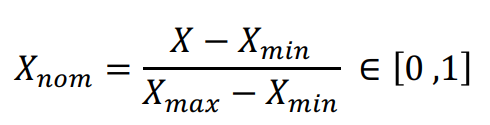
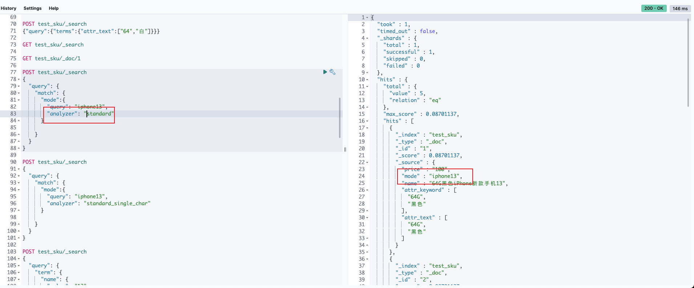
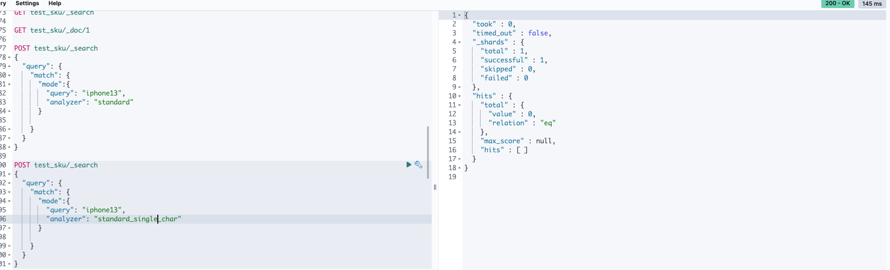

# painless es脚本语言

es的脚本语言 painless  支持使用java 的steam流 和JS内置函数，painless脚本默认不能对text类型使用

```
POST test_sku/_search
{
  "query": {
    "function_score": {
      "query": {
        "bool": {
          "should": [
            {
              "match": {
                "attr_text": "128"
              }
            },
            {
              "match": {
                "attr_text": "白"
              }
            },
            {
              "match": {
                "attr_text": "不存在的颜色"
              }
            }
          ]
        }
      },
      "script_score": {
        "script": {
          "source": "doc['price'].stream().filter(p -> p > 150).count()"
        }
      },
      "max_boost": 15000,
      "boost_mode": "replace"
    }
  }
}
```


# es 归一化

https://blog.csdn.net/laoyang360/article/details/131255445



```
GET /your_index/_search
{
  "query": { "match_all": {} },
  "size": 1,
  "sort": [ { "_score": "desc" } ]
}
```

```
{
  "query": {
    "function_score": {
      "query": { "match_all": {} },
      "script_score": {
        "script": {
          "source": "(_score - params.min) / (params.max - params.min)",
          "params": {
            "max": max_score,
            "min": min_score
          }
        }
      }
    }
  }
}
```


```
POST test_sku/_search
{
  "query": {
    "bool": {
      "should": [
        {
          "terms_set": {
            "attr_text": {
              "terms": [
                "64G","黑色"
              ],
              # "minimum_should_match_field": "required_matches"  ## 以文档中required_matches字段值为准

              "minimum_should_match_script": {
                "source": "params.num_terms" # 入参的数量 也可以传入数字
              }
            }
          }
        }
      ]
    }
  }
}
```


# term和match

term查询的时候 不会进行分词，match查询的会进行分词；

keyword 存储的时候不进行分词，text存储的时候进行分词；

对于不分词的keyword类型字段，使用term和match都可以查询出结果，因为match 默认使用的是stand分词器，会把iphone13拆分成一个单独的单词，自定义standard_single_char分词器会把参数拆成单个字符。





但是对于分词的text类型字段，在es存储的时候已经按照分词器做了拆分存储，比如 ”64G黑色iPhone新款手机13“ 这个商品名称在 standard_single_char 的拆分成一个个单独的汉字来存储。

term查询时 入参哪怕是 完整的商品名称，也搜索不到。但是如果搜索商品名称中的任意一个字符，都能检索到这条记录。所以不建议使用term去查text类型的字段。

match的话会进行分词查询匹配。

# 自定义分词器

```
PUT test_sku
{
  "mappings": {
    "properties": {
      "price": {
        "type": "integer"
      },
      "mode": {
        "type": "keyword"
      },
      "name": {
        "type": "text",
        "analyzer": "standard_single_char"
      },
      "attr_keyword": {
        "type": "keyword"
      },
      "attr_text": {
        "type": "text",
        "analyzer": "standard_single_char"
      }
    }
  },
  "settings": {
    "analysis": {
      "analyzer": {
        "standard_single_char": {
          "type": "standard",
          "max_token_length": "1"
        }
      }
    }
  }
}
```


# 分词器验证

```

POST _analyze
{"tokenizer":"ik_smart","text":"this is es"}

POST _analyze
{"tokenizer":"ik_smart","text":"64G黑色iPhone新款手机13"}

GET test_sku/_analyze
{"analyzer":"standard_single_char","text":"this is es"}
```


# 定义Script fields

https://blog.csdn.net/UbuntuTouch/article/details/115692778

```
  "script_fields": {
    "isAttr": {
      "script": {
        "source": "doc['attr_text'].values.contains(params.query)",
        "lang": "painless",
        "params": {
          "query": "粉色"
        }
      },
      "ignore_failure": true
    }
  }
}
```

- 针对原有值的修改（比如，价钱的转换，不同的排序方法等）
- 一个崭新的及算出来的属性（比如，总和，加权，指数运算，距离测量等）
- 合并多个字段的值（比如，firstname + lastname）


