# Tablestore 与 Elasticsearch 在数据库查询加速场景使用对比

2021-10-28 1003举报

**简介：** 过去三十年，我们从企业应用开始，经历了 PC 互联网、移动互联网的爆发式发展，到如今的产业互联网。在这些不同时代，一直变化的是应用形态，不变的是核心数据的价值。对于核心数据的存储，首选的方案是使用数据库存储，从互联网初期开始，开源关系型数据库 MySQL 成长成为了数据库存储的第一选择，关系型数据库解决了数据的快速建模，高可靠存储和快速查询，但是关系数据库中的高效查询主要依赖二级索引，如果出现索引

过去三十年，我们从企业应用开始，经历了 PC 互联网、移动互联网的爆发式发展，到如今的产业互联网。在这些不同时代，一直变化的是应用形态，不变的是核心数据的价值。


对于核心数据的存储，首选的方案是使用数据库存储，从互联网初期开始，开源关系型数据库 MySQL 成长成为了数据库存储的第一选择，关系型数据库解决了数据的快速建模，高可靠存储和快速查询，但是关系数据库中的高效查询主要依赖二级索引，如果出现索引无法命中的情况就会出现慢查询，降低客户体验。


由于本身二级索引的实现，这种慢查询在数据库自身中无法彻底解决，只能去优化自身索引结构或者依赖其他系统来实现查询加速，以便减少慢查询对产品能力和可用性的影响。


下面我们以一个社交网络的场景案例来看看如何实现数据库查询加速。

## 场景

比如在一个社交类型的应用中，需要存储每个用户的状态信息，比如ID、昵称、当前位置、是否在线、手机号码、好友数、签名、隐私特征、标签等等。这类数据具有下列特征：

- 数据规模较大：千万到数十亿之间。
- 数据高可靠：需要保证数据不丢失。

- 高效更新：每个用户的状态值都是需要持续更新，需要高吞吐和高时效性的更新能力。
- 低延迟的灵活查询：需要支持多种字段的随意组合查询，任意列的排序等。

- 高吞吐圈选：当运营的时候需要找出符合某类特征的客户，这时候就需要高吞吐的用户圈选能力。


针对上述的这些要求，只使用单一的数据库系统是很难满足需求的，比如灵活查询和高吞吐圈选等，所以一般的解决方案都是引入搜索系统，比如 Solr、ES 或者自研的搜索系统来实现查询加速：

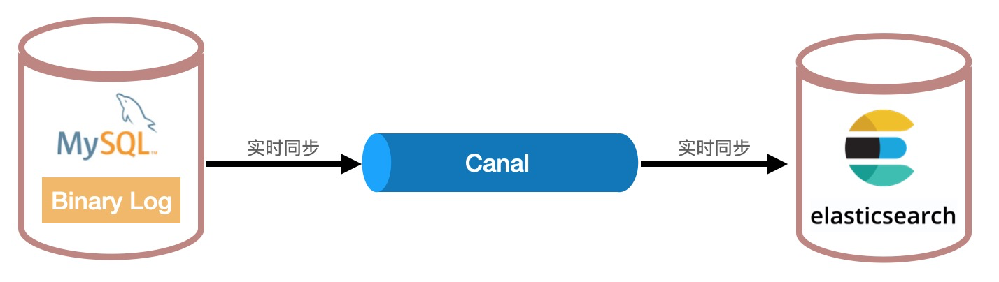


这种架构使用 MySQL 存储数据，然后使用 Canal 实时同步 MySQL的数据到下游的 ES 中，Canal 作为通道，ES 作为数据查询加速系统。另外，LogStash 也能同步数据，但是是批量方式，做不到实时同步。


这种可以基本满足上述的需求，但是存在两个问题，一是：

- 系统选型匹配度低：Solr、Elasticsearch 是搜索系统，而非数据库系统。数据库系统需要侧重于数据可靠性（不丢不错）和准确性，而搜索系统侧重于相关性和近似结果，这个会导致系统最本质能力和最核心保障点上的差异。


二是在 Elasticsearch 侧会存在一些痛点：

- **异构接口**：MySQL 的接口是 SQL，ES 的接口是 Json API ，不同的访问接口给开发带来复杂度和研发周期变长的副作用。
- **能力不对等**：对于数据更新操作，ES 存在部分 Update 场景下性能衰减的情况，这个时候 ES 的写入性能会低于 MySQL，这个能力不对等会导致数据堆积在 MySQL，无法被 ES 消费，导致数据无法被用户可见，影响业务。

- **ES运维难度大**：ES属于搜索系统，能用起来并不代表可以运维好，如果要运维好需要非常强的专业能力，否则很难解决性能突然衰减、各种 Full GC、负载飙高、压力不均、雪崩、慢查询、打爆系统等等各种问题。
- **慢查询的困扰**：使用 ES 的过程中，总会遇到慢查询等性能问题，导致慢查询的原因很多，比如：

- 没使用或者无法使用 Routing 功能导致读放大严重，影响查询性能。
- Schema 设计不合理，比如数字用字符串做范围查询，或者对数字类型进行匹配查询等。

- 分词文本太长导致写入太耗时或者突发写入占满资源影响查询。
- 临时的分析类请求或者统计聚合消耗过多内存或者CPU影响其他查询。

- 后台任务消耗的资源过多影响查询请求。
- 不合理的配置或者数据规模触发的Full GC引起慢查询。

- 分区过多导致查询风暴瞬间消耗完所有线程，比如 Scroll 中多并发导出数据的时候会产生查询风暴，最后落到DataNode的查询QPS 是并发数 * 分区数，如果是500个分区和500个并发，那么总共的QPS会高达 25万。
- 多 Elasticsearch 进程间的PageCache等操作系统资源争抢等。

- 。。。。。。
- 导致慢查询的原因可能会有几十钟，如果遇到此类问题，一般都是网上去搜解决办法，最后也不一定能解决，导致产品迭代受限或者用户体验变差。

## 云上选择

传统架构中都会使用 Elasticsearch 做数据查询加速，如果是阿里云的客户，那么这个时候就会多一种选择，使用具有类似功能的数据库替换 ES，比如 Tablestore。Tablestore 是阿里云自研的一款 Serverless 云原生分布式数据库。使用 Tablestore 后，则架构如下：

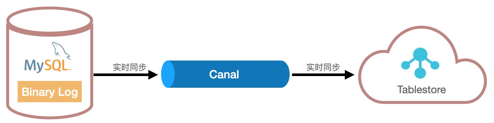


使用 Tablestore 作为查询加速系统后，则 MySQL 数据可以通过 Canal 实时同步到 Tablestore。之前的一些问题就会迎刃而解：

- **系统选型准确**：Tablestore 是一款 数据库产品，优先保障数据可靠性，保证不丢不错。

- **同构 SQL 接口**：Tablestore 提供兼容 MySQL 的 SQL 能力，可以减少客户学习成本和缩短研发周期。
- **零运维**：Tablestore 是一款 Serverless 产品，客户无需运维，整个系统的运维由表格存储的专家们负责运维和稳定性保障，当出现稳定性问题或者风险，比如性能突然衰减、Full GC、负载飙高、高IO、慢查询等各种问题时，表格存储的研发专家们会第一时间解决。同时，也投入了大量人力在研发上，通过技术能力提前化解或者规避风险，这样可以大幅提升产品的可用性和稳定性。 

- **能力对等**：Tablestore 所有写操作的性能一致，不存在随数据规模衰减的情况，整体性能要优于 MySQL 和 Elasticsearch，不会出现数据堆积在同步链路的情况。
- **慢查询优化**：Tablestore 部分场景下相对于 Elasticsearch 会有 10 倍以上的提升，尤其是一些 慢查询请求，在 Tablestore 上会有很好的表现。如果还有慢查询，则我们会提供一对一的专家服务，一起优化性能。如果当前优化不了，作为自研产品，也可以通过引擎本身能力的优化来实现。


上述架构主要演示了 Tablestore 作为数据库查询加速系统的方案，如果客户的某些场景不需要事务等关系型数据库的功能，则可以直接使用 Tablestore 作为存储和查询系统。


介绍完使用新系统的架构后，接下来，我们详细对比下 Tablestore 和 ES 在各方面的能力。

## 优劣对比

在这一节，我们将 Tablestore 和 Elasticsearch 放在一起从多个方面做个对比：

| 类别   | Elasticsearch                                                | Tablestore                                                   | 备注                                                         |
| ------ | ------------------------------------------------------------ | ------------------------------------------------------------ | ------------------------------------------------------------ |
| 功能   | 任意列自由组合查询任意列排序全文检索地理位置查询模糊查询统计聚合：Aggregationsscroll | 任意列自由组合查询任意列排序全文检索地理位置查询模糊查询统计聚合：Min、Max、Sum和GroupBy等ParallelScan 高并发圈选 | 在数据库查询加速场景中，两者的功能满足度基本接近，都可以满足这一场景需求。 |
| 易用性 | API：Java、Go 等多种 SDK。SQL：开源版不支持（商业版提供简单 SQL 翻译） | API：Java、Go 等多种 SDKSQL：兼容 MySQL 的 SQL 引擎          |                                                              |
| 成本   | 10 亿订单场景的配置：3台8核16GB的数据节点。3台1核2GB的管控节点。550GB的存储空间（考虑到后台任务和Log等消耗）。总费用是：5715.12 元/月 | 10 亿订单场景的配置：380GB存储空间3 VCU总费用是：3700 元/月。比 Elasticsearch 便宜 35% | 10 亿订单场景：存储：380GB写入：2000 行/s 查询：200 QPS统计聚合：20 QPS |
| 运维性 | 需要客户自己负责集群的运维工作：常规线上运维操作：容量规划和水位管理索引和集群扩容版本升级线上报警或故障处理：集群OOM或雪崩读写性能抖动或持续下降数据或流量负载不均索引请求间相互影响，比如离线业务影响在线业务等磁盘IO、CPU、Net、Full GC 等疑难杂症进程 Crash 和集群重启ES 或 JVM bug 导致的数据丢失、数据损坏等其他：版本 bug 只能期待新版本能修复新版本性能下降只能回滚或扩容更多机器 | 零运维                                                       | Tablestore 通过以下措施来保证系统的高可用性：几百项的细粒度 Metric 指标协助性能瓶颈和资源异常等可以快速定位和解决。水位系统、软硬件管理平台等系统保证版本平滑升级和容量规划。负载均衡系统、自动化运维系统保证常见稳定性问题可以分钟级别自动处理。索引画像、标签和分池隔离能力保证不同类型请求之间互相不影响。资深云计算、分布式引擎专家 7*24 小时稳定性护航。高效的版本迭代速度可以快速修复线上bug、加速功能演进和性能优化生效。 |

零运维的好处是研发可以将全部精力投入在研发上。


## 操作实践

上面解释了使用 Tablestore 代替 ES 作为数据库查询加速的优化方案，接下来我们通过一篇实践文章手把手带领大家去感受下如何使用 Tablestore 加速 MySQL的查询，详见文章《[车联网场景数据查询加速实践](https://developer.aliyun.com/article/796447?spm=a2c6h.12873639.article-detail.4.25a25ae72euWgr)》


## 成熟案例

上面从架构和实践两个方面介绍了如何使用 Tablestore 来实现查询加速的能力。使用 Tablestore 作为数据查询加速系统并不是最新推出的功能而是已经在业界使用非常频繁和成熟的方案了，接下来会介绍一些典型案例。


#### App 设备状态

某大型互联网公司旗下拥有十几款 App，这些App 都需要维护一个设备表，设备表里面保存了每个设备上安装的App的版本、上次登录时间、用户ID、登录时长等信息，这些信息在用户每次登录时和使用过程中需要不停更新状态。总共的规模有几百亿。查询的时候需要根据运营的特定条件圈选用户，最多可能需要从 10 亿用户中选择出 1 亿用户，这个圈选过程需要越快越好。这种设备圈选系统底层使用了 Tablestore 存储，可以支持每秒 50 万行的 Update 操作，圈选的时候可以支持每秒 1000万行的吞吐能力，完全可以满足业务方的需求。


#### 直播状态

某短视频类企业拥有一款直播功能，直播的时候需要时刻监测客户端的直播状态，比如是否有卡顿，声音大小、延迟等等，这些直播状态需要每秒更新，而且规模和终端数成正比，最高有上千万，同时，需要时刻统计各种异常终端的数量和地理位置，当发生大面积故障的时候可以第一时间发现和定位问题。这种直播状态的存储和查询就是基于 Tablestore 实现，支持高吞吐更新，上千万规模，毫秒级统计聚合查询能力。


#### 域名状态

某著名公司存储了全网的各种域名和 IP 的状态信息，这些信息当发生变化的时候就需要更新，规模在百亿以上，查询的时候需要根据特定属性去查询，同时也存在圈选具备某一列特征的域名或ip的功能需求。客户经过多轮选型后，最终选择使用 Tablestore 存储和查询，上线后的体验远超预期。


#### 物联网设备

某 IOT 公司旗下各类产品覆盖了几百亿的设备，这些设备的状态都存储在设备状态表中，这张设备状态表需要频繁高效的更新，同时规模在百亿以上，查询的时候每个设备可能需要直方图统计，百分位、最大值、最小值、平均值等统计聚合能力，有时候也需要按照某个特征找出相关的所有设备的能力。最终客户经过多轮测试和验证，最终选择了 Tablestore 作为数据查询加速系统，从最早的 ES 迁移到了 Tablestore，使用过程总可用性和易用性等都比之前得到了大幅提升。


## 最后总结

上面介绍了 Tablestore 作为数据查询加速系统相对于 ES 系统的优势，以及一些成熟案例。ES 是一款非常优秀的开源搜索系统，短短几年时间内就把老一代开源搜索系统 Solr 远远甩在了后面，现在选型搜索系统基本就不用考虑 Solr 了，Solr已趋近淘汰边缘。当前 ES 发展重心在日志、监控、安全、企业搜索等场景方面，在数据库查询加速上的进展相对较慢，如果是数据库查询加速场景，使用 Tablestore 会相对更有优势。


如果看完这篇文章，读者的应用系统中也存在一些数据库查询加速的场景，但是目前使用 ES 存在各种问题，而且很难解决，影响线上业务，则可以选择尝试下 Tablestore，相信肯定会带来不一样的感受。


# 车联网场景下海量车辆状态数据存储实践

2021-10-27 676举报

**简介：** 随着通信技术、计算机技术的不断发展，移动通信正在从人与人（H2H）向人与物（H2M）以及物与物（M2M）的方向发展，“万物互联”的概念正在逐步覆盖到各行各业中，例如智能家居、智能农业、智能交通、智能物流等领域。目前，车联网技术已经先行一步，在行车安全、交通管理、生活服务等方面得到充分应用。 车联网技术包括了车辆终端、云端、无线通信等方面。车辆终端实时产生大量车辆状态数

> 作者：李欣

## 背景

随着通信技术、计算机技术的不断发展，移动通信正在从人与人（H2H）向人与物（H2M）以及物与物（M2M）的方向发展，“万物互联”的概念正在逐步覆盖到各行各业中，例如智能家居、智能农业、智能交通、智能物流等领域。目前，车联网技术已经先行一步，在行车安全、交通管理、生活服务等方面得到充分应用。

车联网技术包括了车辆终端、云端、无线通信等方面。车辆终端实时产生大量车辆状态数据，例如里程、油量、胎压、坐标、温度、速度和操作等等。通过对这些数据的检索、分析，可以在环境感知、驾驶决策、行驶安全、出行规划等各个方面发挥作用。但是在车联网场景下，技术实现上也会面临几个难题：
● 数据写入并发度高：数据写入并发数取决于行驶中的车辆数。
● 数据检索延迟敏感：若数据检索出现延迟，则无法感知到最新的车辆状态信息，可能出现无法预料的后果。
● 数据规模庞大：每个车辆终端会记录几十个甚至更多维度的状态数据，周期性保存车辆的状态信息获取车辆状态时序数据。数据规模轻松达到亿行，甚至百亿行以上。

## 方案

### MySQL + LogStash + Elasticsearch 方案

MySQL 自身具备强事务，可作为车辆状态数据存储库。数据量在一定级别内时，可满足业务的写需求。然而 MySQL 中的多列索引需要满足前缀匹配才能发挥效果，当查询条件不符合多列索引匹配规则时，可能会退化成全表扫描。这样一个慢 SQL 会增加服务端负载，使得 MySQL 服务性能降低。因此很容易想到需要一个新的索引引擎来做检索类查询的分流，将一些复杂的查询、分析类需求放到索引引擎中来完成。

Elasticsearch 是一款强大开源搜索和分析引擎，支持丰富的索引类型，通过引入 Elasticsearch 来提供检索、分析的能力，可以有效降低 MySQL 服务端负载。MySQL 数据通过 LogStash 或 Canal 工具同步到 Elasticsearch中。

方案的整体架构如下图:
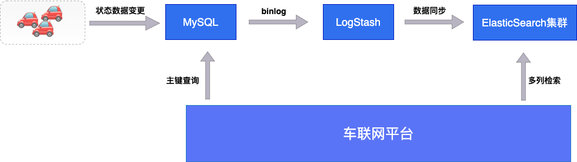

1. MySQL：作为数据存储主库，需能够支持高并发的状态数据变更写入，支持平台侧基于主键查询的能力。
2. LogStash：作为 MySQL 与 Elasticsearch 之间的桥梁，负责将 mysql binlog 转换成 Elasticsearch 的数据结构并写入Elasticsearch。
3. Elasticsearch：作为存储系统索引引擎，负责承载检索、分析聚合类的请求流量。

MySQL + Elasticsearch的方案很好地解决了检索、分析类的业务需求。不过整个存储系统仍然存在一些问题：

1. Elasticsearch 集群搭建与运维复杂度高，一旦出现问题非常难排查。
2. Elasticsearch 成本较高。需要根据业务规模预测机器数，无法做到弹性扩容。

### MySQL + Canal + Tablestore 方案

Tablestore 是阿里云自研的一款多模型结构化数据存储，能够支持 PB 级存储、千万 TPS 写入以及强大的数据检索、分析能力。Tablestore 具备两种存储引擎，数据表基于 LSM-tree 架构能支持高并发低延迟的读写能力，多元索引基于倒排索引、空间索引能支持丰富的数据检索方式，例如多列组合查询、模糊查询、匹配查询、范围查询等等。

在车辆网场景中，Tablestore 的数据表可支持千万级的并发读写，可实现车辆状态实时更新。多元索引引擎提供了百亿行数据毫秒级的检索的能力，可实现根据车辆多种状态查询。Tablestore 服务端实现了数据表与多元索引之间自动数据同步，保证了两者的最终一致性。Tablestore 方案实现车联网存储系统的架构图如下：

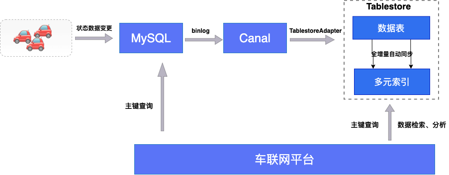

下面会重点给大家介绍下如何实现：MySQL + Canal + Tablestore 的方案。

## 实现

### 开通 Tablestore 服务和创建表

1. 创建按量模式实例，填写实例名。详情请参考 [如何开通表格存储服务、如何创建 Tablestore 实例](https://help.aliyun.com/document_detail/55211.html)。

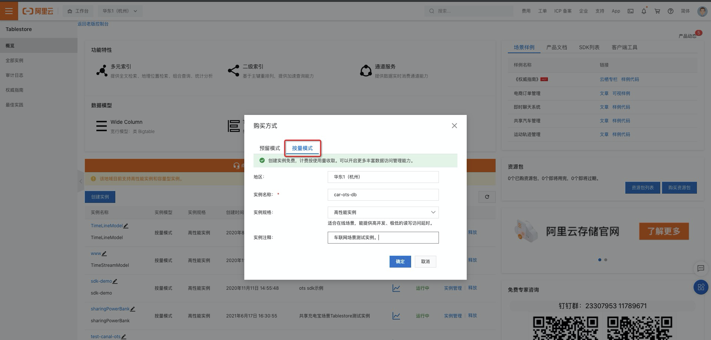

1. 创建 auto_mobile 表。保存车辆状态数据信息。详情请参考 [如何创建 Tablestore 数据表](https://help.aliyun.com/document_detail/55212.html)。

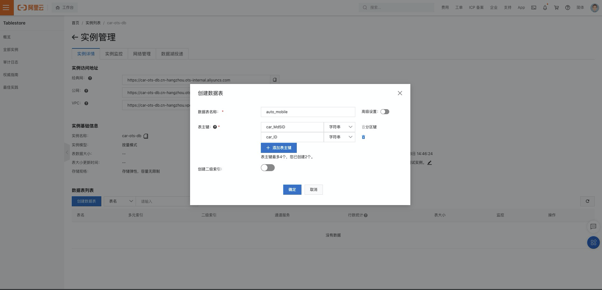

1. 创建 his_auto_moile 表。保存车辆状态数据时序信息。

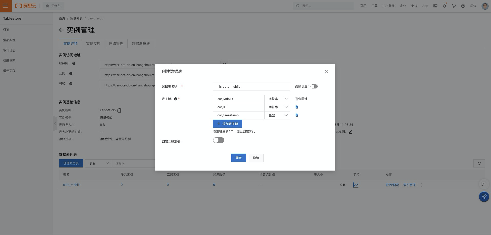

### 准备数据：car-ots-demo（可选步骤）

> Demo 数据：[下载地址](https://car-ots-demo1.oss-cn-hangzhou.aliyuncs.com/test-1.0-SNAPSHOT.jar)。

本文中测试场景中模拟创建了 auto_mobile、his_auto_mobile 两张表，若需要同步其他业务表，请忽略此步骤。

1. 以linux为例，运行命令 `shell tar -zxvf car-ots-demo.tar.gz `解压，解压后目录中包含 application.yml 和 test-1.0-SNAPSHOT.jar。
2. 配置 application.yml 文件。
   1. server.port：压测项目运行端口号。如：8082
   2. spring.datasource.jdbc：MySQL数据源地址，如：rm-bp13dz7yedd2d9zyr.mysql.rds.aliyuncs.com。
   3. spring.datasource.user: MySQL 数据源账号。
   4. spring.datasource.password: MySQL 数据源密码。
3. 运行命令 `shell nohup java -jar -Dspring.config.location=application.yml test-1.0-SNAPSHOT.jar& `启动压测程序。
4. 运行命令 `shell curl "localhost:8082/car/prepareTable" -X POST `创建MySQL表。

### MySQL 实时同步 Tablestore

可以通过两种方案来将 MySQL 数据实时同步到 Tablestore 中。

1. 数据传输服务 DTS 同步

关于 DTS 迁移方案可参考文档 MySQL 同步至 Tablestore。

1. Canal 工具同步。Canal 是阿里巴巴开源 CDC 工具，可基于解析 MySQL Binlog 将增量数据传输到下游，表格存储团队实现了 TablestoreAdapter 用于写入数据到 Tablestore。
   a. 下载同步工具 Canal。运行命令 `shell unzip canal.zip `解压压缩包。
   b. 配置 deployer 和 canal-adapter。
   c. 启动 deployer 和 canal-adapter。

说明：Canal 同步任务配置参数不在本文章中介绍，关于同步任务的配置项、启动步骤说明。请参考 CarmobileExample中的 READ.ME。

### MySQL 测试数据写入

数据压入 jar 包 car-ots-demo 中已提供了测试数据写入接口，运行命令 `shell curl "localhost:8082/car/press?carNum=10&point=10" -X POST `即可。其中 carNum 表示车辆数，point 表示车辆状态记录次数。本文测试场景carNum=1000000, point=10。

1. 运行写入命令：


1. 写入MySQL日志（car-ots-demo/logs/example.log）：

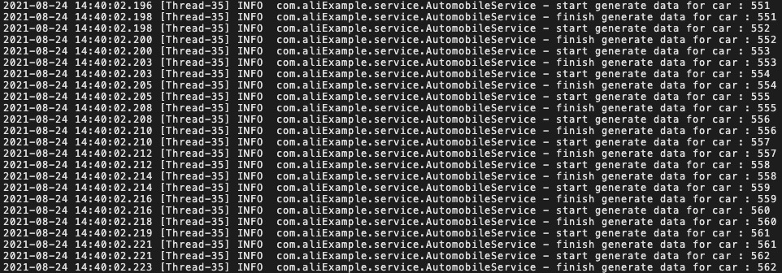

1. Canel数据同步日志（canal-adapter/logs/adapter/adapter.log）：

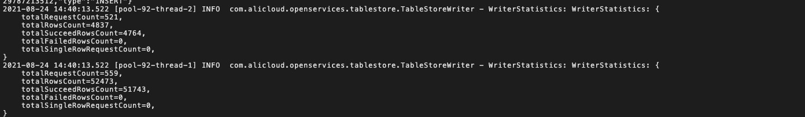

1. 之前已经建立了同步链路，这个时候增量数据会自动同步到 Tablestore：

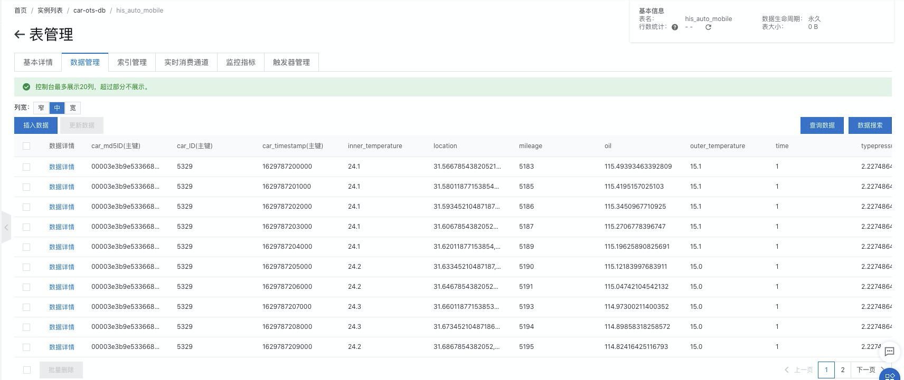

### Tablestore 创建多元索引

登录表格存储控制台，进入索引管理页面，点击创建多元索引。多元索引创建后，数据表中的存量和增量数据将自动同步到索引中。更多关于创建多元索引的介绍请参考 [创建和使用多元索引](https://help.aliyun.com/document_detail/123967.html)。
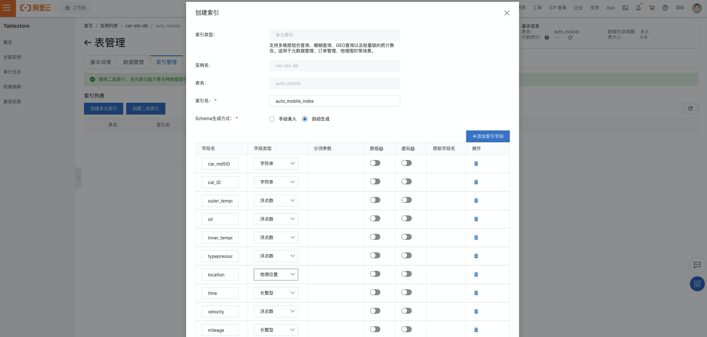

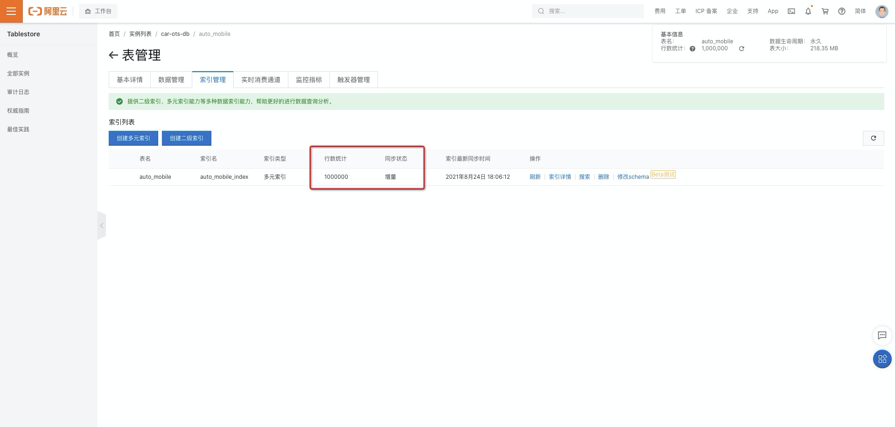

### Tablestore 查询功能展示

- 案例一。查询油量小于 120.0 并且胎压小于 2.3 的车辆 ID，取 3 条记录。

查询代码：

```
//查询油量小于 120.0 并且胎压小于 2.3 的车辆ID，取 3 条记录
public static void searchDemo01(SyncClient client){
        SearchRequest searchRequest = SearchRequest.newBuilder()
                .tableName("auto_mobile")
                .indexName("auto_mobile_index")
                .searchQuery(SearchQuery.newBuilder()
                        .query(QueryBuilders.bool()
                                .must(QueryBuilders.range("oil").lessThan(120.0))
                                .must(QueryBuilders.range("typepressure").lessThan(2.3))
                        )
                        .limit(3)
                        .build())
                .addColumnsToGet(Arrays.asList("car_ID"))
                .build();
        long sys1 = System.currentTimeMillis();
        SearchResponse searchResponse = client.search(searchRequest);
        long sys2 = System.currentTimeMillis();
        System.out.println("cost time: " + (sys2-sys1) + "ms");
        for(Row row : searchResponse.getRows()){
            System.out.println(row);
        }
        client.shutdown();
    }
```

结果展示：

```
cost time: 12ms
[PrimaryKey:]car_md5ID:0000104cd168386a335ba6bf6e32219d, car_ID:848775
[Columns:]
[PrimaryKey:]car_md5ID:000093856b4e947511870f3e10464129, car_ID:646434
[Columns:]
[PrimaryKey:]car_md5ID:0001181bf1ad8f82dcf59c7c18343bd5, car_ID:752608
[Columns:]
```

SQL查询：

```
select * from auto_mobile where oil < 120.0 and typepressure < 2.3 limit 3;
```

SQL查询结果：
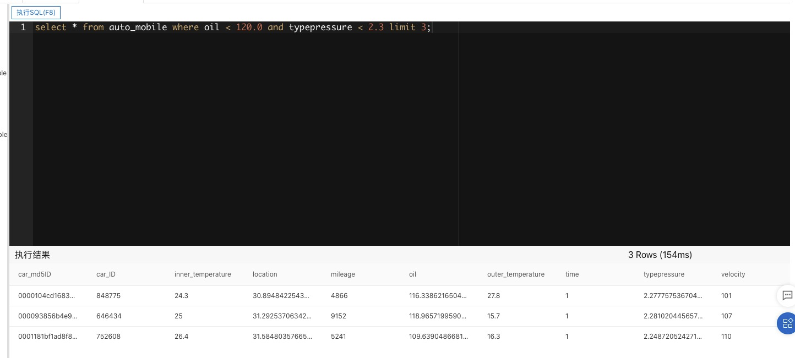

1. 案例二。统计距离 car_md5ID = '0000104cd168386a335ba6bf6e32219d' 五公里内的车辆数。

查询代码：

```
//统计距离car_md5ID='0000104cd168386a335ba6bf6e32219d'五公里内的车辆数。
public static void searchDemo02(SyncClient client){
        SearchRequest searchRequest = SearchRequest.newBuilder()
                .tableName("auto_mobile")
                .indexName("auto_mobile_index")
                .searchQuery(SearchQuery.newBuilder()
                        .query(QueryBuilders.geoDistance("location")
                                .centerPoint("30.968772887652293,120.94512114660778")
                                .distanceInMeter(5000)
                        )
                        .getTotalCount(true)
                        .build())
                .build();
        long sys1 = System.currentTimeMillis();
        SearchResponse searchResponse = client.search(searchRequest);
        long sys2 = System.currentTimeMillis();
        System.out.println("cost time: " + (sys2-sys1) + "ms");
        System.out.println("车辆数：" + searchResponse.getTotalCount());
        client.shutdown();
    }
```

结果：

```
cost time: 18ms
车辆数：6026
```

1. 案例三。查询所有车辆，统计车辆数。并按照里程段分组。

查询代码：

```
//查询所有车辆，统计车辆数。并按照里程段分组。
public static void searchDemo03(SyncClient client){
        SearchRequest searchRequest = SearchRequest.newBuilder()
                .tableName("auto_mobile")
                .indexName("auto_mobile_index")
                .searchQuery(SearchQuery.newBuilder()
                        .query(QueryBuilders.matchAll())
                        .addGroupBy(GroupByBuilders.groupByRange("groupByMileage","mileage")
                                .addRange(Double.MIN_VALUE,2000)
                                .addRange(2000,4000)
                                .addRange(6000,8000)
                                .addRange(8000,Double.MAX_VALUE)
                        )
                        .build())
                .build();
        long sys1 = System.currentTimeMillis();
        SearchResponse searchResponse = client.search(searchRequest);
        long sys2 = System.currentTimeMillis();
        System.out.println("cost time: " + (sys2-sys1) + "ms");
        GroupByRangeResult groupByRangeResult =  searchResponse.getGroupByResults().getAsGroupByRangeResult("groupByMileage");
        for(GroupByRangeResultItem groupByRangeResultItem : groupByRangeResult.getGroupByRangeResultItems()){
            System.out.println("["+groupByRangeResultItem.getFrom()+","+groupByRangeResultItem.getTo()+"] : "+groupByRangeResultItem.getRowCount());
        }
        client.shutdown();
    }
```

结果展示：

```
cost time: 98ms
[-Infinity,2000.0] : 199192
[2000.0,4000.0] : 200569
[4000.0,6000.0] : 199379
[6000.0,8000.0] : 200708
[8000.0,Infinity] : 200152
```

## 最后

表格存储 Tablestore 中多元索引功能可支持在大规模数据场景下实现毫秒级检索，以及轻量级分析的能力。通过表格存储控制台一键索引，自动完成全增量数据同步，省去了索引集群运维的烦恼。通过多元索引的范围查询、多条件组合查询、分组聚合等能力，实现了根据车辆多种状态检索聚合的功能。