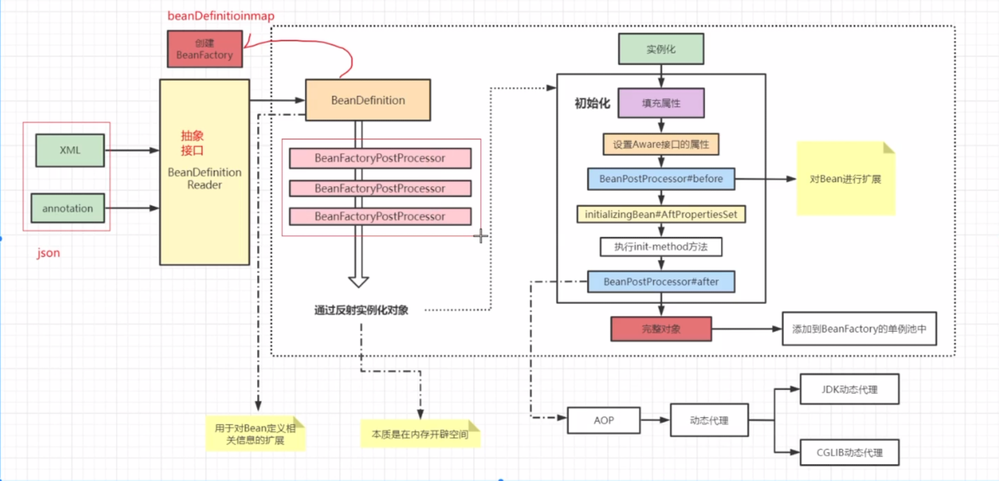
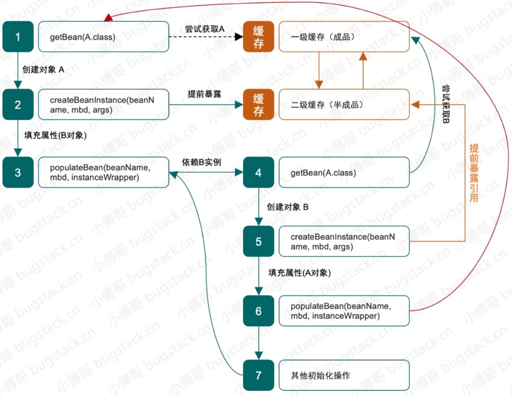
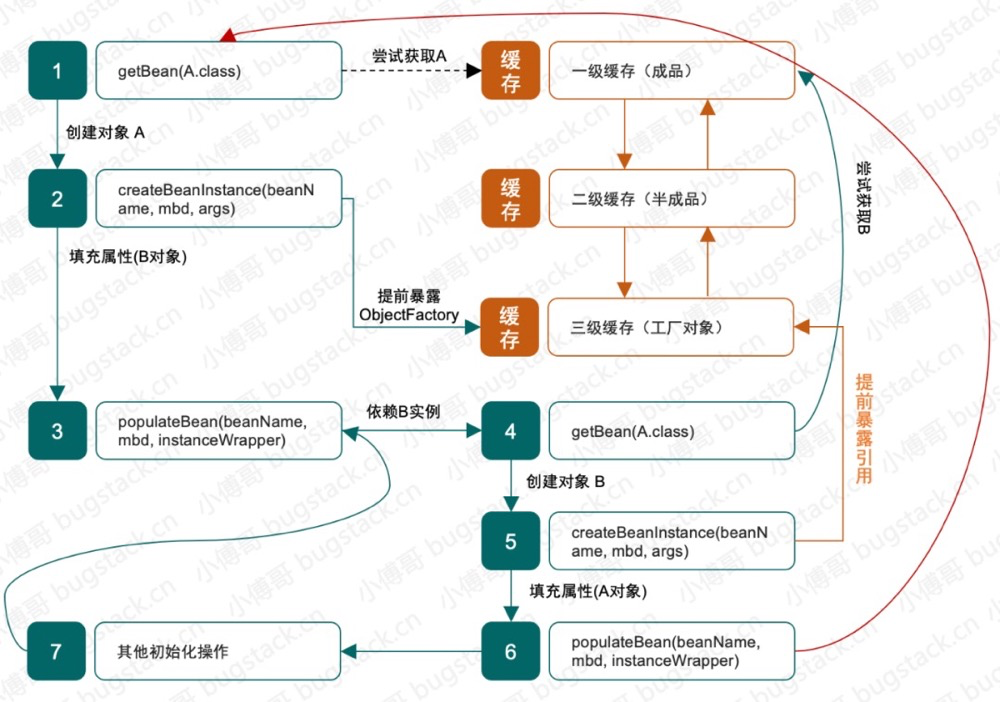
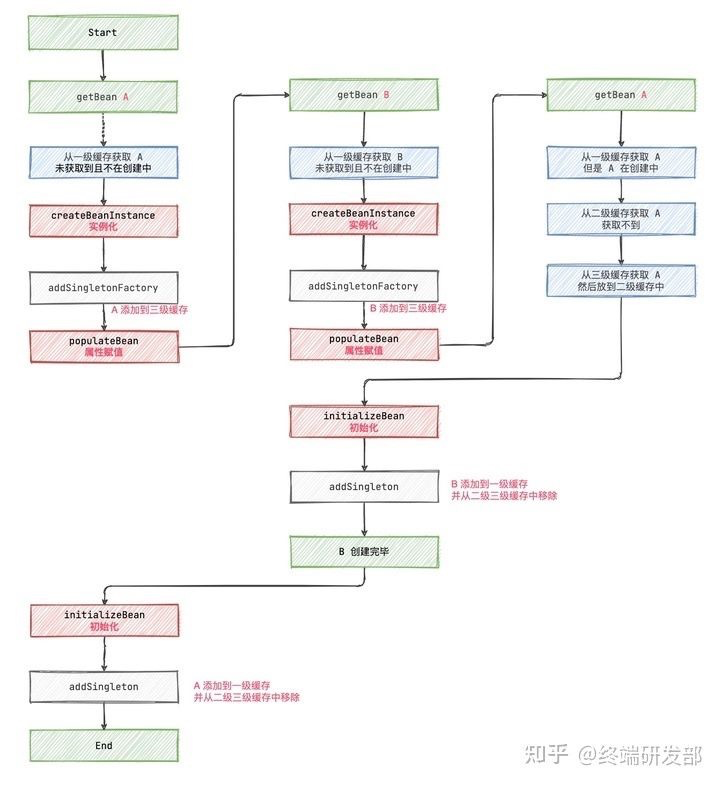
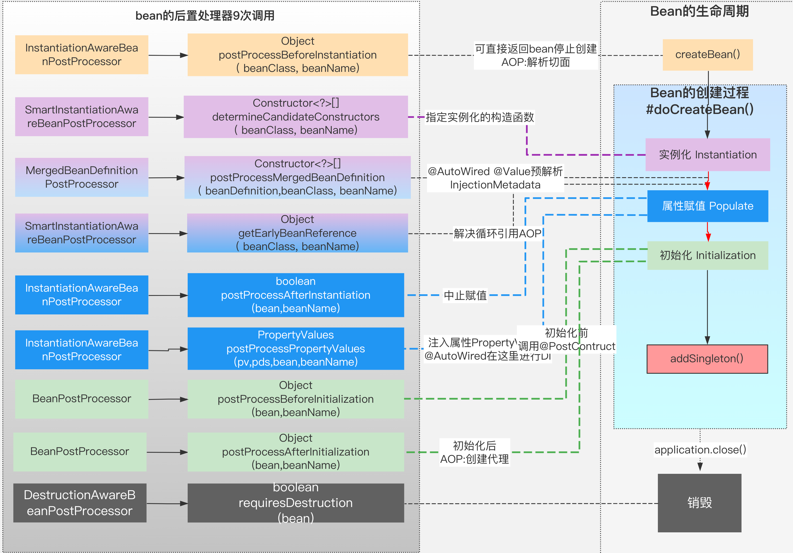
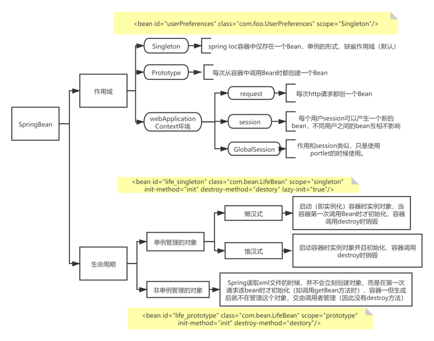
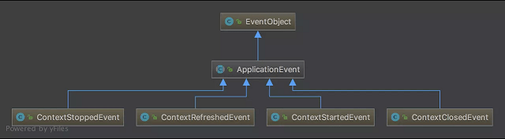
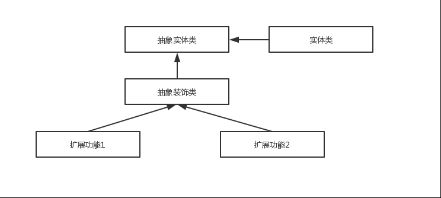
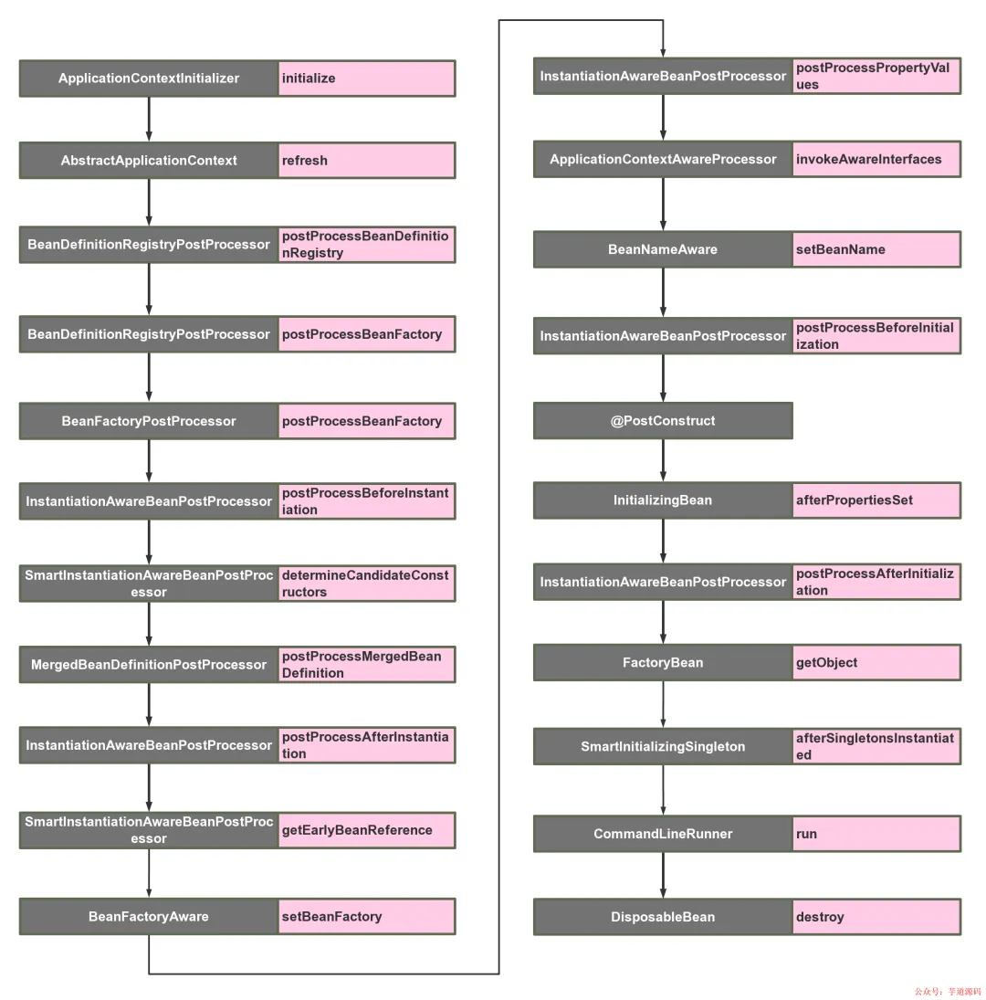

# [Spring文档点这里](https://docs.spring.io/spring-framework/docs/current/reference/html/core.html#spring-core)

# [Spring源码思维导图](https://www.processon.com/view/link/5f5075c763768959e2d109df#outline)

# [spring脑图](./img/spring脑图.jpg)

# 一、Spring IOC

## 对Spring IOC和DI的理解

[IOC实现方式详解](https://www.1024sou.com/article/294756.html)

[Spring IoC有什么好处呢](https://www.zhihu.com/question/23277575/answer/169698662)  

**控制反转 IOC**

（ Inversion of Control），它是一种技术思想，描述的是对象创建和管理如何解耦。

**为什么叫做控制反转？**

控制：指的是对象创建（实例化、管理）的权利 

反转：控制权交给外部环境了（spring框架、IoC容器）

**IoC下开发⽅式**

我们不⽤⾃⼰去new对象了，⽽是由IoC容器去帮助我们实例化对象并且管理它，我们需要使⽤哪个对象，去问IoC容器要即可。

IoC容器不仅仅负责创建对象实例，而是接管了对象对完整生命周期，包括构造这些对象时需要注入哪些其他对象，也包括该对象会被注入到其他对象中，这些对象的销毁也是由 Spring 来管理的。

**依赖注入 DI**

DI：Dependancy Injection（依赖注⼊），DI是IoC的一种实现方式，依赖查找DL（Dependancy Lockup）也可以实现IOC。

```java
public class Human {
    ...
    Father father;
    ...
    public Human() {
        father = new Father();
    }
}
```

Human 类中用到了 Father 类的对象，我们就可以说 Human 类依赖 Father 类。

仔细看这段代码我们会发现存在一些问题：

1. 如果现在要改变 father 生成方式，如需要用new Father(String name)初始化 father，需要修改 Human 代码；
2. 如果想测试不同 Father 对象对 Human 的影响很困难，因为 father 的初始化被写死在了 Human 的构造函数中；
3. 如果new Father()过程非常缓慢，单测时我们希望用已经初始化好的 father 对象 Mock 掉这个过程也很困难。

```java
public class Human {
    ...
    Father father;
    ...
    public Human(Father father) {
        this.father = father;
    }
}
```

上面代码中，我们将 father 对象作为构造函数的一个参数传入。在调用 Human 的构造方法之前外部就已经初始化好了 Father 对象。像这种非自己主动初始化依赖，而通过外部来传入依赖的方式，我们就称为依赖注入。

## ！spring中Bean的生命周期



Bean 容器找到配置文件中 Spring Bean 的定义。

Bean 容器利用 Java Reflection API 创建一个 Bean 的实例。

如果涉及到一些属性值 利用 `set()`方法设置一些属性值。

如果 Bean 实现了 `BeanNameAware` 接口，调用 `setBeanName()`方法，传入 Bean 的名字。

如果 Bean 实现了 `BeanClassLoaderAware` 接口，调用 `setBeanClassLoader()`方法，传入 `ClassLoader`对象的实例。

如果 Bean 实现了 `BeanFactoryAware` 接口，调用 `setBeanFactory()`方法，传入 `BeanFactory`对象的实例。

与上面的类似，如果实现了其他 `*.Aware`接口，就调用相应的方法。

如果有和加载这个 Bean 的 Spring 容器相关的 `BeanPostProcessor` 对象，执行`postProcessBeforeInitialization()` 方法

如果 Bean 实现了`InitializingBean`接口，执行`afterPropertiesSet()`方法。

如果 Bean 在配置文件中的定义包含 init-method 属性，执行指定的方法。

如果有和加载这个 Bean 的 Spring 容器相关的 `BeanPostProcessor` 对象，执行`postProcessAfterInitialization()` 方法

当要销毁 Bean 的时候，如果 Bean 实现了 `DisposableBean` 接口，执行 `destroy()` 方法。

当要销毁 Bean 的时候，如果 Bean 在配置文件中的定义包含 destroy-method 属性，执行指定的方法。

## ！三级缓存解决循环依赖

[循环依赖](https://zhuanlan.zhihu.com/p/377878056)

**核心原理**

将未完成创建的对象引用提前暴露出来，来完成循环依赖中一方的对象创建，从而打破循环依赖。

背景：A依赖B ，B依赖A

名词：一级缓存（也就是对象池 singletonObjects） 二级缓存（earlySingletonObjects） 三级缓存（singletonFactories）

一级缓存存放完整的bean对象，二级缓存存放提前暴露的bean对象（有aop的话存放的是代理对象），三级缓存存放的是对应bean的工厂方法#getEarlyBeanReference，该方法在获取提前暴露时会触发生成代理对象。

**二级缓存能解决吗？**

- 二级缓存可以实现，一个缓存用于存放成品对象，另外一个缓存用于存放半成品对象。
- A 在创建半成品对象后存放到缓存中，接下来补充 A 对象中依赖 B 的属性。
- B 继续创建，创建的半成品同样放到缓存中，在补充对象的 A 属性时，可以从半成品缓存中获取，现在 B 就是一个完整对象了，而接下来像是递归操作一样 A 也是一个完整对象了。



**为什么是三级缓存？**



二级缓存能解决能循环依赖，但是会影响aop代理对象的创建。

Java 对象创建流程是 实例化，属性赋值，初始化，提前暴露对象引用的过程是发生在实例化和属性赋值之间的。
通过二级缓存，也可以实现AOP，原本spirng 生成代理对象是在初始化bean的beanPost后置处理阶段，将获取代理对象的时机提前至实例化后和暴露属性之前，这样引用这个对象的bean就能拿到该对象的代理引用了，但这样会违背spring设计aop的原则，将aop的实现和bean的生命周期耦合了。




## Spirng容器刷新方法源码解析

```java
// Prepare this context for refreshing.
//  进行容器刷新前的准备工作, 记录下容器的启动时间、标记“已启动”状态、处理配置文件中的占位符
prepareRefresh();

// Tell the subclass to refresh the internal bean factory.
//  获取BeanFactory，实例类型为DefaultListableBeanFactory
// 这步比较关键，这步完成后，配置文件就会解析成一个个 Bean 定义，注册到 BeanFactory 中，
// 当然，这里说的 Bean 还没有实例化，只是配置信息都提取出来了，
// 注册也只是将这些信息都保存到了注册中心(说到底核心是一个 beanName-> beanDefinition 的 map)
ConfigurableListableBeanFactory beanFactory = obtainFreshBeanFactory();

// Prepare the bean factory for use in this context.
//  对BeanFactory做一些准备工作，如准备类加载器和配置BeanFactory的容器回调
// 设置 BeanFactory 的类加载器，添加几个 BeanPostProcessor，手动注册几个特殊的 bean
prepareBeanFactory(beanFactory);

// Allows post-processing of the bean factory in context subclasses.
//  允许在上下文子类中对bean工厂进行后处理
// 【这里需要知道 BeanFactoryPostProcessor 这个知识点，Bean 如果实现了此接口，
// 那么在容器初始化以后，Spring 会负责调用里面的 postProcessBeanFactory 方法。】
// 这里是提供给子类的扩展点，到这里的时候，所有的 Bean 都加载、注册完成了，但是都还没有初始化
// 具体的子类可以在这步的时候添加一些特殊的 BeanFactoryPostProcessor 的实现类或做点什么事
postProcessBeanFactory(beanFactory);

// Invoke factory processors registered as beans in the context.
//在所有非懒加载的单例Bean实例化之前调用一次实现BeanFactoryPostProcessor接口的方法，对实现了PriorityOrdered、Order和没有实现Order接口的方法的优先级区分
invokeBeanFactoryPostProcessors(beanFactory);

// Register bean processors that intercept bean creation.
//  注册实现了BeanPostProcessor接口的方法，也进行了优先级的区分，实现控制调用顺序
registerBeanPostProcessors(beanFactory);

// Initialize message source for this context.
//  initMessageSource方法用于初始化MessageSource，MessageSource是Spring定义的用于实现访问国际化的接口
initMessageSource();

// Initialize event multicaster for this context.
//  initApplicationEventMulticaster方法是用于初始化上下文事件广播器的，观察者模式的经典示例
initApplicationEventMulticaster();

// Initialize other special beans in specific context subclasses.
 // 从方法名就可以知道，典型的模板方法(钩子方法)，
// 具体的子类可以在这里初始化一些特殊的 Bean（在初始化 singleton beans 之前）
onRefresh();

// Check for listener beans and register them.
//  用于注册监听器
registerListeners();

// Instantiate all remaining (non-lazy-init) singletons.
// *完成非懒加载单实例Bean的实例化和初始化
finishBeanFactoryInitialization(beanFactory);

// Last step: publish corresponding event.
//  结束Spring上下文刷新
finishRefresh();
```


## Spring属性注入几种方式

[Bean注入属性几种方式](https://www.cnblogs.com/tuyang1129/p/12873492.html)

- ### set方法注入

  ```xml
  <!-- 定义car这个bean，id为myCar -->
  <bean id="myCar" class="cn.tewuyiang.pojo.Car">
      <!-- 
          为car的属性注入值，因为speed和price都是基本数据类型，所以使用value为属性设置值；
          注意，这里的name为speed和price，不是因为属性名就是speed和price，
          而是set方法分别为setSpeed和setPrice，名称是通过将set删除，然后将第一个字母变小写得出；
      -->
      <property name="speed" value="100"/>
      <property name="price" value="99999.9"/>
  </bean>
  
  <!-- 定义user这个bean -->
  <bean id="user" class="cn.tewuyiang.pojo.User">
      <property name="name" value="aaa" />
      <property name="age" value="123" />
      <!-- car是引用类型，所以这里使用ref为其注入值，注入的就是上面定义的myCar 
           基本数据类型或Java包装类型使用value，
           而引用类型使用ref，引用另外一个bean的id 
      -->
      <property name="car" ref="myCar" />
  </bean>
  ```

- ### 构造器注入

  - **构造器参数名称注入**

    ```xml
    <bean id="myCar" class="cn.tewuyiang.pojo.Car">
        <!-- 通过constructor-arg的name属性，指定构造器参数的名称，为参数赋值 -->
        <constructor-arg name="speed" value="100" />
        <constructor-arg name="price" value="99999.9"/>
    </bean>
    
    <bean id="user" class="cn.tewuyiang.pojo.User">
        <constructor-arg name="name" value="aaa" />
        <constructor-arg name="age" value="123" />
        <!-- 
             和之前一样，基本数据类型或Java包装类型使用value，
             而引用类型使用ref，引用另外一个bean的id 
        -->
        <constructor-arg name="car" ref="myCar" />
    </bean>
    ```

  - **构造器参数索引下标注入**

    ```xml
    <bean id="car" class="cn.tewuyiang.pojo.Car">
        <!-- 下标编号从0开始，构造器的第一个参数是speed，为它赋值100 -->
        <constructor-arg index="0" value="100" />
        <!-- 构造器的第二个参数是price，为它赋值99999.9 -->
        <constructor-arg index="1" value="99999.9"/>
    </bean>
    
    <bean id="user" class="cn.tewuyiang.pojo.User">
        <!-- 与上面car的配置同理 -->
        <constructor-arg index="0" value="aaa" />
        <constructor-arg index="1" value="123" />
        <constructor-arg index="2" ref="car" />
    </bean>
    
    ```

  - **构造器参数类型注入**

    ```xml
    bean id="car" class="cn.tewuyiang.pojo.Car">
        <!-- 使用type属性匹配类型，car的构造器包含两个参数，一个是int类型，一个是double类型 -->
        <constructor-arg type="int" value="100" />
        <constructor-arg type="double" value="99999.9"/>
    </bean>
    
    <bean id="user" class="cn.tewuyiang.pojo.User">
        <!-- 对于引用类型，需要使用限定类名 -->
        <constructor-arg type="java.lang.String" value="aaa" />
        <constructor-arg type="int" value="123" />
        <constructor-arg type="cn.tewuyiang.pojo.Car" ref="car" />
    </bean>
    ```

- ### **静态工厂注入**

  ```xml
  <!-- 
  	注意，这里的配置并不是创建一个SimpleFactory对象，取名为myCar，
      这一句配置的意思是，调用SimpleFactory的静态方法getCar，创建一个car实例对象，
      将这个car对象取名为myCar。
  -->
  <bean id="car" class="cn.tewuyiang.factory.SimpleFactory" factory-method="getCar"/>
  
  <bean id="user" class="cn.tewuyiang.pojo.User">
      <!-- name和age使用set注入 -->
      <property name="name" value="aaa"/>
      <property name="age" value="123"/>
      <!-- 将上面配置的car，注入到user的car属性中 -->
      <property name="car" ref="car"/>
  </bean>
  ```

- ### **实例工厂注入**

  实例工厂与静态工厂类似，不同的是，静态工厂调用工厂方法不需要先创建工厂类的对象，因为静态方法可以直接通过类调用，所以在上面的配置文件中，并没有声明工厂类的bean。但是，实例工厂，需要有一个实例对象，才能调用它的工厂方法。我们先看看实例工厂的定义：

  ```java
  public class SimpleFactory {
  
      /**
       * 实例工厂方法，返回一个Car的实例对象
       */
      public Car getCar() {
          return new Car(12345, 5.4321);
      }
  
      /**
       * 实例工厂方法，返回一个String
       */
      public String getName() {
          return "tewuyiang";
      }
  
      /**
       * 实例工厂方法，返回一个int，在Spring容器中会被包装成Integer
       */
      public int getAge() {
          return 128;
      }
  }
  ```

  ```xml
  <!-- 声明实例工厂bean，Spring容器需要先创建一个SimpleFactory对象，才能调用工厂方法 -->
  <bean id="factory" class="cn.tewuyiang.factory.SimpleFactory" />
  
  <!-- 
      通过实例工厂的工厂方法，创建三个bean，通过factory-bean指定工厂对象，
      通过factory-method指定需要调用的工厂方法
  -->
  <bean id="name" factory-bean="factory" factory-method="getName" />
  <bean id="age" factory-bean="factory" factory-method="getAge" />
  <bean id="car" factory-bean="factory" factory-method="getCar" />
  
  <bean id="user" class="cn.tewuyiang.pojo.User">
      <!-- 将上面通过实例工厂方法创建的bean，注入到user中 -->
      <property name="name" ref="name"/>
      <property name="age" ref="age"/>
      <property name="car" ref="car"/>
  </bean>
  ```

- ### **注解注入**

如果依赖的是其他Bean 则可以通过 @Autowired和@Resource两个注解进行依赖注入。

基础类型的字段的话可以用@Value注解。

- ### 查询方法注入

这种注入方式比较少见，是通过bean标签的lookup-method属性或者@Lookup指定

和InitMethod一样，lookup-method也是Bean标签里的子元素，配置一个方法名。


## BeanFactory 接口和 ApplicationContext 接口的区别

先看一张类的继承图。

 

- ApplicationContext 继承了 ListableBeanFactory，这个 Listable 的意思就是，通过这个接口，我们可以获取多个 Bean，大家看源码会发现，最顶层 BeanFactory 接口的方法都是获取单个 Bean 的。
- ApplicationContext 继承了 HierarchicalBeanFactory，Hierarchical 单词本身已经能说明问题了，也就是说我们可以在应用中起多个 BeanFactory，然后可以将各个 BeanFactory 设置为父子关系。

ApplicationContext 继承自 BeanFactory，但是它不应该被理解为 BeanFactory 的实现类，而是说其内部持有一个实例化的 BeanFactory（DefaultListableBeanFactory），也就是说工厂其实是容器内部的一个组件，以后所有的 BeanFactory 相关的操作，容器都会委托给内部工厂来处理的。

## BeanFactory接口 和 FactoryBean接口的区别

- **BeanFactory**

BeanFactory是Spring容器中Bean工厂的顶级接口，它的本质是获取Bean的工厂，因此它的接口中定义了工厂的一些能力。

```java
public interface BeanFactory {
	//获取Bean的多种方式
	Object getBean(String name) throws BeansException;
	<T> T getBean(String name, Class<T> requiredType) throws BeansException;
	Object getBean(String name, Object... args) throws BeansException;
	<T> T getBean(Class<T> requiredType) throws BeansException;
	<T> T getBean(Class<T> requiredType, Object... args) throws BeansException;
  //获取Bean的提供者
	<T> ObjectProvider<T> getBeanProvider(Class<T> requiredType);
	<T> ObjectProvider<T> getBeanProvider(ResolvableType requiredType);
  //是否包含对应的Bean
  boolean containsBean(String name);
  //判断Bean是否单例
  boolean isSingleton(String name) throws NoSuchBeanDefinitionException;
  boolean isPrototype(String name) throws NoSuchBeanDefinitionException;
  //判断类型是否匹配，如果是FactoryBean的话会用其产生的Bean来进行类型比对
  //（检查给定名称的getBean调用是否会返回一个可分配给指定目标类型的对象。将别名转换回相应的规范bean名。也会查）
  boolean isTypeMatch(String name, ResolvableType typeToMatch) throws NoSuchBeanDefinitionException;
  boolean isTypeMatch(String name, Class<?> typeToMatch) throws NoSuchBeanDefinitionException;
  //根据beanName获取类型
  Class<?> getType(String name) throws NoSuchBeanDefinitionException;
	Class<?> getType(String name, boolean allowFactoryBeanInit) throws NoSuchBeanDefinitionException;
  //根据beanName获取别名
  String[] getAliases(String name);
```

- **FactoryBean**

FactoryBean是一种工厂Bean，核心方法是 getObject。 它可以作为工厂来生产对应的Bean实例，将复杂构建逻辑封装起来，不需要让使用方感知到，它也可以修饰对象的生成。

```java
public interface FactoryBean<T> {
	T getObject() throws Exception;
	Class<?> getObjectType();
	default boolean isSingleton() {
		return true;
	}
```

例如 ForkJoinPoolFactoryBean，这个工厂Bean就是为了获取 ForkJoinPool线程池的。

```java
//org.springframework.scheduling.concurrent.ForkJoinPoolFactoryBean
public class ForkJoinPoolFactoryBean implements FactoryBean<ForkJoinPool>, InitializingBean, DisposableBean {

	private int parallelism = Runtime.getRuntime().availableProcessors();

	private ForkJoinPool.ForkJoinWorkerThreadFactory threadFactory = ForkJoinPool.defaultForkJoinWorkerThreadFactory;

	@Nullable
	private Thread.UncaughtExceptionHandler uncaughtExceptionHandler;

	private boolean asyncMode = false;

	private int awaitTerminationSeconds = 0;

  ...

  //这部分是创建ForkJoin池的逻辑，做到更加内聚。
	@Override
	public void afterPropertiesSet() {
		this.forkJoinPool = (this.commonPool ? ForkJoinPool.commonPool() :
				new ForkJoinPool(this.parallelism, this.threadFactory, this.uncaughtExceptionHandler, this.asyncMode));
	}

	@Override
	@Nullable
	public ForkJoinPool getObject() {
		return this.forkJoinPool;
	}

	@Override
	public Class<?> getObjectType() {
		return ForkJoinPool.class;
	}

	@Override
	public boolean isSingleton() {
		return true;
	}
}

```


### 

## 初始化Bean时三种初始化方法调用顺序

- init-method 指定方法名

```xml
<bean id="exampleInitBean" class="examples.ExampleBean" init-method="init"/>
```

```java
@Bean(initMethod = "init")
public Foo foo() {
    return new Foo();
}
```

- 实现 InitializingBean 接口的 afterPropertiesSet 方法

```java
public class AnotherExampleBean implements InitializingBean {
	  @Override
    public void afterPropertiesSet() {
        // do some initialization work
    }
}
```

- 使用 @PostConstruct注解

```java
@PostConstruct
public void init() {

}
```

执行的顺序是：@PostConstruct =〉实现InitializingBean接口 =〉xml中initMethod指定方法名

相应的，销毁Bean回调的顺序是：@PreDestroy=〉实现DisposableBean接口=〉xml中destroyMethod指定方法名

代码示例：

```java
//1.使用@Bean控制创建后和销毁前的操作
@Bean(value = "person",initMethod = "personInit", destroyMethod = "personDestory")
public Person getPerson(){}

public class Person{
    ...
    void personInit()
    void personDestory()
}

//2.Bean实现InitializingBean，DisposableBean接口来控制创建后和销毁前的操作
public class Person implements InitializingBean, DisposableBean {
    public void afterPropertiesSet() throws Exception {}
    public void destroy() throws Exception {}
}

//3.使用 @PostConstruct @PreDestory
public class Bike{
     @PostConstruct
    public void postConstruct() {}

    @PreDestroy
    public void preDestroy() {}
}

//以上三种方式调用的先后顺序
@Configuration
public class InitializingBeanConfig {
    @Bean(initMethod = "initMethod",destroyMethod = "destroyMethod")
    public Bike bike(){
        return new Bike();
    }
}

public class Bike implements InitializingBean, DisposableBean {
    public Bike() {
        System.out.println("Bike...Constructor");
    }

    public void initMethod() {
        System.out.println("1-Bike...initMethod");
    }

    public void destroyMethod() {
        System.out.println("1-Bike...destroyMethod");
    }

    @overwrite
    public void afterPropertiesSet() throws Exception {
        System.out.println("2-Bike...afterPropertiesSet");
    }

    @overwrite
    public void destroy() throws Exception {
        System.out.println("2-Bike...destroy");
    }

    @PostConstruct
    public void postConstruct() {
        System.out.println("3-Bike...postConstruct");
    }

    @PreDestroy
    public void preDestroy() {
        System.out.println("3-Bike...preDestroy");
    }
}
/**
Bike...Constructor  //调用无参构造方法
3-Bike...postConstruct  //在bean调用Construct创建完成后，赋值之前进行初始化，属于JDK的注解
2-Bike...afterPropertiesSet //在属性设置之后调用的初始化方法,底层使用类型强转.方法名()进行直接方法调用
1-Bike...initMethod     //正式的初始化方法,底层使用反射，与Spring解耦但相较InitializingBean接口效率低
app容器初始化完成
3-Bike...preDestroy     //在bean被移除之前进行通知，在容器销毁之前进行清理工作，属于JDK的注解
2-Bike...destroy        //bean销毁时，会把单例bean进行销毁，底层使用类型强转.方法名()进行直接方法调用
1-Bike...destroyMethod  //正式的销毁方法,底层使用反射，与Spring解耦但效率低
**/

//4.BeanPostProcessorsr接口 
public class Bike implements  BeanPostProcessor {
    @Override
    public Object postProcessBeforeInitialization(Object bean, String beanName) throws BeansException {
        System.out.println("4-Bike...postProcessBeforeInitialization..."+bean.toString()+"..."+beanName);
        return bean;
    }

    @Override
    public Object postProcessAfterInitialization(Object bean, String beanName) throws BeansException {
        System.out.println("4-Bike...postProcessAfterInitialization..."+bean.toString()+"..."+beanName);
        return bean;
    }
}


// BeanPostProcessors Bean的后置处理器其实是在Bean正式调用initMethod前后对Bean进行增强
// AbstractAutowireCapableBeanFactory类中的源码如下
/**
wrappedBean = applyBeanPostProcessorsBeforeInitialization(wrappedBean, beanName);
...
invokeInitMethods(beanName, wrappedBean, mbd);
...
wrappedBean = applyBeanPostProcessorsAfterInitialization(wrappedBean, beanName);
**/
```


## spring配置bean实例化方式

http://c.biancheng.net/view/4256.html

- **构造器实例化**

默认是用无构造器，其中会根据策略模式选择是用JDK还是Cglib来实例化。

- **静态工厂方式实例化**

```java
public class MyBeanFactory {
    // 创建Bean实例的静态工厂方法
    public static Person createBean() {
        return new Person();
    }
}
```

```xml
<?xml version="1.0" encoding="UTF-8"?>
<beans xmlns="http://www.springframework.org/schema/beans"
    xmlns:xsi="http://www.w3.org/2001/XMLSchema-instance" xmlns:p="http://www.springframework.org/schema/p"
    xsi:schemaLocation="http://www.springframework.org/schema/beans
    http://www.springframework.org/schema/beans/spring-beans-3.2.xsd">
    <bean id="person" class="com.mengma.instance.static_factory.MyBeanFactory"
        factory-method="createBean" />
</beans>
```

- **实例工厂方式实例化**

```java
public class MyBeanFactory {
    public MyBeanFactory() {
        System.out.println("person3工厂实例化中");
    }
    // 创建Bean的方法
    public Person3 createBean() {
        return new Person3();
    }
}
```

```xml
<?xml version="1.0" encoding="UTF-8"?>
<beans xmlns="http://www.springframework.org/schema/beans"
    xmlns:xsi="http://www.w3.org/2001/XMLSchema-instance" xmlns:p="http://www.springframework.org/schema/p"
    xsi:schemaLocation="http://www.springframework.org/schema/beans
    http://www.springframework.org/schema/beans/spring-beans-3.2.xsd">
    <!-- 配置实例工厂 -->
    <bean id="myBeanFactory" class="com.mengma.instance.factory.MyBeanFactory" />
    <!-- factory-bean属性指定一个实例工厂，factory-method属性确定使用工厂中的哪个方法 -->
    <bean id="person3" factory-bean="myBeanFactory" factory-method="createBean" />
</beans>
```


## BeanPostProcessor的9次调用



## Spring中Bean的作用域

- **singleton** : 唯一 bean 实例，Spring 中的 bean 默认都是单例的，对单例设计模式的应用。
- **prototype** : 每次请求都会创建一个新的 bean 实例。
- **request** : 每一次 HTTP 请求都会产生一个新的 bean，该 bean 仅在当前 HTTP request 内有效。
- **session** : 每一次来自新 session 的 HTTP 请求都会产生一个新的 bean，该 bean 仅在当前 HTTP session 内有效。
- **global-session** ： 全局 session 作用域，仅仅在基于 portlet 的 web 应用中才有意义，Spring5 已经没有了。Portlet 是能够生成语义代码(例如：HTML)片段的小型 Java Web 插件。它们基于 portlet 容器，可以像 servlet 一样处理 HTTP 请求。但是，与 servlet 不同，每个 portlet 都有不同的会话。




## Spring中三种配置方式

**xml配置**

    在spring 1.x时代，使用spring开发满眼都是xml配置的bean，随着项目的扩大，
我们需要把xml配置文件分放到不同的配置文件中，那时候需要频繁地在开发的类和配置文件间切换。

**注解配置**

    在spring 2.x时代，随着JDK1.5带来的注解支持，spring提供了声明bean的注解，
大大减少了配置量。这时spring圈子存在一种争论：注解配置和xml配置究竟哪个更好？我们最终的选择是应用
的基本配置用xml，业务配置用户注解。

**JavaBean配置**

Java配置通过@Configuration和@Bean来实现。spring 4.x和spring boot都推荐使用Java配置。

@Configuration声明当前类是一个配置类，相当于一个spring配置的xml文件

@Bean注解在方法上，声明当前方法的返回值为一个Bean。

## Spring注册Bean的方式

https://juejin.cn/post/6968828033503330341

- **使用@Bean注解/或者xml中的bean标签**

- **使用@Component注解**，或者继承自该注解的@Configuration 、@Controller、@Service、@Repository注解

  会被@ComponentScan通过组件扫描方式，将相关的组件扫描并加载到spring容器中。

- **使用@Import注解**

  该注解可以直接导入相应的Bean对象。

  ```java
  @Import({JavaBeanA.class})
  @Configuration
  public class ImportConfig {}
  ```

  也可以导入实现了 ImportSelector接口的子类，该接口的selectImports方法返回的是一个全限定类名数组。Spring会根据类名进行加载和导入。

  ```java
  @Import({MyImportSelector.class})
  @Configuration
  public class ImportConfig {}
  ```

  ```java
  public class MyImportSelector implements ImportSelector {
      @Override
      public String[] selectImports(AnnotationMetadata importingClassMetadata) {
          return new String[]{"com.lwj.import_test.JavaBeanB"};
      }
  }
  ```

  还可以导入实现 ImportBeanDefinitionRegistrar 接口的子类，该接口是在加载BeanDifinition时的扩展接口。

  ```java
  @Import({MyImportBeanDefinitionRegistrar.class})
  @Configuration
  public class ImportConfig {}
  ```

  ```java
  public class MyImportBeanDefinitionRegistrar implements ImportBeanDefinitionRegistrar {
      @Override
      public void registerBeanDefinitions(AnnotationMetadata importingClassMetadata, BeanDefinitionRegistry registry) {
          RootBeanDefinition rootBeanDefinition = new RootBeanDefinition(JavaBeanC.class);
          registry.registerBeanDefinition("javaBeanC", rootBeanDefinition);
      }
  }
  
  ```

- **配置MEAT-INF/spring.factories** 

  spring boot提供了一种类似于Java的SPI（服务发现）机制spring.factories，我们可以通过在 MEAT-INF/spring.factories配置来加载相关的类的全限定名来加载配置类。

  ```properties
  resources/META-INF/spring.factories
  
  com.lwj.springbootanalysis.auto_import_test.AutoConfigureTest=\
  com.lwj.springbootanalysis.auto_import_test.AutoConfigureTest
  ```

  ```java
  @Configuration
  public class AutoConfigureTest {
      @Bean
      public Age age() {
          return new Age();
      }
  }
  ```

## @Autowired 按什么来装配

spring会有两个地方完成自动装配，：

第一：**构造方法自动装配**

第二：**populateBean方法中进行自动装配**

spring的依赖注入主要包含如下几个方面：

| 常见依赖注入类型                                | 对应的值 | 备注                 |
| ----------------------------------------------- | -------- | -------------------- |
| **AbstractBeanDefinition.AUTOWIRE_NO**          | 0        | 不开启自动装配功能   |
| **AbstractBeanDefinition.AUTOWIRE_BY_NAME**     | 1        | 根据变量名来自动装配 |
| **AbstractBeanDefinition.AUTOWIRE_BY_TYPE**     | 2        | 根据类型自动装配     |
| **AbstractBeanDefinition.AUTOWIRE_CONSTRUCTOR** | 3        | 根据构造方法自动装配 |


# 二、Spring AOP

## 简单介绍一下AOP

### AOP是什么  

AOP全称(Aspect-Oriented Programming) 可以理解为**面向切面编程**，OOP三⼤特征：封装、继承和多态。

OOP是纵向的继承关系，将子类公共代码抽取到父类，是纵向代码的抽取。而AOP是解决横向代码抽取的问题。

AOP简化了系统需求和业务需求之间的关系，使整个系统更具模块化  。

### AOP可以用来做什么      

**为了解决横向代码重复的问题**，在不改变原有业务逻辑情况下，增强横切逻辑代码，根本上解耦合，避免横切逻辑代码重复。

例如日志的记录、事务的开启、权限的校验和还可以做注解缓存。

### AOP的由来  

软件的开发一直在追求更高效、更易维护、更易扩展的方式。从面向过程的编程再到面向对象的编程(Object-Oriented Programming) 

软件开发最终目的是为了解决各种需求，这其中包括业务需求和系统需求，业务需求可以通过OOP来进行抽象和封装，使其模块化，例如用户相关的模块，通过操作封装的UserBean来简化其业务开发

对于业务需求而言，需求与其具体实现基本上是一对一的，但对于系统需求，如日志、监控、事务等。这些需求需要集成到业务需求中。
用通俗来讲就是，需要把日志记录的代码加入到之前写的所有业务中。如果有很多的业务，我们总不能一个一个手动的去添加，如果系统需求发生了变化，难不成还要再一个一个手动的去修改，这种做法断然是不可取 

既然有公共的代码，那不妨把公共的系统需求代码抽取出来，写成静态类的静态方法，这样只需要在业务执行前后调用该方法不就解决了这样的做法对于简单的系统需求可以解决，比如记录调用时间，但如果系统需求稍微复杂一些，需获取方法调用时所传递的参数和获取调用完成返回的结果，这种方式就无法满足了，这时候AOP就登场了。

### Spring-Aop和AOP的关系  

AOP这个概念不是Spring特有的，Spring-Aop只是AOP一种实现，AOP还有其他的Java实现，例如AspectJ，Spring-Aop和AOP的关系好比Java和面向对象编程。   

### Spring AOP 和 AspectJ AOP 有什么区别？

**Spring AOP 属于运行时增强，而 AspectJ 是编译时增强。** Spring AOP 基于代理(Proxying)，而 AspectJ 基于字节码操作(Bytecode Manipulation)。

Spring AOP 已经集成了 AspectJ ，AspectJ 应该算的上是 Java 生态系统中最完整的 AOP 框架了。AspectJ 相比于 Spring AOP 功能更加强大，但是 Spring AOP 相对来说更简单，

如果我们的切面比较少，那么两者性能差异不大。但是，当切面太多的话，最好选择 AspectJ ，它比 Spring AOP 快很多。

## Spring AOP里面的几个名词

**Joinpoint——连接点 **

被拦截到的点，因为Spring只支持方法类型的连接点，所以在Spring中连接点指的就是被拦截到的方法，实际上连接点还可以是字段或者构造器

**Pointcut——切点**

对连接点进行拦截的定义，切到哪里

**Advice——通知**

 指拦截到连接点之后要执行的代码 把什么切进去
Advice按照其自身实例(instance) 能否在目标对象类的所有实例中共享这一标准分为两大类

简单demo：https://blog.csdn.net/autfish/article/details/51124919
实际案例： https://blog.csdn.net/qwe6112071/article/details/50962613#commentsedit

**Aspect——切面**

由Pointcut和Advice组成，在Spring中Advisor代表Aspect  

**Weaving——织入**

将切面应用到目标对象并创建代理对象的过程

AspectJ 采用ajc编译器作为织入器，直接动态修改了字节码文件  

Spring AOP 使用ProxyFactory作为织入器

JBoss AOP 使用自定义的ClassLoader作为织入器


## AOP通知的几种类型

- 前置通知：@Before 在目标方法之前运行
- 后置通知：@After 在目标方法结束后运行，不管有没有异常
- 返回通知：@AfterRuning 在目标方法正常返回值后运行
- 异常通知：@AfterThrowing 在目标方法出异常后运行
- 环绕通知：@Around 动态代理，需要手动执行joinPoint.procced() 前置通知+后置通知(如果出异常则不执行后置)

## SpringAOP实现原理

在初始化Bean的过程中 BeanPostProcessor#postProcessAfterInitialization 方法，由 AbstractAutoProxyCreator对原始对象进行包装，产生包含通知的代理类。

## [AOP相关的坑 @Async注解导致循环依赖](https://mp.weixin.qq.com/s/8aJBWTSuw9RjX6-wW2Xx9g)


# 三、Spring 事务

## Spring 管理事务的方式有几种

- **编程式事务** ： 在代码中硬编码(不推荐使用) : 通过 `TransactionTemplate`或者 `TransactionManager` 手动管理事务，实际应用中很少使用，但是对于你理解 Spring 事务管理原理有帮助。
- **声明式事务** ： 在 XML 配置文件中配置或者直接基于注解（推荐使用） : 实际是通过 AOP 实现（基于`@Transactional` 的全注解方式使用最多）

## Spring 事务中哪几种事务传播行为

[事务传播行为示例](https://zhuanlan.zhihu.com/p/148504094)

**事务传播行为是为了解决业务层方法之间互相调用的事务问题**。

当事务方法被另一个事务方法调用时，必须指定事务应该如何传播。例如：方法可能继续在现有事务中运行，也可能开启一个新事务，并在自己的事务中运行。

正确的事务传播行为可能的值如下:

**1.`TransactionDefinition.PROPAGATION_REQUIRED`**

使用的最多的一个事务传播行为，我们平时经常使用的`@Transactional`注解默认使用就是这个事务传播行为。**如果当前存在事务，则加入该事务；如果当前没有事务，则创建一个新的事务。**

**`2.TransactionDefinition.PROPAGATION_REQUIRES_NEW`**

**创建一个新的事务，如果当前存在事务，则把当前事务挂起**。也就是说不管外部方法是否开启事务，`Propagation.REQUIRES_NEW`修饰的**内部方法会新开启自己的事务，且开启的事务相互独立，互不干扰**。

**3.`TransactionDefinition.PROPAGATION_NESTED`**

如果当前存在事务，则创建一个事务作为当前事务的嵌套事务来运行；如果当前没有事务，则该取值等价于`TransactionDefinition.PROPAGATION_REQUIRED`。

**4.`TransactionDefinition.PROPAGATION_MANDATORY`**

如果当前存在事务，则加入该事务；如果当前没有事务，则抛出异常。（mandatory：强制性）

这个使用的很少。

若是错误的配置以下 3 种事务传播行为，事务将不会发生回滚：

- **`TransactionDefinition.PROPAGATION_SUPPORTS`**: 如果当前存在事务，则加入该事务；如果当前没有事务，则以非事务的方式继续运行。
- **`TransactionDefinition.PROPAGATION_NOT_SUPPORTED`**: 以非事务方式运行，如果当前存在事务，则把当前事务挂起。
- **`TransactionDefinition.PROPAGATION_NEVER`**: 以非事务方式运行，如果当前存在事务，则抛出异常。

## Spring 事务中的隔离级别有哪几种

和事务传播行为这块一样，为了方便使用，Spring 也相应地定义了一个枚举类：`Isolation`

```java
public enum Isolation {

    DEFAULT(TransactionDefinition.ISOLATION_DEFAULT),

    READ_UNCOMMITTED(TransactionDefinition.ISOLATION_READ_UNCOMMITTED),

    READ_COMMITTED(TransactionDefinition.ISOLATION_READ_COMMITTED),

    REPEATABLE_READ(TransactionDefinition.ISOLATION_REPEATABLE_READ),

    SERIALIZABLE(TransactionDefinition.ISOLATION_SERIALIZABLE);

    private final int value;
		...
}
```

下面我依次对每一种事务隔离级别进行介绍：

- **`TransactionDefinition.ISOLATION_DEFAULT`** :使用后端数据库默认的隔离级别，MySQL 默认采用的 `REPEATABLE_READ` 隔离级别 Oracle 默认采用的 `READ_COMMITTED` 隔离级别.
- **`TransactionDefinition.ISOLATION_READ_UNCOMMITTED`** :最低的隔离级别，使用这个隔离级别很少，因为它允许读取尚未提交的数据变更，**可能会导致脏读、幻读或不可重复读**
- **`TransactionDefinition.ISOLATION_READ_COMMITTED`** : 允许读取并发事务已经提交的数据，**可以阻止脏读，但是幻读或不可重复读仍有可能发生**
- **`TransactionDefinition.ISOLATION_REPEATABLE_READ`** : 对同一字段的多次读取结果都是一致的，除非数据是被本身事务自己所修改，**可以阻止脏读和不可重复读，但幻读仍有可能发生。**
- **`TransactionDefinition.ISOLATION_SERIALIZABLE`** : 最高的隔离级别，完全服从 ACID 的隔离级别。所有的事务依次逐个执行，这样事务之间就完全不可能产生干扰，也就是说，**该级别可以防止脏读、不可重复读以及幻读**。但是这将严重影响程序的性能。通常情况下也不会用到该级别。

## @Transactional(rollbackFor = Exception.class)注解了解吗？

`Exception` 分为运行时异常 `RuntimeException` 和非运行时异常。事务管理对于企业应用来说是至关重要的，即使出现异常情况，它也可以保证数据的一致性。

当 `@Transactional` 注解作用于类上时，该类的所有 public 方法将都具有该类型的事务属性，同时，我们也可以在方法级别使用该标注来覆盖类级别的定义。如果类或者方法加了这个注解，那么这个类里面的方法抛出异常，就会回滚，数据库里面的数据也会回滚。

在 `@Transactional` 注解中如果不配置`rollbackFor`属性,那么事务只会在遇到`RuntimeException`的时候才会回滚，加上 `rollbackFor=Exception.class`,可以让事务在遇到非运行时异常时也回滚。

# 四、Spring Annotation

https://javaguide.cn/system-design/framework/spring/spring-common-annotations/

## @Component 和 @Bean 的区别是什么

1. `@Component` 注解作用于类，而`@Bean`注解作用于方法。
2. `@Component`通常是通过类路径扫描来自动侦测以及自动装配到 Spring 容器中（我们可以使用 `@ComponentScan` 注解定义要扫描的路径从中找出标识了需要装配的类自动装配到 Spring 的 bean 容器中）。`@Bean` 注解通常是我们在标有该注解的方法中定义产生这个 bean,`@Bean`告诉了 Spring 这是某个类的实例，当我需要用它的时候还给我。
3. `@Bean` 注解比 `@Component` 注解的自定义性更强，而且很多地方我们只能通过 `@Bean` 注解来注册 bean。比如当我们引用第三方库中的类需要装配到 `Spring`容器时，则只能通过 `@Bean`来实现。

`@Bean`注解使用示例

```java
@Configuration
public class AppConfig {
    @Bean
    public TransferService transferService() {
        return new TransferServiceImpl();
    }

}
```

上面的代码相当于下面的 xml 配置

```xml
<beans>
    <bean id="transferService" class="com.acme.TransferServiceImpl"/>
</beans>
```

下面这个例子是通过 `@Component` 无法实现的。

```java
@Bean
public OneService getService(status) {
    case (status)  {
        when 1:
                return new serviceImpl1();
        when 2:
                return new serviceImpl2();
        when 3:
                return new serviceImpl3();
    }
}
```

## @Configuration 和 @Component 区别

概括就是 `@Configuration` 中可以设置带 `@Bean` 注解的方法需不需要被动态代理（默认为true）。

简单来说，方法内的每次调用@Bean注解的方法都回返回同一个实例（前提这个Bean是单例Bean）。

例如下面 userInfo() 中调用 country() 时，返回的总是同一个实例。将@Configuration替换成@Component，则返回的就是不同的country。

```java
@Configuration
public class MyBeanConfig {
    @Bean
    public Country country(){
        return new Country();
    }
    @Bean
    public UserInfo userInfo(){
        return new UserInfo(country());
    }
}
```

## @Conditional

https://blog.csdn.net/xcy1193068639/article/details/81491071

@Conditional 它的作用是按照一定的条件进行判断，满足条件给容器注册bean。

```java
@Target({ElementType.TYPE, ElementType.METHOD})
@Retention(RetentionPolicy.RUNTIME) 
@Documented
public @interface Conditional {
    Class<? extends Condition>[] value();
}

public interface Condition {
    boolean matches(ConditionContext var1, AnnotatedTypeMetadata var2);
}
```

示例：

```java
public class TestCondition implements Condition {
    @Override
    public boolean matches(ConditionContext conditionContext, AnnotatedTypeMetadata annotatedTypeMetadata) {
       //获取到IOC容器正在使用的beanFactory
        ConfigurableListableBeanFactory beanFactory= context.getBeanFactory()
        if(...){ //注册的bean不是JavaBeanA 返回true
            return true;
        }
        return false;	//否则返回false
    }
}
```

```java
@Configuration
public class BeanConfig {
	  //这样的话该bean就不会被加入spring容器
  	@Conditional({TestCondition.class})
  	@Bean(name = "javaBeanA")
    public JavaBeanA javaBeanA(){
        return new JavaBeanA();
    }
}
```

## @AliasFor

将被标注的属性作为别的属性的别名，既可以是当前注解内的别的属性，也可以是不同注解的别的属性。

```java
@Retention(RetentionPolicy.RUNTIME)
@Target(ElementType.METHOD)
@Documented
public @interface AliasFor {
	@AliasFor("attribute")
	String value() default "";
  
	@AliasFor("value")
	String attribute() default "";

  //默认是当前注解类，也可以指定别的注解类
	Class<? extends Annotation> annotation() default Annotation.class;
}

```

**AliasFor将一个注解中的两个属性互为别名。**

```java
public @interface ComponentScan {
	@AliasFor("basePackages")
	String[] value() default {};
	
	@AliasFor("value")
	String[] basePackages() default {};
	...
}

@ComponentScan("com.binecy")
public class SimpleAlias {

    public static void main(String[] args) {
        ComponentScan ann = AnnotationUtils.getAnnotation(SimpleAlias.class, ComponentScan.class);
        System.out.println(ann.value()[0]);
        System.out.println(ann.basePackages()[0]);
    }
}
//结果都是com.binecy
```

`@ComponentScan("com.binecy")` 其实是 `@ComponentScan(value="com.binecy")`，指定了 value 是 basePackages 的别名，所以用value 也可以拿到扫描包路径。

**跨注解的属性别名**

不仅是一个注解内不同属性可以声明别名，不同注解的属性也可以声明别名。

```java
@Component
public @interface Service {
	@AliasFor(annotation = Component.class)
	String value() default "";
}

@Service("serviceAlias")
public class ServiceAlias {

    public static void main(String[] args) {
        Component component = AnnotationUtils.getAnnotation(ServiceAlias.class, Component.class);
        System.out.println(component);
				Component component2 = AnnotatedElementUtils.getMergedAnnotation(ServiceAlias.class, Component.class);
        System.out.println(component2);
    }
}

// @org.springframework.stereotype.Component(value=)
// @org.springframework.stereotype.Component(value=serviceAlias)
```

## @Autowired和@Resource的区别 

1.来源不同：@Autowired是Spring自带的注解，而@Resource是J2EE提供的注解。

2.注入属性的方式不同：@Autowired默认按照类型（byType）进行自动装配，如果有多个类型匹配的bean，则根据字段名称或方法参数名称进行匹配；而@Resource默认按照名称（byName）进行自动装配，如果找不到bean的名称与注解名称匹配，则会抛出NoSuchBeanDefinitionException异常。

3.使用场景不同：@Autowired适用于Spring应用程序中的自动装配，而@Resource主要用于J2EE应用程序中的装配。

4.可选性不同：@Autowired注解的属性required默认为true，表示必须存在匹配的bean，否则会抛出NoSuchBeanDefinitionException异常；而@Resource注解的属性required默认为false，表示可以不存在匹配的bean，此时对应的属性为null。


# 五、SpringBoot

## 什么是 SpringBoot 自动装配

我们现在提到自动装配的时候，一般会和 Spring Boot 联系在一起。但是，实际上 Spring Framework 早就实现了这个功能。Spring Boot 只是在其基础上，通过 SPI 的方式，做了进一步优化。

> SpringBoot 定义了一套接口规范，这套规范规定：SpringBoot 在启动时会扫描外部引用 jar 包中的`META-INF/spring.factories`文件，将文件中配置的类型信息加载到 Spring 容器（此处涉及到 JVM 类加载机制与 Spring 的容器知识），并执行类中定义的各种操作。对于外部 jar 来说，只需要按照 SpringBoot 定义的标准，就能将自己的功能装置进 SpringBoot。

没有 Spring Boot 的情况下，如果我们需要引入第三方依赖，需要手动配置，非常麻烦。但是，Spring Boot 中，我们直接引入一个 starter 即可。比如你想要在项目中使用 redis 的话，直接在项目中引入对应的 starter 即可。

```xml
<dependency>
    <groupId>org.springframework.boot</groupId>
    <artifactId>spring-boot-starter-data-redis</artifactId>
</dependency>
```

引入 starter 之后，我们通过少量注解和一些简单的配置就能使用第三方组件提供的功能了。

在我看来，自动装配可以简单理解为：**通过注解或者一些简单的配置就能在 Spring Boot 的帮助下实现某块功能。**

## SpringBoot 是如何实现自动装配

大概可以把 `@SpringBootApplication`看作是 `@Configuration`、`@EnableAutoConfiguration`、`@ComponentScan` 注解的集合。根据 SpringBoot 官网，这三个注解的作用分别是：

- `@EnableAutoConfiguration`：启用 SpringBoot 的自动配置机制
- `@Configuration`：允许在上下文中注册额外的 bean 或导入其他配置类
- `@ComponentScan`： 扫描被`@Component` (`@Service`,`@Controller`)注解的 bean，注解默认会扫描启动类所在的包下所有的类 ，可以自定义不扫描某些 bean。如下图所示，容器中将排除`TypeExcludeFilter`和`AutoConfigurationExcludeFilter`。

**Spring Boot 通过 @EnableAutoConfiguration 开启自动装配，通过 SpringFactoriesLoader 最终加载`META-INF/spring.factories`中的自动配置类实现自动装配，自动配置类其实就是通过 @Conditional 按需加载的配置类，想要其生效必须引入`spring-boot-starter-xxx`包实现起步依赖** 


## Spring过滤自动配置类的条件注解介绍

`@ConditionalOnBean`：当容器里有指定 Bean 的条件下

`@ConditionalOnMissingBean`：当容器里没有指定 Bean 的情况下

`@ConditionalOnSingleCandidate`：当指定 Bean 在容器中只有一个，或者虽然有多个但是指定首选 Bean

`@ConditionalOnClass`：当类路径下有指定类的条件下

`@ConditionalOnMissingClass`：当类路径下没有指定类的条件下

`@ConditionalOnProperty`：指定的属性是否有指定的值

`@ConditionalOnResource`：类路径是否有指定的值

`@ConditionalOnExpression`：基于 SpEL 表达式作为判断条件

`@ConditionalOnJava`：基于 Java 版本作为判断条件

`@ConditionalOnJndi`：在 JNDI 存在的条件下差在指定的位置

`@ConditionalOnNotWebApplication`：当前项目不是 Web 项目的条件下

`@ConditionalOnWebApplication`：当前项目是 Web 项 目的条件下


## ConfigurationClassParser

该类负责解析Configuration类的BeanDefinition，并收集到ConfigurationClassParser#configurationClasses中。

解析单个Configuration类可能导致任意数量的ConfigurationClass对象，因为一个Configuration类可能使用import注释导入另一个Configuration类。

这个类可以帮助我们将Configuration类的结构与BeanDefinition类的分离开。基于asm的实现，避免了反射和即时类加载，以便在容器中有效地进行懒加载类加载。

```
private final Map<ConfigurationClass, ConfigurationClass> configurationClasses = new LinkedHashMap<>();
```

核心流程 parse方法。先去解析每个注解类，最后执行DeferredImportSelector的实现类。

```java
	public void parse(Set<BeanDefinitionHolder> configCandidates) {
		for (BeanDefinitionHolder holder : configCandidates) {
			BeanDefinition bd = holder.getBeanDefinition();
				if (bd instanceof AnnotatedBeanDefinition) {
          //解析每个注解类
					parse(((AnnotatedBeanDefinition) bd).getMetadata(), holder.getBeanName());
				}
				else if (bd instanceof AbstractBeanDefinition && ((AbstractBeanDefinition) bd).hasBeanClass()) {
					parse(((AbstractBeanDefinition) bd).getBeanClass(), holder.getBeanName());
				}
				else {
					parse(bd.getBeanClassName(), holder.getBeanName());
				}
			}
    //执行DeferredImportSelector的实现类
		this.deferredImportSelectorHandler.process();
	}
```

具体的解析流程

```java
protected void processConfigurationClass(ConfigurationClass configClass, Predicate<String> filter) {
		...
    //递归解析配置类以及其父配置类 
		// Recursively process the configuration class and its superclass hierarchy.
		SourceClass sourceClass = asSourceClass(configClass, filter);
		do {
			sourceClass = doProcessConfigurationClass(configClass, sourceClass, filter);
		}
		while (sourceClass != null);
		//保存配置类
		this.configurationClasses.put(configClass, configClass);
	}
```

```java
protected final SourceClass doProcessConfigurationClass(ConfigurationClass configClass, SourceClass sourceClass) throws IOException {
		...
	  // 处理@ComponentScan 注解
		Set<AnnotationAttributes> componentScans = AnnotationConfigUtils.attributesForRepeatable(
				sourceClass.getMetadata(), ComponentScans.class, ComponentScan.class);
		if (!componentScans.isEmpty() &&
				!this.conditionEvaluator.shouldSkip(sourceClass.getMetadata(), ConfigurationPhase.REGISTER_BEAN)) {
			for (AnnotationAttributes componentScan : componentScans) {
				// The config class is annotated with @ComponentScan -> perform the scan immediately
				Set<BeanDefinitionHolder> scannedBeanDefinitions =
						this.componentScanParser.parse(componentScan, sourceClass.getMetadata().getClassName());
				// Check the set of scanned definitions for any further config classes and parse recursively if needed
				for (BeanDefinitionHolder holder : scannedBeanDefinitions) {
					BeanDefinition bdCand = holder.getBeanDefinition().getOriginatingBeanDefinition();
					if (bdCand == null) {
						bdCand = holder.getBeanDefinition();
					}
					if (ConfigurationClassUtils.checkConfigurationClassCandidate(bdCand, this.metadataReaderFactory)) {
						parse(bdCand.getBeanClassName(), holder.getBeanName());
					}
				}
			}
		}
  
        ...
        // 处理@Import注解
        processImports(configClass, sourceClass, getImports(sourceClass), true);

        // 处理@ImportResource注解
        if (sourceClass.getMetadata().isAnnotated(ImportResource.class.getName())) {
            AnnotationAttributes importResource = AnnotationConfigUtils.attributesFor(sourceClass.getMetadata(), ImportResource.class);
            String[] resources = importResource.getStringArray("value");
            Class<? extends BeanDefinitionReader> readerClass = importResource.getClass("reader");
            for (String resource : resources) {
                String resolvedResource = this.environment.resolveRequiredPlaceholders(resource);
                configClass.addImportedResource(resolvedResource, readerClass);
            }
        }

        // 处理@Bean注解，注意是处理注解，不是执行@Bean修饰的方法
        Set<MethodMetadata> beanMethods = sourceClass.getMetadata().getAnnotatedMethods(Bean.class.getName());
        for (MethodMetadata methodMetadata : beanMethods) {
            configClass.addBeanMethod(new BeanMethod(methodMetadata, configClass));
        }

        // 处理Configuration类的父类，外面在调用doProcessConfigurationClass方法的时有迭代处理，确保所有父类的注解都会被处理
        if (sourceClass.getMetadata().hasSuperClass()) {
            String superclass = sourceClass.getMetadata().getSuperClassName();
            if (!superclass.startsWith("java") && !this.knownSuperclasses.containsKey(superclass)) {
                this.knownSuperclasses.put(superclass, configClass);
                // Superclass found, return its annotation metadata and recurse
                return sourceClass.getSuperClass();
            }
        }

        // 再也没有父类了，返回null表示当前Configuration处理完毕
        return null;
    }
```


# 六、Spring中用到的设计模式

## 工厂模式

Spring使用工厂模式可以通过 `BeanFactory` 或 `ApplicationContext` 创建 bean 对象。

**两者对比：**

- `BeanFactory` ：延迟注入(使用到某个 bean 的时候才会注入),相比于`ApplicationContext` 来说会占用更少的内存，程序启动速度更快。
- `ApplicationContext` ：容器启动的时候，不管你用没用到，一次性创建所有 bean 。`BeanFactory` 仅提供了最基本的依赖注入支持，`ApplicationContext` 扩展了 `BeanFactory` ,除了有`BeanFactory`的功能还有额外更多功能，所以一般开发人员使用`ApplicationContext`会更多。

ApplicationContext的三个实现类：

1. `ClassPathXmlApplication`：把上下文文件当成类路径资源。
2. `FileSystemXmlApplication`：从文件系统中的 XML 文件载入上下文定义信息。
3. `XmlWebApplicationContext`：从Web系统中的XML文件载入上下文定义信息。

## 单例模式

在我们的系统中，有一些对象其实我们只需要一个，比如说：线程池、缓存、对话框、注册表、日志对象、充当打印机、显卡等设备驱动程序的对象。事实上，这一类对象只能有一个实例，如果制造出多个实例就可能会导致一些问题的产生，比如：程序的行为异常、资源使用过量、或者不一致性的结果。

**使用单例模式的好处:**

- 对于频繁使用的对象，可以省略创建对象所花费的时间，这对于那些重量级对象而言，是非常可观的一笔系统开销；
- 由于 new 操作的次数减少，因而对系统内存的使用频率也会降低，这将减轻 GC 压力，缩短 GC 停顿时间。

**Spring 中 bean 的默认作用域就是 singleton(单例)的。** 除了 singleton 作用域，Spring 中 bean 还有下面几种作用域：

- prototype : 每次请求都会创建一个新的 bean 实例。
- request : 每一次HTTP请求都会产生一个新的bean，该bean仅在当前HTTP request内有效。
- session : 每一次HTTP请求都会产生一个新的 bean，该bean仅在当前 HTTP session 内有效。

**Spring 实现单例的方式：**

- xml : `<bean id="userService" class="top.snailclimb.UserService" scope="singleton"/>`
- 注解：`@Scope(value = "singleton")`

**Spring 通过 `ConcurrentHashMap` 实现单例注册表的特殊方式实现单例模式。Spring 实现单例的核心代码如下**

```java
// 通过 ConcurrentHashMap（线程安全） 实现单例注册表
private final Map<String, Object> singletonObjects = new ConcurrentHashMap<String, Object>(64);

public Object getSingleton(String beanName, ObjectFactory<?> singletonFactory) {
        Assert.notNull(beanName, "'beanName' must not be null");
        synchronized (this.singletonObjects) {
            // 检查缓存中是否存在实例  
            Object singletonObject = this.singletonObjects.get(beanName);
            if (singletonObject == null) {
                //...
                try {
                    singletonObject = singletonFactory.getObject();
                }
                //...
                // 如果实例对象在不存在，我们注册到单例注册表中。
                addSingleton(beanName, singletonObject);
            }
            return (singletonObject != NULL_OBJECT ? singletonObject : null);
        }
    }
    //将对象添加到单例注册表
    protected void addSingleton(String beanName, Object singletonObject) {
            synchronized (this.singletonObjects) {
                this.singletonObjects.put(beanName, (singletonObject != null ? singletonObject : NULL_OBJECT));

            }
        }
}
```

## 代理模式

AOP(Aspect-Oriented Programming:面向切面编程)能够将那些与业务无关，**却为业务模块所共同调用的逻辑或责任（例如事务处理、日志管理、权限控制等）封装起来**，便于**减少系统的重复代码**，**降低模块间的耦合度**，并**有利于未来的可拓展性和可维护性**。

**Spring AOP 就是基于动态代理的**，如果要代理的对象，实现了某个接口，那么Spring AOP会使用**JDK Proxy**，去创建代理对象，而对于没有实现接口的对象，就无法使用 JDK Proxy 去进行代理了，这时候Spring AOP会使用**Cglib** ，这时候Spring AOP会使用 **Cglib** 生成一个被代理对象的子类来作为代理，如下图所示：


## 策略模式

Spring使用策略模式来选择具体实例的方式是使用JDK动态代理还是Cglib代理。

## 模板方法模式

模板方法模式是一种行为设计模式，它定义一个操作中的算法的骨架，而将一些步骤延迟到子类中。 模板方法使得子类可以不改变一个算法的结构即可重定义该算法的某些特定步骤的实现方式。

Spring 中 `jdbcTemplate`、`hibernateTemplate` 等以 Template 结尾的对数据库操作的类，它们就使用到了模板模式。一般情况下，我们都是使用继承的方式来实现模板模式，但是 Spring 并没有使用这种方式，而是使用Callback 模式与模板方法模式配合，既达到了代码复用的效果，同时增加了灵活性。

## 观察者模式

观察者模式是一种对象行为型模式。它表示的是一种对象与对象之间具有依赖关系，当一个对象发生改变的时候，这个对象所依赖的对象也会做出反应。Spring 事件驱动模型就是观察者模式很经典的一个应用。Spring 事件驱动模型非常有用，在很多场景都可以解耦我们的代码。比如我们每次添加商品的时候都需要重新更新商品索引，这个时候就可以利用观察者模式来解决这个问题，DDD中的领域事件也是类似的原理。

下面是Spring事件驱动中的三种角色：

**事件角色**

`ApplicationEvent` (`org.springframework.context`包下)充当事件的角色,这是一个抽象类，它继承了`java.util.EventObject`并实现了 `java.io.Serializable`接口。

Spring 中默认存在以下事件，他们都是对 `ApplicationContextEvent` 的实现(继承自`ApplicationContextEvent`)：

- `ContextStartedEvent`：`ApplicationContext` 启动后触发的事件;
- `ContextStoppedEvent`：`ApplicationContext` 停止后触发的事件;
- `ContextRefreshedEvent`：`ApplicationContext` 初始化或刷新完成后触发的事件;
- `ContextClosedEvent`：`ApplicationContext` 关闭后触发的事件。



**事件监听者角色**

`ApplicationListener` 充当了事件监听者角色，它是一个接口，里面只定义了一个 `onApplicationEvent（）`方法来处理`ApplicationEvent`。`ApplicationListener`接口类源码如下，可以看出接口定义看出接口中的事件只要实现了 `ApplicationEvent`就可以了。所以，在 Spring中我们只要实现 `ApplicationListener` 接口的 `onApplicationEvent()` 方法即可完成监听事件


```java
package org.springframework.context;
import java.util.EventListener;
@FunctionalInterface
public interface ApplicationListener<E extends ApplicationEvent> extends EventListener {
    void onApplicationEvent(E var1);
}
```

**事件发布者角色**

`ApplicationEventPublisher` 充当了事件的发布者，它也是一个接口。

```java
@FunctionalInterface
public interface ApplicationEventPublisher {
    default void publishEvent(ApplicationEvent event) {
        this.publishEvent((Object)event);
    }

    void publishEvent(Object var1);
}
```

`ApplicationEventPublisher` 接口的`publishEvent（）`这个方法在`AbstractApplicationContext`类中被实现，阅读这个方法的实现，你会发现实际上事件真正是通过`ApplicationEventMulticaster`来广播出去的。具体内容过多，就不在这里分析了，后面可能会单独写一篇文章提到。

 **Spring 的事件流程总结**

1. 定义一个事件: 实现一个继承自 `ApplicationEvent`，并且写相应的构造函数；
2. 定义一个事件监听者：实现 `ApplicationListener` 接口，重写 `onApplicationEvent()` 方法；
3. 使用事件发布者发布消息:  可以通过 `ApplicationEventPublisher` 的 `publishEvent()` 方法发布消息。

```java
// 定义一个事件,继承自ApplicationEvent并且写相应的构造函数
public class DemoEvent extends ApplicationEvent{
    private static final long serialVersionUID = 1L;

    private String message;

    public DemoEvent(Object source,String message){
        super(source);
        this.message = message;
    }

    public String getMessage() {
         return message;
    }

    
// 定义一个事件监听者,实现ApplicationListener接口，重写 onApplicationEvent() 方法；
@Component
public class DemoListener implements ApplicationListener<DemoEvent>{

    //使用onApplicationEvent接收消息
    @Override
    public void onApplicationEvent(DemoEvent event) {
      //这里可以过滤掉不关心的事件
        String msg = event.getMessage();
        System.out.println("接收到的信息是："+msg);
    }

}
// 发布事件，可以通过ApplicationEventPublisher 的 publishEvent() 方法发布消息。
@Component
public class DemoPublisher {

    @Autowired
    ApplicationContext applicationContext;

    public void publish(String message){
        //发布事件
        applicationContext.publishEvent(new DemoEvent(this, message));
    }
}
```

当调用 `DemoPublisher` 的 `publish()` 方法的时候，比如 `demoPublisher.publish("你好")` ，控制台就会打印出:`接收到的信息是：你好` 

## 适配器模式

适配器模式(Adapter Pattern) 将一个接口转换成客户希望的另一个接口，适配器模式使接口不兼容的那些类可以一起工作，其别名为包装器(Wrapper)。

**spring AOP中的适配器模式**

我们知道 Spring AOP 的实现是基于代理模式，但是 Spring AOP 的增强或通知(Advice)使用到了适配器模式，与之相关的接口是`AdvisorAdapter` 。Advice 常用的类型有：`BeforeAdvice`（目标方法调用前,前置通知）、`AfterAdvice`（目标方法调用后,后置通知）、`AfterReturningAdvice`(目标方法执行结束后，return之前)等等。每个类型Advice（通知）都有对应的拦截器:`MethodBeforeAdviceInterceptor`、`AfterReturningAdviceAdapter`、`AfterReturningAdviceInterceptor`。Spring预定义的通知要通过对应的适配器，适配成 `MethodInterceptor`接口(方法拦截器)类型的对象（如：`MethodBeforeAdviceInterceptor` 负责适配 `MethodBeforeAdvice`）。

## 装饰者模式

https://xie.infoq.cn/article/9456ec818707cd6e44950019c

装饰者模式和代理模式有些相似，装饰者模式也可以动态地给对象添加一些额外的属性或行为。相比于使用继承，装饰者模式更加灵活。简单点儿说就是当我们需要修改原有的功能，但我们又不愿直接去修改原有的代码时，设计一个Decorator套在原有代码外面。

其实在 JDK 中的IO就是装饰者模式很好的例子，比如 `InputStream` 类下有 `FileInputStream` (读取文件)、`BufferedInputStream` (增加缓存,使读取文件速度大大提升)等子类都在不修改`InputStream` 代码的情况下扩展了它的功能。




## 设计模式小结

**工厂设计模式** : Spring 使用工厂模式通过 `BeanFactory`、`ApplicationContext` 创建 bean 对象。

**代理设计模式** : Spring AOP 功能的实现。

**单例设计模式** : Spring 中的 Bean 默认都是单例的。

**模板方法模式** : Spring 中 `jdbcTemplate`、`hibernateTemplate` 等以 Template 结尾的对数据库操作的类，它们就使用到了模板模式。

**包装器设计模式** : 我们的项目需要连接多个数据库，而且不同的客户在每次访问中根据需要会去访问不同的数据库。这种模式让我们可以根据客户的需求能够动态切换不同的数据源。

**观察者模式:** Spring 事件驱动模型就是观察者模式很经典的一个应用。

**适配器模式** : Spring AOP 的增强或通知(Advice)使用到了适配器模式、spring MVC 中也是用到了适配器模式适配`Controller`。

# 七、常见扩展点

https://mp.weixin.qq.com/s/FMNL7es6t_6UsPt0grSjXw?clicktime=1744789802&enterid=1744789802&scene=90&subscene=236&xtrack=1



## ApplicationContextInitializer

org.springframework.context.ApplicationContextInitializer

这是整个spring容器在刷新之前初始化`ConfigurableApplicationContext`的回调接口，简单来说，就是在容器刷新之前调用此类的`initialize`方法。这个点允许被用户自己扩展。用户可以在整个spring容器还没被初始化之前做一些事情。

可以想到的场景可能为，在最开始激活一些配置，或者利用这时候class还没被类加载器加载的时机，进行动态字节码注入等操作。

```java
public class TestApplicationContextInitializer implements ApplicationContextInitializer {
    @Override
    public void initialize(ConfigurableApplicationContext applicationContext) {
        System.out.println("[ApplicationContextInitializer]");
    }
}
```

因为这时候spring容器还没被初始化，所以想要自己的扩展的生效，有以下三种方式：

- 在启动类中用`springApplication.addInitializers(new TestApplicationContextInitializer())`语句加入
- 配置文件配置`context.initializer.classes=com.example.demo.TestApplicationContextInitializer`
- Spring SPI扩展，在spring.factories中加入`org.springframework.context.ApplicationContextInitializer=com.example.demo.TestApplicationContextInitializer`

## BeanDefinitionRegistryPostProcessor

org.springframework.beans.factory.support.BeanDefinitionRegistryPostProcessor

这个接口在读取项目中的`beanDefinition`之后执行，提供一个补充的扩展点

使用场景：你可以在这里动态注册自己的`beanDefinition`，可以加载classpath之外的bean

```java
public class TestBeanDefinitionRegistryPostProcessor implements BeanDefinitionRegistryPostProcessor {
    @Override
    public void postProcessBeanDefinitionRegistry(BeanDefinitionRegistry registry) throws BeansException {
        System.out.println("[BeanDefinitionRegistryPostProcessor] postProcessBeanDefinitionRegistry");
    }

    @Override
    public void postProcessBeanFactory(ConfigurableListableBeanFactory beanFactory) throws BeansException {
        System.out.println("[BeanDefinitionRegistryPostProcessor] postProcessBeanFactory");
    }
}
```

## BeanFactoryPostProcessor

org.springframework.beans.factory.config.BeanFactoryPostProcessor

这个接口是`beanFactory`的扩展接口，调用时机在spring在读取`beanDefinition`信息之后，实例化bean之前。

在这个时机，用户可以通过实现这个扩展接口来自行处理一些东西，比如修改已经注册的`beanDefinition`的元信息。

```java
public class TestBeanFactoryPostProcessor implements BeanFactoryPostProcessor {
    @Override
    public void postProcessBeanFactory(ConfigurableListableBeanFactory beanFactory) throws BeansException {
        System.out.println("[BeanFactoryPostProcessor]");
    }
}
```

## InstantiationAwareBeanPostProcessor

org.springframework.beans.factory.config.InstantiationAwareBeanPostProcessor

该接口继承了`BeanPostProcess`接口，区别如下：

**`BeanPostProcess`接口只在bean的初始化阶段进行扩展（注入spring上下文前后），而`InstantiationAwareBeanPostProcessor`接口在此基础上增加了3个方法，把可扩展的范围增加了实例化阶段和属性注入阶段。**

该类主要的扩展点有以下5个方法，主要在bean生命周期的两大阶段：**实例化阶段**和**初始化阶段**，下面一起进行说明，按调用顺序为：

- `postProcessBeforeInstantiation`：实例化bean之前，相当于new这个bean之前
- `postProcessAfterInstantiation`：实例化bean之后，相当于new这个bean之后
- `postProcessPropertyValues`：bean已经实例化完成，在属性注入时阶段触发，`@Autowired`,`@Resource`等注解原理基于此方法实现
- `postProcessBeforeInitialization`：初始化bean之前，相当于把bean注入spring上下文之前
- `postProcessAfterInitialization`：初始化bean之后，相当于把bean注入spring上下文之后

使用场景：这个扩展点非常有用 ，无论是写中间件和业务中，都能利用这个特性。比如对实现了某一类接口的bean在各个生命期间进行收集，或者对某个类型的bean进行统一的设值等等。

扩展方式为：

```java
public class TestInstantiationAwareBeanPostProcessor implements InstantiationAwareBeanPostProcessor {

    @Override
    public Object postProcessBeforeInitialization(Object bean, String beanName) throws BeansException {
        System.out.println("[TestInstantiationAwareBeanPostProcessor] before initialization " + beanName);
        return bean;
    }

    @Override
    public Object postProcessAfterInitialization(Object bean, String beanName) throws BeansException {
        System.out.println("[TestInstantiationAwareBeanPostProcessor] after initialization " + beanName);
        return bean;
    }

    @Override
    public Object postProcessBeforeInstantiation(Class<?> beanClass, String beanName) throws BeansException {
        System.out.println("[TestInstantiationAwareBeanPostProcessor] before instantiation " + beanName);
        returnnull;
    }

    @Override
    public boolean postProcessAfterInstantiation(Object bean, String beanName) throws BeansException {
        System.out.println("[TestInstantiationAwareBeanPostProcessor] after instantiation " + beanName);
        returntrue;
    }

    @Override
    public PropertyValues postProcessPropertyValues(PropertyValues pvs, PropertyDescriptor[] pds, Object bean, String beanName) throws BeansException {
        System.out.println("[TestInstantiationAwareBeanPostProcessor] postProcessPropertyValues " + beanName);
        return pvs;
    }
```

## BeanFactoryAware

org.springframework.beans.factory.BeanFactoryAware

这个类只有一个触发点，发生在bean的实例化之后，注入属性之前，也就是Setter之前。这个类的扩展点方法为`setBeanFactory`，可以拿到`BeanFactory`这个属性。

使用场景为，你可以在bean实例化之后，但还未初始化之前，拿到 `BeanFactory`，在这个时候，可以对每个bean作特殊化的定制。也或者可以把`BeanFactory`拿到进行缓存，日后使用。

扩展方式为：

```java
public class TestBeanFactoryAware implements BeanFactoryAware {
    @Override
    public void setBeanFactory(BeanFactory beanFactory) throws BeansException {
        System.out.println("[TestBeanFactoryAware] " + beanFactory.getBean(TestBeanFactoryAware.class).getClass().getSimpleName());
    }
}
```


# 八、常见接口和类

## Order 和 PriorityOrder 

[Bean加载顺序的错误使用](https://spring.hhui.top/spring-blog/2019/10/23/191023-SpringBoot%E7%B3%BB%E5%88%97%E6%95%99%E7%A8%8B%E4%B9%8BBean%E5%8A%A0%E8%BD%BD%E9%A1%BA%E5%BA%8F%E4%B9%8B%E9%94%99%E8%AF%AF%E4%BD%BF%E7%94%A8%E5%A7%BF%E5%8A%BF%E8%BE%9F%E8%B0%A3/)

**注意：`@Order `注解不能指定bean的加载顺序，它适用于AOP的优先级，以及将多个Bean注入到集合时，这些bean在集合中的顺序**

oder 和 priorityOrdere 的规则如下：

1. 实现了PriorityOrdered的接口优先级比Orderd 高
2. 其次再按照getOrder的方法比较大小，数值越小，优先级越高
3. 实现了Orderd接口的bean比普通bean的优先级高
4. 顺序: PriorityOrdered > Orderd >>普通bean

spring中2个接口的定义如下

```java
public interface Ordered {

    /**
     * 最小优先级的的数值
     * @see java.lang.Integer#MIN_VALUE
     */
    int HIGHEST_PRECEDENCE = Integer.MIN_VALUE;

    /**
     * 最大优先级的数值
     * @see java.lang.Integer#MAX_VALUE
     */
    int LOWEST_PRECEDENCE = Integer.MAX_VALUE;

    /**
     * 返回优先级数值
     */
    int getOrder();
}
/**
* 此接口继承与Orderd接口
*/
public interface PriorityOrdered extends Ordered {
}
```


## @AutoConfigureOrder

`@AutoConfigureOrder`指定外部依赖的AutoConfig的加载顺序（即定义在`/META-INF/spring.factories`文件中的配置bean优先级)

比如我引入两个外部的AutoConfig包，这两个包实现了同一个接口在当前工程中使用这个注解并没有什么鸟用。

同样的 `@AutoConfigureBefore`和 `@AutoConfigureAfter`这两个注解的适用范围和`@AutoConfigureOrder`一样

## OrderComparator

spring提供的排序比较器类

```java
public class OrderComparator implements Comparator<Object> {
    ...
    @Override
    public int compare(@Nullable Object o1, @Nullable Object o2) {
        return doCompare(o1, o2, null);
    }

    private int doCompare(Object o1, Object o2, OrderSourceProvider sourceProvider) {
        boolean p1 = (o1 instanceof PriorityOrdered);
        boolean p2 = (o2 instanceof PriorityOrdered);
        if (p1 && !p2) {
            return -1;
        }
        else if (p2 && !p1) {
            return 1;
        }

        int i1 = getOrder(o1, sourceProvider);
        int i2 = getOrder(o2, sourceProvider);
        return Integer.compare(i1, i2);
    }

    public static void sort(List<?> list) {
            if (list.size() > 1) {
                list.sort(INSTANCE);
            }
    }
    ....
}
```


## SpringApplicationRunListener

Spring应用启动监听器接口，在应用启动过程中，会在各个节点调用实现类对应方法。springBoot的事件发布就是依赖这个接口实现的。

[参考文档](https://www.jianshu.com/p/b86a7c8b3442)

SPI配置 /META-INF/spring.factories  

```properties
org.springframework.boot.SpringApplicationRunListener=\
com.lwj.task.starter.MySpringApplicationRunListener
```

```java
package com.lwj.task.starter;

import org.springframework.boot.SpringApplication;
import org.springframework.boot.SpringApplicationRunListener;
import org.springframework.context.ConfigurableApplicationContext;
import org.springframework.core.env.ConfigurableEnvironment;

public class MySpringApplicationRunListener implements SpringApplicationRunListener {

  	//必须要加这个构造方法　
    public MySpringApplicationRunListener(SpringApplication application, String[] args) {
        System.out.println("constructor");
    }

    @Override
    public void starting() {
        System.out.println("starting  在run()方法开始执行时，该方法就立即被调用，可用于在初始化最早期时做一些工作");
    }

    @Override
    public void environmentPrepared(ConfigurableEnvironment environment) {
        System.out.println("environmentPrepared 当environment构建完成，ApplicationContext创建之前，该方法被调用");
    }

    @Override
    public void contextPrepared(ConfigurableApplicationContext context) {
        System.out.println("contextPrepared 当ApplicationContext构建完成时，该方法被调用");
    }

    @Override
    public void contextLoaded(ConfigurableApplicationContext context) {
        System.out.println("contextLoaded 在ApplicationContext完成加载，但没有被刷新前，该方法被调用");
    }

    @Override
    public void started(ConfigurableApplicationContext context) {
        System.out.println("started 在ApplicationContext刷新并启动后，CommandLineRunners和ApplicationRunner未被调用前，该方法被调用");
    }

    @Override
    public void running(ConfigurableApplicationContext context) {
        System.out.println("running 在run()方法执行完成前该方法被调用");
    }

    @Override
    public void failed(ConfigurableApplicationContext context, Throwable exception) {
        System.out.println("failed 当应用运行出错时该方法被调用");
    }
}

```

源码解析：

```java
// org.springframework.context.ConfigurableApplicationContext#run
public ConfigurableApplicationContext run(String... args) {
		StopWatch stopWatch = new StopWatch();
		stopWatch.start();
		ConfigurableApplicationContext context = null;
		Collection<SpringBootExceptionReporter> exceptionReporters = new ArrayList<>();
		configureHeadlessProperty();
	  //
		SpringApplicationRunListeners listeners = getRunListeners(args);
	  // 调用SpringApplicationRunListener#starting方法
		listeners.starting();
		try {
			ApplicationArguments applicationArguments = new DefaultApplicationArguments(
					args);
      // 调用SpringApplicationRunListener#environmentPrepared方法
			ConfigurableEnvironment environment = prepareEnvironment(listeners,
					applicationArguments);
			configureIgnoreBeanInfo(environment);
			Banner printedBanner = printBanner(environment);
			context = createApplicationContext();
			exceptionReporters = getSpringFactoriesInstances(
					SpringBootExceptionReporter.class,
					new Class[] { ConfigurableApplicationContext.class }, context);
      // 调用SpringApplicationRunListener#contextPrepared和contextLoaded方法
			prepareContext(context, environment, listeners, applicationArguments,
					printedBanner);
			refreshContext(context);
			afterRefresh(context, applicationArguments);
			stopWatch.stop();
			if (this.logStartupInfo) {
				new StartupInfoLogger(this.mainApplicationClass)
						.logStarted(getApplicationLog(), stopWatch);
			}
      // 调用SpringApplicationRunListener#started方法
			listeners.started(context);
			callRunners(context, applicationArguments);
		}
		catch (Throwable ex) {
      // 调用SpringApplicationRunListener#failed方法
			handleRunFailure(context, ex, exceptionReporters, listeners);
			throw new IllegalStateException(ex);
		}

		try {
      // 调用SpringApplicationRunListener#running方法
			listeners.running(context);
		}
		catch (Throwable ex) {
			handleRunFailure(context, ex, exceptionReporters, null);
			throw new IllegalStateException(ex);
		}
		return context;
	}
```


## Spring事件触发过程

SpringBoot 中事件的发布是由 EventPublishingRunListener 来完成的。

1.在构建该类时，会创建一个SimpleApplicationEventMulticaster（事件多播器），并将容器中的监听器关联到多播器中。

2.EventPublishingRunListener实现了 SpringApplicationRunListener接口，该接口在SpringBoot启动流程中被调用时，使用Multicaster进行事件的广播。

```java
public class EventPublishingRunListener implements SpringApplicationRunListener, Ordered {
  
	private final SimpleApplicationEventMulticaster initialMulticaster;

	 public EventPublishingRunListener(SpringApplication application, String[] args) {
		this.application = application;
		this.args = args;
		this.initialMulticaster = new SimpleApplicationEventMulticaster();
		for (ApplicationListener<?> listener : application.getListeners()) {
			this.initialMulticaster.addApplicationListener(listener);
		}
	}
  
    @Override
    public void starting() {
      this.initialMulticaster.multicastEvent(
          new ApplicationStartingEvent(this.application, this.args));
    }

    @Override
    public void environmentPrepared(ConfigurableEnvironment environment) {
      this.initialMulticaster.multicastEvent(new ApplicationEnvironmentPreparedEvent(
          this.application, this.args, environment));
    }
}
```


# 九、工具类

## 解析property文件

```java
Properties properties = PropertiesLoaderUtils.loadProperties(resource);
```

## 根据全限定类名和加载器获取class文件

```java
Class<?> instanceClass = ClassUtils.forName(name, classLoader);
```

## 根据构造器和创建创建Bean对象

```java
T instance = (T) BeanUtils.instantiateClass(constructor, args);
```

## Spring中XML的扩展解析

xml 文件解析的本质还是为了生成 spring 的 BeanDefinition，然后由 Spring 最终创建对应的对象。

我们可以使用如下步骤来自定义xml的扩展解析逻辑：

### 1.定义xsd文件	

像 `META-INF/dubbo.xsd` 是用来约束dubbo相关配置文件中的标签和对应属性的，以provider.xml示例，其中引入了dubbo.xsd，这个xml在使用dubbo.xsd中定义的相关标签时会进行约束检查

**provider.xml**

```xml
<beans xmlns:xsi="http://www.w3.org/2001/XMLSchema-instance"
       xmlns:dubbo="http://dubbo.apache.org/schema/dubbo"
       xmlns="http://www.springframework.org/schema/beans"
       xsi:schemaLocation="http://www.springframework.org/schema/beans 	http://www.springframework.org/schema/beans/spring-beans.xsd
       http://dubbo.apache.org/schema/dubbo http://dubbo.apache.org/schema/dubbo/dubbo.xsd">
       
    <dubbo:application name="demo-provider"/>
    <dubbo:registry address="zookeeper://127.0.0.1:2181"/>
    <dubbo:protocol name="dubbo" port="20890"/>
    <bean id="demoService" class="org.apache.dubbo.samples.basic.impl.DemoServiceImpl"/>
    <dubbo:service interface="org.apache.dubbo.samples.basic.api.DemoService" ref="demoService"/>
</beans>
```

**dubbo.xsd**

注意这里的targetNamespace是的命名空间名称，上边的xml中使用的元素 `dubbo:application` ，就是命名空间名：元素名。

```xml
<?xml version="1.0" encoding="UTF-8" standalone="no"?>
<xsd:schema xmlns:xsd="http://www.w3.org/2001/XMLSchema"
            xmlns:beans="http://www.springframework.org/schema/beans"
            xmlns:tool="http://www.springframework.org/schema/tool"
            xmlns="http://dubbo.apache.org/schema/dubbo"
            targetNamespace="http://dubbo.apache.org/schema/dubbo">

    <xsd:import namespace="http://www.w3.org/XML/1998/namespace"/>
    <xsd:import namespace="http://www.springframework.org/schema/beans"
                schemaLocation="http://www.springframework.org/schema/beans/spring-beans.xsd"/>
    <xsd:import namespace="http://www.springframework.org/schema/tool"/>
		
  ...
     <xsd:element name="application" type="applicationType">
        <xsd:annotation>
            <xsd:documentation><![CDATA[ The application config ]]></xsd:documentation>
            <xsd:appinfo>
                <tool:annotation>
                    <tool:exports type="org.apache.dubbo.config.ApplicationConfig"/>
                </tool:annotation>
            </xsd:appinfo>
        </xsd:annotation>
    </xsd:element>
  ...
</xsd:schema>
```


### 2.配置 META-INF/spring.schemas

用来定位xsd文件的位置，META-INF/spring.schemas 这个文件在引入的 dubbo 的 jar 包中，通过该配置告诉 Spring 如果有别的xml文件中引用了`xsi:schemaLocation= http://dubbo.apache.org/schema/dubbo/dubbo.xsd` 可以在这里找到dubbo.xsd。

```xml
http\://dubbo.apache.org/schema/dubbo/dubbo.xsd=META-INF/dubbo.xsd
http\://code.alibabatech.com/schema/dubbo/dubbo.xsd=META-INF/compat/dubbo.xsd
```

### 3.配置 META-INF/spring.handlers 映射

META-INF/spring.handlers 这个文件也是存在于 dubbo 的 jar 包中。

```xml
http\://dubbo.apache.org/schema/dubbo=org.apache.dubbo.config.spring.schema.DubboNamespaceHandler
http\://code.alibabatech.com/schema/dubbo=org.apache.dubbo.config.spring.schema.DubboNamespaceHandler
```

这里定义了具体的命名空间处理器，像**DubboNamespaceHandler**，主要实现了 **NamespaceHandlerSupport** 的 init 方法，将一个个具体的**BeanDefinitionParser**进行注册。

```java
//org.apache.dubbo.config.spring.schema.DubboNamespaceHandler
public class DubboNamespaceHandler extends NamespaceHandlerSupport implements ConfigurableSourceBeanMetadataElement {

    static {
        Version.checkDuplicate(DubboNamespaceHandler.class);
    }

    @Override
    public void init() {
        registerBeanDefinitionParser("application", new DubboBeanDefinitionParser(ApplicationConfig.class));
        registerBeanDefinitionParser("module", new DubboBeanDefinitionParser(ModuleConfig.class));
        registerBeanDefinitionParser("registry", new DubboBeanDefinitionParser(RegistryConfig.class));
        registerBeanDefinitionParser("config-center", new DubboBeanDefinitionParser(ConfigCenterBean.class));
        registerBeanDefinitionParser("metadata-report", new DubboBeanDefinitionParser(MetadataReportConfig.class));
        registerBeanDefinitionParser("monitor", new DubboBeanDefinitionParser(MonitorConfig.class));
        registerBeanDefinitionParser("metrics", new DubboBeanDefinitionParser(MetricsConfig.class));
        registerBeanDefinitionParser("ssl", new DubboBeanDefinitionParser(SslConfig.class));
        registerBeanDefinitionParser("provider", new DubboBeanDefinitionParser(ProviderConfig.class));
        registerBeanDefinitionParser("consumer", new DubboBeanDefinitionParser(ConsumerConfig.class));
        registerBeanDefinitionParser("protocol", new DubboBeanDefinitionParser(ProtocolConfig.class));
        registerBeanDefinitionParser("service", new DubboBeanDefinitionParser(ServiceBean.class));
        registerBeanDefinitionParser("reference", new DubboBeanDefinitionParser(ReferenceBean.class));
        registerBeanDefinitionParser("annotation", new AnnotationBeanDefinitionParser());
    }
  ....
}
```

**DubboBeanDefinitionParser** 是一个dubbo的通用Bean定义解析器，在构造的时候根据不同的配置类完成不同xml元素的解析。核心还是 org.springframework.beans.factory.xml.BeanDefinitionParser#parse 的方法。这里省略掉一些细节。

```java
//org.apache.dubbo.config.spring.schema.DubboBeanDefinitionParser
public class DubboBeanDefinitionParser implements BeanDefinitionParser {
		...
    public DubboBeanDefinitionParser(Class<?> beanClass) {
        this.beanClass = beanClass;
    }

    @SuppressWarnings("unchecked")
    private static RootBeanDefinition parse(Element element, ParserContext parserContext, Class<?> beanClass, boolean registered) {
        RootBeanDefinition beanDefinition = new RootBeanDefinition();
        beanDefinition.setBeanClass(beanClass);
        beanDefinition.setLazyInit(false);
      	....
        if (registered) {
          //最终会在这里将解析出的BeanDefinition进行注册
            parserContext.getRegistry().registerBeanDefinition(beanName, beanDefinition);
        }
        return beanDefinition;
    }
```

到此xml扩展解析的内容就完成了。


# 十、TODO

2.spring 提供了哪些配置方式？

3.spring 支持集中 bean scope？

4.spring bean 容器的生命周期是什么样的？

5.什么是 spring 的内部 bean？

6.什么是 spring 装配

7.自动装配有哪些方式？

8.自动装配有什么局限？

9.什么是 bean 的自动装配？


Spring的优点

Spring 用到了哪些设计模式？

什么是AOP？

AOP有哪些实现方式？

JDK动态代理和CGLIB动态代理的区别？

Spring AOP相关术语

Spring通知有哪些类型？

什么是IOC？

IOC的优点是什么？

什么是依赖注入？

IOC容器初始化过程？

Bean的生命周期

BeanFactory和FactoryBean的区别？

Bean注入容器有哪些方式？

Bean的作用域

Spring自动装配的方式有哪些？

@Autowired和@Resource的区别？

@Qualifier 注解有什么作用

@Bean和@Component有什么区别？

@Component、@Controller、@Repositor和@Service 的区别？

Spring 事务实现方式有哪些？

有哪些事务传播行为？

Spring怎么解决循环依赖的问题？

Spring启动过程

Spring 的单例 Bean 是否有线程安全问题？

Spring的优点

**轻量**，基本版本大约2MB。

通过控制反转和依赖注入实现**松耦合**。

支持**面向切面**的编程，并且把应用业务逻辑和系统服务分开。

通过切面和模板减少样板式代码。

方便集成各种优秀框架。内部提供了对各种优秀框架的直接支持（如：Hibernate、MyBatis等）。

方便程序的测试。Spring支持Junit4，添加注解便可以测试Spring程序。

Spring 用到了哪些设计模式？

1、简单工厂模式：BeanFactory就是简单工厂模式的体现，根据传入一个唯一标识来获得 Bean 对象。

@Override

public Object getBean(String name) throws BeansException {

  assertBeanFactoryActive();

  return getBeanFactory().getBean(name);

}

2、工厂方法模式：FactoryBean就是典型的工厂方法模式。spring在使用getBean()调用获得该bean时，会自动调用该bean的getObject()方法。每个 Bean 都会对应一个FactoryBean，如SqlSessionFactory对应SqlSessionFactoryBean。

3、单例模式：一个类仅有一个实例，提供一个访问它的全局访问点。Spring 创建 Bean 实例默认是单例的。

4、适配器模式：SpringMVC中的适配器HandlerAdatper。由于应用会有多个Controller实现，如果需要直接调用Controller方法，那么需要先判断是由哪一个Controller处理请求，然后调用相应的方法。当增加新的 Controller，需要修改原来的逻辑，违反了开闭原则（对修改关闭，对扩展开放）。

为此，Spring提供了一个适配器接口，每一种 Controller 对应一种HandlerAdapter实现类，当请求过来，SpringMVC会调用getHandler()获取相应的Controller，然后获取该Controller对应的HandlerAdapter，最后调用HandlerAdapter的handle()方法处理请求，实际上调用的是Controller的handleRequest()。每次添加新的 Controller 时，只需要增加一个适配器类就可以，无需修改原有的逻辑。

常用的处理器适配器：SimpleControllerHandlerAdapter，HttpRequestHandlerAdapter，AnnotationMethodHandlerAdapter。

// Determine handler for the current request.

mappedHandler = getHandler(processedRequest);

HandlerAdapter ha = getHandlerAdapter(mappedHandler.getHandler());

// Actually invoke the handler.

mv = ha.handle(processedRequest, response, mappedHandler.getHandler());

public class HttpRequestHandlerAdapter implements HandlerAdapter {

  @Override

  public boolean supports(Object handler) {//handler是被适配的对象，这里使用的是对象的适配器模式

​    return (handler instanceof HttpRequestHandler);

  }

  @Override

  @Nullable

  public ModelAndView handle(HttpServletRequest request, HttpServletResponse response, Object handler)

​    throws Exception {

​    ((HttpRequestHandler) handler).handleRequest(request, response);

​    return null;

  }

}

5、代理模式：spring 的 aop 使用了动态代理，有两种方式JdkDynamicAopProxy和Cglib2AopProxy。

6、观察者模式：spring 中 observer 模式常用的地方是 listener 的实现，如ApplicationListener。

7、模板模式： Spring 中jdbcTemplate、hibernateTemplate等，就使用到了模板模式。

什么是AOP？

面向切面编程，作为面向对象的一种补充，将公共逻辑（事务管理、日志、缓存等）封装成切面，跟业务代码进行分离，可以减少系统的重复代码和降低模块之间的耦合度。切面就是那些与业务无关，但所有业务模块都会调用的公共逻辑。

AOP有哪些实现方式？

AOP有两种实现方式：静态代理和动态代理。

静态代理

静态代理：代理类在编译阶段生成，在编译阶段将通知织入Java字节码中，也称编译时增强。AspectJ使用的是静态代理。

缺点：代理对象需要与目标对象实现一样的接口，并且实现接口的方法，会有冗余代码。同时，一旦接口增加方法，目标对象与代理对象都要维护。

动态代理

动态代理：代理类在程序运行时创建，AOP框架不会去修改字节码，而是在内存中临时生成一个代理对象，在运行期间对业务方法进行增强，不会生成新类。

JDK动态代理和CGLIB动态代理的区别？

Spring AOP中的动态代理主要有两种方式：JDK动态代理和CGLIB动态代理。

JDK动态代理

如果目标类实现了接口，Spring AOP会选择使用JDK动态代理目标类。代理类根据目标类实现的接口动态生成，不需要自己编写，生成的动态代理类和目标类都实现相同的接口。JDK动态代理的核心是InvocationHandler接口和Proxy类。

缺点：目标类必须有实现的接口。如果某个类没有实现接口，那么这个类就不能用JDK动态代理。

CGLIB来动态代理

通过继承实现。如果目标类没有实现接口，那么Spring AOP会选择使用CGLIB来动态代理目标类。CGLIB（Code Generation Library）可以在运行时动态生成类的字节码，动态创建目标类的子类对象，在子类对象中增强目标类。

CGLIB是通过继承的方式做的动态代理，因此如果某个类被标记为final，那么它是无法使用CGLIB做动态代理的。

优点：目标类不需要实现特定的接口，更加灵活。

什么时候采用哪种动态代理？

如果目标对象实现了接口，默认情况下会采用JDK的动态代理实现AOP

如果目标对象实现了接口，可以强制使用CGLIB实现AOP

如果目标对象没有实现了接口，必须采用CGLIB库

两者的区别：

jdk动态代理使用jdk中的类Proxy来创建代理对象，它使用反射技术来实现，不需要导入其他依赖。cglib需要引入相关依赖：asm.jar，它使用字节码增强技术来实现。

当目标类实现了接口的时候Spring Aop默认使用jdk动态代理方式来增强方法，没有实现接口的时候使用cglib动态代理方式增强方法。

Spring AOP相关术语

（1）切面（Aspect）：切面是通知和切点的结合。通知和切点共同定义了切面的全部内容。

（2）连接点（Join point）：指方法，在Spring AOP中，一个连接点总是代表一个方法的执行。连接点是在应用执行过程中能够插入切面的一个点。这个点可以是调用方法时、抛出异常时、甚至修改一个字段时。切面代码可以利用这些点插入到应用的正常流程之中，并添加新的行为。

（3）通知（Advice）：在AOP术语中，切面的工作被称为通知。

（4）切入点（Pointcut）：切点的定义会匹配通知所要织入的一个或多个连接点。我们通常使用明确的类和方法名称，或是利用正则表达式定义所匹配的类和方法名称来指定这些切点。

（5）引入（Introduction）：引入允许我们向现有类添加新方法或属性。

（6）目标对象（Target Object）： 被一个或者多个切面（aspect）所通知（advise）的对象。它通常是一个代理对象。

（7）织入（Weaving）：织入是把切面应用到目标对象并创建新的代理对象的过程。在目标对象的生命周期里有以下时间点可以进行织入：

编译期：切面在目标类编译时被织入。AspectJ的织入编译器是以这种方式织入切面的。

类加载期：切面在目标类加载到JVM时被织入。需要特殊的类加载器，它可以在目标类被引入应用之前增强该目标类的字节码。AspectJ5的加载时织入就支持以这种方式织入切面。

运行期：切面在应用运行的某个时刻被织入。一般情况下，在织入切面时，AOP容器会为目标对象动态地创建一个代理对象。SpringAOP就是以这种方式织入切面。

Spring通知有哪些类型？

在AOP术语中，切面的工作被称为通知。通知实际上是程序运行时要通过Spring AOP框架来触发的代码段。

Spring切面可以应用5种类型的通知：

前置通知（Before）：在目标方法被调用之前调用通知功能；

后置通知（After）：在目标方法完成之后调用通知，此时不会关心方法的输出是什么；

返回通知（After-returning ）：在目标方法成功执行之后调用通知；

异常通知（After-throwing）：在目标方法抛出异常后调用通知；

环绕通知（Around）：通知包裹了被通知的方法，在被通知的方法调用之前和调用之后执行自定义的逻辑。


IOC容器初始化过程？

ioc 容器初始化过程：BeanDefinition 的资源定位、解析和注册。

从XML中读取配置文件。

将bean标签解析成 BeanDefinition，如解析 property 元素， 并注入到 BeanDefinition 实例中。

将 BeanDefinition 注册到容器 BeanDefinitionMap 中。

BeanFactory 根据 BeanDefinition 的定义信息创建实例化和初始化 bean。

单例bean的初始化以及依赖注入一般都在容器初始化阶段进行，只有懒加载（lazy-init为true）的单例bean是在应用第一次调用getBean()时进行初始化和依赖注入。

// AbstractApplicationContext

// Instantiate all remaining (non-lazy-init) singletons.

finishBeanFactoryInitialization(beanFactory);

多例bean 在容器启动时不实例化，即使设置 lazy-init 为 false 也没用，只有调用了getBean()才进行实例化。

loadBeanDefinitions采用了模板模式，具体加载BeanDefinition的逻辑由各个子类完成。

Bean的生命周期

1.对Bean进行实例化

2.依赖注入

3.如果Bean实现了BeanNameAware接口，Spring将调用setBeanName()，设置Bean的 id（xml文件中bean标签的id）

4.如果Bean实现了BeanFactoryAware接口，Spring将调用setBeanFactory()

5.如果Bean实现了ApplicationContextAware接口，Spring容器将调用setApplicationContext()

6.如果存在BeanPostProcessor，Spring将调用它们的postProcessBeforeInitialization（预初始化）方法，在Bean初始化前对其进行处理

7.如果Bean实现了InitializingBean接口，Spring将调用它的afterPropertiesSet方法，然后调用xml定义的 init-method 方法，两个方法作用类似，都是在初始化 bean 的时候执行

8.如果存在BeanPostProcessor，Spring将调用它们的postProcessAfterInitialization（后初始化）方法，在Bean初始化后对其进行处理

9.Bean初始化完成，供应用使用，直到应用被销毁

10.如果Bean实现了DisposableBean接口，Spring将调用它的destory方法，然后调用在xml中定义的destory-method方法，这两个方法作用类似，都是在Bean实例销毁前执行。

public interface BeanPostProcessor {

​	@Nullable

​	default Object postProcessBeforeInitialization(Object bean, String beanName) throws BeansException {

​		return bean;

​	}

​	@Nullable

​	default Object postProcessAfterInitialization(Object bean, String beanName) throws BeansException {

​		return bean;

​	}

}

public interface InitializingBean {

​	void afterPropertiesSet() throws Exception;

}

BeanFactory和FactoryBean的区别？

BeanFactory：管理Bean的容器，Spring中生成的Bean都是由这个接口的实现来管理的。

FactoryBean：通常是用来创建比较复杂的bean，一般的bean 直接用xml配置即可，但如果一个bean的创建过程中涉及到很多其他的bean 和复杂的逻辑，直接用xml配置比较麻烦，这时可以考虑用FactoryBean，可以隐藏实例化复杂Bean的细节。

当配置文件中bean标签的class属性配置的实现类是FactoryBean时，通过 getBean()方法返回的不是FactoryBean本身，而是调用FactoryBean#getObject()方法所返回的对象，相当于FactoryBean#getObject()代理了getBean()方法。如果想得到FactoryBean必须使用 '&' + beanName 的方式获取。

Mybatis 提供了 SqlSessionFactoryBean，可以简化 SqlSessionFactory 的配置：

public class SqlSessionFactoryBean implements FactoryBean<SqlSessionFactory>, InitializingBean, ApplicationListener<ApplicationEvent> {

 @Override

 public void afterPropertiesSet() throws Exception {

  notNull(dataSource, "Property 'dataSource' is required");

  notNull(sqlSessionFactoryBuilder, "Property 'sqlSessionFactoryBuilder' is required");

  state((configuration == null && configLocation == null) || !(configuration != null && configLocation != null),

​       "Property 'configuration' and 'configLocation' can not specified with together");

  this.sqlSessionFactory = buildSqlSessionFactory();

 }


 protected SqlSessionFactory buildSqlSessionFactory() throws IOException {

​	//复杂逻辑

 }


 @Override

 public SqlSessionFactory getObject() throws Exception {

  if (this.sqlSessionFactory == null) {

   afterPropertiesSet();

  }

  return this.sqlSessionFactory;

 }

}

在 xml 配置 SqlSessionFactoryBean：

<bean id="tradeSqlSessionFactory" class="org.mybatis.spring.SqlSessionFactoryBean">

  <property name="dataSource" ref="trade" />

  <property name="mapperLocations" value="classpath*:mapper/trade/*Mapper.xml" />

  <property name="configLocation" value="classpath:mybatis-config.xml" />

  <property name="typeAliasesPackage" value="com.bytebeats.mybatis3.domain.trade" />

</bean>

Spring 将会在应用启动时创建SqlSessionFactory，并使用sqlSessionFactory这个名字存储起来。

Bean注入容器有哪些方式？

将普通类交给Spring容器管理，通常有以下方法：

1、使用@Configuration与@Bean注解

2、使用@Controller、@Service、@Repository、@Component注解标注该类，然后启用@ComponentScan自动扫描

3、使用@Import方法。使用@Import注解把bean导入到当前容器中，代码如下：

//@SpringBootApplication

@ComponentScan

/*把用到的资源导入到当前容器中*/

@Import({Dog.class, Cat.class})

public class App {

  public static void main(String[] args) throws Exception {

​    ConfigurableApplicationContext context = SpringApplication.run(App.class, args);

​    System.out.println(context.getBean(Dog.class));

​    System.out.println(context.getBean(Cat.class));

​    context.close();

  }

}

Bean的作用域

1、singleton：单例，Spring中的bean默认都是单例的。

2、prototype：每次请求都会创建一个新的bean实例。

3、request：每一次HTTP请求都会产生一个新的bean，该bean仅在当前HTTP request内有效。

4、session：每一次HTTP请求都会产生一个新的bean，该bean仅在当前HTTP session内有效。

5、global-session：全局session作用域。

Spring自动装配的方式有哪些？

Spring的自动装配有三种模式：byType(根据类型)，byName(根据名称)、constructor(根据构造函数)。

byType

找到与依赖类型相同的bean注入到另外的bean中，这个过程需要借助setter注入来完成，因此必须存在set方法，否则注入失败。

当xml文件中存在多个相同类型名称不同的实例Bean时，Spring容器依赖注入仍然会失败，因为存在多种适合的选项，Spring容器无法知道该注入那种，此时我们需要为Spring容器提供帮助，指定注入那个Bean实例。可以通过＜bean＞标签的autowire-candidate设置为false来过滤那些不需要注入的实例Bean

<bean id="userDao" class="com.zejian.spring.springIoc.dao.impl.UserDaoImpl" />

<!-- autowire-candidate="false" 过滤该类型 -->

<bean id="userDao2" autowire-candidate="false" class="com.zejian.spring.springIoc.dao.impl.UserDaoImpl" />

<!-- byType 根据类型自动装配userDao-->

<bean id="userService" autowire="byType" class="com.zejian.spring.springIoc.service.impl.UserServiceImpl" />

byName

将属性名与bean名称进行匹配，如果找到则注入依赖bean。

<bean id="userDao" class="com.zejian.spring.springIoc.dao.impl.UserDaoImpl" />

<bean id="userDao2" class="com.zejian.spring.springIoc.dao.impl.UserDaoImpl" />

<!-- byName 根据名称自动装配，找到UserServiceImpl名为 userDao属性并注入-->

<bean id="userService" autowire="byName" class="com.zejian.spring.springIoc.service.impl.UserServiceImpl" />

constructor

存在单个实例则优先按类型进行参数匹配（无论名称是否匹配），当存在多个类型相同实例时，按名称优先匹配，如果没有找到对应名称，则注入失败，此时可以使用autowire-candidate=”false” 过滤来解决。

<!--只存在userDao2，userDao3 无法成功注入-->

<bean id="userDao2" class="com.zejian.spring.springIoc.dao.impl.UserDaoImpl" />

<bean id="userDao3" class="com.zejian.spring.springIoc.dao.impl.UserDaoImpl" />

<bean id="userService" autowire="constructor" class="com.zejian.spring.springIoc.service.impl.UserServiceImpl" />

@Autowired 可以传递了一个required=false的属性，false指明当userDao实例存在就注入不存就忽略，如果为true，就必须注入，若userDao实例不存在，就抛出异常。由于默认情况下@Autowired是按类型匹配的(byType)，如果需要按名称(byName)匹配的话，可以使用@Qualifier注解与@Autowired结合。

public class UserServiceImpl implements UserService {

  //标注成员变量

  @Autowired

  @Qualifier("userDao1")

  private UserDao userDao; 

 }

byName模式 xml 配置：

<!-- 根据@Qualifier("userDao1")自动识别 -->

<bean id="userDao1" class="com.zejian.spring.springIoc.dao.impl.UserDaoImpl" />

<bean id="userDao2" class="com.zejian.spring.springIoc.dao.impl.UserDaoImpl" />

<bean id="userService" class="com.zejian.spring.springIoc.service.impl.UserServiceImpl" />

@Resource，默认按 byName模式自动注入。@Resource有两个中重要的属性：name和type。Spring容器对于@Resource注解的name属性解析为bean的名字，type属性则解析为bean的类型。因此使用name属性，则按byName模式的自动注入策略，如果使用type属性则按 byType模式自动注入策略。倘若既不指定name也不指定type属性，Spring容器将通过反射技术默认按byName模式注入。

@Resource(name=“userDao”)

private UserDao userDao;//用于成员变量

//也可以用于set方法标注

@Resource(name=“userDao”)

public void setUserDao(UserDao userDao) {

  this.userDao= userDao;

}

上述两种自动装配的依赖注入并不适合简单值类型，如int、boolean、long、String以及Enum等，对于这些类型，Spring容器也提供了@Value注入的方式。@Value接收一个String的值，该值指定了将要被注入到内置的java类型属性值，Spring 容器会做好类型转换。一般情况下@Value会与properties文件结合使用。

jdbc.properties文件如下：

jdbc.driver=com.mysql.jdbc.Driver

jdbc.url=jdbc:mysql://127.0.0.1:3306/test?characterEncoding=UTF-8&allowMultiQueries=true

jdbc.username=root

jdbc.password=root

利用注解@Value获取jdbc.url和jdbc.username的值，实现如下：

public class UserServiceImpl implements UserService {

  //占位符方式

  @Value("${jdbc.url}")

  private String url;

  //SpEL表达方式，其中代表xml配置文件中的id值configProperties

  @Value("#{configProperties['jdbc.username']}")

  private String userName;

}

xml配置文件：

<!--基于占位符方式 配置单个properties -->

  <!--<context:property-placeholder location="conf/jdbc.properties"/>-->

  <!--基于占位符方式 配置多个properties -->

  <bean id="propertyConfigurer" class="org.springframework.beans.factory.config.PreferencesPlaceholderConfigurer">

​    <property name="location" value="conf/jdbc.properties"/>

  </bean>

  <!--基于SpEL表达式 配置多个properties id值为configProperties 提供java代码中使用 -->

  <bean id="configProperties" class="org.springframework.beans.factory.config.PropertiesFactoryBean">

​    <property name="locations">

​      <list>

​        <value>classpath:/conf/jdbc.properties</value>

​      </list>

​    </property>

  </bean>

@Autowired和@Resource的区别？

@Autowired注解是按照类型（byType）装配依赖对象的,但是存在多个类型⼀致的bean，⽆法通过byType注⼊时，就会再使⽤byName来注⼊，如果还是⽆法判断注⼊哪个bean则会UnsatisfiedDependencyException。

@Resource会⾸先按照byName来装配，如果找不到bean，会⾃动byType再找⼀次。

@Qualifier 注解有什么作用

当需要创建多个相同类型的 bean 并希望仅使用属性装配其中一个 bean 时，可以使用@Qualifier 注解和 @Autowired 通过指定应该装配哪个 bean 来消除歧义。

@Bean和@Component有什么区别？

都是使用注解定义 Bean。@Bean 是使用 Java 代码装配 Bean，@Component 是自动装配 Bean。

@Component 注解用在类上，表明一个类会作为组件类，并告知Spring要为这个类创建bean，每个类对应一个 Bean。

@Bean 注解用在方法上，表示这个方法会返回一个 Bean。@Bean 需要在配置类中使用，即类上需要加上@Configuration注解。

@Component

public class Student {

  private String name = "lkm";

  public String getName() {

​    return name;

  }

}

@Configuration

public class WebSocketConfig {

  @Bean

  public Student student(){

​    return new Student();

  }

}

@Bean 注解更加灵活。当需要将第三方类装配到 Spring 容器中，因为没办法源代码上添加@Component注解，只能使用@Bean 注解的方式，当然也可以使用 xml 的方式。

@Component、@Controller、@Repositor和@Service 的区别？

@Component：最普通的组件，可以被注入到spring容器进行管理。

@Controller：将类标记为 Spring Web MVC 控制器。

@Service：将类标记为业务层组件。

@Repository：将类标记为数据访问组件，即DAO组件。

Spring 事务实现方式有哪些？

事务就是一系列的操作原子执行。Spring事务机制主要包括声明式事务和编程式事务。

@Transactional

@Transactional相关属性如下：

属性类型描述

valueString可选的限定描述符，指定使用的事务管理器

propagationenum: Propagation可选的事务传播行为设置

isolationenum: Isolation可选的事务隔离级别设置

readOnlyboolean读写或只读事务，默认读写

timeoutint (in seconds granularity)事务超时时间设置

rollbackForClass对象数组，必须继承自Throwable导致事务回滚的异常类数组

rollbackForClassName类名数组，必须继承自Throwable导致事务回滚的异常类名字数组

noRollbackForClass对象数组，必须继承自Throwable不会导致事务回滚的异常类数组

noRollbackForClassName类名数组，必须继承自Throwable不会导致事务回滚的异常类名字数组

有哪些事务传播行为？

在TransactionDefinition接口中定义了七个事务传播行为：

PROPAGATION_REQUIRED如果存在一个事务，则支持当前事务。如果没有事务则开启一个新的事务。如果嵌套调用的两个方法都加了事务注解，并且运行在相同线程中，则这两个方法使用相同的事务中。如果运行在不同线程中，则会开启新的事务。

PROPAGATION_SUPPORTS如果存在一个事务，支持当前事务。如果没有事务，则非事务的执行。

PROPAGATION_MANDATORY如果已经存在一个事务，支持当前事务。如果不存在事务，则抛出异常IllegalTransactionStateException。

PROPAGATION_REQUIRES_NEW总是开启一个新的事务。需要使用JtaTransactionManager作为事务管理器。

PROPAGATION_NOT_SUPPORTED总是非事务地执行，并挂起任何存在的事务。需要使用JtaTransactionManager作为事务管理器。

PROPAGATION_NEVER总是非事务地执行，如果存在一个活动事务，则抛出异常。

PROPAGATION_NESTED如果一个活动的事务存在，则运行在一个嵌套的事务中。如果没有活动事务, 则按PROPAGATION_REQUIRED 属性执行。

PROPAGATION_NESTED 与PROPAGATION_REQUIRES_NEW的区别:

使用PROPAGATION_REQUIRES_NEW时，内层事务与外层事务是两个独立的事务。一旦内层事务进行了提交后，外层事务不能对其进行回滚。两个事务互不影响。

使用PROPAGATION_NESTED时，外层事务的回滚可以引起内层事务的回滚。而内层事务的异常并不会导致外层事务的回滚，它是一个真正的嵌套事务。

Spring怎么解决循环依赖的问题？

构造器注入的循环依赖：Spring处理不了，直接抛出BeanCurrentlylnCreationException异常。

单例模式下属性注入的循环依赖：通过三级缓存处理循环依赖。

非单例循环依赖：无法处理。

下面分析单例模式下属性注入的循环依赖是怎么处理的：

首先，Spring单例对象的初始化大略分为三步：

createBeanInstance

populateBean

initializeBean

Spring为了解决单例的循环依赖问题，使用了三级缓存：

singletonObjects：完成了初始化的单例对象map，bean name --> bean instance

earlySingletonObjects：完成实例化未初始化的单例对象map，bean name --> bean instance

singletonFactories： 单例对象工厂map，bean name --> ObjectFactory，单例对象实例化完成之后会加入singletonFactories。

在调用createBeanInstance进行实例化之后，会调用addSingletonFactory，将单例对象放到singletonFactories中。

protected void addSingletonFactory(String beanName, ObjectFactory<?> singletonFactory) {

  Assert.notNull(singletonFactory, "Singleton factory must not be null");

  synchronized (this.singletonObjects) {

​    if (!this.singletonObjects.containsKey(beanName)) {

​      this.singletonFactories.put(beanName, singletonFactory);

​      this.earlySingletonObjects.remove(beanName);

​      this.registeredSingletons.add(beanName);

​    }

  }

}

假如A依赖了B的实例对象，同时B也依赖A的实例对象。

A首先完成了实例化，并且将自己添加到singletonFactories中

接着进行依赖注入，发现自己依赖对象B，此时就尝试去get(B)

发现B还没有被实例化，对B进行实例化

然后B在初始化的时候发现自己依赖了对象A，于是尝试get(A)，尝试一级缓存singletonObjects和二级缓存earlySingletonObjects没找到，尝试三级缓存singletonFactories，由于A初始化时将自己添加到了singletonFactories，所以B可以拿到A对象，然后将A从三级缓存中移到二级缓存中

B拿到A对象后顺利完成了初始化，然后将自己放入到一级缓存singletonObjects中

此时返回A中，A此时能拿到B的对象顺利完成自己的初始化

由此看出，属性注入的循环依赖主要是通过将实例化完成的bean添加到singletonFactories来实现的。而使用构造器依赖注入的bean在实例化的时候会进行依赖注入，不会被添加到singletonFactories中。比如A和B都是通过构造器依赖注入，A在调用构造器进行实例化的时候，发现自己依赖B，B没有被实例化，就会对B进行实例化，此时A未实例化完成，不会被添加到singtonFactories。而B依赖于A，B会去三级缓存寻找A对象，发现不存在，于是又会实例化A，A实例化了两次，从而导致抛异常。

总结：1、利用缓存识别已经遍历过的节点； 2、利用Java引用，先提前设置对象地址，后完善对象。

Spring启动过程

读取web.xml文件。

创建 ServletContext，为 ioc 容器提供宿主环境。

触发容器初始化事件，调用 contextLoaderListener.contextInitialized()方法，在这个方法会初始化一个应用上下文WebApplicationContext，即 Spring 的 ioc 容器。ioc 容器初始化完成之后，会被存储到 ServletContext 中。

初始化web.xml中配置的Servlet。如DispatcherServlet，用于匹配、处理每个servlet请求。

Spring 的单例 Bean 是否有线程安全问题？

当多个用户同时请求一个服务时，容器会给每一个请求分配一个线程，这时多个线程会并发执行该请求对应的业务逻辑，如果业务逻辑有对单例状态的修改（体现为此单例的成员属性），则必须考虑线程安全问题。

若每个线程中对全局变量、静态变量只有读操作，而无写操作，那么不会有线程安全问题；若有多个线程同时执行写操作，一般都需要考虑线程同步，否则就可能影响线程安全。

无状态bean和有状态bean

有实例变量的bean，可以保存数据，是非线程安全的。

没有实例变量的对象。不能保存数据，是线程安全的。

在Spring中无状态的Bean适合用单例模式，这样可以共享实例提高性能。有状态的Bean在多线程环境下不安全，一般用Prototype模式或者使用ThreadLocal解决线程安全问题

​	
