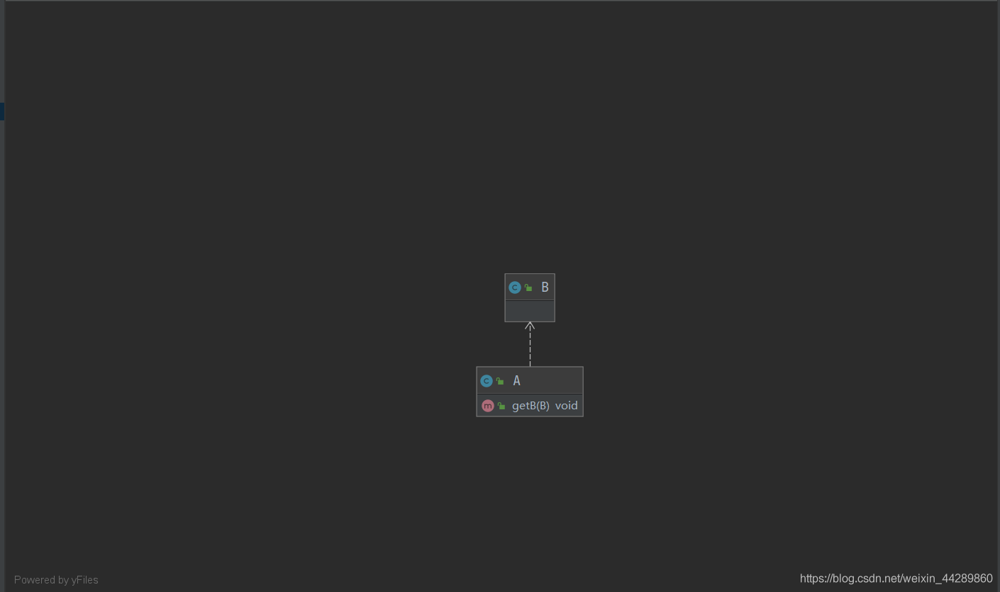

##  依赖关系——虚线箭头，白色

依赖关系是一种使用关系，表示某个类依赖于另外一个类，通常表现为，某个类的方法的参数使用了另外一个类的对象。

```java
public class A {
    public void getB(B b){
    }
}
```



## 实现关系——虚线三角，绿色

```java
public class A  implements C{
}
```


## 继承关系——实线三角，蓝色

```java
public class A  extends B{
}
```


## 关联关系——实线箭头

关联关系是对象之间的引用关系，表示一个类和另外一个类的关系，如老师和学生，丈夫和妻子等。

## 聚合关系——实线空心菱形

聚合关系是关联关系的一种，表示部分和整体之间的关系。如学校和老师，车子和轮胎。

聚合关系在类中是通过成员对象来体现的，成员是整体的一部分，成员也可以脱离整体而存在。如老师是学校的一部分，同时老师也是独立的个体，可以单独存在。

在UML类图中，用带空心菱形的实线来表示聚合关系，菱形指向整体。

## 组合关系——实线实心菱形

组合关系也是关联关心的一种，表示更强的关联。是一种比聚合关系还要强的关系。部分对象不能脱离整体对象而单独存在，如人的身体和大脑之间的关系，大脑不能脱离身体而单独存在。