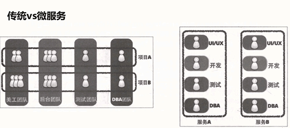

# 微服务

- 一系列微小的服务共同组成
- 跑在自己的进程里
- 每个服务为独立的业务开发
- 独立部署
- 分布式管理

# 架构演化的过程

## 单体架构的优点

- 容易测试
- 容易部署

## 单体架构的缺点

- 开发效率低
- 稳定性不高
- 代码维护难
- 扩展性不够
- 部署不灵活

# Spring Cloud Eureka

- 基于 Netflix Eureka 做了二次封装
- 两个组件组成：
  - Eureka Server 注册中心
  - Eureka Client 服务注册

