# [系统Redis学习博客](https://pdai.tech/md/db/nosql-redis/db-redis-overview.html)

# 一、Redis整体视角

## Redis知识维度 

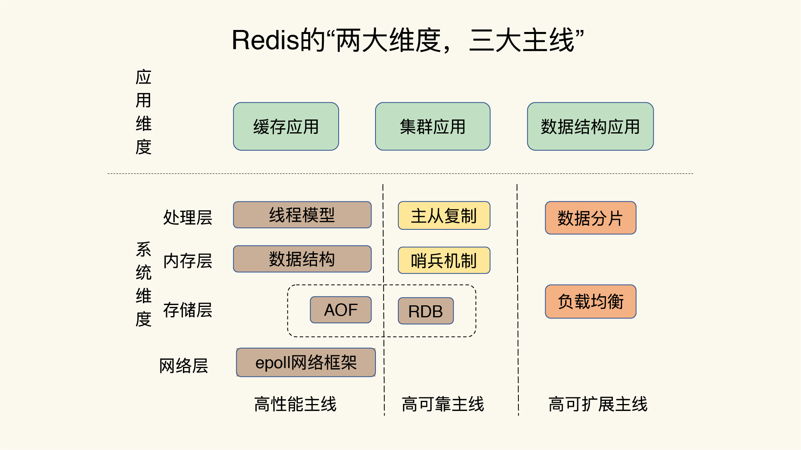

## Redis问题画像


## Redis简化架构


# 二、Redis线程模型 

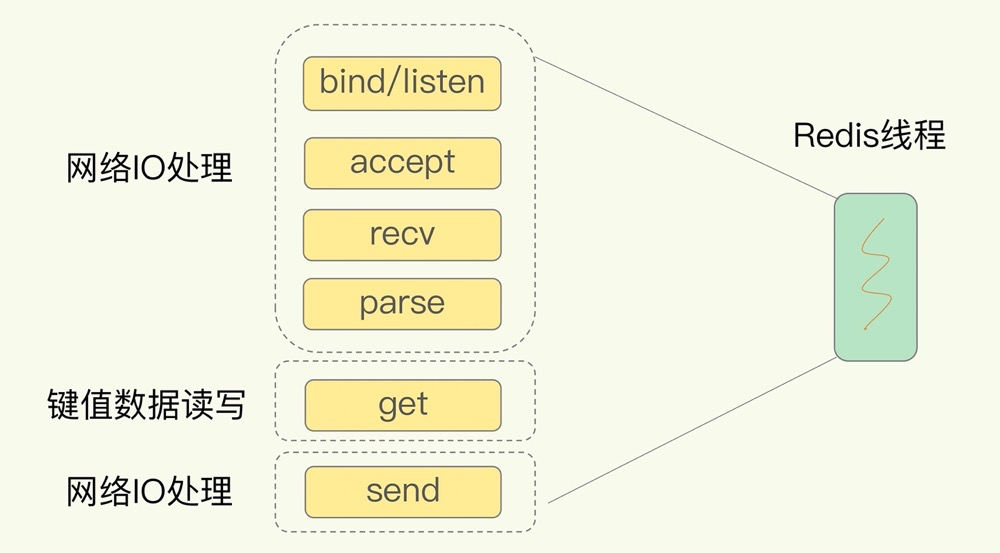

上图中的get是内存操作，其他的都是网络IO处理。

这些操作中有潜在的阻塞点，分别是 accept 和 recv。当 Redis 监听到一个客户端有连接请求，但一直未能成功建立起连接时，会阻塞在 accept 函数这里，导致其他客户端无法和 Redis 建立连接。类似的，当 Redis 通过 recv 从一个客户端读取数据时，如果数据一直没有到达，Redis 也会一直阻塞在 recv。

这就导致 Redis 整个线程阻塞，无法处理其他客户端请求。不过socket 网络模型本身可以通过设置来支持非阻塞模式。

在 socket 模型中，不同操作调用后会返回不同的套接字类型。socket方法会返回主动套接字，然后调用 listen 方法，将主动套接字转化为监听套接字，此时，可以监听来自客户端的连接请求。最后，调用 accept 方法接收到达的客户端连接，并返回已连接套接字。

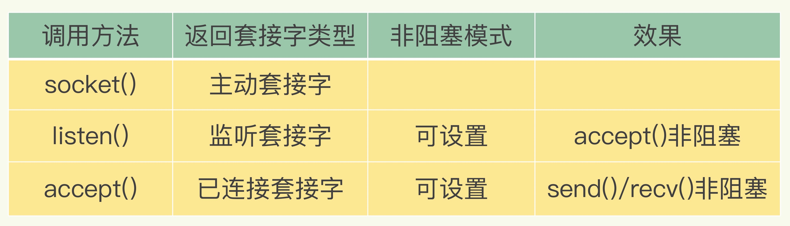

针对监听套接字，可以设置非阻塞模式。当 Redis 调用 accept 后没有连接请求到达时，Redis 线程可以返回处理其他操作，而不是阻塞在等待连接上。

虽然 Redis 线程可以不用继续等待，但是总得有机制继续在监听套接字上等待后续连接请求，并在有请求时通知 Redis。

类似的，我们也可以针对已连接套接字设置非阻塞模式：Redis 调用 recv 后，如果已连接套接字上一直没有数据到达，Redis 线程同样可以返回处理其他操作。我们也需要有机制继续监听该已连接套接字，并在有数据达到时通知 Redis。

这样才能保证 Redis 线程，既不会像基本 IO 模型中一直在阻塞点等待，也不会导致 Redis 无法处理实际到达的连接请求或数据。

到此，Liux 中的 IO 多路复用机制就要登场了。

Linux 中的 IO 多路复用机制是指一个线程处理多个 IO 流，就是我们经常听到的select/epoll机制。简单来说，在Redis只运行单线程的情况下，该机制允许内核中，同时存在多个监听套接字和已连接套接字。内核会一直监听这些套接字上的连接请求或数据请求。一旦有请求到达，就会交给 Redis 线程处理，这就实现了一个 Redis 线程处理多个 IO 流的效果。

下图就是基于多路复用的 Redis IO 模型。图中的多个 FD 就是刚才所说的多个套接字。Redis 网络框架调用 epoll 机制，让内核监听这些套接字。此时，Redis 线程不会阻塞在某一个特定的监听或已连接套接字上，也就是说，不会阻塞在某一个特定的客户端请求处理上。正因为此，Rdis 可以同时和多个客户端连接并处理请求，从而提升并发性。

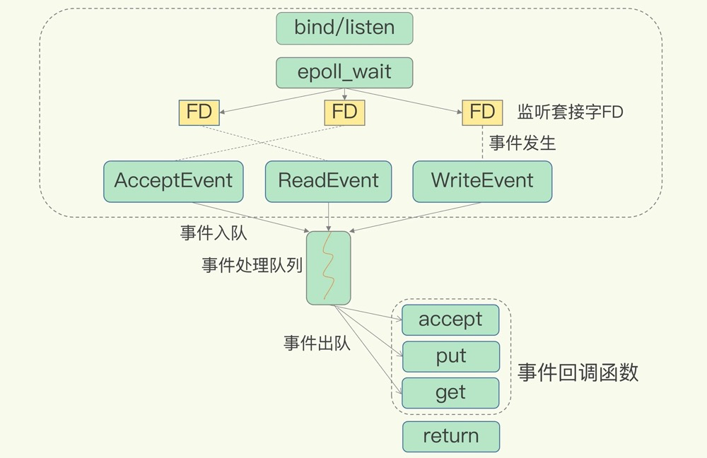

为了在请求到达时能通知到 Redis 线程，select/epol 川提供了基于事件的回调机制，即针对不同事件的发生，调用相应的处理函数。

那么，回调机制是怎么工作的呢？其实，select/epoll一旦监测到FD上有请求到达时，就会触发相应的事件。

这些事件会被放进一个事件队列，Rdis 单线程对该事件队列不断进行处理。这样一来，Redis 无需一直轮询是否有请求实际发生，这就可以避免造成 CPU 资源浪费。同时，Rdis 在对事件队列中的事件进行处理时，会调用相应的处理函数，这就实现了基于事件的回调。因为 Rdis 一直在对事件队列进行处理，所以能及时响应客户端请求，提升 Redis 的响应性能。

为了方便你理解，我再以连接请求和读数据请求为例，具体解释一下。

这两个请求分别对应 Accept 事件和 Read 事件，Redis 分别对这两个事件注册 accept 和 get 回调函数。当 Linux 内核监听到有连接请求或读数据请求时，就会触发 Accept 事件和 Read 事件，此时，内核就会回调 Redis 相应的 accept 和 get 函数进行处理。

**Redis单线程处理IO请求性能瓶颈主要包括2个方面：**

1、任意一个请求在server中一旦发生耗时，都会影响整个server的性能，也就是说后面的请求都要等前面这个耗时请求处理完成，自己才能被处理到。耗时的操作包括以下几种：
a、操作bigkey：写入一个bigkey在分配内存时需要消耗更多的时间，同样，删除bigkey释放内存同样会产生耗时；
b、使用复杂度过高的命令：例如SORT/SUNION/ZUNIONSTORE，或者O(N)命令，但是N很大，例如lrange key 0 -1一次查询全量数据；
c、大量key集中过期：Redis的过期机制也是在主线程中执行的，大量key集中过期会导致处理一个请求时，耗时都在删除过期key，耗时变长；
d、淘汰策略：淘汰策略也是在主线程执行的，当内存超过Redis内存上限后，每次写入都需要淘汰一些key，也会造成耗时变长；
e、AOF刷盘开启always机制：每次写入都需要把这个操作刷到磁盘，写磁盘的速度远比写内存慢，会拖慢Redis的性能；
f、主从全量同步生成RDB：虽然采用fork子进程生成数据快照，但fork这一瞬间也是会阻塞整个线程的，实例越大，阻塞时间越久；
2、并发量非常大时，单线程读写客户端IO数据存在性能瓶颈，虽然采用IO多路复用机制，但是读写客户端数据依旧是同步IO，只能单线程依次读取客户端的数据，无法利用到CPU多核。

针对问题1，一方面需要业务人员去规避，一方面Redis在4.0推出了lazy-free机制，把bigkey释放内存的耗时操作放在了异步线程中执行，降低对主线程的影响。

针对问题2，Redis在6.0推出了多线程，可以在高并发场景下利用CPU多核多线程读写客户端数据，进一步提升server性能，当然，只是针对客户端的读写是并行的，每个命令的真正操作依旧是单线程的

# 三、Redis基础数据类型

## 常用的五种数据类型

这里介绍的是我们通常存储值的几种数据类型，而非最底层的数据结构。这些数据类型也是通过redis底层的数据结构来实现。

| 结构类型         | 结构存储的值                               | 结构的读写能力                                               |
| ---------------- | ------------------------------------------ | ------------------------------------------------------------ |
| **String字符串** | 可以是字符串、整数或浮点数                 | 对整个字符串或字符串的一部分进行操作；对整数或浮点数进行自增或自减操作 |
| **List列表**     | 一个链表，链表上的每个节点都包含一个字符串 | 对链表的两端进行push和pop操作，读取单个或多个元素；根据值查找或删除元素 |
| **Set集合**      | 包含字符串的无序集合                       | 字符串的集合，包含基础的方法有看是否存在添加、获取、删除；还包含计算交集、并集、差集等 |
| **Hash散列**     | 包含键值对的无序散列表                     | 包含方法有添加、获取、删除单个元素                           |
| **Zset有序集合** | 和散列一样，用于存储键值对                 | 字符串成员与浮点数分数之间的有序映射；元素的排列顺序由分数的大小决定；包含方法有添加、获取、删除单个元素以及根据分值范围或成员来获取元素 |

## String数据类型常用操作

| 命令   | 示例                 | 描述                                                         |
| ------ | -------------------- | ------------------------------------------------------------ |
| set    | set key value        | 赋值                                                         |
| get    | get key              | 取值                                                         |
| getset | getset key value     | 取值并赋值                                                   |
| setnx  | setnx key value      | 当key不存在时才用赋值 set key value NX PX 3000 原子操作，px 设置毫秒数 |
| append | append key value     | 向尾部追加值                                                 |
| strlen | strlen key           | 获取字符串长度                                               |
| incr   | incr key             | 递增数字                                                     |
| incrby | incrby key increment | 增加指定的整数                                               |
| decr   | decr key             | 递减数字                                                     |
| decrby | decrby key decrement | 减少指定的整数                                               |

## List数据类型常用操作

| 命令       | 示例                                 | 描述                                                         |
| ---------- | ------------------------------------ | ------------------------------------------------------------ |
| lpush      | lpush key v1 v2 v3 ...               | 从左侧插入列表                                               |
| lpop       | lpop key                             | 从列表左侧取出                                               |
| rpush      | rpush key v1 v2 v3                   | 从右侧插入列表                                               |
| rpop       | rpop key                             | 从列表右侧取出                                               |
| lpushx     | lpushx key value                     | 将值插入到列表头部                                           |
| rpushx     | rpushx key value                     | 将值插入到列表尾部                                           |
| blpop      | blpop key timeout                    | 从列表左侧取出，当列表为空时阻塞，可以设置最大阻塞时 间，单位为秒 |
| brpop      | blpop key timeout                    | 从列表右侧取出，当列表为空时阻塞，可以设置最大阻塞时 间，单位为秒 |
| llen       | llen key                             | 获得列表中元素个数                                           |
| lindex     | lindex key index                     | 获得列表中下标为index的元素 index从0开始                     |
| lrange     | lrange key start end                 | 返回列表中指定区间的元素，区间通过start和end指定             |
| lrem       | lrem key count value                 | 删除列表中与value相等的元素 当count>0时， lrem会从列表左边开始删除;当count<0时， lrem会从列表后边开始删除;当count=0时， lrem删除所有值 为value的元素 |
| lset       | lset key index value                 | 将列表index位置的元素设置成value的值                         |
| ltrim      | ltrim key start end                  | 对列表进行修剪，只保留start到end区间                         |
| rpoplpush  | rpoplpush key1 key2                  | 从key1列表右侧弹出并插入到key2列表左侧                       |
| brpoplpush | brpoplpush key1 key2                 | 从key1列表右侧弹出并插入到key2列表左侧，会阻塞               |
| linsert    | linsert key BEFORE/AFTER pivot value | 将value插入到列表，且位于值pivot之前或之后                   |

## Set数据类型常用操作

| 命令        | 示例                          | 描述                                   |
| ----------- | ----------------------------- | -------------------------------------- |
| sadd        | sadd key mem1 mem2 ....       | 为集合添加新成员                       |
| srem        | srem key mem1 mem2 ....       | 删除集合中指定成员                     |
| smembers    | smembers key                  | 获得集合中所有元素                     |
| spop        | spop key                      | 返回集合中一个随机元素，并将该元素删除 |
| srandmember | srandmember key               | 返回集合中一个随机元素，不会删除该元素 |
| scard       | scard key                     | 获得集合中元素的数量                   |
| sismember   | sismember key member          | 判断元素是否在集合内                   |
| sinter      | sinter key1 key2 key3         | 求多集合的交集                         |
| sdiff        | sdiff key1 key2 key3           | 求多集合的差集                         |
| sunion      | sunion key1 key2 key3         | 求多集合的并集                         |
| sunionstore | sunionstore destKey key1 key2 | 将多集合的并集保存至                   |

## Zset数据类型常用操作

| 命令      | 示例                                       | 描述                                        |
| --------- | ------------------------------------------ | ------------------------------------------- |
| zadd      | zadd key score1 member1 score2 member2 ... | 为有序集合添加新成员                        |
| zrem      | zrem key mem1 mem2 ....                    | 删除有序集合中指定成员                      |
| zcard     | zcard key                                  | 获得有序集合中的元素数量                    |
| zcount    | zcount key min max                         | 返回集合中score值在[min,max]区间 的元素数量 |
| zincrby   | zincrby key increment member               | 在集合的member分值上加increment             |
| zscore    | zscore key member                          | 获得集合中member的分值                      |
| zrank     | zrank key member                           | 获得集合中member的排名（按分值从 小到大）   |
| zrevrank  | zrevrank key member                        | 获得集合中member的排名（按分值从 大到小）   |
| zrange    | zrange key start end                       | 获得集合中指定区间成员，按分数递增 排序     |
| zrevrange | zrevrange key start end                    | 获得集合中指定区间成员，按分数递减 排序     |

## Hash数据类型常用操作

| 命令    | 示例                                | 描述                       |
| ------- | ----------------------------------- | -------------------------- |
| hset    | hset key field value                 | 赋值，不区别新增或修改     |
| hmset   | hmset key field1 value1 field2 value2 | 批量赋值                   |
| hsetnx  | hsetnx key field value               | 赋值，如果filed存在则不操作 |
| hexists | hexists key filed                    | 查看某个field是否存在       |
| hget    | hget key field                       | 获取一个字段值             |
| hmget   | hmget key field1 field2 ...           | 获取多个字段值             |
| hgetall | hgetall key                         | 依次返回所有entry          |
| hdel    | hdel key field1 field2...             | 删除指定字段               |
| hincrby | hincrby key field increment          | 指定字段自增increment      |
| hlen    | hlen key                            | 获得字段数量               |

## BitMap数据类型常用操作

Bitmap 本身是用 String 类型作为底层数据结构实现的一种统计二值状态的数据类型。

String类型是会保存为二进制的字节数组，所以，Redis 就把字节数组的每个 bit 位利用起来，用来表示一个元素的二值状态。可以把 Bitmap 看作是一个 bit 数组。

Bitmap提供了GETBIT/SETBIT操作，使用一个偏移值offset对bit数组的某一个bit 位进行读和写。不过，需要注意的是，Bitmap 的偏移量是从 0 开始算的，也就是说 offset 的最小值是 0。当使用 SETBIT 对一个 bit 位进行写操作时，这个 bit 位会被设置为 1。

Bitmap 还提供了 BITCOUNT 操作，用来统计这个 bit 数组中所有“1”的个数。

## Stream数据类型常用操作 TODO

# 四、Redis底层数据结构

## redisObject

### 数据类型、编码类型和底层数据结构

开始之前先看段代码。

```bash
> set a 1
OK
> type a
string
> object encoding a	# 查看对象的编码类型
int
> set a 1.1 
OK
> object encoding a
embstr
> set a 1a
OK
> object encoding a
embstr
```

分别对string类型的key `a ` 进行设值 `1` 、`1.1`、`a`，然后查看储存不同值时的对应的编码类型，发现有int和embstr两种。

为什么都是string数据类型，返回的编码类型却不一样。我们来开始学习redis的底层数据结构。


不管是哪种数据类型，它都会需要支持DEL、TTL等这种通用的命令，所以可以将这些共同的逻辑抽取出来，形成数据类型的公共父接口，也就是redisObject。

而string、list、hash这些数据类型可以看作是继承redisObject的子接口。这些接口定义了各自类型的特性，同样是插入元素，string用`set`命令，list用`lpush`命令，而不同的编码类型可以看作同一数据类型的不同的实现。这样就可以**根据不同编码进行多态处理**。

### redisObject数据结构

```c
/*
 * Redis 对象
 */
typedef struct redisObject {

    // 数据类型   如 string set zset hash list
    unsigned type:4;

    // 编码类型 	如 OBJ_ENCODING_EMBSTR、OBJ_ENCODING_INT
    unsigned encoding:4;

    // LRU - 24位, 记录最末一次访问时间（相对于lru_clock）; 或者 LFU（最少使用的数据：8位频率，16位访问时间）
    unsigned lru:LRU_BITS; // LRU_BITS: 24

    // 引用计数		用于垃圾回收
    int refcount;

    /* 指向底层数据结构实例 
			ptr是一个指针，指向实际保存值的数据结构，这个数据结构由type和encoding属性决定。
			例如，一个redisObject的type属性为OBJ_LIST，encoding属性为OBJ_ENCODING_QUICKLIST，那么这个对象就是一个Redis列表（List)，它的值保存在一个QuickList的数据结构内，而ptr 指针就指向quicklist的对象；
		*/
    void *ptr;

} robj;
```

元信息内存占用：4位数据类型+4位编码类型+24位LRU引用+32位的引用计数（int类型占4个字节，每个字节8位）=64位 = 8个字节

结构定义的是8个字节的指针，指向实际数据结构的地址。如果是**OBJ_ENCODING_INT**编码类型的话，这里其实直接存的就是具体的Long类型值了，不会再指向一个地址。

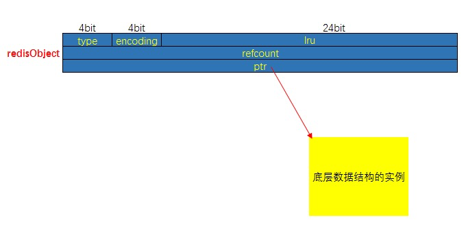

**redis中查找一个key的流程**

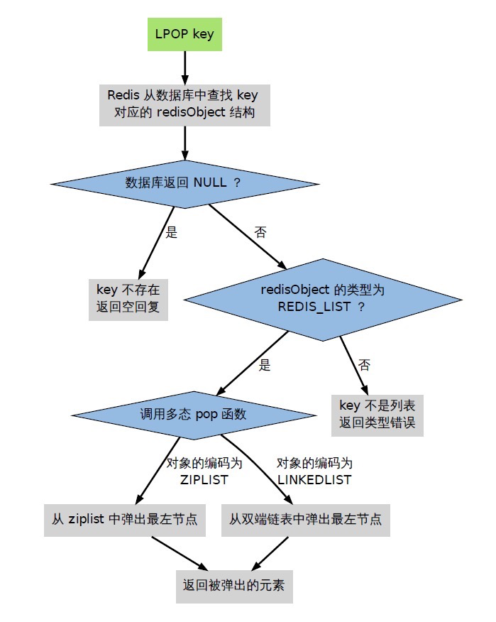小结

- redis使用自己实现的对象机制（redisObject)来实现类型判断、命令多态和基于引用次数的垃圾回收；
- redis会预分配一些常用的数据对象，并通过共享这些对象来减少内存占用，和避免频繁的为小对象分配内存。

- redis使用自己实现的对象机制（redisObject)来实现类型判断、命令多态和基于引用次数的垃圾回收；
- redis会预分配一些常用的数据对象，并通过共享这些对象来减少内存占用，和避免频繁的为小对象分配内存。

## 简单动态字符串

[SDS 数据结构介绍](https://pdai.tech/md/db/nosql-redis/db-redis-x-redis-ds.html#%E7%AE%80%E5%8D%95%E5%8A%A8%E6%80%81%E5%AD%97%E7%AC%A6%E4%B8%B2---sds)

[《Redis 设计与实现》相关章节](https://redisbook.readthedocs.io/en/latest/internal-datastruct/sds.html)

Redis 是用 C 语言写的，但是对于Redis的字符串，却不是 C 语言中的字符串（即以空字符’\0’（是空字符NULL）结尾的字符数组），它是自己构建了一种名为 **简单动态字符串（simple dynamic string,SDS**）的抽象类型，并将 SDS 作为 Redis的默认字符串表示。这个数据结构除了能存储二进制数据, 显然是用于设计作为字符串使用的。SDS 还可以作为缓冲区（buffer）：包括 AOF 模块中的AOF缓冲区以及客户端状态中的输入缓冲区。

SDS的结构图：


它的头部并非是固定类型的，它会根据数据内容的大小选择不同类型的头。目前SDS在使用的有四种不同的头部。

SDS支持两种编码类型 **OBJ_ENCODING_RAW**和**OBJ_ENCODING_EMBSTR **

### **四种头部类型结构**

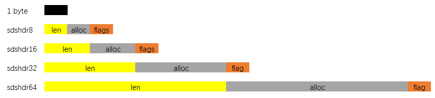

**头部属性介绍**

- len：保存了SDS已保存字符串的长度，已用大小
- alloc：以无符号数表示保存字符串buf的总大小，分配大小
- flags：始终为一字节, 以低三位标示着头部的类型, 高5位未使用

这里其实还有一个点，当存储的内容是字符串（非数值类型）且长度小于等于44字节时，会使用OBJ_ENCODING_EMBSTR 编码类型，

超过44字节使用OBJ_ENCODING_RAW编码类型。

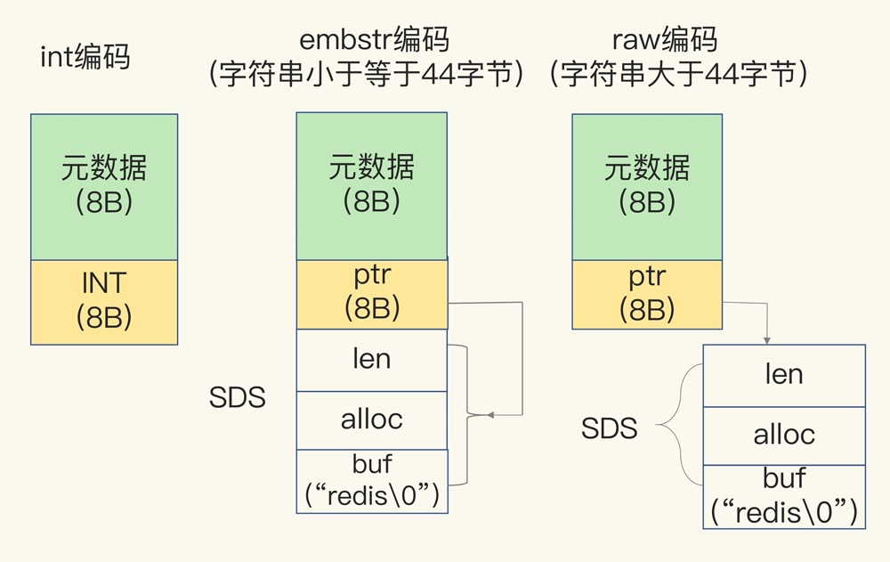


embstr编码时，RedisObject 中的元数据、指针和 SDS 是一块连续的内存区域，这样就可以避免内存碎片。

embstr与raw都使用redisObject和sds保存数据，区别在于，embstr的使用只分配一次内存空间（因此redisObject和sds是连续的），而raw需要分配两次内存空间（分别为redisObject和sds分配空间）。因此与raw相比，embstr的好处在于创建时少分配一次空间，删除时少释放一次空间，以及对象的所有数据连在一起，寻找方便。而embstr的坏处也很明显，如果字符串的长度增加需要重新分配内存时，整个redisObject和sds都需要重新分配空间，因此redis中的embstr实现为只读。

为什么是44字节，redisObject元数据的8字节+redisObject指针的8字节+SDS头部len1字节+SDS头部alloc1字节+SDS头部flags1字节+字SDS数据内容buf44字节+SDS末尾的"\0"的1个字节=8+8+1+1+1+44+1=64字节。

Redis的分配库是 Jemalloc，Jemalloc 在分配内存时，会根据我们申请的字节数 N，找一个比 N 大，但是最接近 N 的 2 的幂次数作为分配的空间，这样可以减少频繁分配的次数。

### **String数据类型**

String数据类型的编码可以是int，raw或者embstr。而raw和embstr都是由SDS来实现的。

- `int 编码`：保存的是可以用 long 类型表示的整数值。
- `embstr 编码`：保存长度小于44字节的字符串（redis3.2版本之前是39字节，之后是44字节）。
- `raw 编码`：保存长度大于44字节的字符串（redis3.2版本之前是39字节，之后是44字节）。

int 编码是用来保存整数值，而embstr是用来保存短字符串，raw编码是用来保存长字符串。

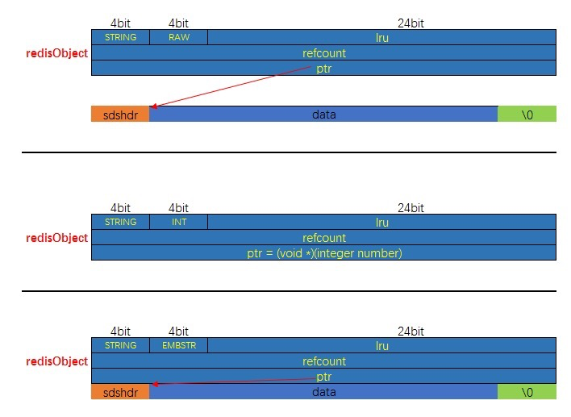


### SDS的优势——SDS

- **常数复杂度获取字符串长度**

  以O（1）时间复杂度获取字符串的长度，通过 `strlen key` 命令可以获取 key 的字符串长度。

- **杜绝缓冲区溢出**

  在进行字符修改的时候，**会首先根据记录的 len 属性检查内存空间是否满足需求**，如果不满足，会进行相应的空间扩展，然后在进行修改操作，所以不会出现缓冲区溢出。

- **减少修改字符串的内存重新分配次数**

  C语言由于不记录字符串的长度，所以如果要修改字符串，必须要重新分配内存（先释放再申请），如果没有重新分配，字符串长度增大时会造成内存缓冲区溢出，字符串长度减小时会造成内存泄露。

  而对于SDS，由于`len`属性和`alloc`属性的存在，对于修改字符串SDS实现了**空间预分配**和**惰性空间释放**两种策略：

  1、`空间预分配`：对字符串进行空间扩展的时候，扩展的内存比实际需要的多，这样可以减少连续执行字符串增长操作所需的内存重分配次数。

  2、`惰性空间释放`：对字符串进行缩短操作时，程序不立即使用内存重新分配来回收缩短后多余的字节，而是使用 `alloc` 属性将这些字节的数量记录下来，等待后续使用。（当然SDS也提供了相应的API，当我们有需要时，也可以手动释放这些未使用的空间。）

   对于 redis 这种缓存类型数据库，对于缓存的 Value 是有可能经常的更改的，这两种策略可以理解为**扩容时多扩一点，缩容时晚缩一点**

- **二进制安全**

  因为C字符串以空字符作为字符串结束的标识，而对于一些二进制文件（如图片、视频等），内容可能包括空字符串，因此C字符串无法正确存取；而所有 SDS 的API 都是以处理二进制的方式来处理 `buf` 里面的元素，并且 SDS 不是以空字符串来判断是否结束，而是以 len 属性表示的长度来判断字符串是否结束。

- **兼容部分 C 字符串函数**

  虽然 SDS 是二进制安全的，但是一样遵从每个字符串都是以空字符串结尾的惯例，这样可以重用 C 语言库`<string.h>` 中的一部分函数。这也是为什么SDS以`\0`结尾的缘故

##  压缩列表——ZipList

[压缩列表](https://redisbook.readthedocs.io/en/latest/compress-datastruct/ziplist.html)

ziplist是为了提高存储效率而设计的一种特殊编码的双向链表。在内存中也是由连续的内存块构成的列表。

它可以存储字符串或者整数，存储整数时是采用整数的二进制而不是字符串形式存储。他能在O(1)的时间复杂度下完成list两端的push和pop操作。但是因为每次操作都需要重新分配ziplist的内存，所以实际复杂度和ziplist的内存使用量相关。

### zipList的结构

```bash
area        |<---- ziplist header ---->|<----------- entries ------------->|<-end->|

size          4 bytes  4 bytes  2 bytes    ?        ?        ?        ?     1 byte
            +---------+--------+-------+--------+--------+--------+--------+-------+
component   | zlbytes | zltail | zllen | entry1 | entry2 |  ...   | entryN | zlend |
            +---------+--------+-------+--------+--------+--------+--------+-------+
                                       ^                          ^        ^
address                                |                          |        |
                                ZIPLIST_ENTRY_HEAD                |   ZIPLIST_ENTRY_END
                                                                  |
                                                         ZIPLIST_ENTRY_TAIL
```

图中各个域的作用如下：

| 域        | 长度/类型  | 域的值                                                       |
| :-------- | :--------- | :----------------------------------------------------------- |
| `zlbytes` | `uint32_t` | 整个 ziplist 占用的内存字节数，对 ziplist 进行内存重分配，或者计算末端时使用。 |
| `zltail`  | `uint32_t` | 到达 ziplist 表尾节点的偏移量。 通过这个偏移量，可以在不遍历整个 ziplist 的前提下，弹出表尾节点。 |
| `zllen`   | `uint16_t` | ziplist 中节点的数量。 当这个值小于 `UINT16_MAX` （`65535`）时，这个值就是 ziplist 中节点的数量； 当这个值等于 `UINT16_MAX` 时，节点的数量需要遍历整个 ziplist 才能计算得出。 |
| `entryX`  | `?`        | ziplist 所保存的节点，各个节点的长度根据内容而定。           |
| `zlend`   | `uint8_t`  | `255` 的二进制值 `1111 1111` （`UINT8_MAX`） ，用于标记 ziplist 的末端。 |

### zipList中entry的结构

```bash
area        |<------------------- entry -------------------->|

            +------------------+----------+--------+---------+
component   | pre_entry_length | encoding | length | content |
            +------------------+----------+--------+---------+
```

`pre_entry_length` 记录了前一个节点的长度，而非指针地址（因为在ziplistResize重新调整 ziplist 的内存大小时，地址会变），通过这个值，可以进行指针计算，从而跳转到上一个节点。默认是一个字节，也就是前一个entry的长度小于254情况。如果前者的长度大于等于254，那么将该entry的pre_entry_length将会用5个字节来表示，其中第1个字节设置为254，后边4个字节记录前者的实际长度，高位补0。

`encoding`和`length`这两部分一起决定了 `content` 部分所保存的数据的类型以及长度。

`content`表示节点存储的内容，是二进制形式的。

### Zip的优缺点

优点是内存排列紧凑，足够节省空间

缺点是由于没有预留空间，所以每次操作都会对应内存分配。

## 快速链表——QuickList

[快速链表](https://redisbook.readthedocs.io/en/latest/internal-datastruct/adlist.html)

它是一种以ziplist为结点的双端链表结构. 宏观上, quicklist是一个链表, 微观上, 链表中的每个结点都是一个ziplist。


之前的List类型是由双端链表+压缩列表来实现的，元素数量少的时候使用压缩列表，数量多的话转为双端链表。

list作为最传统的双链表, 结点通过指针持有数据, 指针字段会耗费大量内存. ziplist解决了耗费内存这个问题. 但引入了新的问题: 每次写操作整个ziplist的内存都需要重分配。

quicklist在两者之间做了一个平衡， 并且使用者可以通过自定义`quicklist.fill`。

`quicklist.fill`的值影响着每个链表结点中, ziplist的长度。

1. 当数值为负数时, 代表以字节数限制单个ziplist的最大长度. 具体为:
2. -1 不超过4kb
3. -2 不超过 8kb
4. -3 不超过 16kb
5. -4 不超过 32kb
6. -5 不超过 64kb
7. 当数值为正数时, 代表以entry数目限制单个ziplist的长度. 值即为数目. 由于该字段仅占16位, 所以以entry数目限制ziplist的容量时, 最大值为2^15个

## 哈希表——HashTable

### HashTable的使用场景

**1.作为Redis的键空间**

hashTable也可以被称为字典，除了是OBJ_ENCODING_HT这种编码类型的底层数据结构以外，它还被用来实现Redis数据库的键空间。

Redis 是一个键值对数据库， 数据库中的键值对由字典保存： 每个数据库都有一个对应的字典， 这个字典被称之为键空间（key space）。

当用户添加一个键值对到数据库时， 程序就将该键值对添加到键空间； 当用户从数据库中删除键值对时， 程序就会将这个键值对从键空间中删除；

**2.作为Hash数据类型的底层数据结构**

Hash数据类型的编码可以是 ziplist 或者 hashtable；对应的底层实现有两种, 一种是ziplist, 一种是hashTable（dict）。

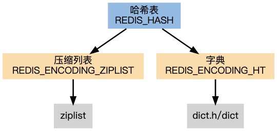

默认当hash保存元素满足下列条件时，使用zipList，否则使用hashTable。

- 列表保存元素个数小于512
- 每个元素长度小于64字节

也可以手动进行配置：

hash-max-ziplist--entries：表示用压缩列表保存时哈希集合中的最大元素个数。

hash-max-ziplist--value：表示用压缩列表保存时哈希集合中单个元素的最大长度。

如果我们往 Hash 集合中写入的元素个数超过了 hash-max-ziplist--entries，或者写入的单个元素大小超过了 hash-max-ziplist-value, Redis 就会自动把 Hash 类型的实现结构由压缩列表转为哈希表。

一旦从压缩列表转为了哈希表，Hash 类型就会一直用哈希表进行保存，而不会再转回压缩列表了。在节省内存空间方面，哈希表就没有压缩列表那么高效了。

### HashTable的结构定义

```c
/*
 * 字典
 *
 * 每个字典使用两个哈希表，用于实现渐进式 rehash
 */
typedef struct dict {

    // 特定于类型的处理函数
    dictType *type;

    // 类型处理函数的私有数据
    void *privdata;

    // 哈希表（2 个）	//两个hash表的引用是为了进行渐进式hash
    dictht ht[2];

    // 记录 rehash 进度的标志，值为 -1 表示 rehash 未进行
    int rehashidx;

    // 当前正在运作的安全迭代器数量
    int iterators;

} dict;

/*
 * 哈希表
 */
typedef struct dictht {

    // 哈希表节点指针数组（俗称桶，bucket）
  	// table 属性是个数组， 数组的每个元素都是个指向 dictEntry 结构的指针。
		// 每个 dictEntry 都保存着一个键值对， 以及一个指向另一个 dictEntry 结构的指针：
    dictEntry **table;

    // 指针数组的大小
    unsigned long size;

    // 指针数组的长度掩码，用于计算索引值
    unsigned long sizemask;

    // 哈希表现有的节点数量
    unsigned long used;

} dictht;

/*
 * 哈希表节点
 */
typedef struct dictEntry {

    // 键
    void *key;

    // 值
    union {
        void *val;
        uint64_t u64;
        int64_t s64;
    } v;

    // 链往后继节点
    struct dictEntry *next;

} dictEntry;
```

### HashTable整体结构图

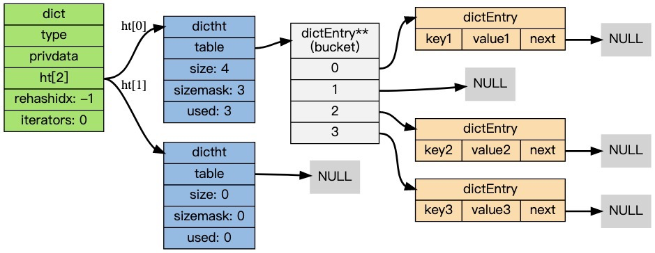


### HashTable的渐进式hash

**创建HashTable时**，会返回一个dict对象，这个dict包含的两个dictht都没有为 `table` 属性分配任何空间：

- `ht[0]->table` 的空间分配将在第一次往字典添加键值对时进行；
- `ht[1]->table` 的空间分配将在 rehash 开始时进行；

**向HashTable添加新元素时，可能会发生渐进式rehash或hash冲突。**流程如下图：

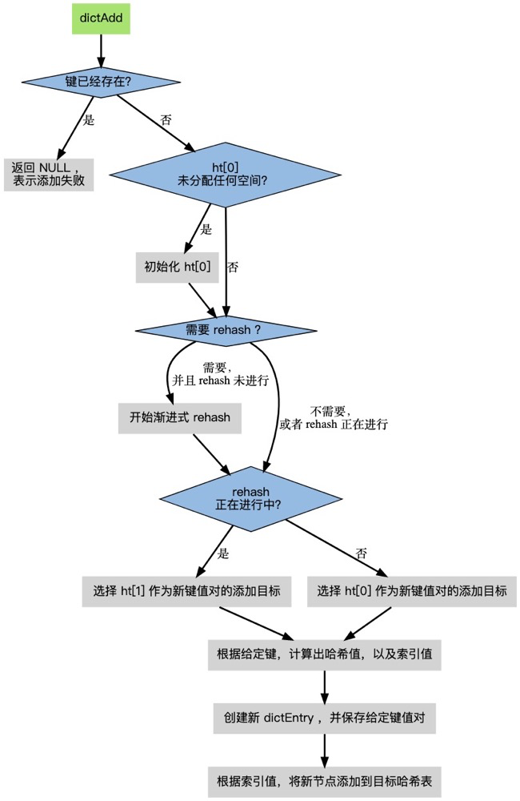

由于Redis没有提供树化链表的机制，所以当hash链表过长时，会影响HashTable的查询性能，所以需要对hashTable进行扩容，增大hash桶的数量，可以降低hash冲突。对已有的元素再需要进行rehash。并且当元素数量太少也会通过rehash进行收缩。

**触发扩容的条件**：

1. 服务器目前 **没有** 执行 BGSAVE 命令或者 BGREWRITEAOF 命令，并且负载因子大于等于1。
2. 服务器目前 **正在** 执行 BGSAVE 命令或者 BGREWRITEAOF 命令，并且负载因子大于等于5。

ps：负载因子 = 哈希表已保存节点数量 / 哈希表大小。将比率维持在 1:1 左右时性能最好。

也就是没有AOF 或者RDB时，负载因子大于等于1就可以触发。当有AOF 或者RDB的时候，负载因子需要大于等于5才触发

**扩容和收缩的具体步骤：**

1. 创建一个比 `ht[0]->table` 更大的 `ht[1]->table` ；一般2倍扩容。
2. 将 `ht[0]->table` 中的所有键值对迁移到 `ht[1]->table` ；
3. 将原有 `ht[0]` 的数据清空，并将 `ht[1]` 替换为新的 `ht[0]` ；

**渐近式 rehash：**

 rehash 程序并不是在激活之后，就马上执行直到完成的， 而是分多次、渐进式地完成的。因为在rehash的过程中会阻塞Redis Server主线程，如果数据量大的话，服务在此期间是不可用的。这个无法接受的。

在rehash期间，字典的删除查找更新等操作可能会在两个哈希表上进行，第一个哈希表没有找到，就会去第二个哈希表上进行查找。但是进行增加操作，一定是在新的哈希表上进行的。

rehash主要由下面两个方法进行：

- `_dictRehashStep` 用于对数据库字典、以及哈希键的字典进行被动 rehash ；

  每次执行一次添加、查找、删除操作，都会将`ht[0]->table` 哈希表第一个不为空的索引上的所有节点就会全部迁移到 `ht[1]->table` 。

- `dictRehashMilliseconds` 则由 Redis 服务器常规任务程序（server cron job）执行，用于对数据库字典进行主动 rehash ；

  `dictRehashMilliseconds` 可以在指定的毫秒数内， 对字典进行 rehash 。

  当 Redis 的服务器常规任务执行时， `dictRehashMilliseconds` 会被执行， 在规定的时间内， 尽可能地对数据库字典中那些需要 rehash 的字典进行 rehash ， 从而加速数据库字典的 rehash 进程（progress）。

### [美团针对Redis Rehash机制的探索和实践](https://tech.meituan.com/2018/07/27/redis-rehash-practice-optimization.html)

## 整数集——IntSet 

整数集合（intset）是集合类型的底层实现之一，当一个集合只包含整数值元素，并且这个集合的元素数量不多时，Redis 就会使用整数集合作为集合键的底层实现。

## 跳表——SkipList 

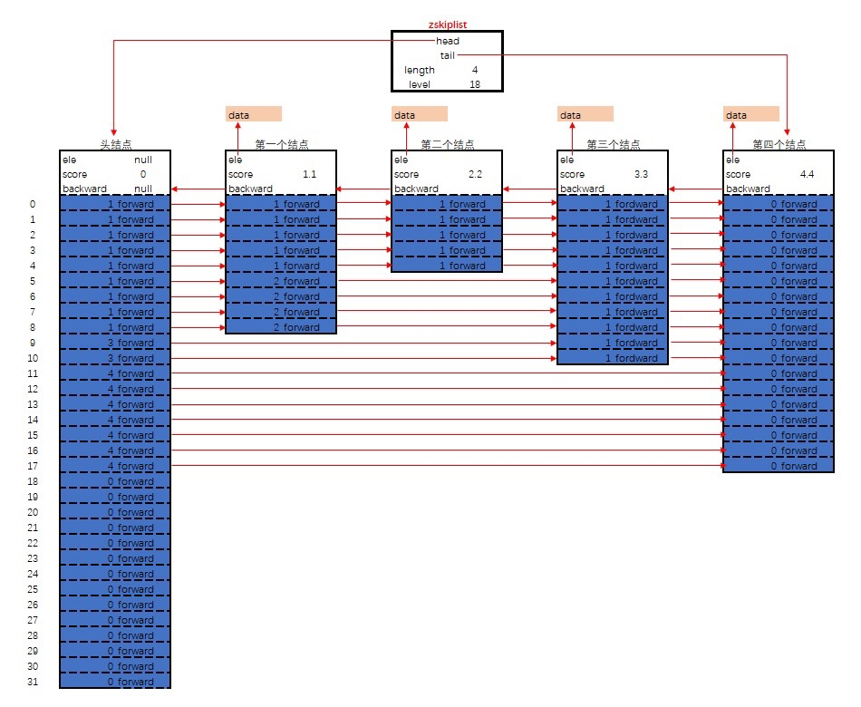

**zskiplist的核心设计要点**

- **头节点**不持有任何数据, 且其level[]的长度为32

- 每个结点

  - `ele`字段，持有数据，是sds类型

  - `score`字段, 其标示着结点的得分, 结点之间凭借得分来判断先后顺序, 跳跃表中的结点按结点的得分升序排列.

  - `backward`指针, 这是原版跳跃表中所没有的. 该指针指向结点的前一个紧邻结点.

  - ```
    level
    ```

    字段, 用以记录所有结点(除过头节点外)；每个结点中最多持有32个zskiplistLevel结构. 实际数量在结点创建时, 按幂次定律随机生成(不超过32). 每个zskiplistLevel中有两个字段

    - `forward`字段指向比自己得分高的某个结点(不一定是紧邻的), 并且, 若当前zskiplistLevel实例在level[]中的索引为X, 则其forward字段指向的结点, 其level[]字段的容量至少是X+1. 这也是上图中, 为什么forward指针总是画的水平的原因.
    - `span`字段代表forward字段指向的结点, 距离当前结点的距离. 紧邻的两个结点之间的距离定义为1.

### 为什么不用平衡树或者哈希表

- **为什么不是平衡树，先看下作者的回答**

https://news.ycombinator.com/item?id=1171423

```bash
There are a few reasons:

They are not very memory intensive. It's up to you basically. Changing parameters about the probability of a node to have a given number of levels will make then less memory intensive than btrees.
A sorted set is often target of many ZRANGE or ZREVRANGE operations, that is, traversing the skip list as a linked list. With this operation the cache locality of skip lists is at least as good as with other kind of balanced trees.

They are simpler to implement, debug, and so forth. For instance thanks to the skip list simplicity I received a patch (already in Redis master) with augmented skip lists implementing ZRANK in O(log(N)). It required little changes to the code.

About the Append Only durability & speed, I don't think it is a good idea to optimize Redis at cost of more code and more complexity for a use case that IMHO should be rare for the Redis target (fsync() at every command). Almost no one is using this feature even with ACID SQL databases, as the performance hint is big anyway.
About threads: our experience shows that Redis is mostly I/O bound. I'm using threads to serve things from Virtual Memory. The long term solution to exploit all the cores, assuming your link is so fast that you can saturate a single core, is running multiple instances of Redis (no locks, almost fully scalable linearly with number of cores), and using the "Redis Cluster" solution that I plan to develop in the future.
```

简而言之就是实现简单且达到了类似效果。

- **skiplist与平衡树、哈希表的比较**

来源于：https://www.jianshu.com/p/8ac45fd01548

skiplist和各种平衡树（如AVL、红黑树等）的元素是有序排列的，而哈希表不是有序的。因此，在哈希表上只能做单个key的查找，不适宜做范围查找。所谓范围查找，指的是查找那些大小在指定的两个值之间的所有节点。

在做范围查找的时候，平衡树比skiplist操作要复杂。在平衡树上，我们找到指定范围的小值之后，还需要以中序遍历的顺序继续寻找其它不超过大值的节点。如果不对平衡树进行一定的改造，这里的中序遍历并不容易实现。而在skiplist上进行范围查找就非常简单，只需要在找到小值之后，对第1层链表进行若干步的遍历就可以实现。

平衡树的插入和删除操作可能引发子树的调整，逻辑复杂，而skiplist的插入和删除只需要修改相邻节点的指针，操作简单又快速。

从内存占用上来说，skiplist比平衡树更灵活一些。一般来说，平衡树每个节点包含2个指针（分别指向左右子树），而skiplist每个节点包含的指针数目平均为1/(1-p)，具体取决于参数p的大小。如果像Redis里的实现一样，取p=1/4，那么平均每个节点包含1.33个指针，比平衡树更有优势。

查找单个key，skiplist和平衡树的时间复杂度都为O(log n)，大体相当；而哈希表在保持较低的哈希值冲突概率的前提下，查找时间复杂度接近O(1)，性能更高一些。所以我们平常使用的各种Map或dictionary结构，大都是基于哈希表实现的。

从算法实现难度上来比较，skiplist比平衡树要简单得多。


# 五、Redis的持久化

https://zhuanlan.zhihu.com/p/340082703

## AOF

**(append only file)记录了Redis已尽执行过的命令，是在主线程执行的。步骤分为：命令追加（append）、写入文件缓冲区和同步（write and sync）**

注意：**AOF不是预写日志的记录方式**，**是先执行命令再记录日志** 这样的好处：

- 这样的好处是对错误命令的校验放在了命令执行的时候，如果命令内容是错误的，则不会到日志记录阶段。所以通过AOF恢复数据时，不会因为错误命令而报错。
- 而且先执行命令才记录日志，不会阻塞当前写操作的执行。

**存在的风险：**

- 首先，如果刚执行完一个命令，还没有来得及记日志就宕机了，那么这个命令和相应的数据就有丢失的风险。如果此时 Redis 是用作缓存，还可以从后端数据库重新读入数据进行恢复但是，如果 Rdis 是直接用作数据库的话，此时，因为命令没有记入日志，所以就无法用日志进行恢复了。
- 其次，AOF 虽然避免了对当前命令的阻塞，但可能会给下一个操作带来阻塞风险。这是因为，AOF 日志也是在主线程中执行的，如果在把日志文件写入磁盘时，磁盘写压力大，就会导致写盘很慢，进而导致后续的操作也无法执行了。

**可以看出上述的风险，都和持久化的时机有关。为了避免以上风险，AOF提供了持久化时机的配置。**

### **AOF三种写回策略**

1. Always 同步写回：每个写命令执行完，立马同步地将日志写回磁盘

2. EverySec 每秒写回：每个写命令执行完，只是先把日志写到 AOF 文件的内存缓冲区，每

   隔一秒把缓冲区中的内容写入磁盘

3. No 操作系统控制的写回：每个写命令执行完，只是先把日志写到 AOF 文件的内存缓冲

   区，由操作系统决定何时将缓冲区内容写回磁盘。

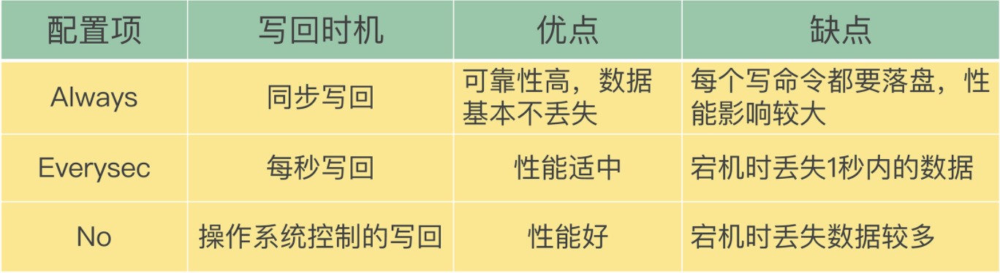

### **AOF重写**

随着接收的命令越来越多，AOF文件也会越来越大，这样也会带来一些性能问题。

- 文件系统本身对于文件大小的限制
- 文件本身过大后，追加写的性能也会收到影响
- 如果发生宕机，从AOF恢复的过程也会比较缓慢
- 由于AOF记录的是每次的操作命令，而我们恢复的时候只想要最新的数据，并不关心数据的是由哪些数据变更过来的。所以会存在很多我们不关心的过程数据

针对以上几点问题，Redis提供了 AOF重写机制。

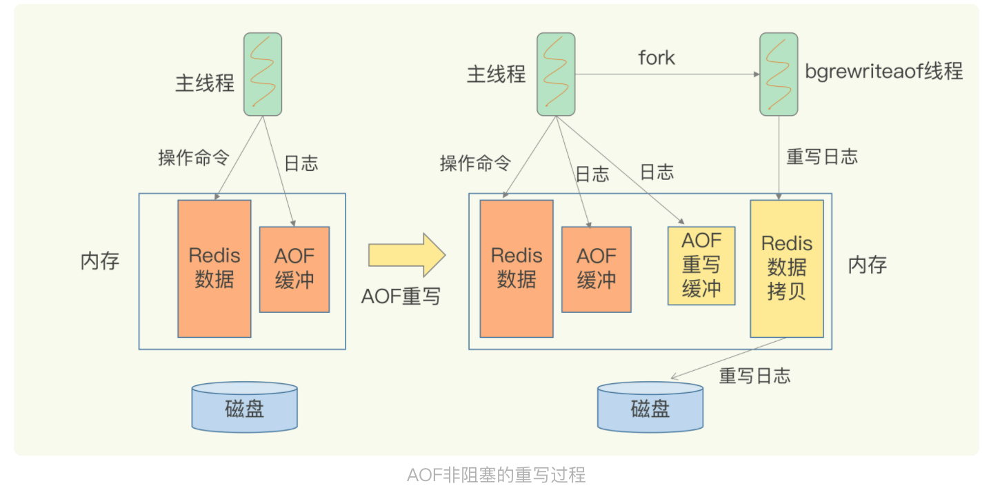

这个过程是异步的，会开辟新的进程来完成，因此不会阻塞主进程的读写。

首先主进程会在后台fork出一个bgrewriteaof进程，fork会把主进程中持有的内存引用拷贝一份给它的子进程。

这个子进程会将redis内存数据进行AOF重写至磁盘，在重写的过程中主进程还会接收到新的写操作，这个时候主进程除了将命令写入原本到AOF缓冲区，还会开辟一个AOF重写缓冲区，往这个里边保存增量的写操作，等到将拷贝数据的操作完成后，主进程再将AOF重写缓冲区的内容也写入新的AOF重写文件，此时用新的AOF文件代替旧的AOF文件，这样就完成了AOF重写。

小结：

- 主线程fork出子进程重写aof日志
- 子进程重写日志完成后，将追加的aof日志缓冲也写入新aof文件
- 替换日志文件

**重写AOF文件的过程中，潜在阻塞主线程的风险：**

1. 在fork这个操作的瞬间是会阻塞主线程的，这里并不是把内存中的数据拷贝，而是只拷贝进程的内存页表（虚拟内存页和物理内存页的索引映射表）

2. 主进程有bigkey写入时，操作系统会创建页面的副本（copy on write），并拷贝原有的数据，会对主线程阻塞。

   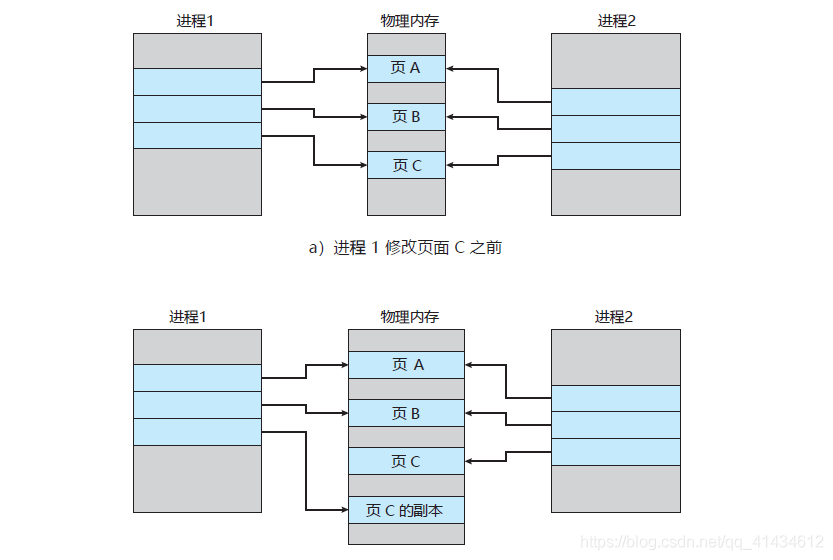

3. 子进程重写日志完成后，主进程追加aof重写缓冲区时可能会对主线程阻塞。

**为什么AOF重写不复用原AOF日志**？

1. 父子进程写同一个文件会产生竞争问题，影响父进程的性能。
2. 如果AOF重写过程中失败了，相当于污染了原本的AOF文件，无法做恢复数据使用。

**AOF相关的配置**

```properties
# appendonly参数开启AOF持久化 
appendonly no

# AOF持久化的文件名，默认是appendonly.aof
appendfilename "appendonly.aof"

# AOF文件的保存位置和RDB文件的位置相同，都是通过dir参数设置的
dir ./

# 同步策略
# appendfsync always
appendfsync everysec
# appendfsync no

# aof重写期间是否同步
no-appendfsync-on-rewrite no

# 重写触发配置
auto-aof-rewrite-percentage 100
auto-aof-rewrite-min-size 64mb

# 加载aof出错如何处理
aof-load-truncated yes

# 文件重写策略
aof-rewrite-incremental-fsync yes
```

`appendonly`：默认情况下AOF功能是关闭的，将该选项改为yes以便打开Redis的AOF功能。

`appendfilename`：这个参数项很好理解了，就是AOF文件的名字。

`appendfsync`：这个参数项是AOF功能最重要的设置项之一，主要用于设置“真正执行”操作命令向AOF文件中同步的策略。

什么叫“真正执行”呢？还记得Linux操作系统对磁盘设备的操作方式吗？ 为了保证操作系统中I/O队列的操作效率，应用程序提交的I/O操作请求一般是被放置在linux Page Cache中的，然后再由Linux操作系统中的策略自行决定正在写到磁盘上的时机。而Redis中有一个fsync()函数，可以将Page Cache中待写的数据真正写入到物理设备上，而缺点是频繁调用这个fsync()函数干预操作系统的既定策略，可能导致I/O卡顿的现象频繁 。

与上节对应，appendfsync参数项可以设置三个值，分别是：always、everysec、no，默认的值为everysec。

`no-appendfsync-on-rewrite`：always和everysec的设置会使真正的I/O操作高频度的出现，甚至会出现长时间的卡顿情况，这个问题出现在操作系统层面上，所有靠工作在操作系统之上的Redis是没法解决的。为了尽量缓解这个情况，Redis提供了这个设置项，保证在完成fsync函数调用时，不会将这段时间内发生的命令操作放入操作系统的Page Cache（这段时间Redis还在接受客户端的各种写操作命令）。

`auto-aof-rewrite-percentage`：上文说到在生产环境下，技术人员不可能随时随地使用“BGREWRITEAOF”命令去重写AOF文件。所以更多时候我们需要依靠Redis中对AOF文件的自动重写策略。Redis中对触发自动重写AOF文件的操作提供了两个设置：auto-aof-rewrite-percentage表示如果当前AOF文件的大小超过了上次重写后AOF文件的百分之多少后，就再次开始重写AOF文件。例如该参数值的默认设置值为100，意思就是如果AOF文件的大小超过上次AOF文件重写后的1倍，就启动重写操作。

增量文件大小/上次AOF大小。相对上次的比值这个值的计算方法是：当前 AOF 文件大小和上一次重写后 AOF 文件大小的差值，再除以上一次重写后 AOF 文件大小。也就是当前 AOF 文件比上一次重写后 AOF 文件的增量大小，和上一次重写后 AOF 文件大小的比值。

`auto-aof-rewrite-min-size`：表示运行 AOF 重写时文件的最小大小，默认为 64MB，参考auto-aof-rewrite-percentage选项的介绍，auto-aof-rewrite-min-size设置项表示启动AOF文件重写操作的AOF文件最小大小。如果AOF文件大小低于这个值，则不会触发重写操作。注意，auto-aof-rewrite-percentage和auto-aof-rewrite-min-size只是用来控制Redis中自动对AOF文件进行重写的情况，如果是技术人员手动调用“BGREWRITEAOF”命令，则不受这两个限制条件左右。


## RDB

**Redis Database**	实际是内存快照，RDB是把当前进程数据生成快照以二进制的形式保存到磁盘上。

可以分为手动触发和自动触发两种。

### **手动触发**

**save命令**：阻塞当前Redis服务器，直到RDB过程完成为止，对于内存 比较大的实例会造成长时间**阻塞**，线上环境不建议使用

**bgsave命令**：Redis进程执行fork操作创建子进程，RDB持久化过程由子进程负责，完成后自动结束。阻塞只发生在fork阶段，一般时间很短，复制后和AOF类似，主进程会进行写时复制。

- redis客户端执行bgsave命令或者自动触发bgsave命令；
- 主进程判断当前是否已经存在正在执行的子进程，如果存在，那么主进程直接返回；
- 如果不存在正在执行的子进程，那么就fork一个新的子进程进行持久化数据，fork过程是阻塞的，fork操作完成后主进程即可执行其他操作；
- 子进程先将数据写入到临时的rdb文件中，待快照数据写入完成后再原子替换旧的rdb文件；
- 同时发送信号给主进程，通知主进程rdb持久化完成，主进程更新相关的统计信息（info Persitence下的rdb_*相关选项）。

### 自动触发

- redis.conf中配置`save m n`，即在m秒内有n次修改时，自动触发bgsave生成rdb文件；

- 主从复制时，从节点要从主节点进行全量复制时也会触发bgsave操作，生成当时的快照发送到从节点；

- 执行debug reload命令重新加载redis时也会触发bgsave操作；

- 默认情况下执行shutdown命令时，如果没有开启aof持久化，那么也会触发bgsave操作；

### redis.conf中配置RDB

**快照周期**：内存快照虽然可以通过技术人员手动执行SAVE或BGSAVE命令来进行，但生产环境下多数情况都会设置其周期性执行条件。

- **Redis中默认的周期新设置**

```bash
# 周期性执行条件的设置格式为
save <seconds> <changes>

# 默认的设置为：
save 900 1	# 如果900秒内有1条Key信息发生变化，则进行快照；
save 300 10 # 如果300秒内有10条Key信息发生变化，则进行快照； 
save 60 10000 # 如果60秒内有10000条Key信息发生变化，则进行快照。

save ""  # 该设置方式为关闭RDB快照功能
```

- **其它相关配置**

```bash
# 文件名称 RDB文件在磁盘上的名称。
dbfilename dump.rdb

# 文件保存路径 RDB文件的存储路径。默认设置为“./”，也就是Redis服务的主目录。
dir /home/work/app/redis/data/

# 如果持久化出错，主进程是否停止写入
stop-writes-on-bgsave-error yes

# 是否压缩 该属性将在字符串类型的数据被快照到磁盘文件时，启用LZF压缩算法。
rdbcompression yes

# 导入前是否检查 从RDB快照功能的version 5 版本开始，一个64位的CRC冗余校验编码会被放置在RDB文件的末尾，检查文件完整性
rdbchecksum yes
```

`stop-writes-on-bgsave-error`：上文提到的在快照进行过程中，主进程照样可以接受客户端的任何写操作的特性，是指在快照操作正常的情况下。如果快照操作出现异常（例如操作系统用户权限不够、磁盘空间写满等等）时，Redis就会禁止写操作。这个特性的主要目的是使运维人员在第一时间就发现Redis的运行错误，并进行解决。一些特定的场景下，您可能需要对这个特性进行配置，这时就可以调整这个参数项。该参数项默认情况下值为yes，如果要关闭这个特性，指定即使出现快照错误Redis一样允许写操作，则可以将该值更改为no。

## RDB和AOF混合

Redis 4.0 中提出混合使用RDB和AOF的方法，简单来说，内存快照以一定频率执行，在两次快照之间通过AOF来记录所有命令变更。快照备份完成后清空AOF即可。

这样一来，快照不用很频繁地执行，这就避免了频繁 fork 对主线程的影响。而且，AOF 日志也只用记录两次快照间的操作，也就是说，不需要记录所有操作了，因此，就不会出现文件过大的情况了，也可以避免重写开销。

如下图所示，T1 和 T2 时刻的修改，用 AOF 日志记录，等到第二次做全量快照时，就可以清空 AOF 日志，因为此时的修改都已经记录到快照中了，恢复时就不再用日志了。

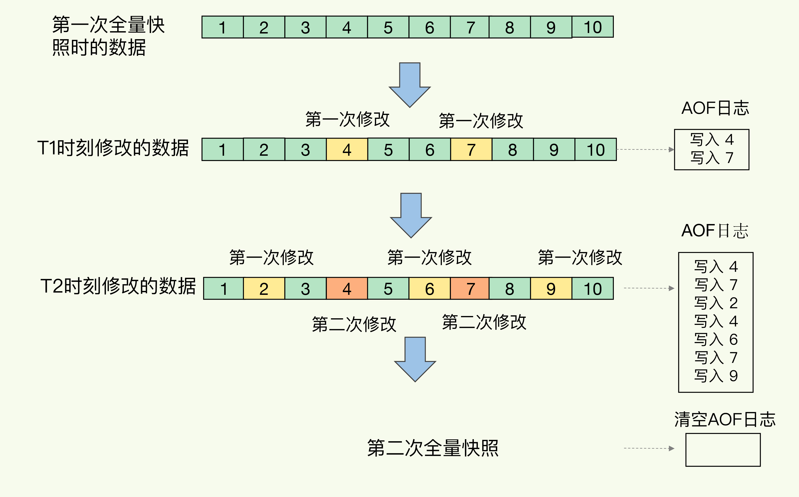

这个方法既能享受到 RDB 文件快速恢复的好处，又能享受到 AOF 只记录操作命令的简单优势, 实际环境中用的很多。


##  持久化的性能与实践

通过上面的分析，我们都知道RDB的快照、AOF的重写都需要fork，这是一个重量级操作，会对Redis造成阻塞。因此为了不影响Redis主进程响应，我们需要尽可能降低阻塞。

- 降低fork的频率，比如可以手动来触发RDB生成快照、与AOF重写；
- 控制Redis最大使用内存，防止fork耗时过长；
- 使用更牛逼的硬件；
- 合理配置Linux的内存分配策略，避免因为物理内存不足导致fork失败。

在线上我们到底该怎么做？我提供一些自己的实践经验。

- 如果Redis中的数据并不是特别敏感或者可以通过其它方式重写生成数据，可以关闭持久化，如果丢失数据可以通过其它途径补回；
- 自己制定策略定期检查Redis的情况，然后可以手动触发备份、重写数据；
- 单机如果部署多个实例，要防止多个机器同时运行持久化、重写操作，防止出现内存、CPU、IO资源竞争，让持久化变为串行；
- 可以加入主从机器，利用一台从机器进行备份处理，其它机器正常响应客户端的命令；
- RDB持久化与AOF持久化可以同时存在，配合使用。

# 六、Redis的高可用和高扩展

## Redis高可用-主从复制

**优点**

- **数据冗余**：主从复制实现了数据的热备份，是持久化之外的一种数据冗余方式。

- **故障恢复**：当主节点出现问题时，可以由从节点提供服务，实现快速的故障恢复；实际上是一种服务的冗余。

- **负载均衡**：在主从复制的基础上，配合读写分离，可以由主节点提供写服务，由从节点提供读服务（即写Redis数据时应用连接主节点，读Redis数据时应用连接从节点），分担服务器负载；尤其是在写少读多的场景下，通过多个从节点分担读负载，可以大大提高Redis服务器的并发量。

### 全量复制

从库启动进行配置：

```bash
replicaof 172.16.19.3 6379
```

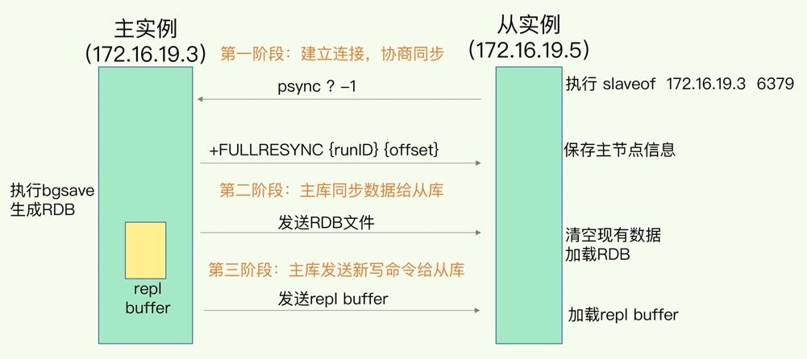

1. **建立连接，协商同步。**

   请求同步的时候会带上主库ID和复制进度偏移量offset

2. **主库同步当前数据给从库。**

   主库会fork子进程创建rdb文件，传输给从库，从库会清空自己，然后加载rdb。

3. **主库同步在步骤二期间的修改操作。**

   为了保证主从库的数据一致性，主库会在内存中用专门的 replication buffer，记录 RDB 文件生成后收到的所有写操作。

### 增量复制

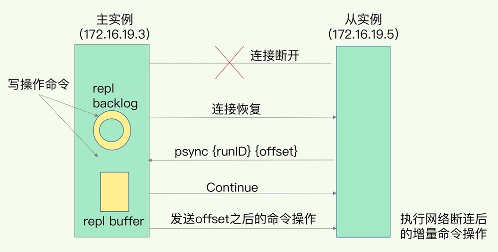

如果主从库在命令传播时出现了网络闪断，那么再将全量数据复制一遍的成本是很大的。所以Redis2.8之后提供了，网络断开后以增量复制的方式继续同步。

这里用到了一个repl_backlog_buffer的环形缓冲区。网络断连时，主库有写入命令时会继续向缓冲区中写入，当从库拿着offset来恢复同步的时候，主库会从rpel_backlog_buffer中找从库offset与主库写入位置的差值。然后通过repl_buffer同步给从库。

> **repl_backlog_buffer配置尽量大一些，可以降低主从断开后全量复制的概率**

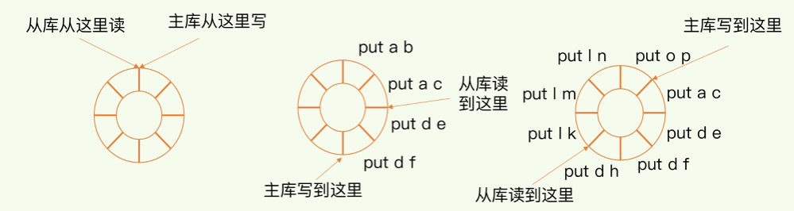

**repl_backlog_size环形缓冲区写满之后，从库会不会丢数据**？

断连时间过长，主库把repl_backlog_size环形缓冲区写满后还会继续覆盖写，此时从库和主库之间就会进行全量复制。

### **replication buffer和repl_backlog_buffer区别**

replication buffer 是主从库在进行数据复制时，主库上用于和从库连接的客户端的 buffer；而 repl_backlog_buffer 是为了支持从库增量复制，主库上用于持续保存写操作的一块专用 buffer。

Redis 主从库在进行复制时，当主库要把全量复制期间的写操作命令发给从库时，主库会先创建一个客户端，用来连接从库，然后通过这个客户端，把写操作命令发给从库。在内存中，主库上的客户端就会对应一个 buffer，这个 buffer 就被称为 replication buffer。Redis 通过 client_buffer 配置项来控制这个 buffer 的大小。主库会给每个从库建立一个客户端，所以 replication buffer 不是共享的，而是每个从库都有一个对应的客户端。

repl_backlog_buffer 是一块专用 buffer，在 Redis 服务器启动后，开始一直接收写操作命令，这是所有从库共享的。主库和从库会各自记录自己的复制进度，所以，不同的从库在进行恢复时，会把自己的复制进度（slave_repl_offset）发给主库，主库就可以和它独立同步。

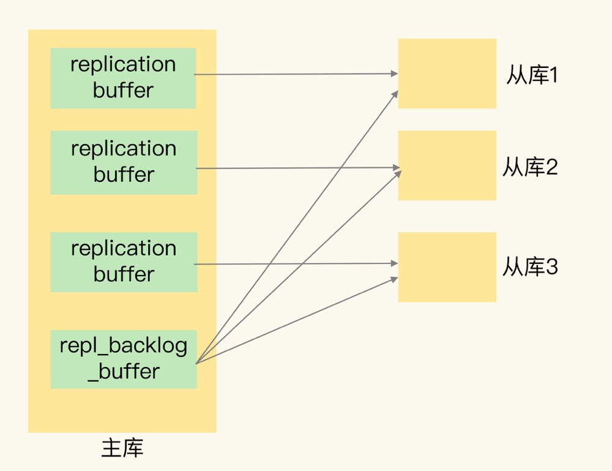

### **为什么主从复制不用aof，而使用rdb？**

1.RDB文件是二进制文件，无论是要把 RDB 写入磁盘，还是要通过网络传输 RDB, IO 效率都比记录和传输 AOF 的高。

2.在从库端进行恢复时，用 RDB 的恢复效率要高于用 AOF。

## Redis高可用-哨兵机制

监控

选主

通知

哨兵集群

## Redis高扩展-分片技术

## 常见问题

### 主从数据不一致

由于主从的命令复制是异步进行的，主库收到写命令后，会发送给从库，但不会等从库执行完才返回结果给客户端。主库保证自己执行完就返回了，这样从库还没来的急执行同步过来的命令，就有查询过来了，此时，主从库间的数据就不一致了。

造成的原因可能是：

1. 主从间网络传输延迟
2. 从库在执行其他复杂度高的命令

解决方式：

1. 硬件环境配置，尽量保证主从库间网络良好，避免部署在不同机房。
2. 开发外部程序监控主从复制进度，根据复制进度来决定要不要访问某些从节点。

### 在从库读到过期的数据

- 惰性删除是访问时删除，而定时删除删除量会比较少。

所以内存中还是会存在一些过期key但未被删除的情况，当读到从库的过期key的时候，从库本身不能删除key，所以会返回过期key的

数据（这个在3.2版本后会返回空值）

- 主从同步会存在短暂的延时

当全量同步时，主库收到了一条expire的命令，主库自己会立马执行，而从库要等到全量同步完成后，才会收到并执行该命令。这中间两次命令的执行存在间隔时间，这个间隔时间也是从库数据比主库晚过期的时间。

为了避免这种情况，可以在业务应用中使用EXPIREAT/PEXPIREAT命令，把数据的过期时间设置为具体的时间点，避免读到过期数据。设置时间点过期这个，还要保证主从机器的时间是一致的，具体的做法是让主从节点使用相同的NTP服务器（时间服务器）做时钟同步。

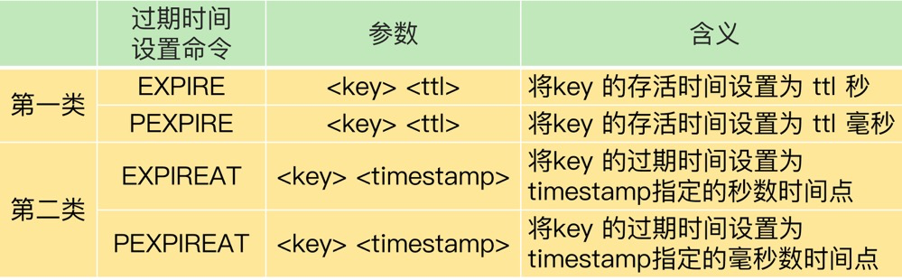


# 七、Redis实践分享

## Redis客户端常用操作命令

```bash
info #查看redis信息
info memory  #查看内存使用信息
object encofing [key] #查看参数key对应值的编码类型

```

scan cursor [macth] [count]这里的count是指扫描多少个槽

[scan不会重复扫描数据的原因](https://acuario.xyz/posts/redis-deep-adventure-scan/)

```bash
> scan 0 match a* count 5	//从0开始扫描所有类型的key，匹配a开头的，扫描5个槽位slot
2 //下次扫描游标开始的地方，只有返回0时才表示扫描完成，返回空集合可能是扫描的槽位没有数据
key11
key12
key10
key3
```

## Mac 常用命令

```basic
lsof -i:6379
COMMAND     PID           USER   FD   TYPE             DEVICE SIZE/OFF NODE NAME
redis-ser 16896 networkcavalry    6u  IPv4 0x7ac718a92813b969      0t0  TCP localhost:6379 (LISTEN)
redis-ser 16896 networkcavalry    7u  IPv6 0x7ac7189f8e920c91      0t0  TCP localhost:6379 (LISTEN)
redis-ser 16896 networkcavalry   10u  IPv4 0x7ac718a92914a969      0t0  TCP localhost:6379->localhost:51630 (ESTABLISHED)
redis-ser 19412 networkcavalry    9u  IPv4 0x7ac718a928130ea9      0t0  TCP localhost:51630->localhost:6379 (ESTABLISHED)
```


## 聚合运算

set、zset和bitmap 的聚会运算（差集、并集和交集）的计算复杂度较高，在数据量较大的情况下，如果直接执行这些计算，会导致 Redis 实例阻塞。所以建议：从主从集群中选择一个从库，让它专门负责聚合计算，或者是把数据读取到客户端，在客户端来完成聚合统计，这样就可以规避阻塞主库实例和其他从库实例的风险了。

如果是在集群模式使用多个 key 聚合计算的命令，一定要注意，因为这些 key 可能分布在不同的实例上，多个实例之间是无法做聚合运算的，这样操作可能会直接报错或者得到的结果是错误的。


**使用 Sorted Set 保存时序数据，把时间戳作为 score，把实际的数据作为 member，。有什么潜在的风险？**

我目前能想到的风险是，如果对某一个对象的时序数据记录很频繁的话，那么这个 key 很容易变成一个 bigkey，在 key 过期释放内存时可能引发阻塞风险。所以不能把这个对象的所有时序 数据存储在一个ky上，而是需要拆分存储，例如可以按天/周/月拆分（根据具体查询需求来定）。当然，拆分 key 的缺点是，在查询时，可能需要客户端查询多个 key 后再做聚合才能得到结果。

**如果你是 Redis 的开发维护者，你会把聚合计算也设计为 Sorted Set 的内在功能吗？**

不会。因为聚合计算是 CPU 密集型任务，Redis？在处理请求时是单线程的，也就是它在做聚合计算时无法利用到多核 CPU 来提升计算速度，如果计算量太大，这也会导致 Redis 的响应延迟变长，影响 Redis 的性能。Redis 的定位就是高性能的内存数据库，要求访问速度极快。所以对于时序数据的存储和聚合计算，我觉得更好的方式是交给时序数据库去做，时序数据库会针对这些存储和计算的场景做针对性优化。

另外，在使用 MULTI 和 EXEC 命令时，建议客户端使用 pipeline，当使用 pipelinel 时，客户端会把命令一次性批量发送给服务端，然后让服务端执行，这样可以减少客户端和服务端的来回网络 O 次数，提升访问性能。

## Redis实现消息队列

实现消息队列需要需要满足几个要求，

- 消息的有序性
- 重复消息的处理

- 保证消息的可靠性

### 基于List数据类型

**实现思路**

list的先进先出实现消息保序，使用BRPOP来阻塞没消息时候的读，减少CPU开销。

在发送端加上全局的消息ID，接收端比对接收的消息ID和已处理的消息ID，来判断消息有没有经过处理，确保消息幂等性。

通过BRPOPLPUSH命令，将接收到消息保存至另一个备份list，在接收消息后，将还未来得及处理的消息先保存起来，这样当机器宕机或处理消息故障的时候，重启后就可以从备份list读取未处理的消息了，处理成功后删除备份list的消息，以上方法可以保证消息可靠。

**存在问题**

消息堆积问题，消息堆积时会给Redis带来内存压力。

无法支持多个消费组。

### 基于Streams数据类型

Redis 5.0 开始提供Streams数据类型，它借鉴了Kafka的设计，是一个新的强大的支持多播的可持久化的消息队列

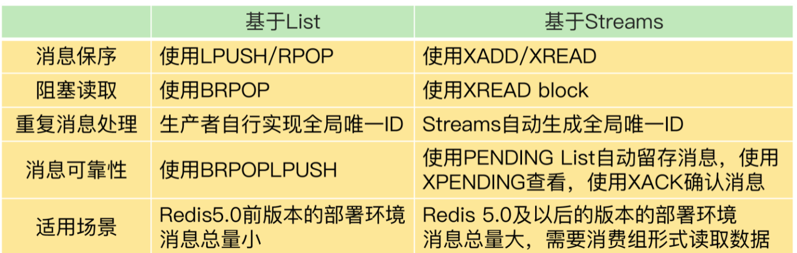

### 小结

- 在用 Redis 当作消息队列或存储数据时，是有可能丢失数据的：一个场景是，如果打开 AOF 并且是每秒写盘，因为这个写盘过程是异步的，Redis？宕机时会丢失 1 秒的数据。而如果 AOF 改为同步写盘，那么写入性能会下降。另一个场景是，如果采用主从集群，如果写入量比较大，从库同步存在延迟，此时进行主从切换，也存在丢失数据的可能（从库还未同步完成主库发来的数据就被提成主库）。总的来说，Redis 不保证严格的数据完整性和主从切换时的一致性。我们在使用 Redis 时需要注意。
- 而采用 RabbitMQ 和 kafka 这些专业的队列中间件时，就没有这个问题了。这些组件一般是部署一个集群，生产者在发布消息时，队列中间件一般会采用写多个节点+预写磁盘的方式保证消息的完整性，即便其中一个节点挂了，也能保证集群的数据不丢失。当然，为了做到这些，方案肯定比 Redis 设计的要复杂（毕竟是专们针对队列场景设计的）。

综上，Redis 可以用作队列，而且性能很高，部署维护也很轻量，但缺点是无法严格保数据的完整性（个人认为这就是业界有争议要不要使用 Redis 当作队列的地方）。而使用专业的队列中间件，可以严格保证数据的完整性，但缺点是，部署维护成本高，用起来比较重。

所以我们需要根据具体情况进行选择，如果对于丢数据不敏感的业务，例如发短信、发通知的场景，可以采用 Rdis 作队列。如果是金融相关的业务场景，例如交易、支付这类，建议还是使用专业的队列中间件。

# 八、Redis异步机制

## Redis发生阻塞的场景

分为四个大方面：

1. 分别是和客户端交互的阻塞点，包括全量查询和聚合操作、bigkey的删除 和 清空数据库
2. 和磁盘交互的阻塞点，包括AOF同步写回时可能存在问题
3. 主从节点交互的阻塞点，主从复制时会清空从库 和 加载大的RDB文件
4. 切片集群交互的阻塞点，Redis同步迁移时存在bigkey

### 集合全量查询和聚合操作

Rdis 中涉及集合的操作复杂度通常为 O (N），我们要在使用时重视起来。例如集合元素全量查询操作 HGETALL、SMEMBERS，以及集合的聚合统计操作，例如求交、并和差集。这些操作可以作为 Redis 的第一个阻塞点：集合全量查询和聚合操作。

### bigkey删除

[bigkey排查处理](https://juejin.cn/post/6884479174413811720)

删除操作的本质是要释放键值对占用的内存空间。你可不要小瞧内存的释放过程。释放内存只是第一步，为了更加高效地管理内存空间，在应用程序释放内存时，操作系统需要把释放掉的内存块插入一个空闲内存块的链表，以便后续进行管理和再分配。这个过程本身需要一定时间，而且会阻塞当前释放内存的应用程序，所以，如果一下子释放了大量内存，空闲内存块链表操作时间就会增加，相应地就会造成 Rdis 主线程的阻塞。

bigkey删除的耗时图：

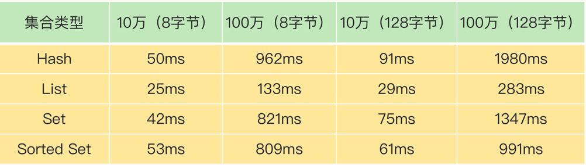

### 清空数据库

清空数据库涉及到删除和释放所有键值对，所以清空数据库的操作（ FLUSHDB 和 FLUSHALL操作）也会阻塞Redis。

### AOF日志同步写

Redis是基于内存的数据库，所以在进行磁盘IO时会带来阻塞。所以RDB生成快照文件和AOF重写都是基于子进程来完成的。

这样低速的磁盘IO就不会阻塞主进程，但是Redis在记录AOF文件的时候，会根据不同的写回策略进行刷盘。

可以由操作系统来控制写回，每秒写回和同步写回。在同步写回的情况下，有大量写操作进来的话就会阻塞主线程。

### **主从复制时清空从库** 

主从同步时，主库生成RDB文件，并且传输给从库，在创建和传输RDB文件，由fork出的子进程完成，不会阻塞。

但是从库接收RDB文件后，会执行FLUSHDB命令，清空当前数据库，这个涉及到删除和释放所有键值对，和前面的bigkey删除一样，也会阻塞Redis。

### 主从复制时加载大的RDB文件

从库清空后，还要加载RDB文件到从库内存，这个过程和RDB大小有关，加载过程中会阻塞从库Redis的主线程。

### 切片集群同步迁移bigkey

当部署 Redis 切片集群时，每个 Redis 实例上分配的哈希槽信息需要在不同实例间进行传递，同时，当需要进行负载均衡或者有实例增删时，数据会在不同的实例间进行迁移。不过，哈希槽的信息量不大，而数据迁移是渐进式执行的，所以，一般来说，这两类操作对 Redis 主线程的阻塞风险不大。

不过，在使用Redis Cluster方案，且迁移bigkey时会阻塞，因为Redis Cluster使用的是同步迁移。当没有bigkey时，同步迁移就不会有问题。

## 异步的子线程机制

尽管前面有五种场景可能发生阻塞，但实际上部分场景可以通过异步子线程机制来避免阻塞。

除了 **全量查询、聚合操作** 和 **从库加载RDB文件** 外，bigkey删除，清空数据库，AOF日志同步写都适用。

> AOF同步写这里存疑，同步写就是为了确保操作命令已经落盘，主线程交给异步线程去处理，默认是异步处理不会失败的。可能存在数据不一致的问题。

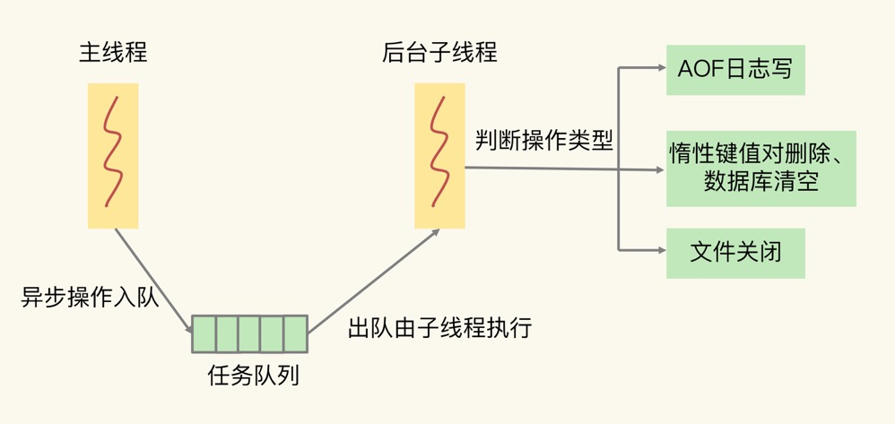

主线程接到请求后，将可以异步化的请求封装成一个任务，放到任务队列中，然后给客户端返回完成，实际可能还没执行。

只有当后台子线程从任务队列读取任务后，才开始删除键值对，并释放内存空间。因此这种异步删除也称为惰性删除。这样做的好处就是不会阻塞主线程。

### 惰性删除

http://hbprotoss.github.io/post/%E5%85%B3%E4%BA%8Eredis%E7%9A%84lazy-free/

惰性删除的相关细节点：

1、lazy-free 是 4.0 新增的功能，但是默认是关闭的，需要手动开启。

2、手动开启 lazy-free 时，有 4 个选项可以控制，分别对应不同场景下，要不要开启异步释放内存机制：

-  lazyfree-lazy-expire: key 在过期删除时尝试异步释放内存
-  lazyfree-lazy-eviction：内存达到 maxmemory：并设置了淘汰策略时尝试异步释放内存 
-  lazyfree-lazy-server--del: 执行RENAME/MOVE等命令或需要覆盖一个key 时，删除旧 key 尝试异步释放内存
-  replica-lazy-fush：主从全量同步，从库清空数据库时异步释放内存

3、即使开启了 lazy-free，如果直接使用 DEL 命令还是会同步删除 key，只有使用 UNLINK 命令才会可能异步删除 key。

4、这也是最关键的一点，上面提到开启 lazy-free 的场景，除了 replica-lazy-flush 之外，其他情况都只是 ***可能*** 去异步释放 key 的内存，并不是每次必定异步释放内存的。

**开启 lazy-free 后，Redis 在释放一个 key 的内存时，首先会评估代价，如果释放内存的代价很小，那么就直接在主线程中操作了，没必要放到异步线程中执行（不同线程传递数据也会有性能消耗）。**

**什么情况才会真正异步释放内存？**

这和 key 的类型、编码方式、元素数量都有关系（详细可参考源码中的 lazyfreeGetFreeEffort函数) ：

- 当Hash/Set底层采用哈希表存储（非ziplist/int编码存储）时，并且元素数量超过64 个
- 当 ZSet 底层采用跳表存储（非 ziplist 编码存储）时，并且元素数量超过 64 个
- 当 Lst 链表节点数量超过 64 个（注意，不是元素数量，而是链表节点的数量，List 的实现是在每个节点包含了若干个元素的数据，这些元素采用 ziplist 存储）

只有以上这些情况，在删除 key 释放内存时，才会真正放到异步线程中执行，其他情况一律还 是在主线程操作。

也就是说String(不管内存占用多大)、List（少量元素）、Set(int 编码存储）、Hash/ZSe t (ziplist 编码存储）这些情况下的 key 在释放内存时，依旧在主线程中操作。

可见，即使开启了 Iazy-free, String 类型的 bigkey，在删除时依旧有阻塞主线程的风险。所以，即便 Redis：提供了 lazy-free，我建议还是尽量不要在 Redis 中存储 bigkey。

个人理解 Redis 在设计评估释放内存的代价时，不是看 key 的内存占用有多少，而是关注释放内存时的工作量有多大。从上面分析基本能看出，如果需要释放的内存是连续的，Redis 作者认为释放内存的代价比较低，就放在主线程做。如果释放的内存不连续（大量指针类型的数据），这个代价就比较高，所以才会放在异步线程中去执行。

### 定期删除

这里把定期删除和惰性删除放在一起，方便区分。

**惰性删除**，数据过期时，不会立即删除，而是等有请求再来读写的时候，才会去检查和删除。这样减少删除操作对CPU的占用，但这样会有大量过期的数据停留在内存中，占用内存资源。所以在惰性删除时使用了定期删除。

**定期删除**，Redis每隔一段时间（默认100ms）会随机选出一些数据，检查是否过期。

# CPU对Redis的影响

[美团Redis 高负载下的中断优化](https://tech.meituan.com/2018/03/16/redis-high-concurrency-optimization.html)

## CPU 的 NUMA 架构对 Redis 性能的影响

在实际应用 Redis 时，我经常看到一种做法，为了提升 Redis 的网络性能，把操作系统的网络中断处理程序和 CPU 核绑定。这个做法可以避免网络中断处理程序在不同核上来回调度执行，的确能有效提升 Redis 的网络处理性能。

但是，网络中断程序是要和 Rdis 实例进行网络数据交互的，一旦把网络中断程序绑核后，

我们就需要注意 Redis 实例是绑在哪个核上了，这会关系到 Redis 访问网络数据的效率高

低。

我们先来看下 Redis 实例和网络中断程序的数据交互：网络中断处理程序从网卡硬件中读取数据，并把数据写入到操作系统内核维护的一块内存缓冲区。内核会通过 epoll机制触发事件，通知 Redis 实例，Redis 实例再把数据从内核的内存缓冲区拷贝到自己的内存空间，如下图所示：

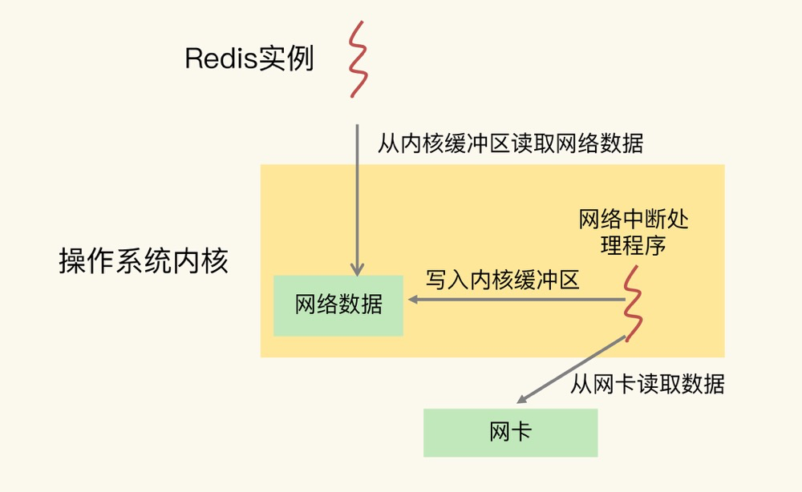

## NUMA架构CPU核编号规则

不过，需要注意的是，在 CPU 的 NUMA 架构下，对 CPU 核的编号规则，并不是先把一个 CPU Socket 中的所有逻辑核编完，再对下一个 CPU Socket 中的逻辑核编码，**而是先给每个 CPU Socket 中每个物理核的第一个逻辑核依次编号，再给每个 CPU Socket 中的物理核的第二个逻辑核依次编号**。

我给你举个例子。假设有 2 个 CPU Socket，。每个 Socket 上有 6 个物理核，每个物理核又有 2 个逻辑核，总共 24 个逻辑核。我们可以执行 Iscpu 命令，查看到这些核的编号：

Architecture: x86_64

NUMA node0 CPU (s):0-5,12-17

NUMA node1 CPU (s):6-11,18-23

可以看到，NUMA node0 的 CPU 核编号是 0 到 5、12 到 17。其中，0 到 5 是 node0 上的 6 个物理核中的第一个逻辑核的编号，12 到 17 是相应物理核中的第二个逻辑核编号。NUMA node1 的 CPU 核编号规则和 node0 一样。

# Redis缓冲区

Redis服务端会对每个连接的客户端分配一块缓冲区，主要有下面两种使用场景：

- 客户端和服务端之间的缓冲区使用

  在客户端和服务器端之间进行通信时，用来暂存客户端发送的命令数据，或者是服务器端返回给客户端的数据结果。

- 主从节点数据同步时的缓冲区使用

  主从节点间进行数据同步时，用来暂存主节点接收的写命令和数据。

## 客户端和服务端之间的缓冲区

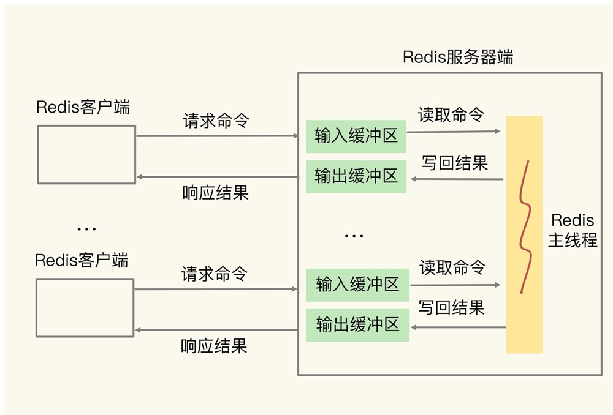

**输入缓冲区溢出：**

当瞬时写入量过大时，输入缓冲区可能会发生溢出。比如bigkey，或者百万级别的集合数据。

处理方法：Redis输入缓冲区的大小是固定的，每个客户端设定1GB的大小，所以我们只能避免让客户端写入bigkey

**输出缓冲区溢出：**

查询返回bigkey的大量结果、执行monitor命令、缓冲区设置不合理。都会导致输出缓冲区溢出。

monitor会持续输出检测到的各个命令操作。

处理方法：

- 避免 bigkey 操作返回大量数据结果。

- 避免在线上环境中持续使用 MONITOR 命令。

- 设置合理的缓冲区大小上限，或是缓冲区连续写入时间和写入量上限。

  ```bash
  client-output-buffer-limit pubsub 32mb 8mb 60 #输出缓冲区最大32mb，60s内写入超过8mb也会溢出
  ```

  

## 主从节点数据同步时的缓冲区

主从复制时，全量同步时，在主库的子进程生成和传输RDB文件时，依然会有命令进来，这些命令不会存在于之前生成的RDB文件中，所以需要进行一次额外的同步操作。这些需要二次同步的命令就存放在客户端缓冲区（复制缓冲区-replication_buffer）。

```bash
client-output-buffer-limit replica 256mb 64mb 60
```

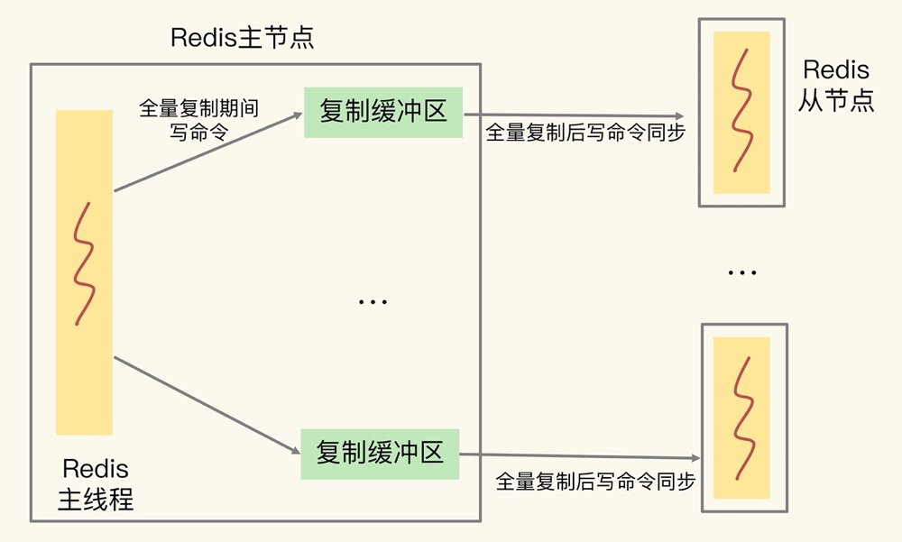

增量同步时，主库会将命令写入一个大小有限的环形缓冲区（rpli_backlog_buffer），并记录写入位置，从库恢复连接后，读取断连后的写入命令，进行增量同步。

环形缓冲区写满之后会覆盖旧数据，如果从库此时还没读取旧命令数据，那么会进行全量同步。

```bash
repl-backlog-size 1mb #可以设置环形缓冲区的大小，通常是replication_buffer的2倍
```

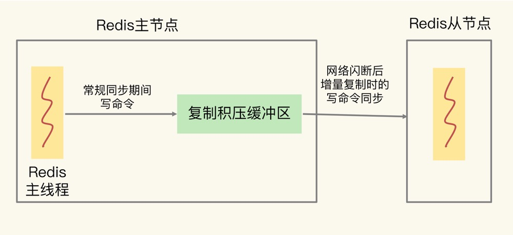

# Redis性能问题排查

1. 使用复杂度过高的命令或一次查询全量数据；

2. 操作 bigkey; 3. 大量 key 集中过期；4. 内存达到 maxmemory;

5. 客户端使用短连接和 Redis 相连；

6. 当 Redis 实例的数据量大时，无论是生成 RDB，还是 AOF 重写，都会导致 fork 耗时严

重；

7.AOF 的写回策略为 always，。导致每个操作都要同步刷回磁盘；

8. Redis 实例运行机器的内存不足，导致 sWap 发生，Redis 需要到 swap 分区读取数据；9. 进程绑定 CPU 不合理；
9. Redis 实例运行机器上开启了透明内存大页机制；
10. 网卡压力过大。

关于如何分析、排查、解决 Redis 变慢问题，我总结的 checklist：如下：

1、使用复杂度过高的命令（例如SORT/SUION/ZUNIONSTORE/KEYS),或一次查询全量数据（例如 LRANGE key0N，但 N 很大）

分析：a）查看 slowlog：是否存在这些命令 b) Redis 进程 CPU 使用率是否飙升（聚合运算命令导致）

解决：）不使用复杂度过高的命令，或用其他方式代替实现（放在客户端做）b）数据尽量分批查询（LRANGE key 0 N,建议N<=1O0,查询全量数据建议使用HSCAN/SSCAN/ZSCA N)

2、操作 oigkey

分析：a)slowlog出现很多SET/DELETE变慢命令(bigkey 分配内存和释放内存变慢）b）使用 redis-cli-h$host-p$port--bigkeys 扫描出很多 bigkey

解决：a）优化业务，避免存储 bigkey b) Redis4.0+可开启 lazy-free机制

3、大量key集中过期

分析：a)业务使用EXPIREAT/PEXPIREAT 命令 b)Redis info 中的 expired keys 指标短期突增

解决：a）优化业务，过期增加随机时间，把时间打散，减轻删除过期 ky 的压力 b）运维层面，监控 expired keys 指标，有短期突增及时报警排查

4、Redis 内存达到 maxmemory

分析：a）实例内存达到 maxmemory，且写入量大，淘汰 key 压力变大 b) Redis info 中的 evict ed_keys 指标短期突增

解决：a）业务层面，根据情况调整淘汰策略（随机比 LRU 快）b）运维层面，监控 evicted_ke ys 指标，有短期突增及时报警 c）集群扩容，多个实例减轻淘汰 key 的压力

5、大量短连接请求

分析：Redis：处理大量短连接请求，TCP 三次握手和四次挥手也会增加耗时

解决：使用长连接操作 Redis

6、生成 RDB 和 AOF 重写 fork 耗时严重

分析：a) Redis3 变慢只发生在生成 RDB 和 AOF 重写期间 b）实例占用内存越大，fok 拷贝内存页表越久 c) Redis info 中 latest_fork_usec 耗时变长

解决：a）实例尽量小 b) Redis）尽量部署在物理机上 c）优化备份策略（例如低峰期备份）d）合理配置 repl-backlog 和 slave client-. Output--buffer---limit，。避免主从全量同步 e）视情况考虑关闭 AOFf）监控 latest_fork_usec 耗时是否变长

7、AOF 使用 awalys 机制

分析：磁盘 O 负载变高

解决：a）使用 everysec 机制 b）丢失数据不敏感的业务不开启 AOF

8、使用 Swap

分析：a）所有请求全部开始变慢 b) slowlog：大量慢日志 c）查看 Redis 进程是否使用到了 Swap

解决：a）增加机器内存 b）集群扩容 c) Swap 使用时监控报警

9、进程绑定 CPU 不合理

分析：a) Redis？进程只绑定一个 CPU 逻辑核 b) NUMA 架构下，网络中断处理程序和 Redis 进程没有绑定在同一个 Socket 下

解决：a) Redis？进程绑定多个 CPU 逻辑核 b）网络中断处理程序和 Redis：进程绑定在同一个 Soc ket 下

10、开启透明大页机制

分析：生成 RDB 和 AOF 重写期间，主线程处理写请求耗时变长（拷贝内存副本耗时变长）

解决：关闭透明大页机制

11、网卡负载过高

分析：a)TCP/IP 层延迟变大，丢包重传变多b）是否存在流量过大的实例占满带宽

解决：）机器网络资源监控，负载过高及时报警 b）提前规划部署策略，访问量大的实例隔离部署

总之，Redis 的性能与 CPU、内存、网络、磁盘都息息相关，任何一处发生问题，都会影响到 Redis 的性能。

主要涉及到的包括业务使用层面和运维层面：业务人员需要了解 Rdis 基本的运行原理，使用合理的命令、规避 bigk 问题和集中过期问题。运维层面需要 DBA 提前规划好部署策略，预留足够的资源，同时做好监控，这样当发生问题时，能够及时发现并尽快处理。

# 慢查询排查

问题 1：如何使用慢查询日志和 latency monitor 排查执行慢的操作？

在第 18 讲中，我提到，可以使用 Redis 日志（慢查询日志）和 latency monitor 来排查执行较慢的命令操作，那么，我们该如何使用慢查询日志和 latency monitor 呢？

Redis 的慢查询日志记录了执行时间超过一定阈值的命令操作。当我们发现 Redis 响应变慢、请求延迟增加时，就可以在慢查询日志中进行查找，确定究竟是哪些命令执行时间很长。

在使用慢查询日志前，我们需要设置两个参数。

slowlog-log-slower. -than：这个参数表示，慢查询日志对执行时间大于多少微秒的命令进行记录。

·slowlog-max-len：这个参数表示，慢查询日志最多能记录多少条命令记录。慢查询日志

的底层实现是一个具有预定大小的先进先出队列，一旦记录的命令数量超过了队列长度，最先记录的命令操作就会被删除。这个值默认是 128。但是，如果慢查询命令较多的话，日志里就存不下了；如果这个值太大了，又会占用一定的内存空间。所以，一般建议设置为 1000 左右，这样既可以多记录些慢查询命令，方便排查，也可以避免内存开销。

设置好参数后，慢查询日志就会把执行时间超过 slowlog--log-slower. -than 阈值的命令操作记录在日志中。

我们可以使用 SLOWLOG GET 命令，来查看慢查询日志中记录的命令操作，例如，我们执行如下命令，可以查看最近的一条慢查询的日志信息。

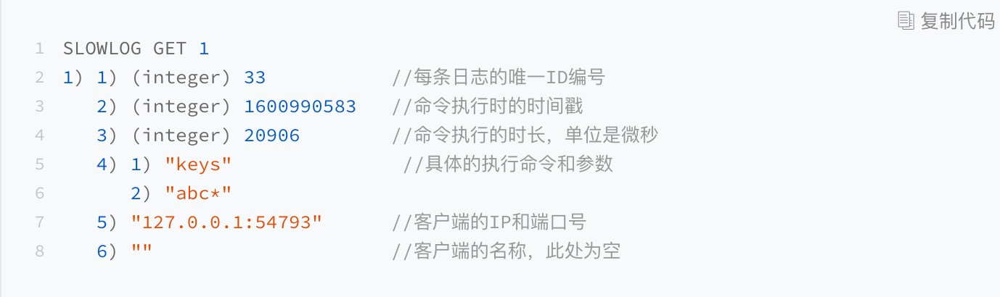

# Bigkey排查

# 旁路缓存

由代码程序控制来进行缓存的处理操作，对程序是有感知的，不像CPU里的缓存，程序是无感的。

具体可以分为**只读缓存**和**读写缓存**。

**只读缓存**，命中缓存时取缓存数据，未命中时，查询数据库，并更新缓存。有更新操作时，让缓存失效。

**读写缓存**，有写操作时，会同时写缓存和数据库，两种不同的写入数据库策略（同步写或者等缓存替换时写回数据库）。

也有类似的问题，应该先操作耗时的数据库操作。

**小结**

只读缓存，牺牲了一定性能来保证数据的一致性。读写缓存，则适用于缓存db一致性要求不高的场景，可以保证更好的性能。

# Redis缓存淘汰策略

4.0之前有6种策略，4.0之后又增加了2种策略（LFU的两种）。

在使用expire设置过期时间后，即使缓存没有被写满，只要数据过期了，也会被删除，无论哪种策略。

```bash
# redis_config中定义
# 1.使用类似LRU算法，删除设置过期时间的keys。类似是因为，同时考虑了数据的访问实效性和数据访问次数。
# volatile-lru -> Evict using approximated（近似的） LRU, only keys with an expire set.
# allkeys-lru -> Evict any key using approximated LRU.
# volatile-lfu -> Evict using approximated LFU, only keys with an expire set.
# allkeys-lfu -> Evict any key using approximated LFU.
# volatile-random -> Remove a random key having an expire set.
# allkeys-random -> Remove a random key, any key.
# 7.根据过期时间删除，越早过期的越先删除
# volatile-ttl -> Remove the key with the nearest expire time (minor TTL)
# 8.不进行数据淘汰，在写入操作时返回错误，默认的淘汰策略。
# noeviction -> Don't evict anything, just return an error on write operations. 
```

可以看出前缀时 volatile 的是在设置了过期时间的数据中进行淘汰，未设置的是在所有的keys中淘汰。

在allkeys的策略中，**如果一个键值对被删除策略选中了，即使它的过期时间还没到，也需要被删除。当然，如果它的过期时间到了但未被策略选中，同样也会被删除。**

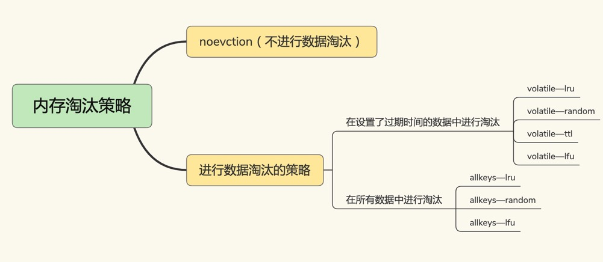

## Redis的LRU淘汰策略

**最近最少使用**

真正的LRU会维护一个所以数据的链表，把更新或者新增的数据移到链表的头部MRU，这样不被使用的数据就会靠近尾部LRU。当需要删除时，直接从尾部移除数据即可。这样会带来额外的空间开销。而且过多链表的节点移动也会损耗性能。

但是redis数据量比较大，维护这样一个链表不太现实。所以采取了一种近似LRU的算法。首先，我们要知道，RedisObject里有一个属性是用来记录最近一次访问的时间戳，当需要进行LRU缓存淘汰时，从Redis中选个N个数据作为候选数据集（取决于 maxmemory-samples 配置，默认5），比较这些数据的时间戳，将时间戳最小，也就是最老的数据删除，注意，**下次再淘汰数据时，能进入刚才剩下4个数据的候选集合的前置条件是，时间戳要小于候选集合中的最小lru值**。

这样的好处是不用维护大链表，也不用移动节点。

```bash
# LRU, LFU and minimal TTL algorithms are not precise algorithms but approximated
# algorithms (in order to save memory), so you can tune it for speed or
# accuracy. For default Redis will check five keys and pick the one that was
# used less recently, you can change the sample size using the following
# configuration directive.
#
# The default of 5 produces good enough results. 10 Approximates very closely
# true LRU but costs more CPU. 3 is faster but not very accurate.
#
# maxmemory-samples 5
```

## Redis的LFU淘汰策略

**最近不经常使用**

如果只看数据访问时间的话，LRU策略在处理扫描时的单次查询操作时，会把很多访问频次低的数据缓存起来，降低缓存整体的命中率。

LFU，是按照访问次数来排序的，把访问次数比较多的放到链表前端，后端则是访问次数少的。

Redis实现的类似LFU的策略结合了访问时间和访问次数，先按访问次数排序，相同次数的再按时间排序。

访问时间是RedisObject中的一个24bit的属性，如果是LRU的话，24位表示一个时间戳，如果是LFU的话，前16位表示时间，后8位表示次数。8位一共能表示0～255数字，多于255就没法判断次数多少，Redis这里有一个设计，当一次访问的时候，count并不会直接+1，而是有一个非线性的增长算法。同时还可以配置衰减因子，长时间不访问该key的话，count会相应的变小。

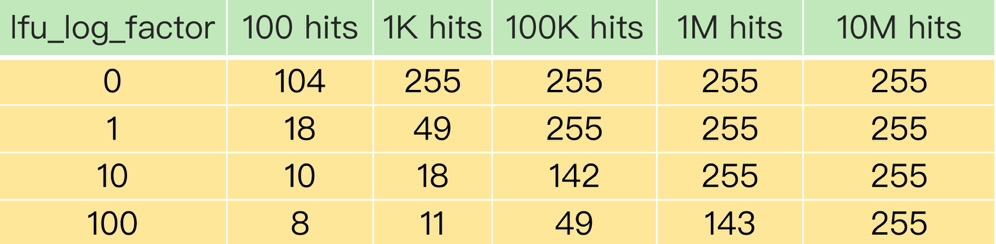


# 缓存常见问题

## 缓存和DB不一致

**先删缓存后更新DB**

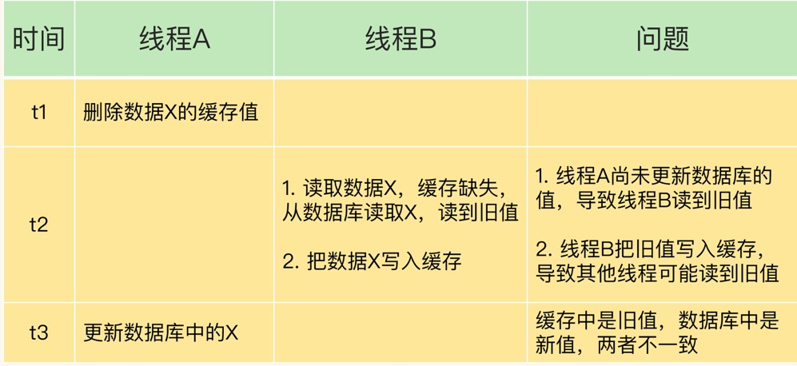

先删缓存，再更新DB（容易出现脏数据）。A线程删除缓存后，由于更新DB耗时，在此期间，有B线程查询请求没命中缓存，所以取数据库读到了一个A未更新完成的数据写入了缓存，等A更新完成后，数据库和缓存就不一致了。

解决办法：延时双删。更新完成后，等待一段时间，再进行一次删除操作，等待间隔取决于读取数据并写缓存的时间操作时间。

**先更新DB再删缓存**

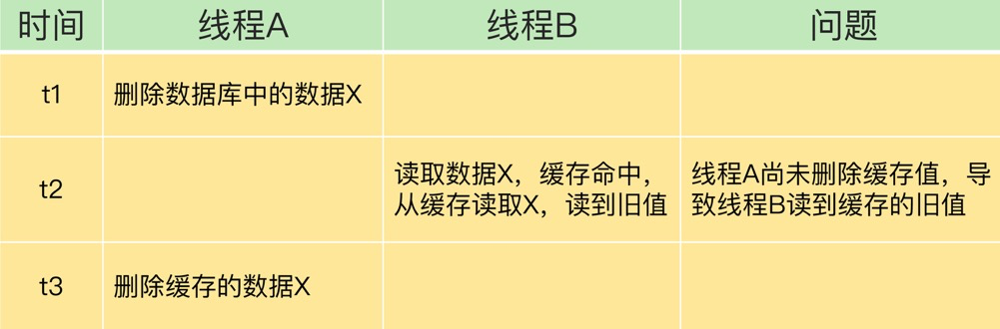

这里的删除数据X也可以等同为更新数据X。

最好先更新DB，再删缓存（风险小）。A进行读操作，未命中缓存，查询数据库后准备写入缓存前，B线程更新了DB，并删除了缓存。此时A线程拿了一个老数据写入了缓存，缓存DB不一致。但这种场景出现的几率比较小，因为从查出旧数据到写入缓存之前到时间远远小于更新DB的时间。

**小结**

只读缓存的这种数据不一致情况，建议结合具体使用场景来看。

延时双删，如果删除了热key，那么可能存在缓存击穿的问题，大量请求会打到数据库上。而且延时的这个时间不好把控。

先更新再删，则会有短暂的数据不一致情况。

## 缓存雪崩

**触发场景一**：缓存集中失效，导致数据库查询量巨大

**解决办法**

- 在缓存过期时间上进行分散，加上随机过期时间

- 服务降级

  当业务应用访问的是非核心数据（例如电商商品属性）时，暂时停止从缓存中查询这些数据，而是直接返回预定义信息、空值或是错误信息；

  当业务应用访问的是核心数据（例如电商商品库存）时，仍然允许查询缓存，如果缓存缺失，也可以继续通过数据库读取。


**触发场景二**：Redis发生故障宕机或者缓存服务不可用

**解决办法**

- 服务熔断，快速返回错误信息 或者请求限流，减小数据库压力
- 构建高可用集群，主从集群+哨兵，发生宕机时快速切换，继续提供缓存服务。

## 缓存击穿

热点key过期后，针对某个热点key频繁的访问，无法在缓存中处理，流量打到数据库。

设置热点数据永远不过期。

如果缓存数据库是分布式部署，将热点数据均匀分布在不同搞得缓存数据库中。

## 缓存穿透

触发场景一：业务误操作，或者业务刚上线

触发场景二：恶意攻击

**解决方案：**

- 缓存空值或者缺省值，比如查不到就缓存一个空值，或者缺省值（例如库存的缺省值可以设为0）
- 使用布隆过滤器，快速判断数据是否存在，避免从数据库中查询，减轻数据库压力

## 服务熔断、服务降级、请求限流的理解

服务熔断、服务降级、请求限流的方法不太合适应对缓存穿透的场景。

因为缓存穿透的场景实质上是因为查询到了 Redis 和数据库中没有的数据。

而熔断、降级、限流，本质上是为了解决 Redis 实例没有起到缓存层作用这种情况；在损失业务吞吐量的代价下，在时间的作用下，随着过期 key 慢慢填充，Redis 实例可以自行恢复缓存层作用。

而缓存穿透的场景，是因为用户要让 Redis 和数据库提供一个它没有的东西。这种场景下，如果没有人工介入，不论时间过去多久，都不太可能会自然恢复。采用这种有损业务吞吐量的行为，会拖慢系统响应、降低用户体验、给公司一种系统“勉强能用”的错觉；但对问题的解决没有帮助。最好的办法是事前拦截，降低这种类型的请求打到系统上的可能。布隆过滤器虽然判别数据存在可能有误判的情况，判别数据不存在不会误判。


# Lua脚本

建议先使用 SCRIPT LOAD 命令把 lua 脚本加载到 Redis 中，然后得到一个脚本唯一摘要值，再通过 EVALSHA 命令+脚本摘要值来执行脚本，这样可以避免每次发送脚本内容到 Redis，减少网络开销。

Redis 2.6开始，可以使用Lua脚本原子化的执行多个命令，这主要涉及到eval、evalsha 和script这几个命令。
Redis脚本本身就是事务性的，原子化的执行并且不受其它命令干扰，使用Redis脚本取代Redis事务会更加简单快速。当前Redis脚本执行期间也是阻塞性的，这与Redis事务在调用EXEC执行命令期间阻塞其它请求并无二致。

# 分布式锁

这里老师漏了一点 就是session timeout处理 在分布式锁的场景中就是：
一个key过期了 但是代码还没处理完 此时就发生了重复加锁的问题。

通常我们有两种方式处理：
\1. 设置看门狗 也就是redision的处理方式
\2. 设置状态机 由最后的业务层来做代码回溯

简单总结，基于 Redis 使用分布锁的注意点：

1、使用 SET \$lock_key \$unique_val EX $second NX 命令保证加锁原子性，并为锁设置过期时间

2、锁的过期时间要提前评估好，要大于操作共享资源的时间

3、每个线程加锁时设置随机值，释放锁时判断是否和加锁设置的值一致，防止自己的锁被别人释放

4、释放锁时使用 Lua 脚本，保证操作的原子性

5、基于多个节点的 Redlock，加锁时超过半数节点操作成功，并且获取锁的耗时没有超过锁的有效时间才算加锁成功

6、Redlock 释放锁时，要对所有节点释放（即使某个节点加锁失败了），因为加锁时可能发生服务端加锁成功，由于网络问题，给客户端回复网络包失败的情况，所以需要把所有节点可能存的锁都释放掉

7、使用 Redlock 时要避免机器时钟发生跳跃，需要运维来保证，对运维有一定要求，否则可能会导致 Redlock 失效。例如共 3 个节点，线程 A 操作 2 个节点加锁成功，但其中 1 个节点机器时钟发生跳跃，锁提前过期，线程 B 正好在另外 2 个节点也加锁成功，此时 Redlock 相当于失效了（Redis 作者和分布式系统专家争论的重要点就在这）

8、如果为了效率，使用基于单个 Redis 节点的分布式锁即可，此方案缺点是允许锁偶尔失效，优点是简单效率高

9、如果是为了正确性，业务对于结果要求非常严格，建议使用 Redlock，但缺点是使用比较重，部署成本高

# Redis事务

通过 multi 和 exec 来完成Redis的事务操作。

在使用multi开启事务后，发送给reids服务端端命令会被暂存到命令队列里，等到执行exec命令的时候，才会具体执行发送的命令。

Redis的事务没有提供回滚机制，只提供了放弃事务执行的命令——discard

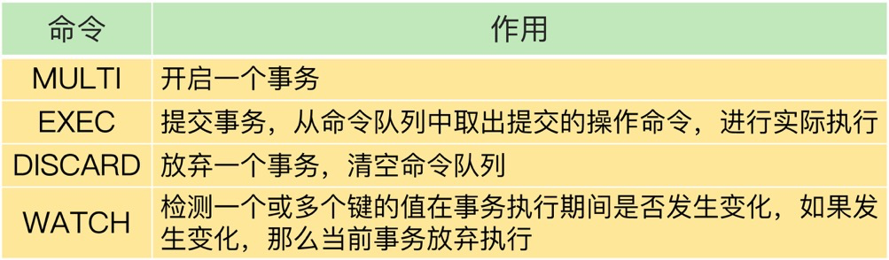

MULTI、EXEC、DISCARD和WATCH命令构成了Redis事务的基础。
MULTI用于开启一个事务，事务中的所有命令不会执行，而是被被缓冲在服务端队列中。
EXEC用于执行事务中所有的命令，在调用EXEC期间，其它连接的请求将被阻塞，直到所有命令执行完成后退出事务。
DISCARD用于刷新当前事务队列并退出事务。
WATCH用于监视指定key在调用EXEC之前是否被修改，同时WATCH命令也可以被多次调用，只要存在一次修改，事务就会终止，EXEC命令将返回Null，通知事务失败。

和关系型数据库不同，Redis不支持回滚，即便其中一个命令执行失败了，也不会影响事务中其它命令继续执行。
Redis事务的主要意义在于两点：
（1）隔离性
事务中的所有命令作为一个独立单元执行，在执行期间确保其它请求写入操作不会执行；

（2）原子性  事务中的所有命令要么全部执行，要么都不执行。这里全部执行包含一个或多个命令执行成功或者执行失败。如果客户端在调用EXEC前失去了与服务端的连接，则不会执行任何操作，反之则会执行所有操作。

# Redis Pipeline（管道）

Redis Pipeline主要用于批量发送命令，一次性发送多个请求，一次性读取所有返回结果。可以节省连接->发送命令->返回结果这个过程所产生的时间（RTT），减少read()和write()的系统调用（从用户态到内核态之间的切换）次数。其中从客户端发送命令到服务端，到服务端返回响应到客户端这个过程需要的时间叫往返时间（RTT），即便我们通常会将Redis服务置于内网中，也只是节省了建立网络连接的时间，RTT也并不会减少。

使用Pipeline，即便客户端还没有读取之前请求的响应，它也能够处理新的请求，这样就可以在不等待响应的情况下向服务端发送多个命令。这主要是由于客户端将会使用本地内存队列对所有通过Pipeling发送的命令进行排队。由于会有一定的内存占用，官方建议单个批次最多10k个命令，包含大量命令时最好分批次发送，速度和单次发送几乎相同，但会极大减少本地内存占用。

另外通过Pipeline批量执行命令时，不会阻塞其它客户端的读写操作，这主要是由于Redis采用了多路I/O复用模型（非阻塞IO）。


# Redis事务、Pipeline区别

以上将Redis事务、Redis Pipeline、Redis脚本放在一起单独做了说明，表面上它们可以作为批量执行命令的方式，但实际也有许多区别。

Redis脚本可以看作是Redis事务的另类表现形式（不完全相同），这里仅比较Redis事务和Redis Pipeline即可。
（1）命令缓冲队列方式不同
Redis事务包含的命令是缓冲在服务端内存队列，而Redis Pipeline则是缓冲在客户端本地内存中；

（2）请求次数不同
Redis事务中每个命令都需要发送到服务端，而Pipeline只需要发送一次，请求次数更少；

（3）原子性保证。
Redis事务可以保证命令原子化执行，而Pipeline不保证原子性。

当然如果使用的是Redis脚本，它既包含了事务特性，也无需发送多次请求到服务端。

最后也要说明的是，Redis事务、Pipeline都只能作用于单个节点。集群环境下，执行Redis命令时，会根据key计算出一个槽位（slot）,然后根据槽位重定向到特定的节点上执行操作。批量执行命令的操作可能会使用到多个Redis节点，即多个连接，目前还无法支持。

# Reids 大Key 排查处理

https://blog.csdn.net/qq_63815371/article/details/137602525

# 其他

## [动态链接库](https://zhuanlan.zhihu.com/p/130871341)


## Redis为什么是单线程的

**Redis 基于 Reactor 模式来设计开发了自己的一套高效的事件处理模型** （Netty 的线程模型也基于 Reactor 模式，Reactor 模式不愧是高性能 IO 的基石），这套事件处理模型对应的是 Redis 中的文件事件处理器（file event handler）。由于文件事件处理器（file event handler）是单线程方式运行的，所以我们一般都说 Redis 是单线程模型。

**既然是单线程，那怎么监听大量的客户端连接呢？**

Redis 通过**IO 多路复用程序** 来监听来自客户端的大量连接（或者说是监听多个 socket），它会将感兴趣的事件及类型（读、写）注册到内核中并监听每个事件是否发生。

这样的好处非常明显： **I/O 多路复用技术的使用让 Redis 不需要额外创建多余的线程来监听客户端的大量连接，降低了资源的消耗**（和 NIO 中的 `Selector` 组件很像）。

另外， Redis 服务器是一个事件驱动程序，服务器需要处理两类事件：1. 文件事件; 2. 时间事件。

时间事件不需要多花时间了解，我们接触最多的还是 **文件事件**（客户端进行读取写入等操作，涉及一系列网络通信）。

《Redis 设计与实现》有一段话是如是介绍文件事件的，我觉得写得挺不错。

> Redis 基于 Reactor 模式开发了自己的网络事件处理器：这个处理器被称为文件事件处理器（file event handler）。文件事件处理器使用 I/O 多路复用（multiplexing）程序来同时监听多个套接字，并根据套接字目前执行的任务来为套接字关联不同的事件处理器。
>
> 当被监听的套接字准备好执行连接应答（accept）、读取（read）、写入（write）、关 闭（close）等操作时，与操作相对应的文件事件就会产生，这时文件事件处理器就会调用套接字之前关联好的事件处理器来处理这些事件。
>
> **虽然文件事件处理器以单线程方式运行，但通过使用 I/O 多路复用程序来监听多个套接字**，文件事件处理器既实现了高性能的网络通信模型，又可以很好地与 Redis 服务器中其他同样以单线程方式运行的模块进行对接，这保持了 Redis 内部单线程设计的简单性。

可以看出，文件事件处理器（file event handler）主要是包含 4 个部分：

- 多个 socket（客户端连接）
- IO 多路复用程序（支持多个客户端连接的关键）
- 文件事件分派器（将 socket 关联到相应的事件处理器）
- 事件处理器（连接应答处理器、命令请求处理器、命令回复处理器）

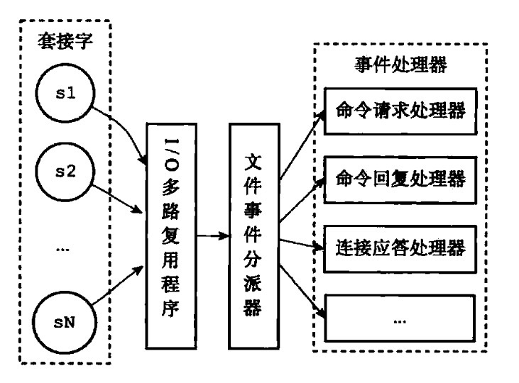

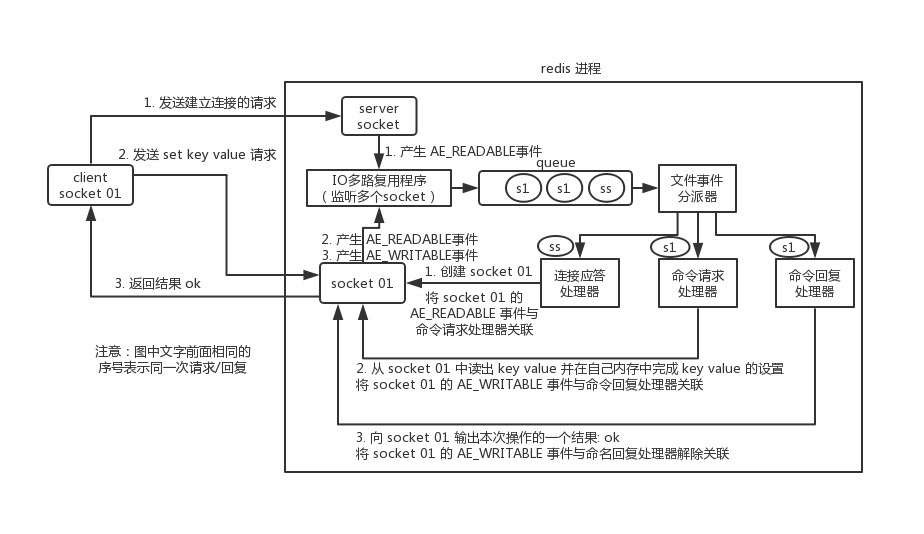
