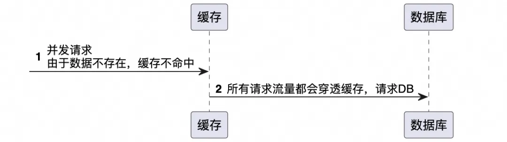
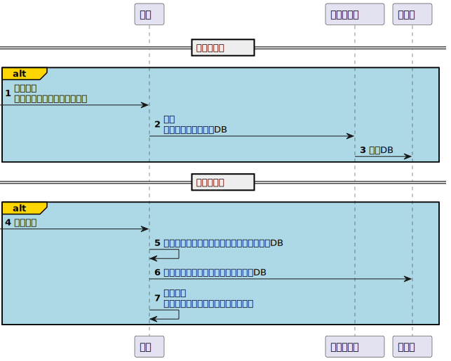
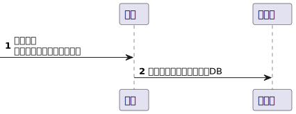
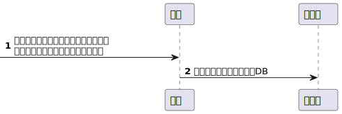

# [原文连接](https://mp.weixin.qq.com/s/6-TAG8s5tgefs-5Qdt4tzQ) 

# 相关八股文

## 缓存穿透、缓存击穿、缓存雪崩

缓存穿透、缓存击穿和缓存雪崩都是缓存系统中可能遇到的问题，特别是在高并发的场景下更容易出现。了解它们之间的区别，能帮助我们更好地设计和维护缓存系统，保持系统的稳定性和性能。

### 缓存穿透

**定义**

缓存穿透是指查询一个数据库中不存在的数据，由于缓存不命中（因为数据根本就不存在），请求便会穿过缓存，直接请求数据库。如果有大量此类请求，数据库压力会突然增大，严重时可能会拖垮数据库。

**应对策略**

1. 布隆过滤器：在缓存之前使用布隆过滤器，一种空间效率高的数据结构，用来检测一个元素是否在一个集合中。如果布隆过滤器说不存在，那么就直接返回，不再查询数据库。
2. 缓存空结果：如果查不到数据，也将这个“空”结果缓存起来，并设置一个合理的过期时间。

### 缓存击穿

**定义**

缓存击穿指一个热点key在缓存中有效期过期的瞬间，大量请求同时涌入数据库去查询这个数据，因为缓存过期这些请求不能被缓存拦截，直接请求到数据库，导致数据库瞬间压力过大。

**应对策略**

1. 设置热点数据永远不过期：这要求系统能准确判断哪些是热点数据。
2. 加锁或队列：当热点key过期时，不是所有请求都去数据库查询，而是让某一个请求去数据库查询并更新缓存，其他请求等待缓存更新后再访问缓存。

### 缓存雪崩

**定义**

缓存雪崩是指在某一个时间段内，大量的缓存键集中过期失效，导致所有的请求都落到数据库上，造成数据库瞬间压力过大可能到达崩溃的状态。

**应对策略**

1. 缓存数据的过期时间设置为随机，防止很多缓存同时过期。
2. 使用高可用的缓存架构，即使缓存服务出现问题，也能通过备份机制快速恢复。
3. 设置热点数据静态化，即把访问量较大的数据做静态化处理，减少数据库的访问。

## 数据一致性问题

数据一致性问题是指当数据在多个地方（如缓存和数据库）存储时，这些地方的数据可能会出现不一致的情况。这种不一致可能是由于缓存更新滞后、系统故障或其他原因引起的。数据一致性是分布式系统设计中的一项挑战，尤其是在读写非常频繁的系统中。

数据一致性问题

当数据被更新时，如果缓存中的相应数据没有立即更新，那么缓存系统将向应用程序提供旧数据。这会导致应用程序得到不一致的结果，影响用户体验和数据的准确性。

实时强一致性和最终一致性

在分布式系统中，数据一致性是一个核心问题。根据系统的设计与需求，可以选择实时强一致性(Strong Consistency)或最终一致性(Eventual Consistency)。

### 实时强一致性

**定义：**实时强一致性保证了任何时刻，所有的客户端看到的数据都是一样的。在分布式系统中实现强一致性意味着，一个操作一旦完成，所有的客户端立即都能看到这个操作的结果。

**适用场景：**事务性强、对数据一致性要求高的系统，如银行系统或任何财务系统。

**保障策略：**

1. 三阶段提交（3PC）等分布式事务协议：在分布式系统中保证操作要么全部成功，要么全部失败。
2. 分布式锁：通过在操作前获取全局锁，保证同一时刻只有一个操作可以修改数据，从而保障数据一致性。
3. 强一致性算法：如Paxos或Raft算法，通过一系列严格的消息传递和确认机制，确保分布式系统中的多个副本能够达到一致状态。

### 最终一致性

**定义：**最终一致性是指，系统会保证在没有新的更新操作的情况下，经过足够的时间后，数据将达到一致的状态。在这种模型下，数据的副本之间可能会暂时存在不一致。

**适用场景：**对实时性要求不高，可以容忍短时间内数据不一致的场景，如社交网络、推荐系统等。

**保障策略：**

1. 异步复制：当数据更新发生时，首先更新主副本，然后异步地将更新同步到其他副本。
2. 读取修复（Read Repair）：在读取数据的时候检测副本之间的不一致，并在后台异步修复不一致的数据。
3. 后台一致性修复进程：定期在后台运行的进程检查和同步数据副本之间的差异，以达到最终一致性。
4. 版本控制：每次更新数据时附加一个时间戳或版本号，用于解决更新冲突和保持数据的最终一致性。

## 常见缓存更新/失效策略与一致性解决方案

### 缓存更新策略

- Write through cache（直写缓存）：首先将数据写入缓存，然后立即将新的缓存数据复制到数据库。这种方式可以保证写操作的一致性，但可能会影响写操作的性能。
- Write back cache（写回缓存）：数据首先写入缓存，然后由缓存异步写入数据库。这种方式可以提高写操作的性能，但增加了数据丢失的风险。
- Write around cache（饶写缓存）：绕过缓存，直接写数据库，然后依据需要更新缓存或使缓存失效。这适用于更频繁读取操作的场景。

### 缓存失效策略

- 主动更新：当数据库数据变化时，主动更新缓存中的数据。这可以保持缓存数据的实时性，但可能会增加系统的复杂性。
- 定时失效：为缓存数据设置一个过期时间。定期从数据库中重新加载数据，以保持数据的新鲜度。但这无法解决数据在两次加载之间变化导致的一致性问题。
- 惰性加载：只有在请求特定数据且发现缓存失效或缓存中没有该数据时，才去数据库加载该数据。这种策略简单，但在高并发场景下可能会导致缓存击穿。

### 使用缓存一致性协议

- 基于订阅的更新：使用消息队列（如Kafka，RabbitMQ）来发布数据库更新，然后相关服务订阅这些更新消息来同步更新缓存。
- 最终一致性：采用最终一致性模型，允许系统在一段时间内是不一致的，但保证经过足够的时间后，系统中的所有复制数据最终将达到一致的状态。

分布式缓存系统

使用如Redis Cluster、Apache Ignite、Tair等分布式缓存系统，这些系统内置了处理缓存一致性的机制，（但是无法解决缓存和数据库之间的数据一致性问题）。

# Push中心原方案简介

为了使各应用职责及整体的架构设计更加清晰，Push中心整体将后台配置端和前台投放端分别部署在了两个应用中，两个应用需要分别配置数据库连接，分别配置缓存。

## 投放端

投放端对于投放计划pushPlan，只有查询流量，没有增删改。

由于投放端qps较高，为减少数据库压力，必须使用缓存。同时，为了避免缓存击穿和缓存穿透，我们用本地缓存和tair组成了二级缓存，并使用定时任务定时将数据库中的数据刷新到tair。

（注：不了解tair的话，可以简单理解为和redis类似）

## 配置端

配置端会增删改pushPlan。

' fill='%23FFFFFF'%3E%3Crect x='249' y='126' width='1' height='1'%3E%3C/rect%3E%3C/g%3E%3C/g%3E%3C/svg%3E)

## 问题描述

梳理到这里，其实很容易发现潜在的不一致性问题：

1. tair和数据库不一致
2. 投放端的本地缓存和Tair缓存不一致
3. 投放端和配置端都用到了Tair缓存，需要是同一个，且key的拼写规则要保持一致
4. 配置端采用的缓存一致性方案是：“修改前删缓存，查询后刷新”，删除后会导致投放端的缓存也被删除

本次的问题便出现在第4点：一旦数据在配置端被修改，那么在投放端本地缓存过期后，定时任务刷新tair前，查询出来的数据便是null，导致异常。

' fill='%23FFFFFF'%3E%3Crect x='249' y='126' width='1' height='1'%3E%3C/rect%3E%3C/g%3E%3C/g%3E%3C/svg%3E)

至于前3点，此前的方案为：

1. 配置端通过“修改前删缓存，查询后刷新”解决，投放端使用定时任务刷新
2. 减少本地缓存过期时间（本地缓存主要是避免缓存穿透和缓存击穿，过期时间可以设置地比较短，业务上可以接受短暂的不一致性）
3. 谜题就在谜面上

# 排查过程

上面的梳理应该还是蛮清晰的，很容易定位到问题所在，但实际上在发现报错之后排查还是有些艰难的。

一开始我甚至有些怀疑是因为本地缓存和tair的代码写法有问题，但看代码一直没看出来问题。最终还是通过日志查到的，因为报错日志十分地有规律：每5分钟有一波报错...

让我突然想到配置端有个定时任务每5分钟执行一次，刷新pushPlan的执行进度等信息。

' fill='%23FFFFFF'%3E%3Crect x='249' y='126' width='1' height='1'%3E%3C/rect%3E%3C/g%3E%3C/g%3E%3C/svg%3E)

由于配置端每次更新是先删缓存，再写数据库，此时在投放端定时任务刷新tair之前，查询缓存便是null。

' fill='%23FFFFFF'%3E%3Crect x='249' y='126' width='1' height='1'%3E%3C/rect%3E%3C/g%3E%3C/g%3E%3C/svg%3E)

# 解决方案

定位到问题，解决方案就比较简单明了。

## 方案一：修改配置端

比如，双写方案：写完数据库后刷新缓存（第5步）

这是最直接的解决方案，既然之前删缓存不行，那就不删除，而是直接刷新缓存。刷新缓存后，配置端从数据库中取出的数据便为最新的数据。

' fill='%23FFFFFF'%3E%3Crect x='249' y='126' width='1' height='1'%3E%3C/rect%3E%3C/g%3E%3C/g%3E%3C/svg%3E)

此处涉及到一个先刷新数据库，还是先刷新缓存之类的问题，这里简单列一下各方案及优缺点：

| **方案**                         | **特点**                                                     |
| -------------------------------- | ------------------------------------------------------------ |
| 先更新数据库，再更新缓存         | **优点**：**一致性更强**：如果数据库更新成功，而缓存更新失败，可以通过重试机制解决，或者直接让缓存过期，保证了最终一致性。**减少数据不一致的窗口期**：因为更新缓存的操作通常比更新数据库快得多，所以更新完数据库后马上更新缓存，可以尽快保持它们之间的一致性。**缺点**：**更新窗口期中的读操作可能导致脏读**：如果在更新数据库后、更新缓存前有新的读请求，这时会读到旧的缓存数据。 |
| 先更新缓存，再更新数据库         | **优点**：**减少了脏读的可能**：因为缓存是最先被更新的，读请求总是能读到最新的数据。**缺点**：**一致性问题更为复杂**：如果缓存更新成功，但是数据库更新失败，这会导致缓存和数据库之间出现长期的不一致状态，解决这种不一致状态需要额外的回滚操作，增加了系统的复杂性。**需要处理回滚操作**：如上所述，更新缓存成功而数据库更新失败时，需要有一套策略来回滚已经更新的缓存，确保数据一致性。 |
| 先删缓存，再更新数据库（原方案） | 这种策略是指在更新数据之前，首先删除缓存中的数据，然后再更新数据库。**优点**：简单直接，逻辑清晰。**缺点**：可能导致窗口期一致性问题。在删除成功和数据库更新期间，如果有读操作发生，将会读取到旧的数据并且可能回填到缓存中，导致数据库与缓存数据不一致。 |
| 延时双删策略                     | 延时双删涉及三个步骤：先删除缓存、更新数据库，然后过一段时间后再次删除缓存。**优点**：相对于“先删缓存，再更新数据库”策略，这种方法可以减少由于缓存窗口期造成的不一致概率。延迟第二次删除可以覆盖到那些在数据库更新过程中请求旧缓存的读操作，从而阻止这些操作将旧数据回填到缓存。**缺点**：增加了系统的复杂度，需要合适的机制来定时执行第二次删除操作。第二次删除的延迟时间不易确定，太短可能无效，太长则可能导致长时间的数据不一致。 |

## 方案二：修改投放端（存在问题）

tair未命中时，主动查数据库刷新tair（第3步）

该方案存在一个问题，但也可以帮助理解并发场景下的数据一致性问题，所以便也留在这里了。

由于配置端和投放端分成了两部分，可能存在一种并发情况：配置端删除缓存后，投放端此时查询缓存并刷新到了缓存中，假如配置端未刷新缓存，会导致缓存失效前取到的数据是旧值，存在数据不一致问题。

# 结语

数据一致性问题是我们在工程实践中经常遇到的一种问题，了解常见的解决方案，可以帮助我们有效解决该问题，更好地满足业务诉求。

**本文讲了那么多，到底哪种方案更好呢？是不是强一致性就是最优解？**

其实不存在绝对的“哪种方案更好”，只有最适合当前系统特性和业务需求的方案。理想的选择是，基于具体应用场景和对数据一致性要求的严格程度，采用能够平衡性能和一致性需求的更新策略，并通过合理设计来降低数据不一致的风险。

有些业务中必须尽量做到强一致性，但很多业务中往往也能容忍一定的不一致性。强一致性未必好，最终一致性也未必不好。强一致性往往会提高系统的复杂度、降低系统性能。综合考虑系统性能、系统复杂度、业务对数据一致性的容忍度等诸多因素，选择适合自己的方案才是最优解。

