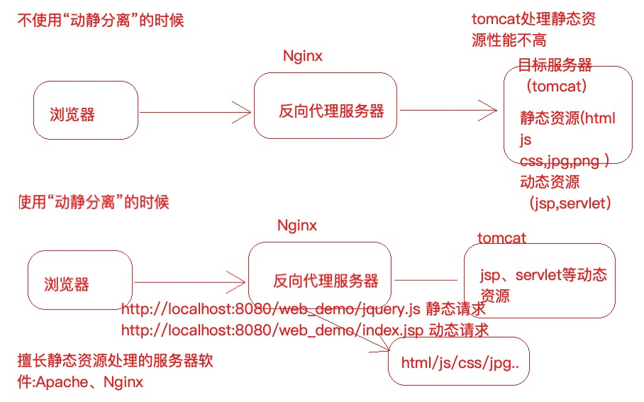
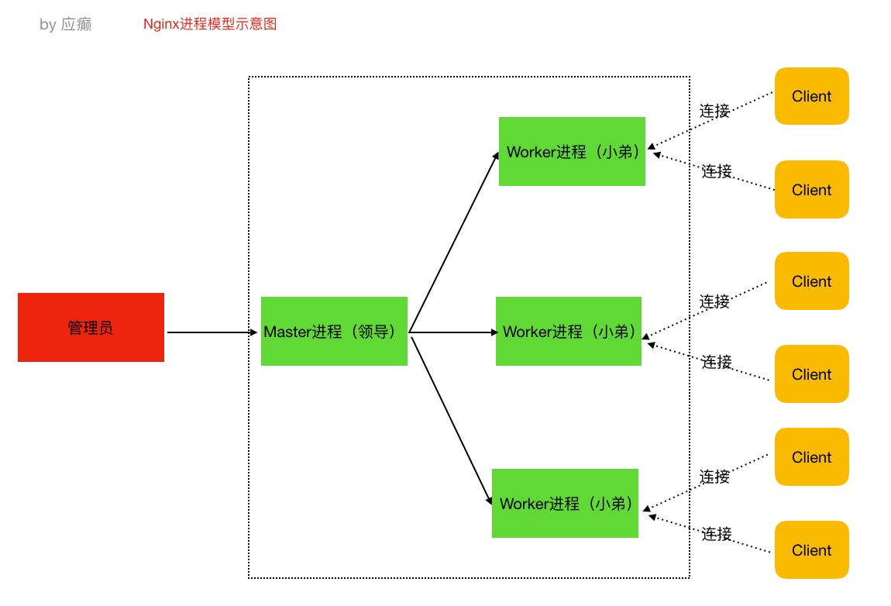
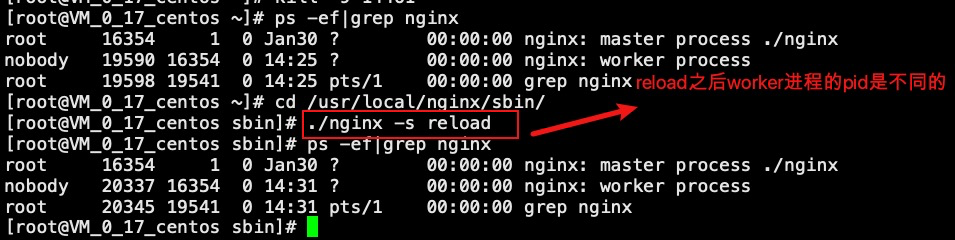

# [Nginx介绍](https://nginx.org/en/docs/beginners_guide.html)

## Nginx是什么

Nginx 是⼀个⾼性能的HTTP和反向代理web服务器，核⼼特点是占有内存少，并发能⼒强 

## Nginx能做什么

- Http服务器（Web服务器） 
- 性能⾮常⾼，⾮常注重效率，能够经受⾼负载的考验（⽀持50000个并发连接数，不仅如此，CPU和内存的占⽤也⾮常的低，10000个没有活动的连接才占⽤2.5M的内存）
- 反向代理服务器
- 负载均衡服务器

## Nginx的特点

-  跨平台：Nginx可以在⼤多数类unix操作系统上编译运⾏，⽽且也有windows版本 
- Nginx的上⼿⾮常容易，配置也⽐较简单 
- ⾼并发，性能好 
- 稳定性也特别好，宕机概率很低

# Nginx使用场景

## 正向代理

源服务器 通过 代理服务器 来访问 目标服务器。

正向代理是对客户端进行代理，可以让服务器端不知道真正的客户端是谁。比如我们通过正向代理去访问外网。

我们在浏览器中配置代理服务器的相关信息，通过代理服务器访问⽬标⽹站，代理服务器收 到⽬标⽹站的响应之后，会把响应信息返回给我们⾃⼰的浏览器客户端。

## 反向代理

目标服务器 通过 代理服务器 来对 源服务器 提供服务。

反向代理是对服务端进行代理，让客户端不知道真正提供服务的是哪台机器。比如大型网站的应用服务集群不会对外暴露，而对外暴露的是反向代理服务器。

浏览器客户端发送请求到反向代理服务器（⽐如Nginx），由反向代理服务器选择原始 服务器提供服务获取结果响应，最终再返回给客户端浏览器。

## 负载均衡服务器

负载均衡，当进行反向代理的时候，如果⽬标服务器有多台（⽐如上 图中的tomcat1，tomcat2，tomcat3...），找哪⼀个⽬标服务器来处理当前请求呢，这样⼀ 个寻找确定的过程就叫做负载均衡。

⽣活中也有很多这样的例⼦，⽐如，我们去银⾏，可以处理业务的窗⼝有多个，那么我们会 被分配到哪个窗⼝呢到底，这样的⼀个过程就叫做负载均衡。

## 动静分离

浏览器加载的页面数据中，包含动态数据和静态数据。动态数据是根据请求参数经过后端服务处理返回的数据，静态数据或者说是静态资源可以直接返回。



## Nginx常用操作

```shell
./nginx 启动nginx 

./nginx -s stop 终⽌nginx（当然也可以找到nginx进程号，然后使⽤kill -9 杀掉nginx进程） 
  
./nginx -s reload (重新加载nginx.conf配置⽂件)
```

## Nginx 配置详解

```sh
#可以查看nginx版本和启动参数，包含了日志的路径
nginx -V 
```

Nginx的核⼼配置⽂件conf/nginx.conf包含三块内容：全局块、events块、http块

- 全局块

```sh
#user  nobody;
worker_processes  1;

#error_log  logs/error.log;
#error_log  logs/error.log  notice;
#error_log  logs/error.log  info;

#pid        logs/nginx.pid;
```

从配置⽂件开始到events块之间的内容，此处的配置影响nginx服务器整体的运⾏，⽐如worker进 程的数量、错误⽇志的位置等。

- events块

```sh
events {
    worker_connections  1024;
}

```

events块主要影响nginx服务器与⽤户的⽹络连接，⽐如worker_connections 1024，标识每个 workderprocess⽀持的最⼤连接数为1024。

- http块

http块是配置最频繁的部分，虚拟主机的配置，监听端⼝的配置，请求转发、反向代理、负载均衡 等

```sh
http {
    include       mime.types;
    default_type  application/octet-stream;
		# 日志格式
    #log_format  main  '$remote_addr - $remote_user [$time_local] "$request" '
    #                  '$status $body_bytes_sent "$http_referer" '
    #                  '"$http_user_agent" "$http_x_forwarded_for"';

    #access_log  logs/access.log  main;

    sendfile        on; 
    #tcp_nopush     on;

    #keepalive_timeout  0;  连接超时时间
    keepalive_timeout  65;

		# 开启gzip压缩 https://juejin.cn/post/6844903661575880717
    #gzip  on;

    server {
        listen       8080;
        server_name  localhost;

        #charset koi8-r;

        #access_log  logs/host.access.log  main;

        location / {
            root   html;
            index  index.html index.htm;
        }

        #error_page  404              /404.html;

        # redirect server error pages to the static page /50x.html
        #
        error_page   500 502 503 504  /50x.html;
        location = /50x.html {
            root   html;
        }

        # proxy the PHP scripts to Apache listening on 127.0.0.1:80
        #
        #location ~ \.php$ {
        #    proxy_pass   http://127.0.0.1;
        #}

        # pass the PHP scripts to FastCGI server listening on 127.0.0.1:9000
        #
        #location ~ \.php$ {
        #    root           html;
        #    fastcgi_pass   127.0.0.1:9000;
        #    fastcgi_index  index.php;
        #    fastcgi_param  SCRIPT_FILENAME  /scripts$fastcgi_script_name;
        #    include        fastcgi_params;
        #}

        # deny access to .htaccess files, if Apache's document root
        # concurs with nginx's one
        #
        #location ~ /\.ht {
        #    deny  all;
        #}
    }


    # another virtual host using mix of IP-, name-, and port-based configuration
    #
    #server {
    #    listen       8000;
    #    listen       somename:8080;
    #    server_name  somename  alias  another.alias;

    #    location / {
    #        root   html;
    #        index  index.html index.htm;
    #    }
    #}


    # HTTPS server
    #
    #server {
    #    listen       443 ssl;
    #    server_name  localhost;

    #    ssl_certificate      cert.pem;
    #    ssl_certificate_key  cert.key;

    #    ssl_session_cache    shared:SSL:1m;
    #    ssl_session_timeout  5m;

    #    ssl_ciphers  HIGH:!aNULL:!MD5;
    #    ssl_prefer_server_ciphers  on;

    #    location / {
    #        root   html;
    #        index  index.html index.htm;
    #    }
    #}
    include servers/*;
}
```


## Nginx 的进程模型

Nginx启动后，以daemon多进程⽅式在后台运⾏，包括⼀个Master进程和多个Worker进程，Master 进程是领导，是⽼⼤，Worker进程是⼲活的⼩弟。


**master进程**

主要是管理worker进程，⽐如：

- 接收外界信号向各worker进程发送信号(./nginx -s reload)
- 监控worker进程的运⾏状态，当worker进程异常退出后Master进程会⾃动重新启动新的 worker进程等 

**worker进程**

 worker进程具体处理⽹络请求。多个worker进程之间是对等的，他们同等竞争来⾃客户端的请 求，各进程互相之间是独⽴的。⼀个请求，只可能在⼀个worker进程中处理，⼀个worker进程， 不可能处理其它进程的请求。worker进程的个数是可以设置的，⼀般设置与机器cpu核数⼀致。



**以 ./nginx -s reload 来说明nginx信号处理这部分** 

1. master进程对配置⽂件进⾏语法检查 
2. 尝试配置（⽐如修改了监听端⼝，那就尝试分配新的监听端⼝） 
3. 尝试成功则使⽤新的配置，新建worker进程 
4. 新建成功，给旧的worker进程发送关闭消息 
5. 旧的worker进程收到信号会继续服务，直到把当前进程接收到的请求处理完毕后关闭 所以reload之后worker进程pid是发⽣了变化的



**worker进程处理请求部分的说明**

 例如，我们监听9003端⼝，⼀个请求到来时，如果有多个worker进程，那么每个worker进程都有 可能处理这个链接。

 master进程创建之后，会建⽴好需要监听的的socket，然后从master进程再fork出多个 worker进程。所以，所有worker进程的监听描述符listenfd在新连接到来时都变得可读。 

nginx使⽤互斥锁来保证只有⼀个workder进程能够处理请求，拿到互斥锁的那个进程注册 listen fd读事件，在读事件⾥调⽤accept接受该连接，然后解析、处理、返回客户端 

**nginx多进程模型好处**

每个worker进程都是独⽴的，不需要加锁，节省开销 每个worker进程都是独⽴的，互不影响，⼀个异常结束，其他的照样能提供服务 多进程模型为reload热部署机制提供了⽀撑


