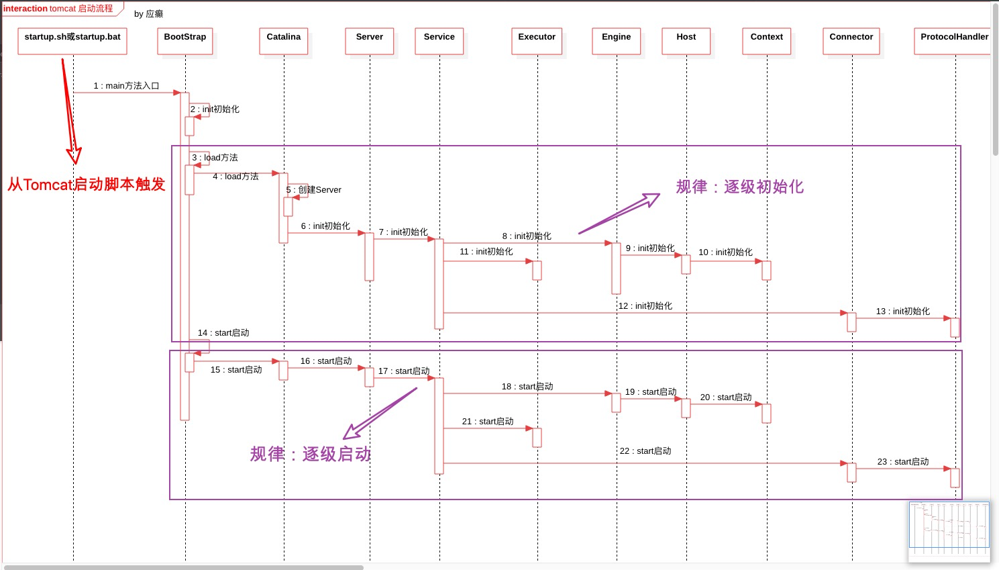
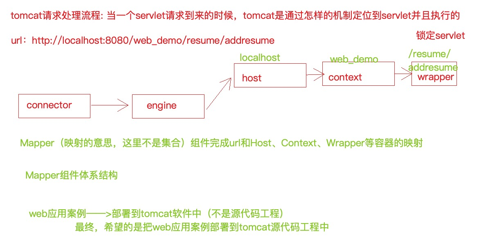
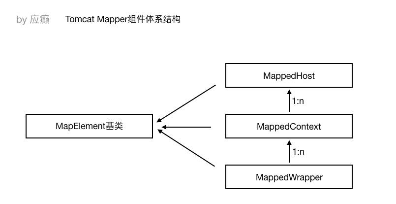
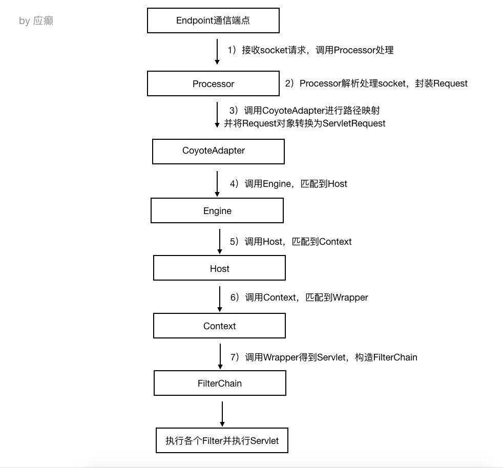
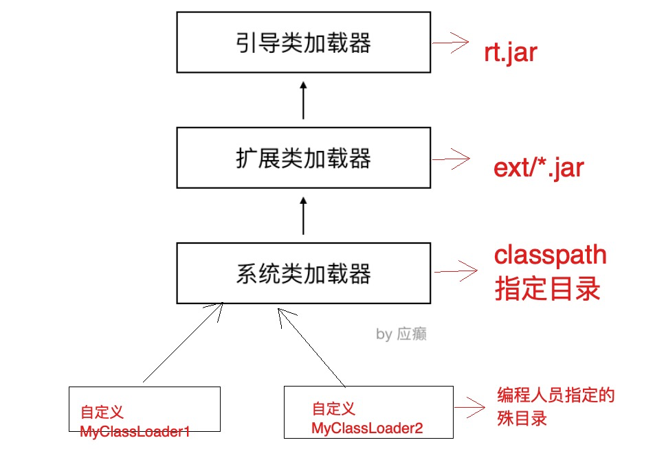
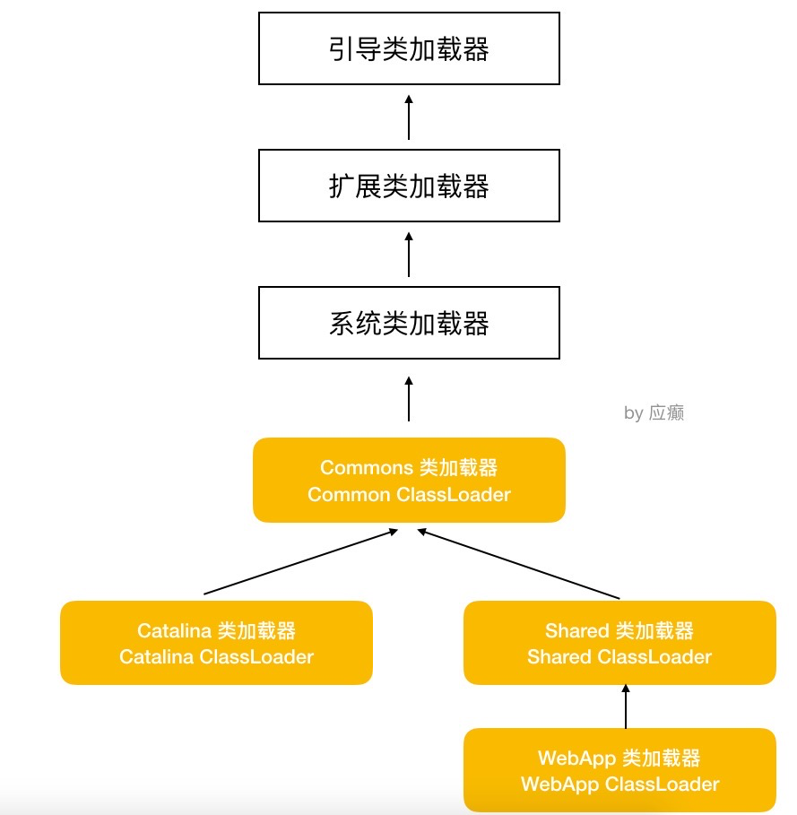

## 启动流程解析

## 请求处理过程解析

### 请求处理流程分析

### Mapper组件体系结构

### 请求处理流程示意图

## 双亲委派加载机制

| 类加载器                                      | 作⽤                                                         |
| --------------------------------------------- | ------------------------------------------------------------ |
| 引导启动类加载器 BootstrapClassLoader         | c++编写，加载java核⼼库 java.*,⽐如rt.jar中的类，构 造ExtClassLoader和AppClassLoader |
| 扩展类加载器 ExtClassLoader                   | java编写，加载扩展库 JAVA_HOME/lib/ext⽬录下的jar 中的类，如classpath中的jre ，javax.*或者java.ext.dir 指定位置中的类 |
| 系统类加载器 SystemClassLoader/AppClassLoader | 默认的类加载器，搜索环境变量 classpath 中指明的路径          |

⽤户可以⾃定义类加载器（Java编写，⽤户⾃定义的类加载器，可加载指定路径的 class ⽂件）

当 JVM 运⾏过程中，⽤户⾃定义了类加载器去加载某些类时，也会根据⽗类委托机制，按照下⾯的步骤进行加载：

-  ⽤户⾃⼰的类加载器，把加载请求传给⽗加载器，⽗加载器再传给其⽗加载器，⼀直到加载器 树的顶层
- 最顶层的类加载器⾸先针对其特定的位置加载，如果加载不到就转交给⼦类
- 如果⼀直到底层的类加载都没有加载到，那么就会抛出异常 ClassNotFoundException 　 

因此，按照这个过程可以想到，如果同样在 classpath 指定的⽬录中和⾃⼰⼯作⽬录中存放相同的 class，会优先加载 classpath ⽬录中的⽂件

## 双亲委派加载机制的作用

- 防⽌重复加载同⼀个.class。通过委托去向上⾯问⼀问，加载过了，就不⽤再加载⼀遍。保证数据安全。

- 保证核⼼.class不能被篡改。通过委托⽅式，不会去篡改核⼼.class，即使篡改也不会去加载，即使 加载也不会是同⼀个.class对象了。不同的加载器加载同⼀个.class也不是同⼀个.class对象。这样 保证了class执⾏安全（如果⼦类加载器先加载，那么我们可以写⼀些与java.lang包中基础类同名 的类， 然后再定义⼀个⼦类加载器，这样整个应⽤使⽤的基础类就都变成我们⾃⼰定义的类了。 ）

## Tomcat打破双亲委派机制

由于tomcat需要对外部app进加载和部署。注意，这里是由tomcat的程序去加载和解析app的war包。如果不同app依赖同一个类的不同版本，那么传统的双亲委派机制是无法实现的。因为默认的类加载器在加载前会去判断该类是否已经被加载，所以全限定名相同但版本不同的同一个类只会加载一次，无法同时满足两个app，所以tomcat需要打破这种类加载机制。

- 引导类加载器 和 扩展类加载器 的作⽤不变

- 系统类加载器正常情况下加载的是 CLASSPATH 下的类，但是 Tomcat 的启动脚本并未使⽤该变 量，⽽是加载tomcat启动的类，⽐如bootstrap.jar，通常在catalina.bat或者catalina.sh中指定。 位于CATALINA_HOME/bin下

- Common 通⽤类加载器加载Tomcat使⽤以及应⽤通⽤的⼀些类，位于CATALINA_HOME/lib下， ⽐如servlet-api.jar

- Catalina ClassLoader ⽤于加载服务器内部可⻅类，这些类应⽤程序不能访问

- Shared ClassLoader ⽤于加载应⽤程序共享类，这些类服务器不会依赖

- Webapp ClassLoader，每个应⽤程序都会有⼀个独⼀⽆⼆的Webapp ClassLoader，他⽤来加载 本应⽤程序 /WEB-INF/classes 和 /WEB-INF/lib 下的类

**tomcat 8.5 默认改变了严格的双亲委派机制，其加载顺序如下：**

1. ⾸先从 Bootstrap Classloader加载指定的类 （保证基础的类不会受影响）
2. 如果未加载到，则由应用自己的WebApp 类加载器从 /WEB-INF/classes加载 
3. 如果未加载到，则应用自己的WebApp 类加载器从 /WEB-INF/lib/*.jar 加载 
4. 如果未加载到，则依次从 System、Common、Shared 加载（在这最后⼀步，遵从双亲委派 机制）

第2步和第3步就是打破严格双亲委派机制的体现。