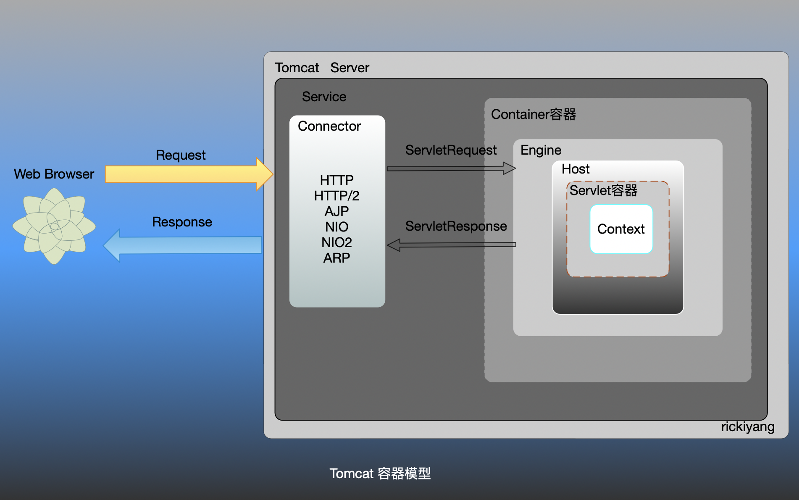
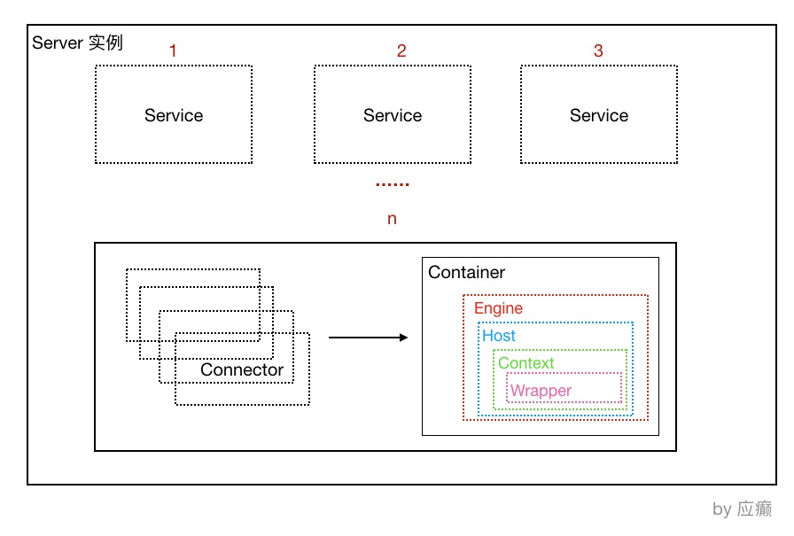
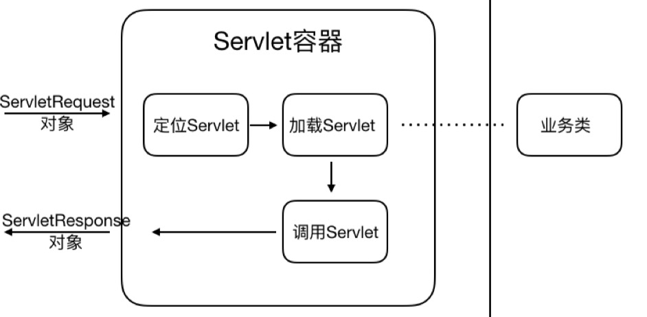
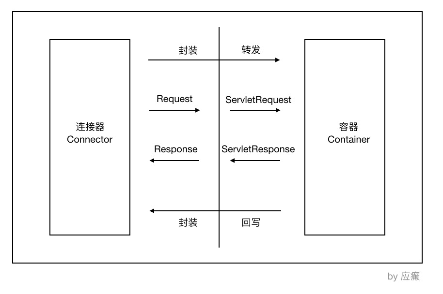
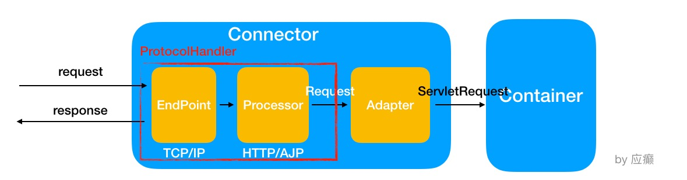
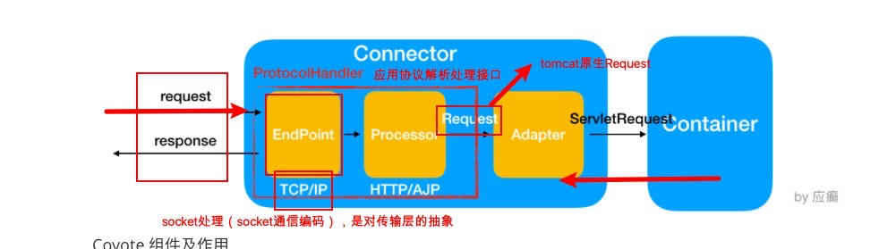
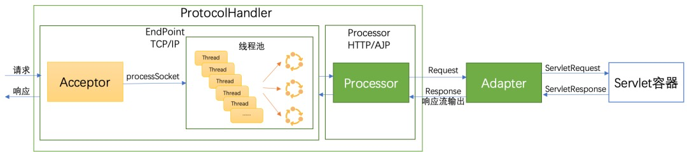
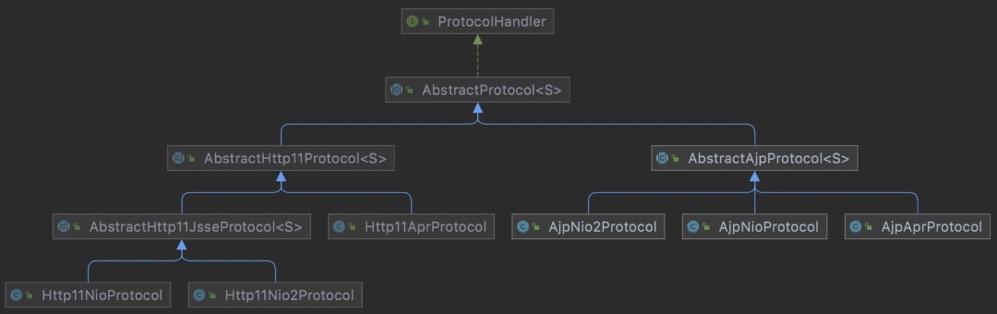
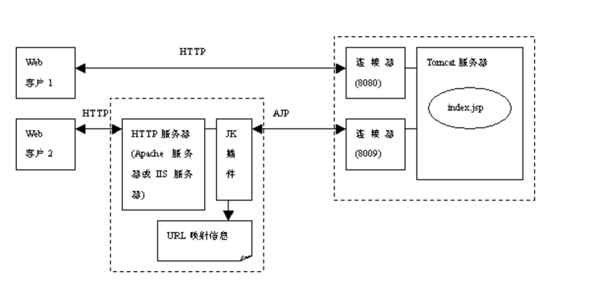

####  对Web服务的理解

web服务提供，客户端和服务器交换数据。例如使用 Java 的 Socket 套接字进行编程，去处理客户端来的 tcp 请求，经过编解码处理读取请求体，获取请求行，然后找到请求行对应的处理器进行处理，处理完毕把对应的结果返回给当前的 Socket 链接，响应完毕，关闭 Socket。

以上过程，你有没有发现其实是两个部分：

1. 建立连接，传输数据，关闭连接，你肯定知道这些步骤不是你所开发的web服务去处理的，而是tomcat容器帮你做了这些事情。
2. 处理请求的逻辑就是servlet。

#### Web服务器和应用服务器

Web服务器主要是为提供[静态内容](#静态内容与动态内容)而设计的。不限于HTTP，它还可以提供其他协议支持，如RMI / RPC。Web服务包括 Apache和Nginx等。不过大多数Web服务器都有插件来支持脚本语言，比如Perl、PHP、ASP、JSP等，通过这些插件，这些服务器就可以生成动态的HTTP内容。

应用服务器，如 WebLogic，JBoss。应用服务器一般也支持HTTP协议，因此界限没这么清晰。所以在大多数时候，Web服务器和引用服务器这两个术语是可以互换使用的。但是应用服务器的HTTP协议部分仅仅是支持，一般不会做特别优化，所以很少有见Tomcat直接暴露给外面，而是和Nginx、Apache等配合，只让Tomcat处理JSP和Servlet部分。

由于web服务器非常适合用于提供静态内容，而应用服务器适合提供动态内容，因此大多数生产环境都有web服务器充当应用服务器的反向代理，如Nginx。这意味着在页面请求时，web服务器会通过提供静态内容(例如图像/静态HTML)来解释请求，并且它还会使用某种过滤技术(主要是请求资源的扩展)识别动态内容请求，并透明地转发到应用服务器。

此外，应用服务器有组件和特性来支持应用级服务，如连接池、[对象池](https://www.zhihu.com/search?q=对象池&search_source=Entity&hybrid_search_source=Entity&hybrid_search_extra={"sourceType"%3A"answer"%2C"sourceId"%3A226652400})、事务支持、消息服务等。

我们平常通过springBoot启动的web应用，其实内置了tomcat应用服务器，对外可以提供http协议的服务，也可以提供grpc服务或者dubbo服务。

## 应用服务容器结构



Java web 应用如果部署到 Tomcat 中，一台机器可以包含多个 Service 服务（也就是启动多个tomcat），Tomcat 默认的 Service 服务是 Catalina，而一个 Service 服务可以包含多个连接器，因为 Tomcat 支持多种网络协议，包括 HTTP/1.1、HTTP/2、AJP 等等。

一个 Service 服务还包括一个容器，容器外部会有一层 Engine 引擎所包裹，负责与处理连接器的请求与响应，连接器与容器之间通过 ServletRequest 和 ServletResponse 对象进行交流。

Service 组件是一个逻辑组件，用于绑定 connector 和 container，有了 service 表示可以向外提供服务，就像是一般的 daemon 类服务的 service。可以认为一个 service 就启动一个JVM，更严格地说，一个 engine 组件才对应一个 JVM （定义负载均衡时，jvmRoute 就定义在 Engine 组件上用来标识这个 JVM ），只不过 connector 也工作在 JVM 中。

// Tomcat 设计了两个核⼼组件连接器（Connector）和容器（Container）来完成 Tomcat 的两⼤核⼼ 功能。 连接器，负责对外交流： 处理Socket连接，负责⽹络字节流与Request和Response对象的转化； 容器，负责内部处理：加载和管理Servlet，以及具体处理Request请求；

Tomcat容器的设计提现在一个核心文件中：server.xml。这个文件充分展示了Tomcat的高度抽象设计：

```xml
<Server port="8005" shutdown="SHUTDOWN">
    <Service name="Catalina">
        <Connector port="8080" protocol="HTTP/1.1" connectionTimeout="20000" redirectPort="8443"/>
      	<Connector port="8009" protocol="AJP/1.3" redirectPort="8443"/>
				<Engine name="Catalina" defaultHost="localhost">
          	<Host name="localhost" appBase="webapps" unpackWARs="true" autoDeploy="true"/>
        </Engine>
    </Service>
</Server>
```

### Servlet 容器 Catalina 的结构

Tomcat（我们往往有⼀个认识，Tomcat就是⼀个Catalina的实例，因为Catalina是Tomcat的核⼼）



其实，可以认为整个Tomcat就是⼀个Catalina实例，Tomcat 启动的时候会初始化这个实例，Catalina 实例通过加载server.xml完成其他实例的创建，创建并管理⼀个Server，Server创建并管理多个服务， 每个服务⼜可以有多个Connector和⼀个Container。

⼀个Catalina实例（容器）包含⼀个 Server实例（容器），而一个Server又可以有多个Service实例（不过一般只配置一个使用），每⼀个Service实例下可以有多个Connector实例（处理不同的应用层协议）和⼀个Container容器实例。

Catalina 负责解析Tomcat的配置⽂件（server.xml） , 以此来创建服务器Server组件并进⾏管理 Server 服务器表示整个Catalina Servlet容器以及其它组件，负责组装并启动Servlet引擎,Tomcat连接器。Server通过实现Lifecycle接⼝，提供了⼀种优雅的启动和关闭整个系统的⽅式

Service 服务是Server内部的组件，⼀个Server包含多个Service。它将若⼲个Connector组件绑定到⼀个 Container

Container 容器，负责处理⽤户的servlet请求，并返回对象给web⽤户的模块 

**4.3 Container 组件的具体结构**

Container组件下有⼏种具体的组件，分别是Engine、Host、Context和Wrapper。这4种组件（容器） 是⽗⼦关系。Tomcat通过⼀种分层的架构，使得Servlet容器具有很好的灵活性。

Engine 表示整个Catalina的Servlet引擎，⽤来管理多个虚拟站点，⼀个Service最多只能有⼀个Engine， 但是⼀个引擎可包含多个Host

Host 代表⼀个虚拟主机，或者说⼀个网站站点，可以给Tomcat配置多个虚拟主机地址，⽽⼀个虚拟主机下 可包含多个Context，与这里的虚拟主机相对的是物理主机，通常一台物理主机上会部署多个虚拟主机，来保证充分利用物理主机的硬件资源。

```xml
<Host name="localhost"  appBase="webapps" unpackWARs="true" autoDeploy="true">
<Host name="www.abc.com"  appBase="webapps" unpackWARs="true" autoDeploy="true">
```

Context 表示⼀个Web应⽤程序， ⼀个Web应⽤可包含多个Wrapper

Wrapper 表示⼀个Servlet，Wrapper 作为容器中的最底层，不能包含⼦容器

上述组件的配置其实就体现在conf/server.xml中。

### Connector 组件是监听组件，它有四个作用

1. 开启监听套接字，监听外界请求，并和客户端建立 TCP 连接；
2. 使用 protocolHandler 解析请求中的协议和端口等信息，如 http 协议、AJP 协议；
3. 根据解析到的信息，使用 processer 将分析后的请求转发给绑定的 Engine；
4. 接收响应数据并返回给客户端。

### Container 容器组件

Container 表示一类组件，在配置文件(server.xml)中没有体现出来。它包含4个容器类组件：Engine容器、Host容器、Context容器 和 wrapper容器。

**Engine** 容器用于从 Connector 组件处接收已建立的 TCP 连接，还用于接收客户端发送的 HTTP 请求并分析请求，然后按照分析的结果将相关参数传递给匹配出的虚拟主机。Engine 还用于指定默认的虚拟主机。

**Host** 容器定义虚拟主机，对应了服务器中一个网络名实体（如”www.baidu.com”，或IP地址”23.0.32.1”）。为了使用户可以通过域名连接 Tomcat 服务器，这个域名应该在域名服务器已经注册过。

比如上例中的配置：

```xml
<Host name="localhost" appBase="webapps" unpackWARs="true" autoDeploy="true">
```

name=localhost 表示当前对应的请求是本机，这是因为已经配置了Nginx代理的原因，如果没有配置代理，那么这里就必须是真实的IP 或者域名。注意后面的 appBase，appBase表示当前 web资源所在的目录。

**Context** 容器主要是根据 path 和 docBase 获取一些信息，将结果交给其内的 wrapper 组件进行处理（它提供wrapper运行的环境，所以它叫上下文context）。一般来说，都采用默认的标准 wrapper 类，因此在 Context 容器中几乎不会出现 wrapper 组件。

**wrapper** 容器对应 Servlet 的处理过程。它开启 Servlet 的生命周期，根据 Context 给出的信息以及解析 web.xml 中的映射关系，负责装载相关的类，初始化 servlet 对象 `init()`、执行 servlet 代码 `service()` 以及服务结束时 servlet 对象的销毁 `destory()`。

根据上面描述的 tomcat 组件体系结构，处理请求的大致过程其实很容易推导出来：

```rust
CopyClient(request)-->Connector-->Engine-->Host-->Context-->Wrapper(response data)-->Connector(response header)-->Client
```

#### Catalina容器作用

1. 建立连接；
2. 调用Servlet处理请求；
3. 响应请求给客户端；
4. 释放连接；

#### 容器处理流程

当⽤户请求某个URL资源时 

1. Connector 会把请求信息使⽤ServletRequest对象封装起来 
2. 进⼀步去调⽤Servlet容器中某个具体的Servlet 
3. 在 步骤2 中，Servlet容器拿到请求后，根据URL和Servlet的映射关系，找到相应的Servlet 
4. 如果Servlet还没有被加载，就⽤反射机制创建这个Servlet，并调⽤Servlet的init⽅法来完成初始化 
5. 接着调⽤这个具体Servlet的service⽅法来处理请求，请求处理结果使⽤ServletResponse对象封装 
6. 把ServletResponse对象返回给HTTP服务器，HTTP服务器会把响应发送给客户端



### 

## Tomcat 连接器组件 Coyote

Coyote 是Tomcat 中连接器的组件名称 , 是对外的接⼝。客户端通过Coyote与服务器建⽴连接、发送请 求并接受响应 。 

（1）Coyote 封装了底层的⽹络通信（Socket 请求及响应处理） 

（2）Coyote 使Catalina 容器（容器组件）与具体的请求协议及IO操作⽅式完全解耦 

（3）Coyote 将Socket 输⼊转换封装为 Request 对象，进⼀步封装后交由Catalina 容器进⾏处理，处 理请求完成后, Catalina 通过Coyote 提供的Response 对象将结果写⼊输出流 

（4）Coyote 负责的是具体协议（应⽤层）和IO（传输层）相关内容



### Coyote 的内部组件及流程





| 组件            | 作⽤描述                                                     |
| --------------- | ------------------------------------------------------------ |
| EndPoint        | EndPoint 是 Coyote 通信端点，即通信监听的接⼝，是具体Socket接收和发 送处理器，是对传输层的抽象，因此EndPoint⽤来实现TCP/IP协议的 |
| Processor       | Processor 是Coyote 协议处理接⼝ ，如果说EndPoint是⽤来实现TCP/IP协 议的，那么Processor⽤来实现HTTP协议，Processor接收来⾃EndPoint的 Socket，读取字节流解析成Tomcat Request和Response对象，并通过 Adapter将其提交到容器处理，Processor是对应⽤层协议的抽象 |
| ProtocolHandler | Coyote 协议接⼝， 通过Endpoint 和 Processor ， 实现针对具体协议的处 理能⼒。Tomcat 按照协议和I/O 提供了6个实现类 ： AjpNioProtocol ， AjpAprProtocol， AjpNio2Protocol ， Http11NioProtocol ， Http11Nio2Protocol ，Http11AprProtocol |
| Adapter         | 由于协议不同，客户端发过来的请求信息也不尽相同，Tomcat定义了⾃⼰的 Request类来封装这些请求信息。ProtocolHandler接⼝负责解析请求并⽣成 Tomcat Request类。但是这个Request对象不是标准的ServletRequest，不 能⽤Tomcat Request作为参数来调⽤容器。Tomcat设计者的解决⽅案是引 ⼊CoyoteAdapter，这是适配器模式的经典运⽤，连接器调⽤ CoyoteAdapter的Sevice⽅法，传⼊的是Tomcat Request对象， CoyoteAdapter负责将Tomcat Request转成ServletRequest，再调⽤容器 |

### Tomcat请求处理过程-连接器

参考 [https://mp.weixin.qq.com/s/BdVqvm2wLNv05vMTieevMg](https://mp.weixin.qq.com/s/BdVqvm2wLNv05vMTieevMg)




Tomcat 的整体架构包含连接器和容器两大部分，其中连接器负责与外部通信，容器负责内部逻辑处理。在连接器中：

**1.使用 ProtocolHandler 接口来封装I/O模型和应用层协议的差异**。其中I/O模型可以选择非阻塞I/O、异步I/O或APR，应用层协议可以选择HTTP、HTTPS或 [AJP](#AJP协议)。

ProtocolHandler将I/O模型和应用层协议进行组合，让EndPoint只负责字节流的收发，Processor负责将字节流解析为Tomcat Request/Response对象，实现功能模块的高内聚和低耦合。

ProtocolHandler接口继承关系如下图示：



AbstractProtocol的抽象实现类，按照应用层协议分为http协议和ajp协议，然后各自协议下又根据IO模型分NIO、NIO2（AIO）、[APR模型](#APR线程模型) 来进行不同的实现。

**2.通过适配器 Adapter 将Tomcat Request对象转换为标准的ServletRequest对象。**

#### Tomcat线程池创建

在Tomcat中，通过AbstractEndpoint类提供底层的网络I/O的处理，若用户没有配置自定义公共线程池，则AbstractEndpoint通过createExecutor方法来创建Tomcat默认线程池。

核心代码：

```java
public void createExecutor() {
        internalExecutor = true;
        TaskQueue taskqueue = new TaskQueue();
        TaskThreadFactory tf = new TaskThreadFactory(getName() + "-exec-", daemon, getThreadPriority());
        executor = new ThreadPoolExecutor(getMinSpareThreads(), getMaxThreads(), 60, TimeUnit.SECONDS,taskqueue, tf);
        taskqueue.setParent( (ThreadPoolExecutor) executor);
    }
```

 其中，TaskQueue、ThreadPoolExecutor分别为Tomcat自定义任务队列、线程池实现。

#### Tomcat自定义ThreadPoolExecutor

Tomcat自定义线程池继承于java.util.concurrent.ThreadPoolExecutor，并新增了一些成员变量来更高效地统计已经提交但尚未完成的任务数量（submittedCount），包括已经在队列中的任务和已经交给工作线程但还未开始执行的任务。

```java
public class ThreadPoolExecutor extends java.util.concurrent.ThreadPoolExecutor {
    // 新增的submittedCount成员变量，用于统计已提交但还未完成的任务数
    private final AtomicInteger submittedCount = new AtomicInteger(0);
    private final AtomicLong lastContextStoppedTime = new AtomicLong(0L);
    // 构造函数
    public ThreadPoolExecutor(int corePoolSize, int maximumPoolSize, long keepAliveTime, TimeUnit unit, BlockingQueue<Runnable> workQueue, ThreadFactory threadFactory,
            RejectedExecutionHandler handler) {
        super(corePoolSize, maximumPoolSize, keepAliveTime, unit, workQueue, threadFactory, handler);
        // 预启动所有核心线程
        prestartAllCoreThreads();
    }
}
```

Tomcat在自定义线程池ThreadPoolExecutor中重写了execute()方法，并实现对提交执行的任务进行submittedCount加一。Tomcat在自定义ThreadPoolExecutor中，当线程池抛出RejectedExecutionException异常后，会调用force()方法再次向TaskQueue中进行添加任务的尝试。如果添加失败，则submittedCount减一后，再抛出RejectedExecutionException。

```java
		@Override
    public void execute(Runnable command) {
        execute(command,0,TimeUnit.MILLISECONDS);
    }

    public void execute(Runnable command, long timeout, TimeUnit unit) {
        submittedCount.incrementAndGet();
        try {
            super.execute(command);
        } catch (RejectedExecutionException rx) {
            if (super.getQueue() instanceof TaskQueue) {
                final TaskQueue queue = (TaskQueue)super.getQueue();
                try {
                    if (!queue.force(command, timeout, unit)) {
                        submittedCount.decrementAndGet();
                        throw new RejectedExecutionException("Queue capacity is full.");
                    }
                } catch (InterruptedException x) {
                    submittedCount.decrementAndGet();
                    throw new RejectedExecutionException(x);
                }
            } else {
                submittedCount.decrementAndGet();
                throw rx;
            }
        }
    }
```

#### Tomcat自定义任务队列

在Tomcat中重新定义了一个阻塞队列TaskQueue，它继承于LinkedBlockingQueue。在Tomcat中，核心线程数默认值为10，最大线程数默认为200，**为了避免线程到达核心线程数后后续任务放入队列等待，Tomcat通过自定义任务队列TaskQueue重写offer方法实现了核心线程池数达到配置数后线程的创建。**

具体地，从线程池任务调度机制实现可知，当offer方法返回false时，线程池将尝试创建新新线程，而不是放入等待队列中等待，从而实现任务的快速响应。

TaskQueue核心实现代码如下：

```java
public class TaskQueue extends LinkedBlockingQueue<Runnable> {

    public boolean force(Runnable o, long timeout, TimeUnit unit) throws InterruptedException {
        if ( parent==null || parent.isShutdown() ) throw new RejectedExecutionException("Executor not running, can't force a command into the queue");
        return super.offer(o,timeout,unit); //forces the item onto the queue, to be used if the task is rejected
    }

    @Override
    public boolean offer(Runnable o) {
        // 1. parent为线程池，Tomcat中为自定义线程池实例
      //we can't do any checks
        if (parent==null) return super.offer(o);
        // 2. 当线程数达到最大线程数时，新提交任务入队
        //we are maxed out on threads, simply queue the object
        if (parent.getPoolSize() == parent.getMaximumPoolSize()) return super.offer(o);
        // 3. 当提交的任务数小于线程池中已有的线程数时，即有空闲线程，任务入队即可
        //we have idle threads, just add it to the queue
        if (parent.getSubmittedCount()<=(parent.getPoolSize())) return super.offer(o);
        // 4. 【关键点】如果当前线程数量未达到最大线程数，直接返回false，让线程池创建新线程
        //if we have less threads than maximum force creation of a new thread
        if (parent.getPoolSize()<parent.getMaximumPoolSize()) return false;
        // 5. 最后的兜底，放入队列
        //if we reached here, we need to add it to the queue
        return super.offer(o);
    }   
}
```

#### Tomcat为什么要自定义线程池和任务队列实现

JUC原生线程池在提交任务时，当工作线程数达到核心线程数后，继续提交任务会尝试将任务放入阻塞队列中，只有当前运行线程数未达到最大设定值且在任务队列任务满后，才会继续创建新的工作线程来处理任务，因此JUC原生线程池无法满足Tomcat快速响应的诉求。

#### Tomcat为什么使用无界队列

Tomcat在EndPoint中通过acceptCount和maxConnections两个参数来避免过多请求积压。

maxConnections为Tomcat在任意时刻接收和处理的最大连接数，当Tomcat接收的连接数达到maxConnections时，Acceptor不会读取accept队列中的连接；这时accept队列中的线程会一直阻塞着，直到Tomcat接收的连接数小于maxConnections（maxConnections默认为10000，如果设置为-1，则连接数不受限制）。

acceptCount为accept队列的长度，当accept队列中连接的个数达到acceptCount时，即队列满，此时进来的请求一律被拒绝，默认值是100（基于Tomcat 8.5.43版本）。

因此，通过acceptCount和maxConnections两个参数作用后，Tomcat默认的无界任务队列通常不会造成OOM。

## Tomcat请求处理过程-Servlet容器

https://www.cnblogs.com/rickiyang/p/12764615.html


前面讲到，Adapter 会将 Tomcat Request/Response对象转换为标准的 ServletRequest/ServletResponse对象。后边交由 tomcat 的Servlet容器来完成具体的请求处理。

不同的请求url会有不同的处理逻辑，也就对应不同的Servlet，那么自然需要一个组件将不同的请求分发给对应的Servelet来处理，而这个组件就是 DispatcherServlet。

Servlet 拿到具体的请求信息后，会通过调用service 方法来完成请求的处理。而service方法的调用方则是 Servlet容器。

```java
public interface Servlet {
  
  	public void init(ServletConfig config) throws ServletException;

    public ServletConfig getServletConfig();

    public void service(ServletRequest req, ServletResponse res)
            throws ServletException, IOException;

    public String getServletInfo();

    public void destroy();
}

```


  


# 其他

#### 静态内容与动态内容

现在我们从编程实现的角度看一看服务器是如何响应客户端请求的。当客户端做出一个请求，比如

```http
GET /index.html
```

服务器如何返回相应的资源？这取决于/index.html代表的资源是否含有服务器动态生成的内容。比如我们需要index.html包含服务器当前的时间：

```http
<!doctype html>
<html>
  <body>
    现在是2016年 7月 3日 星期日 17时42分32秒 CST
  </body>
</html>
```

每次GET /index.html都会得到不同的内容。这就是服务器生成的动态内容。相反，如果index.html包含的内容固定不变，如

```http
<!doctype html>
<html>
  <body>
    Hello！
  </body>
</html>
```

这就是静态内容。

对于静态内容，我们不需要花力气去编程就能通过HTTP提供它们——现有的HTTP服务器，如Apache、Nginx等等都帮我们做好了：只要把这些静态的文件存放在指定的目录下（这些目录由服务器的配置文件指定，如Apache的DocumentRoot或者Nginx的root参数），服务器就会用它们来响应HTTP请求。

动态内容则需要靠服务器端编程实现。

#### AJP协议

使用二进制格式来传输可读性文本。 WEB服务器通过TCP连接和SERVLET容器连接。

简单来说就是 web服务器和应用服务器的一个TCP通信协议。

https://www.cnblogs.com/linuxtop/p/12552930.html



#### APR线程模型

APR 全称是 Apache Portable Runtime/Apache可移植运行库，是Apache HTTP服务器的支持库。可以简单地理解为，Tomcat将以JNI的形式调用Apache HTTP服务器的核心动态链接库来处理文件读取或网络传输操作。使用需要编译安装APR 库