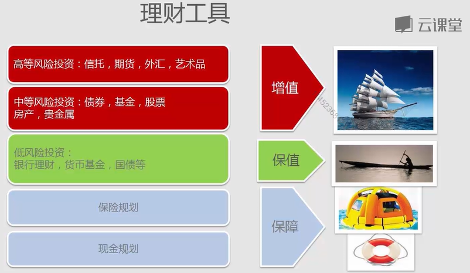
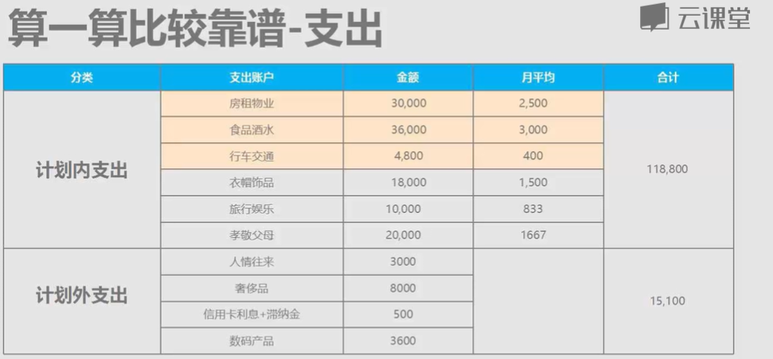

## 奖励目标：

1. ### Apple iPhone 8  黑色 64G 二手 （￥1,960）

2. ### Apple iPhone 8  黑色 128G （￥4,000）

3. ### Apple iPhone 11  黑色 128G （￥6,000）

4. ### 过年带家人出去旅游，想去三亚（￥20，000）

5. ### 和女友去日本、东南亚、菲律宾、等 旅游 （￥20，000）

6. ### 最新的 2019 MacBook Pro  16寸  九代 i 7  + 1T SSD（￥22,000）

7. ### 汽车  丰田- 凯美瑞 （￥200,000）

8. ### 杭州买房 100 /m2（￥2,000，000）

   

## 谨言：

金钱有一些秘密和规律，要想了解这些秘密和规律，前提条件是，你自己必须真的有这个愿望。

如果你只是带着试试看的心态，那么你最后只会以失败而告终，你会一事无成。尝试纯粹是一种借口，你还没有做，就已经给自己想好了退路。不能试验。你只有两个选择：做，或者不做。

给自己定下来相变富有的目标，贴在墙上，每天都看，每天都去想象你已经实现这个目标的画面，用这种想象力来刺激你的欲望，做事以这个目标来标榜自己。

## 书单：

1. 《不持有的生活》

## 理财：

